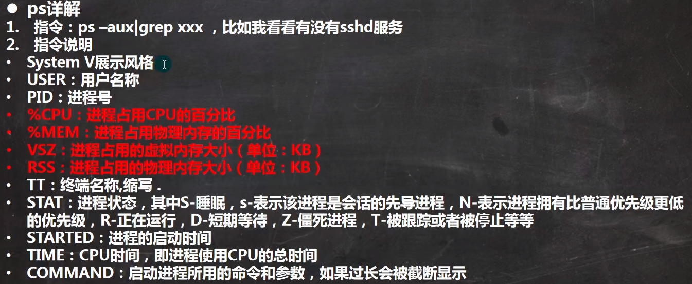

## 网络连接概念

- IP地址时一种逻辑地址，用来标识网络中一个个主机
  - IP地址 = 网络地址 + 主机地址
  - IP地址是一个 4 * 8bit (1字节) 由 0/1 组成的数字串（IP协议）
- 子网掩码NETMASK
  - 子网掩码只有一个功能，就是将IP地址划分为 网络地址 + 主机地址
  - 子网掩码与 IP地址进行**与运算**（都为1 的则结果为1，否则为 0）
- 默认网关 GETWAY
  - 连接两个不同的网络的设备都可以叫网关设备；网关的作用就是实现两个网络之间进行通讯与控制
  - 网关的地址就是网关设备的IP地址
- 域名服务器DNS
  - DNS是域名服务器，用来解析域名的（域名与IP之间的解析）
  - 如果没有这东西，登录某个网站就必须输入该网站的IP地址，有了DNS就可以直接输入网址

#### 网络连接

- 桥接模式
  - 同一个网段，IP容易冲突
- NAT模式
  - 在当前主机下建立新的子网络，确保子网络IP不会和其他IP冲突

#### 设置网络连接

删除 UUID一行

修改BOOTPROTO=static、NOBOOT=yes

添加IPADDR、NETMASK、GATEWAY、DNS1


### 网络配置

```bash
TYPE=Ethernet
PROXY_METHOD=none
BROWSER_ONLY=no 
BOOTPROTO=dhcp # dhcp：动态分配，改成 static
DEFROUTE=yes
IPV4_FAILURE_FATAL=no
IPV6INIT=yes
IPV6_AUTOCONF=yes
IPV6_DEFROUTE=yes
IPV6_FAILURE_FATAL=no
IPV6_ADDR_GEN_MODE=stable-privacy
NAME=eno1
UUID=a3744ad9-f101-42fc-875a-c33b6b1bd61b
DEVICE=eno1
ONBOOT=yes
#IP地址（追加）
IPADDR=192.168.131.200
#网关（追加）
GATEWAY=192.168.131.2
#域名解析器（追加）
DNS1=192.168.131.2

```

重启网络服务

```bash
service network restart #重启网络
reboot # 重启系统
```

#### 设置主机名与hosts映射

在 Linux中的 /etc/hosts 文件中，可以设置IP映射关系

```bash
172.16.72.238 owner
```

```bash
ping owner
PING owner (172.16.72.238) 56(84) bytes of data.
64 bytes from owner (172.16.72.238): icmp_seq=1 ttl=124 time=13.1 ms
64 bytes from owner (172.16.72.238): icmp_seq=2 ttl=124 time=12.7 ms
64 bytes from owner (172.16.72.238): icmp_seq=3 ttl=124 time=12.6 ms
```


## 常用命令

#### 系统服务命令

1. systemctl start 服务名：启动服务
2. systemctl stop 服务名：关闭服务（临时的）
3. systemctl status 服务名：查看服务状态
4. systemctl restart 服务名：重启服务
5. systemctl disable 服务名：关闭服务自启动
6. systemctl enable 服务名：开启服务自启动
7. systemctl --type service：查看正在运行的服务
8. systemctl list-unit-files：查看所有服务器的自启配置

#### 其他命令

1. useradd：libai 添加用户
2. passwd：libai 给**libai**添加密码用户添加密码
3. whereis file-name：查看文件
4. whoami：查看当前用户是谁
5. ll -a：查看隐藏文件
6. echo $$：显示当前进程
7. shutdown -h/-r now：立即关机/重启
8. reboot：重启计算机
9. sync：把内存的数据同步到磁盘中

#### 特殊字符

1. $：代表变量
2. *：代表通配符
3. ~：代表当前用户的主目录（root的主目录是/root，普通用户的主目录是 /home/）
4. -：一个缩写参数（一个杠杠）
5. --：一个单词参数（两个杠杠）

## Linux文件系统

Linux下一切皆文件

#### Linux文件目录

```bash
# 挂载磁盘，将硬盘3挂载到/usr/upload下
mount /dev/disk3 /usr/upload

bin ->usr/bin：这个目录存放经常使用的命令
sbin ->超级管理员使用的命令
boot：这个目录存放启动Linux时使用的一些核心文件，包括一些连接文件以及镜像文件

etc：这个目录存放所有的系统管理所需要的配置文件
dev：dev是device（设备）的缩写，该目录下存放的是Linux外部设备，Linux中的设备也是以文件形式存在的

root：该目录为系统管理员目录，root是具有超越权限的用户
home：普通用户的主目录，在Linux中，每个用户都有一个自己的文件夹目录，一般该文件夹以用户名的账号命名

lib ->usr/lib：这个，目录存放着系统最基本的动态连接共享库，其作用类似于Windows里的DLL文件
      ，几乎所有的应用程序都需要用到这些共享库

mnt：系统提供该目录是为了让用户临时挂载别的文件系统，我们可以将光驱挂载在/mnt/上，然后进入
      该目录就可以查看光驱里的内容

usr：这是一个非常重要的目录，用户的很多应用程序和文件都放在这个目录下，类似于Windows下的program files目录
/usr/local：一般用于安装软件
/opt：用于存放软件的包，这些包通常安装在/usr/local目录下

var：这个目录存放着在不断扩充着的东西，我们习惯将那些经常被修改的文件存放在该目录下，比如运行各种日志文件

tmp：这个目录是用来存放一些临时文件的
```

#### 操作文件

```bash
#创建文件夹
mkdir dir
#创建文件
touch file
#查看文件目录
ll
ls
ll -a #查看所有文件（包含隐藏文件）

```

### vi与vim

- 正常模式

> 以vim打开一个档案就直接进入一般模式了(这是默认的模式)。在这个模式中,你可以使用「上下左右」按键来移动光标,你可以使用「删除宇符」或「删除整行」 来处理档案容,也可以使用复制、粘贴J来处理你的文件数据。

- 插入模式

> 按下 i，I，o, O, a, A, r, R等任何一个字母之后才会进入编辑模式，一般来说按 i 即可.

- 命令行模式

> 按下esc进入正常模式，按下冒号：，进入命令行模式，在这个模式当中,可以提供你相关指令, 完成读取、存盘、替换、离开vim、显示行号等的动作则是在此模式中达成的!

#### 快捷键

1. 拷贝当前行：yy，拷贝当前行向下5行：5yy，并粘贴（输入p）

2. 删除当前行：dd，删除当前行向下5行：5dd

3. 设置行号：以冒号开头，set nu

   ```
   //设置行号
   :set nu
   //取消行号
   :set nonu
   ```

4. 查找文件中的某个单词：以斜杠开头，输入关键词，按 n 键查找下一个

   ```
   /abc
   ```

5. 首行，尾行

   ```
   //首行
   gg
   //尾行
   G
   ```

6. 跳转多少行，跳转第35行：

   ```
   35+shift+g
   ```

7. 撤回/恢复：

   ```bash
   #撤回
   u
   #恢复
   CTRL + r
   ```

### 用户管理

#### 用户添加删除

```bash
#添加用户，默认在home目录下创建同名目录
useradd 用户名
#设置密码
passwd 用户名
#删除用户，但是保留主目录
userdel 用户名
#删除用户及主目录
userdel -r 用户名
```

#### 查看用户信息

```bash
#查看用户信息
id root
uid=0(root) gid=0(root) 组=0(root)
```

#### 用户组

```bash
#新增用户组
groupadd 组名
#删除用户组
groupdel 组名
#添加用户时直接分配组
useradd 用户名 -g 用户组名
#修改用户的组
usermod 用户名 -g 用户组名
```

##### 用户和组相关文件

```
/etc/passwd 文件
用户( user )的配置文件,记录用户的各种信息
每行的含义:用户名:口令:用户标识号:组标识号:注释性描述:主目录:登录Shell

/etc/shadow 文件
口令的配置文件
每行的含义:登录名:加密口令:最后一次修改时间:最小时间间隔:最大时间间隔:警告时间:不活动时间:失效时间:标志

/etc/group 文件
组(group)的配置文件,记录Linux包含的组的信息
每行含义:组名:口令:组标识号:组内用户列表
```

### 实用指令

#### 运行级别

> 0：关机
>
> 1：单用户【找回丢失密码】
>
> 2：多用户状态没有网络服务
>
> 3：多用户状态有网络服务
>
> 4：系统未使用保留给用户
>
> 5：图形界面
>
> 6：系统重启
>
> 常用的运行级别是 3 和 5，也可以指定默认运行级别

```bash
#切换级别
init 0 #关机
#查看当前级别
systemctl get-default
#设置默认级别
systemctl set-default multi-user.target #设置多用户网络级别
systemctl set-default graphical.target #设置图形化界面
```

#### 找回root密码

仅Centos7版本后有效

1. 重启系统，在进入登记页面前，选择core，然后按 e 键
2. 进入后找到 UTF-8，在后面输入 init=/bin/sh，然后快捷键 CTRL+x 进入单用户模式
3. 在光标闪烁的位置中输入：mount -o remount,rw /
4. 在新的一行输入：passwd，然后回车输入新密码（密码长度最好8位以上，但不是必须的）密码修改成功后，会显示passwd字样说明密码修改成功
5. 在光标闪烁的位置中输入：touch /.autorelabel
6. 继续在闪烁的位置输入：exec /sbin/init （这个过程有点长，耐心等待），完成后系统会自动重启，新的密码就生效了

#### 帮助指令

```bash
#获取指令 ll 的帮助信息
man ls
help ls
```

#### 文件目录指令

```bash
#创建目录
mkdir one
#创建多级目录
mkdir one/two/three -p
#删除目录、文件。-r：递归，-f：强制
rm -rf 文件/目录  

#拷贝文件/目录。-r：递归，
cp 拷贝源 拷贝到哪里
#强制覆盖同名文件
\cp 拷贝源 拷贝到哪里

#分屏查看文件内容。空白键 向下翻页，pageup 向上翻页，q 退出
less 文件名
#查看文件前10行（默认）
head 文件名
head 文件名 -n 5 #指定查看前5行
#查看文件后10行（默认）
tail 文件名
tail 文件名 -n 5 #指定查看后5行

#输出内容到控制台
echo $PATH
# 重定向 >
echo 'hello world' > 文件名 #将 hello world 内容输入到文件中
echo 'hello world' >> 文件名 #将 hello world 内容追加到文件中
ll > 文件名 #将查询到的结果写入到文件中，如果文件不存在则自动创建

# 软连接，类似于快捷键
ln -s 源文件或目录 软连接名
# 删除软连接
rm 软连接名 -f

#查看历史命令
history
history 10 #查看10条历史命令记录
#执行历史命令
!历史命令编号 #如：!23，执行历史第23条命令

#时间指令
date
date "+%Y-%m-%d %H:%M:%S"
#设置日期时间
date -s "2021-12-21 21:09:55"
#查看日历
cal
#查看本年度日历
cal 2021

#搜索查找
find 搜索目录 -name 文件名
#查看指令位置
which 指令名称
#查看文件
locate 文件名 #在执行前，需要先执行 updatedb 
#管道 | 与 grep
ll | grep temp
cat one.txt | grep two -n # -n 可以显示内容所在的行号
```

#### 压缩与解压

```bash
#压缩
gzip 文件 
zip 文件
tar -zxvf 压缩包 -C 解压到哪里
#解压
gunzip 压缩包
unzip 压缩包
tar -zcvf  压缩包名字 需要压缩的文件或目录
# tar的参数
t：列出文件
f：指定文件名
不管是解压还是压缩，都要参数 z
```


### 组管理与权限管理

#### 组修改

Linux中，每个用户必须属于一个组（group）

文件所有者，一般为文件创建者

```bash
# 修改文件所有者
chown 用户名 文件名 # 将该文件所有者修改为当前用户名
# 修改文件所在组
chgrp 组名 文件名 # 将该文件所有者修改为当前用户名
```

#### 权限

```bash
-rwxrw-r-- 1 root root 1213 Feb 2 09:39 abc
```

第0位，用来确定文件类型（d，-，l，c，b）

- d：代表目录
- -：代表普通文件
- l：代表连接
- c：代表字符设备文件，鼠标，键盘
- b：块设备，硬盘

第1-3位，确定所有者拥有该文件的权限

第4-6位，确定所属组拥有该文件的权限

第7-9位，确定其他用户拥有该文件的权限

权限解释rwx，r=4，w=2，x=1

作用在文件上

- r：代表可读取文件

- w：代表可写入文件内容

- x：代表可执行该文件

作用在目录上

- r：代表可读取查看目录

- w：代表可修改目录

- x：代表可进入该目录

其他说明

1：如果是文件，则表示硬链接数；如果是目录则表示子目录数

#### 权限修改

```bash
# chmod 指令
# 第一种方式：+、-、= 变更权限
# u：表示所有者  g：表示所属组 o：代表其他人 a：代表所有人
chmod u=rwx,g=rx,o=x 文件或目录名 #给所属者赋予读写执行权限，所属组赋予读执行权限，其他人执行权限
chmod o+w 文件或目录名 #给其他人添加写入权限
chmod a-x 文件或目录名 #给所有人都取消执行权限
```

## 定时调度

### 基本语法

crontab 【选项】

| 选项 | 说明                              |
| ---- | --------------------------------- |
| -e   | 编辑crontab定时任务               |
| -l   | 查询crontab定时任务               |
| -r   | 删除当前用户所有的crontab定时任务 |

设置调度文件：/etc/crontab

设置个人任务调度。执行**crontab -e** 命令

接着输入：*/1 * * * * ll > /tmp/to.txt

**重启调度任务**

```bash
service crond restart
```

| 项目     | 含义               | 范围                    |
| -------- | ------------------ | ----------------------- |
| 第一个 * | 一个小时中第几分钟 | 0-59                    |
| 第二个 * | 一天中第几小时     | 0-23                    |
| 第三个 * | 一个月中第几天     | 1-31                    |
| 第四个 * | 一年中第几个月     | 1-12                    |
| 第五个 * | 一周中周几         | 0-7（0和7都代表星期天） |

特殊符号的说明

| 特殊符号 | 含义                                                         |
| -------- | ------------------------------------------------------------ |
| *        | 代表任何时间。比如第一个 * ，就代表一小时中每分钟都执行一次  |
| ，       | 代表不连续的时间。比如：“0 8,12,16 * * *”，就代表每天第8小时0分钟，12小时0分钟，16小时0分钟执行一次 |
| -        | 代表连续的时间。比如：“0 5 * * 1-6”，就代表每周一到周六每天5点0分执行一次 |
| */n      | 代表每隔多久执行一次。比如：“*/10 * * * *”，就代表每隔10分钟就执行一遍 |

#### at定时任务

at命令是一次性定时计划任务，at守护进程atd会以后台模式运行，检查作业队列

默认情况下，atd守护进程每60秒检查一次队列，有队列作业时，会检查队列作业时间，如果时间与当前时间匹配，则运行次作业

在使用at命令时，一定要保证atd进程的启动，可以使用 ps -ef | grep atd 来查看

**命令**：at 【选项】【时间】

CTRL+D 结束at命令的输入，需要输入两次

## 进程



#### 基本介绍

```bash
ps -a：显示当前终端的所有进程信息
ps -u：以用户的格式显示进程信息
ps -x：显示后台进程运行的参数
```

命令

```bash
#查看进程 -e 显示全部进程 -f 显示全部格式
ps -ef | grep xxx
#终止进程
kill 【选项】进程号（通过进程号杀死/终止进程）
killall 进程名（通过进程名杀死进程，也支持通配符，这在系统因负载过大而变得很慢时很有用）
#常用选项
# -9：表示强迫进程立即停止
```

## 服务管理（service）

> 服务(service)本质就是进程,但是是运行在后台的,通常都会监听某个端口,等待其它程序的请求,比如(mysqld , sshd 防火墙等) ,因此我们又称为守护进程，是Linux中非常重要的知识点。

#### service管理指令

```bash
# CentOS7.0后，很多服务不再使用service，而是systemctl
service 服务名 [start | stop | restart | reload | status]
```

可以通过查看 /etc/init.d 目录来判断是否可以使用service指令，显示绿色目录的则表示可以使用
