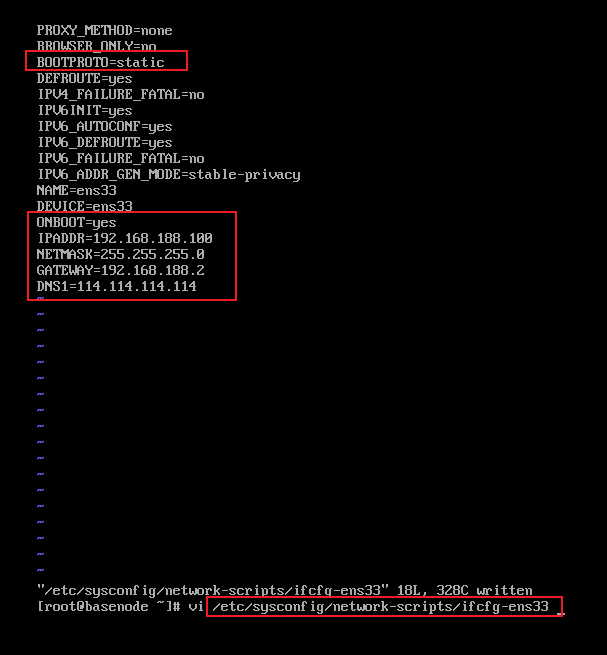

## 网络连接概念

- IP地址时一种逻辑地址，用来标识网络中一个个主机
  - IP地址 = 网络地址 + 主机地址
  - IP地址是一个 4 * 8bit (1字节) 由 0/1 组成的数字串（IP协议）
- 子网掩码NETWORK
  - 子网掩码只有一个功能，就是将IP地址划分为 网络地址 + 主机地址
  - 子网掩码与 IP地址进行**与运算**（都为1 的则结果为1，否则为 0）
- 默认网关 GETWAY
  - 连接两个不同的网络的设备都可以叫网关设备；网关的作用就是实现两个网络之间进行通讯与控制
  - 网关的地址就是网关设备的IP地址
- 域名服务器DNS
  - DNS是域名服务器，用来解析域名的（域名与IP之间的解析）
  - 如果没有这东西，登录某个网站就必须输入该网站的IP地址，有了DNS就可以直接输入网址

#### 网络连接

- 桥接模式
  - 同一个网段，IP容易冲突
- NAT模式
  - 在当前主机下建立新的子网络，确保子网络IP不会和其他IP冲突

#### 设置网络连接

删除 UUID一行

修改BOOTPROTO=static、NOBOOT=yes

添加IPADDR、NETMASK、GATEWAY、DNS1




## 常用命令

#### 系统服务命令

1. systemctl start 服务名：启动服务
2. systemctl stop 服务名：关闭服务（临时的）
3. systemctl status 服务名：查看服务状态
4. systemctl restart 服务名：重启服务
5. systemctl disable 服务名：关闭服务自启动
6. systemctl enable 服务名：开启服务自启动
7. systemctl --type service：查看正在运行的服务
8. systemctl list-unit-files：查看所有服务器的自启配置

#### 其他命令

1. useradd：libai 添加用户
2. passwd：libai 给**libai**添加密码用户添加密码
3. whereis file-name：查看文件
4. whoami：查看当前用户是谁
5. ll -a：查看隐藏文件
6. echo $$：显示当前进程

#### 特殊字符

1. $：代表变量
2. *：代表通配符
3. ~：代表当前用户的主目录（root的主目录是/root，普通用户的主目录是 /home/）
4. -：一个缩写参数（一个杠杠）
5. --：一个单词参数（两个杠杠）

## Linux文件系统

Linux下一切皆文件

#### Linux文件目录

```bash
# 挂载磁盘，将硬盘3挂载到/usr/upload下
mount /dev/disk3 /usr/upload
```

#### 操作文件

```bash
#创建文件夹
mkdir dir
#创建文件
touch file
#查看文件目录
ll
ls
ll -a #查看所有文件（包含隐藏文件）

```

