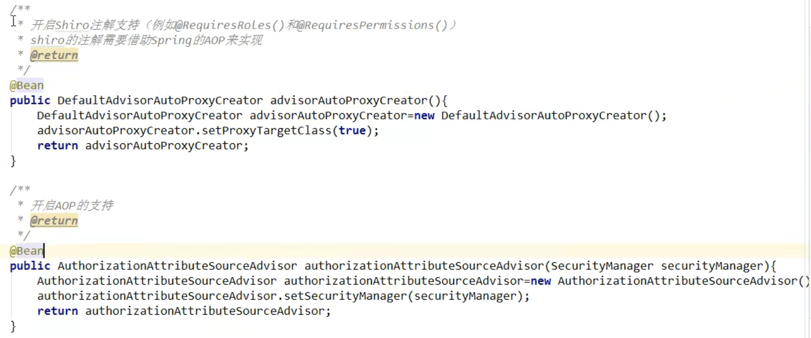

# 基于配置类的权限认证

## 实现步骤

1. 配置 **ShiroConfig.class** 配置类
2. 实现 **Realm **接口的 **UserRealm.class**
3. 在 **ShiroConfig.class **配置类中配置权限规则
4. **controller **层进行 **shiro**登录操作
5. 在 **UserRealm.class** 中进行登录验证与授权

## 代码实现

1. **ShiroConfig.class**
   ```java
   package com.cth.demo01.config;
   
   import org.apache.shiro.realm.Realm;
   import org.apache.shiro.spring.web.ShiroFilterFactoryBean;
   import org.apache.shiro.web.mgt.DefaultWebSecurityManager;
   import org.springframework.beans.factory.annotation.Qualifier;
   import org.springframework.context.annotation.Bean;
   import org.springframework.context.annotation.Configuration;
   import org.springframework.stereotype.Controller;
   import org.springframework.web.bind.annotation.RequestMapping;
   
   import java.util.LinkedHashMap;
   import java.util.Map;
   
   /**
    * @author 走我们钓鱼去
    * @date 2022/09/20 14:33
    **/
   @Configuration
   public class ShiroConfig {
   
       /**
        * shiro拦截器
        * @param securityManager
        * @return
        */
       @Bean
       public ShiroFilterFactoryBean shiroFilterFactoryBean(
               @Qualifier("defaultWebSecurityManager") DefaultWebSecurityManager securityManager
       ){
           ShiroFilterFactoryBean filter = new ShiroFilterFactoryBean();
           filter.setSecurityManager(securityManager);
           return filter;
       }
   
       /**
        * 安全管理器
        * @param realm
        * @return
        */
       @Bean(name = "defaultWebSecurityManager")
       public DefaultWebSecurityManager getSecurityManager(@Qualifier("userRealm") Realm realm){
           DefaultWebSecurityManager securityManager = new DefaultWebSecurityManager();
           securityManager.setRealm(realm);
           return securityManager;
       }
   
       /**
        * 自定义用户
         * @return
        */
       @Bean
       public Realm userRealm(){
           return new UserRealm();
       }
   
   
   }
   ```

2. **UserRealm.class**
   ```java
   package com.cth.demo01.config;
   
   import org.apache.shiro.authc.AuthenticationException;
   import org.apache.shiro.authc.AuthenticationInfo;
   import org.apache.shiro.authc.AuthenticationToken;
   import org.apache.shiro.authz.AuthorizationInfo;
   import org.apache.shiro.realm.AuthorizingRealm;
   import org.apache.shiro.subject.PrincipalCollection;
   
   /**
    * @author 走我们钓鱼去
    * @date 2022/09/20 14:41
    **/
   public class UserRealm extends AuthorizingRealm {
       @Override
       protected AuthorizationInfo doGetAuthorizationInfo(PrincipalCollection principalCollection) {
           return null;
       }
   
       @Override
       protected AuthenticationInfo doGetAuthenticationInfo(AuthenticationToken authenticationToken) throws AuthenticationException {
           return null;
       }
   }
   ```

3. 在**ShiroConfig.class**中配置权限规则
   ```java
   @Configuration
   public class ShiroConfig {
   
     /**
      * 配置一个shiro的过滤器bean,这bean将配置shiro.相关的一个规则的拦截
      * 例如什么样的请求可以访间什么样的请求不可以访问等等
      * @return
      */
     @Bean
     public ShiroFilterFactoryBean shiroFilter(@Qualifier("defaultWebSecurityManager")
                                                           DefaultWebSecurityManager defaultWebSecurityManager){
         //创建过滤器配置 bean
         ShiroFilterFactoryBean shiroFilterFactoryBean = new ShiroFilterFactoryBean();
         shiroFilterFactoryBean.setSecurityManager(defaultWebSecurityManager);
         //配置用户请求接口时，未认证时自动跳转登录请求
         shiroFilterFactoryBean.setLoginUrl("/login");
         //配置登录认证成功以后自动跳转的请求地址（暂时没用过这个）
         shiroFilterFactoryBean.setSuccessUrl("/success");
         //配置登录者认证后没有权限时转向的请求地址
         shiroFilterFactoryBean.setUnauthorizedUrl("/noPermission");
   
         /**
          * 配置权限拦截规则
          * shiro拦截器
          * anon：无需认证
          * authc：必须认证了才能访问
          * user：必须拥有 记住我 功能才能用
          * perms：拥有对某个资源的权限才能访问
          * role：拥有某个角色权限才能访问
          */
         Map<String, String> filterChainMap = new LinkedHashMap<>();
         //配置登录请求不需要认证anon表示某个请求不需要认证
         filterChainMap.put("/login","anon");
         //配置登录的请求，登出后会请求当前用户的内存
         filterChainMap.put("/logout", "logout");
         //配置一个admin.开头的所有请求需要登录authc表示需要登录认证
         filterChainMap.put("/admin/**", "authc");
         //配置一个user.开头的所有请求需要登录authc表示需要登录认证
         filterChainMap.put("/user/**", "authc");
         //配置剩余的所有请求全部需要进行登录认证（注意：这个必须写在最后面）
         filterChainMap.put("/**", "authc");
   
         //设置权限拦截规则
         shiroFilterFactoryBean.setFilterChainDefinitionMap(filterChainMap);
         return shiroFilterFactoryBean;
     }
     
     /**
      * 配置一个安全管理器
      * @return
      */
     @Bean(name="defaultWebSecurityManager")
     public DefaultWebSecurityManager defaultWebSecurityManager(@Qualifier("userRealm") Realm realm){
         DefaultWebSecurityManager securityManager = new DefaultWebSecurityManager();
         securityManager.setRealm(realm);
         return securityManager;
     }
     
     /**
      * 配置一个自定义尔eaLm饰ean,最终将使用这个bean返回的对象来完成我们的认证和授权
      * @return
      */
     @Bean(name = "userRealm")
     public Realm userRealm(){
         return new UserRealm();
     }
   }
   ```

4. controller 层进行 shiro 登录操作
   ```java
   @RequestMapping("/login")
     public String login(String name,String password){
         UsernamePasswordToken token = new UsernamePasswordToken(name,password);
         Subject subject = SecurityUtils.getSubject();
         //用户是否认证过（是否登录过），进入f表示用户没有认证过需要进行认证
        if(!subject.isAuthenticated()){
            try {
                subject.login(token);
            }catch (AuthenticationException e){
                return "redirect:/";
            }
        }
         return "redirect:index.html";
     }
   ```
5. 在 UserRealm.class 中进行登录认证与授权
   ```java
   /**
    * @author 走我们钓鱼去
    * @date 2022/09/20 14:41
    **/
   public class UserRealm extends AuthorizingRealm {
       /**
        * 授权
        * @param principalCollection
        * @return
        */
       @Override
       protected AuthorizationInfo doGetAuthorizationInfo(PrincipalCollection principalCollection) {
           System.out.println("执行了 doGetAuthorizationInfo 授权");
           Subject subject = SecurityUtils.getSubject();
           SimpleAuthorizationInfo info = new SimpleAuthorizationInfo();
           info.addStringPermission("admin:za");
           return info;
       }
   
       /**
        * 认证
        * 用户认证的方法这个方法不能手动调用Shir0会自动调用
        * @param authenticationToken 用户身份这里存放着用户的账号和密码
        * @return用户登录成功后的身份证明
        * @throws AuthenticationException
        * 如果认证失Shiro会抛出各种异常
        * 常用异常
        * UnknownAccountException 账号不存在
        * AccountException 账号异常
        * LockedAccountException 账户锁定异常（冻结异常）》
        * IncorrectCredentialsException 密码认证失败以后Shiro自动抛出表示密码错误
        * 注意
        *    如果这些异常不够用可以自定义异常类并继承shiro认证异常女类AuthenticationException
        */
       @Override
       protected AuthenticationInfo doGetAuthenticationInfo(AuthenticationToken authenticationToken) throws AuthenticationException {
           System.out.println("执行了 doGetAuthenticationInfo 认证");
           UsernamePasswordToken token = (UsernamePasswordToken) authenticationToken;
           System.out.println("token:"+token.getUsername()+token.getPassword());
           String account = "lsgfish";
           String password = "123456";
   //        不推荐在这里写这些东西
   //        //设置让当前登录用户中的密码数据进行加密
   //        HashedCredentialsMatcher hash = new HashedCredentialsMatcher();
   //        //加密方式
   //        hash.setHashAlgorithmName("MD5");
   //        //加密次数
   //        hash.setHashIterations(2);
   //        this.setCredentialsMatcher(hash);
           if(!account.equals(token.getUsername())){
   //            账号异常
               throw new AccountException();
           }else if(!password.equals(new String(token.getPassword()))){
   //            密码异常
               throw new IncorrectCredentialsException();
           }
           /**
            * 创建密码认证对象，由Shiro自动认证密码
            * 参数1数据库中的账号（或页面账号均可）
            * 参数2为数据中读取数据来的密码
            * 参数3为当前Realm的名字
            * 如果密码认证成功则返回一个用户身份对象，如果密码认证失败Shiro会抛出异常缸IncorrectCredentialsException
            */
           return new SimpleAuthenticationInfo("",password,"");
       }
   }
   ```

<br/>

<br/>

<br/>

# 基于注解的权限认证

基于注解的拦截，需要先对 **ShiroConfig.class** 配置类中的拦截规则进行注释

## 低版本shiro

**Realm自定义实现类中**



## 高版本shiro

```java
//权限
@RequiresPermissions("admin:za")
//角色权限
@RequiresRoles("admin")
@RequestMapping("/admin/one")
public String adminTest(){
    return "/admin.html";
}
```

<br/>

# 基于方法调用进行权限认证

```java
//注意：Shiro 中出列基于配置权限验证以及注解的权限验证意外还支持基于方法调用的权限验证例如
Subject subject = securityutils.getsubject();
string[] roles={""};
subject.checkRoles(roles);//验证当前用户是否拥有指定的角色
string[] permissions={""};
subject.checkPermissions(permissions);//验证当前用户是否拥有指定的权限
```

<br/>

# Shiro加密

## 授权加密

```java
@Override
protected AuthenticationInfo doGetAuthenticationInfo(AuthenticationToken authenticationToken) throws AuthenticationException {
    System.out.println("执行了 doGetAuthenticationInfo 认证");
    UsernamePasswordToken token = (UsernamePasswordToken) authenticationToken;
    System.out.println("token:"+token.getUsername()+token.getPassword());
    String account = "lsgfish";
    String password = "123456";
    //不推荐在这里写这些东西
    //设置让当前登录用户中的密码数据进行加密
    HashedCredentialsMatcher hash = new HashedCredentialsMatcher();
    //加密方式
    hash.setHashAlgorithmName("MD5");
    //加密次数
    hash.setHashIterations(2);
    this.setCredentialsMatcher(hash);
    if(!account.equals(token.getUsername())){
//            账号异常
        throw new AccountException();
    }else if(!password.equals(new String(token.getPassword()))){
//            密码异常
        throw new IncorrectCredentialsException();
    }
    /**
     * 创建密码认证对象，由Shiro自动认证密码
     * 参数1数据库中的账号（或页面账号均可）
     * 参数2为数据中读取数据来的密码
     * 参数3为当前Realm的名字
     * 如果密码认证成功则返回一个用户身份对象，如果密码认证失败Shiro会抛出异常缸IncorrectCredentialsException
     */
    return new SimpleAuthenticationInfo("",password,"");
}
```

<br/>

## 方法调用加密MD5

```java
 public static void main(String[] args) {
      /**
       * 使用shiro提供的工具类对数据进行加密
       * 参数1为加密算法名我们使用05这是一个不可逆的加密算法
       * 参数2为需要加密的数据
       * 参数3加密的盐值用于改变加密结果的不同的盐加密的数据是不一致的
       * 参数4为加密的次数
       */
      Object simpleHash = new SimpleHash  ("MD5","123456","加盐",1);
      System.out.println("加密1次："+simpleHash);
  }
```
