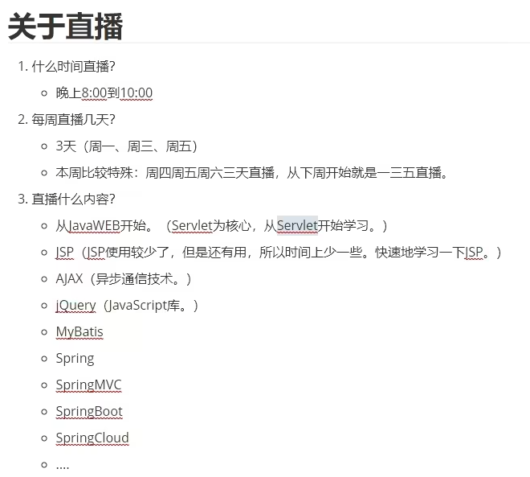
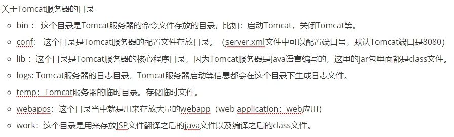
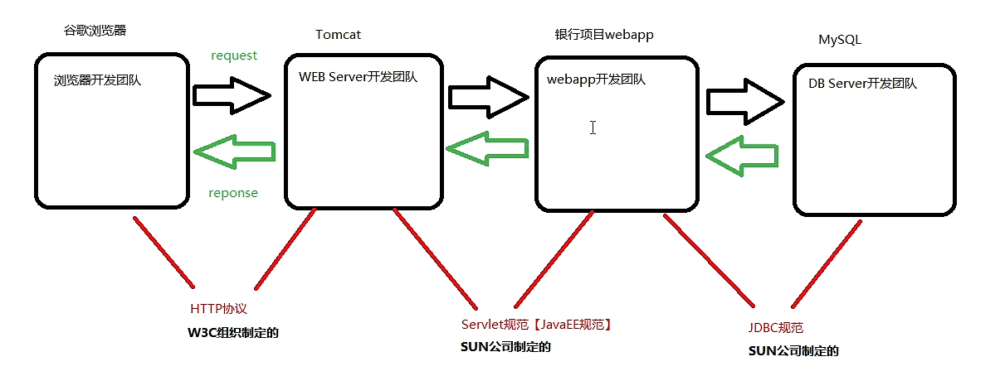

# JavaWeb


## 直播



## Tomcat配置

1. 要先安装jdk，配置jdk的环境变量

2. 下载Tomcat，解压，配置bin目录的环境变量即可

   ```bash
   变量名：CATALINA_HOME
   变量值：tomcat的解压地址
   ```

   

3. 启动Tomcat：进入bin目录下，双击startup.bat文件，即可启动tomcat

   

4. 关闭Tomcat：执行bin目录下的shutdown.bat

## BS结构系统的角色和协议



## Servlet

### 模拟Servlet服务

#### tomcat

```java
package org.apache;
import java.util.Scanner;
import java.io.FileReader;
import java.util.Properties;
import javax.servlet.Servlet;

public class Tomcat{
    public static void main(String[] args) throws Exception{
        System.out.println("Tomcat");
        System.out.println("please input your url:");
        Scanner s = new Scanner(System.in);
        String key = s.nextLine();
        FileReader reader = new FileReader("web.properties");
        Properties pro = new Properties();
        pro.load(reader);
        reader.close();
        String className = pro.getProperty(key);
        Class clazz = Class.forName(className);
        Object obj = clazz.newInstance();
        Servlet  servlet = (Servlet)obj;
        servlet.service();
    }
}
```

#### servlet

```java
package javax.servlet;
public interface Servlet{
    void service();
}

```

#### userListServlet

```java
package com.cth.servlet;
import javax.servlet.Servlet;
public class UserListServlet implements Servlet{
    public void service(){
        System.out.println("UserListServlet  service");
    }
}
```

#### userLoginServlet

```java
package com.cth.servlet;
import javax.servlet.Servlet;
public class UserLoginServlet implements Servlet{
    public void service(){
        System.out.println("UserLoginServlet  service");
    }
}
```

#### BankServlet

```java
package com.cth.servlet;
import javax.servlet.Servlet;

public class BankServlet implements Servlet{
    public void service(){
        System.out.println("BankServlet  service");
    }
}
```

#### web.properties

```properties
/a=com.cth.servlet.UserLoginServlet
/b=com.cth.servlet.UserListServlet
/c=com.cth.servlet.BankServlet
```


### 开发一个带有Servlet的webapp

- 开发步骤是怎样的？

  - 第一步：在webapps目录下新建一个目录，起名crm（这个crm就是webapp的名字）。当然，也可以是其它项目，比如银行项
    目，可以创建一个目录bank，办公系统可以创建一个oa。

    - 注意：crm就是这个webapp的根

  - 第二步：在webapp的目录下新建一个目录：WEB-INF

    - 注意：这个目录的名字是Servlet规范中规定的，必须全部大写，必须一模一样。必须的必须。

  - 第三步：在WEB-INF目录下新建一个目录：classes

    - 注意：这个目录的名字必须是全部小写的classes。这也是Servlet规范中规定的。另外这个目录下一定存放的是Java程序编译之后的class文件（这里存放的是字节码文件）。

  - 第四步：在WEB-INF目录下新建一个目录：lib

    - 注意：这个目录不是必须的。但如果一个webapp需要第三方的jar包的话，这个jar包要放到这个lib目录下，这个目录的名字也不能随意编写，必须是全部小写的lib。例如java语言连接数据库需要数据库的驱动jar包。那么这个jar包就一定要放到lib目录下。这Servlet规范中规定的。
    
  - 第五步：在WEB-INF目录下新建一个文件：web.xml

    - 注意：这个文件是必须的，这个文件名必须叫做web.xml。这个文件必须放在这里。一个合法的webapp，web.xml文件是必须的，这个web.xml文件就是一个配置文件，在这个配置文件中描述了请求路径和Servlet类之间的对照关系。
      
    - 这个文件最好从其他的webapp中拷贝，最好别手写。没必要。复制粘贴
    
    - ```xml
      <?xml version="1.0" encoding="UTF-8"?>
      
      <web-app xmlns="https://jakarta.ee/xml/ns/jakartaee"
        xmlns:xsi="http://www.w3.org/2001/XMLSchema-instance"
        xsi:schemaLocation="https://jakarta.ee/xml/ns/jakartaee
                            https://jakarta.ee/xml/ns/jakartaee/web-app_5_0.xsd"
        version="5.0"
        metadata-complete="true">
      
      
      </web-app>
      ```
    
  - 第六步：编写一个ava程序，这个小ava程序也不能随意开发，这个小java程序必须实现Servlet接口。
  
    - 这个Servlet接口不在IDK当中。（因为Servlet不是lavaSE了。Servlet属于lavaEE，是另外的一套类库。）
    - Servlet接口（Servlet.class文件）是Oracle提供的。（最原始的是sun公司提供的。
    - Servlet接口是JavaEE的规范中的一员。
    - Tomcat服务器实现了Servlet规范，所以Tomcat服务器也需要使用Servlet接口。Tomcat服务器中应该有这个接口，Tomcat服务器的CATALINA_HOME\lib目录下有一个servlet-api.jar，解压这个servlet-api.jar之后，你会看到里面有一个
      Servlet.class文件。
    
  - 第七步：编译我们编写的HelloServlet
  
    - 重点：你怎么能让你的HelloServlet编译通过呢？配置环境变量CLASSPATH

      CLASSPATH=.;C:\dev\apache-tomcat-10.0.12\lib\servlet-api.jar

    - 思考问题：以上配置的CLASSPATH和Tomcat服务器运行有没有关系？

      - 没有任何关系，以上配置这个环境变量只是为了让你的HelloServlet能够正常编译生成class文件。

  - 第八步：将以上编译之后的HelloServlet.class文件拷贝到WEB-INF\classes目录下。

  - 第九步：在web.xml文件中编写配置信息，让“请求路径”和“Servlet类名”关联在一起。

    - 这一步用专业术语描述：在web.xml文件中注册Servlet类。

    - ```xml
      <?xml version="1.0" encoding="UTF-8"?>
      
      <web-app xmlns="https://jakarta.ee/xml/ns/jakartaee"
        xmlns:xsi="http://www.w3.org/2001/XMLSchema-instance"
        xsi:schemaLocation="https://jakarta.ee/xml/ns/jakartaee
                            https://jakarta.ee/xml/ns/jakartaee/web-app_5_0.xsd"
        version="5.0"
        metadata-complete="true">
      
      	<!--servlet描述信息-->
      	<!--任何一个servlet都对应一个servlet-mapping -->
      	<servlet>
      		<servlet-name>fdsafdsagfdsafdsa</servlet-name>
      		<!--这个位置必须是带有包名的全限定类名-->
      		<servlet-class>com.bjpowernode.servlet.HelloServlet</servlet-class>
      	</servlet>
      
      	<!--servlet映射信息-->
      	<servlet-mapping>
      		<!--这个也是随便的，不过这里写的内容要和上面的一样。-->
      		<servlet-name>fdsafdsagfdsafdsa</servlet-name>
      		<!--这里需要一个路径-->
      		<!--这个路径唯一的要求是必须以 / 开始-->
      		<!--当前这个路径可以随便写-->
      		<url-pattern>/fdsa/fd/saf/d/sa/fd/sa/fd</url-pattern>
      	</servlet-mapping>
      	
      </web-app>
      
      ```
  
  - 第十步：启动Tomcat服务器
  
  - 第十一步：打开浏览器，在浏览器地址栏上输入一个url，这个URL必须是：

    - http://127.0.0.1:8080/crm/fdsa/fd/saf/d/sa/fd/sa/fd   
    - 非常重要的一件事：浏览器上的请求路径不能随便写，这个请求路径必须和web.xml文件中的url-pattern一致。
    - 注意：浏览器上的请求路径和web.xml文件中的url-pattern的唯一区别就是：浏览器上的请求路径带项目名：/crm

  - 浏览器上编写的路径太复杂，可以使用超链接。（**非常重要：html页面只能放到WEB-INF目录外面。**）
  
  - 以后不需要我们编写main方法了。tomcat服务器负责调用main方法，Tomcat服务器启动的时候执行的就是main方法。我们javaweb程序员只需要编写Servlet接口的实现类，然后将其注册到web.xml文件中，即可。

  - 总结一下：一个合法的webapp目录结构应该是怎样的？

    ```
    webapproot
         |------WEB-INF
         		  |------classes(存放字节码)
         		  |------lib(第三方jar包)
         		  |------web.xml(注册Servlet)
         |------html
         |------css
         |------javascript
         |------image
         ....
    ```
  
  - 浏览器发送请求，到最终服务器调用Servlet中的方法，是怎样的一个过程？（以下这个过程描述的很粗糙。其中还有很多步骤我省略了。）
  
    - 用户输入URL，或者直接点击超链接：http://127.0.0.1:8080/crm/fdsa/fd/saf/d/sa/fd/sa/fd  
    - 然后Tomcat服务器接收到请求，截取路径：/crm/fdsa/fd/saf/d/sa/fd/sa/fd  
    - Tomcat服务器找到crm项目
    - Tomcat服务器在web.xml文件中查找/fdsa/fd/saf/d/sa/fd/sa/fd  对应的Servlet是：com.bjpowernode.servlet.HelloServlet
    - Tomcat服务器通过反射机制，创建com.bjpowernode.servlet.HelloServlet的对象。
    - Tomcat服务器调用com.bjpowernode.servlet.HelloServlet对象的service方法。

### Servlet生命周期

#### servlet 家族

tomcat服务器在启动的时候，并没有创建servlet对象。但是他创建了servletContext上下文对象。当访问第一个servlet服务时，先创建该servlet对象（执行无参构造），然后执行 init 方法，然后执行 service 方法。第二次访问该servlet服务时，则只执行 service 方法。当tomcat服务关闭时，servletContext 对象也随之销毁

- 一个**webapp**就是一个应用，一个应用对应着一个**servletContext**，
- 而一个**servlet**对应着一个**servletConfig**，一个应用中可能有多个**servlet**，而这多个**servlet**则共享同一个**servletContext**
- **servletContext**在服务器一启动的时候，解析webapp的时候就会创建，在服务器关闭的时候销毁

### http协议

HTTP的请求协议包括：4部分

- 请求行
- 请求头
- 空白行
- 请求体

##### 请求行

- 包括三部分：
  - 第一部分：请求方式（7种）
    - get（常用的）
    - post（常用的）
    - delete
    - put
    - head
    - options
    - trace
  - 第二部分：URI
    - 什么是URI？ 统一资源标识符。代表网络中某个资源的名字。但是通过URI是无法定位资源的。
    - 什么是URL？统一资源定位符。代表网络中某个资源，同时，通过URL是可以定位到该资源的。
    - URI和URL什么关系，有什么区别？
      - URL包括URI
      - http://localhost:8080/servlet05/index.html 这是URL。
      - /servlet05/index.html 这是URI。
  - 第三部分：HTTP协议版本号

##### 状态行

- 三部分组成
  - 第一部分：协议版本号（HTTP/1.1）
  - 第二部分：状态码（HTTP协议中规定的响应状态号。不同的响应结果对应不同的号码。）
    - 200 表示请求响应成功，正常结束。
    - 404表示访问的资源不存在，通常是因为要么是你路径写错了，要么是路径写对了，但是服务器中对应的资源并没有启动成功。总之404错误是前端错误。
    - 405表示前端发送的请求方式与后端请求的处理方式不一致时发生：
      - 比如：前端是POST请求，后端的处理方式按照get方式进行处理时，发生405
      - 比如：前端是GET请求，后端的处理方式按照post方式进行处理时，发生405
    - 500表示服务器端的程序出现了异常。一般会认为是服务器端的错误导致的。
    - 以4开始的，一般是浏览器端的错误导致的。
    - 以5开始的，一般是服务器端的错误导致的。
  - 第三部分：状态的描述信息
    - ok 表示正常成功结束。
    - not found 表示资源找不到。

### 欢迎页

> 设置欢迎页面的时候，**这个路径不需要以 / 开头**。并且这个路径默认是从 webapp 目录下开始查找。webapp目录下的多级目录欢迎页面：**文件夹名称/文件夹名称/index.html**

```xml
<welcome-file-list>
    <!--默认在web目录下找-->
    <welcome-file>index.html</welcome-file>
</welcome-file-list>
```

你有没有注意一件事：当我的文件名设置为index.html的时候，不需要在web.xml文件中进行配置欢迎页面。这是为什么？

- 这是因为小猫咪Tomcat服务器已经提前配置好了。

- 实际上配置欢迎页面有两个地方可以配置：

  - 一个是在webapp内部的web.xml文件中。（在这个地方配置的属于局部配置）

  - 一个是在CATALINA_HOME/conf/web.xml文件中进行配置。（在这个地方配置的属于全局配置）

    - ```xml
      <welcome-file-list>
          <welcome-file>index.html</welcome-file>
          <welcome-file>index.htm</welcome-file>
          <welcome-file>index.jsp</welcome-file>
      </welcome-file-list>
      ```

    - Tomcat服务器的全局欢迎页面是：index.html index.htm index.jsp。如果你一个web站点没有设置局部的欢迎页面，Tomcat服务器就会以index.html index.htm index.jsp作为一个web站点的欢迎页面。

  - 注意原则：局部优先原则。（就近原则）

### HttpServletRequest接口详解

> request 的生命周期很短，一次请求即完成了request、response对象的创建到销毁。每次请求时，request对象都不是同一个request对象

#### 常用方法

- 转发与重定向

  ```java
  //转发：转发不需要添加根路径，因为本身就已经在当前项目里面了
  req.getRequestDispatcher("/three").forward(req,resp);
  //重定向：重定向需要添加应用根路径
  resp.sendRedirect(req.getContextPath() + "/hello.html";);
  ```

  

### 注解式开发

```java
@WebServlet
```

### JSP

```jsp
<%Java代码块%>
<%=内容输出%>
<%!方法块%>
```

JSP基础语法总结：

- JSP中直接编写普通字符串
  - 翻译到service方法的out.write("这里")
- <%%>
  - 翻译到service方法体内部，里面是一条一条的java语句。
- <%! %>
  - 翻译到service方法之外。
- <%= %>
  - 翻译到service方法体内部，翻译为：out.print();
- <%@page  contentType="text/html;charset=UTF-8"%>
  - page指令，通过contentType属性用来设置响应的内容类型。
