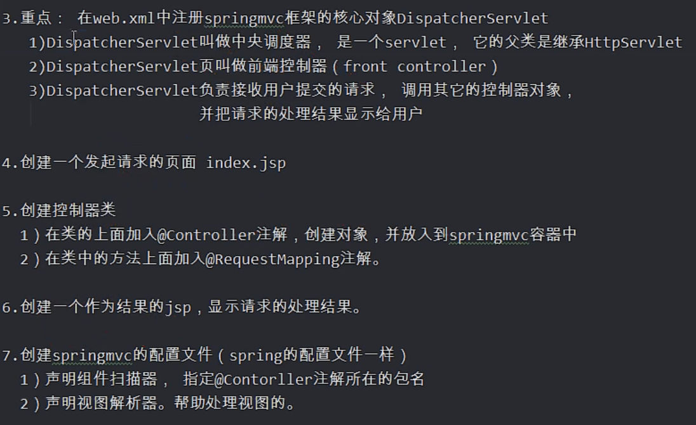
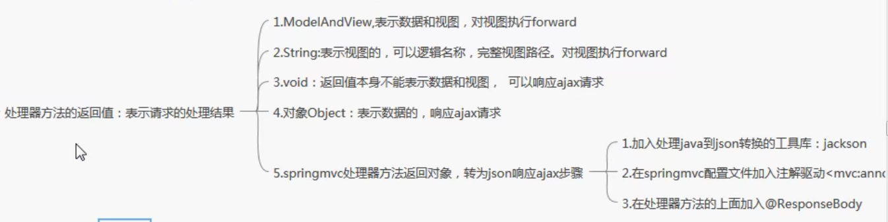
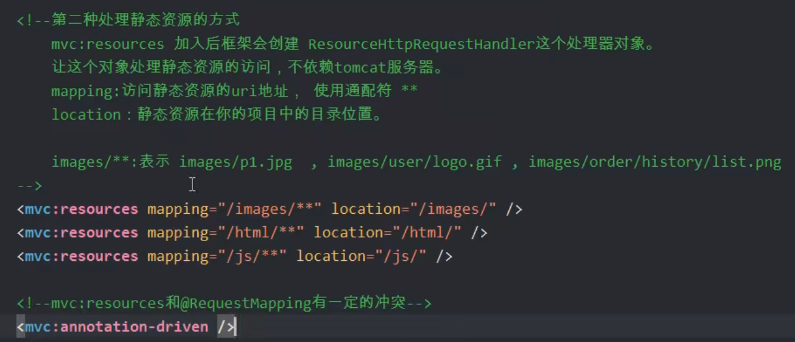

# SpringMVC



### SpringMVC配置

##### web.xml

> 加载中央调度器

```xml
<servlet>
    <servlet-name>myDispatchServlet</servlet-name>
    <servlet-class>org.springframework.web.servlet.DispatcherServlet</servlet-class>
    <init-param>
        <param-name>contextConfigLocation</param-name>
        <param-value>classpath:springmvc.xml</param-value>
    </init-param>
    <load-on-startup>1</load-on-startup>
</servlet>
```

### 接受请求参数

1. HttpServletRequest
2. HttpServletResponse
3. HttpSession

#### 逐个参数接受

```java
public void index(String name,int age)
```

##### 处理参数名与形参名不一致问题

```java
//required默认为true，表示参数必须要不为空
public void index(
    @RequestParam(value="canshu",required=true)String xingcan,
    @RequestParam(value="canshu2",required=false)String xingcan2
)
```


#### 接受对象参数

> 提前定义一个vo类，使用解构赋值

```java
public void index(Student student)
```

### 返回值

1. ModelAndView：返回视图和数据
2. String：可以指定视图名
3. void：不能表示数据，也不能表示视图，在处理ajax请求时，可以使用void返回值。通过HttpServletResponse输出数据。
4. 返回对象Object



### 静态资源处理

当web.xml中，映射资源路径使用了 / ，则会代替tomcat默认的default Servlet。而springmvc默认没有处理静态资源的能力，所以需要手动处理静态资源的访问

```xml
<!--第一种处理方式-->
<mvc:default-servlet-handler/>
<!--原理是：加入这个标签后，框架会创建控制器对象 DefaultServletHttpRequestHandler(类似于我们写的controller)，可以把接收到的请求转发给tomcat的default 的servlet-->
<!--但是DefaultServletHttpRequestHandler与@RequestMapping注解有冲突，所以需要加入注解驱动-->
<mvc:annotation-driven/>

<!--第二种处理方式-->
<mvc:resources mapping="/static/**" location="/static/"/>

```


