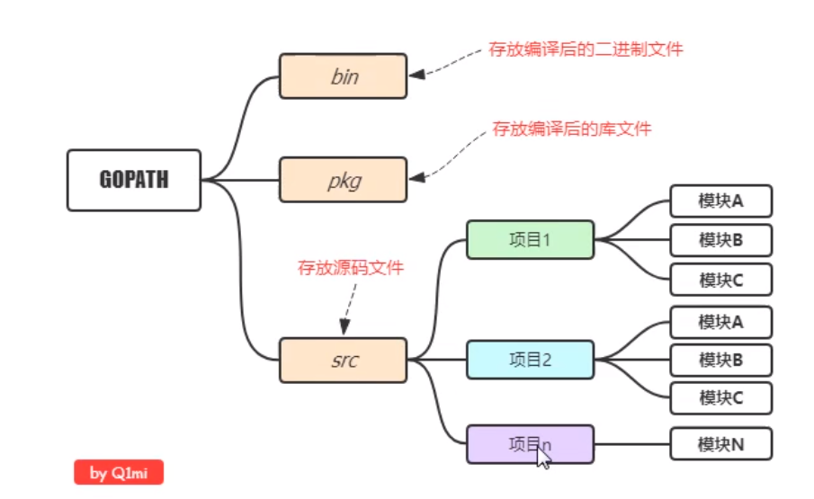
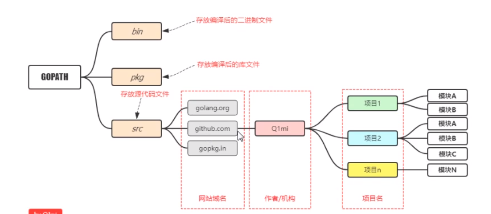
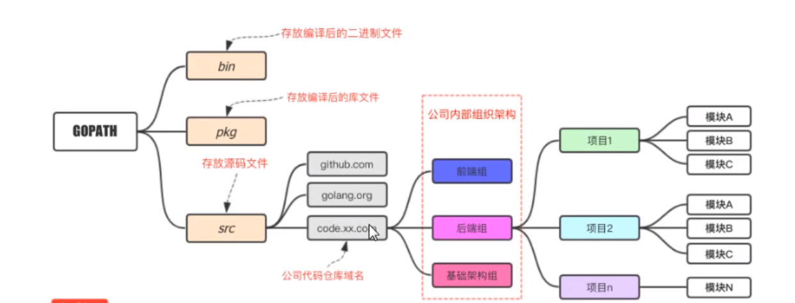

## 配置环境变量

1. GOPATH：保存的是以后项目的存放目录GO
2. GOROOT：保存的是安装包的目录
3. Path：go的bin目录
4. 在步骤一的GOPATH目录中，新建：src、pkg、bin

#### 常用命令

1. go env
2. go run
3. go build
4. go build -o hello.exe  //给编译后的文件重命名

### go开发目录

#### 个人使用



#### 多人



#### 企业



## IDE -vsCode

### 插件

1. Go


## 数据类型

### 变量声明

```go
var bianliang string
var bl2 string = "字符串类型赋值"
var bl = "类型推导声明"
bl3 := "简化版声明变量并赋值，只能在函数内部使用"
var (
	bl4 = "批量变量声明"
    bl6 = 123
    bl7 = 123.456
)
const (
	pl = "常量批量声明"
    pl2 //常量批量声明如果不写值，则值同上
    
)
//iota:在const关键字出现的时候被重置为0，const中每新增一行常量声明将使 iota 计数一次（iota可以理解为const中的行索引）。使用iota能简化定义，在定义枚举时很有用
const (
	a1 = iota //iota = 0,自增
    a2 //a2=1
    a3 //a3=2
)
const (
	a1 = iota //iota = 0,自增
    a2 //a2=1
    _  //_是匿名变量的意思，表示不要
    a3 //a3=3
)
```

### 基本数据类型

#### 整形

##### 带符号

##### 不带符号

##### 特殊整形

| 类型    | 描述                                             |
| ------- | ------------------------------------------------ |
| uint    | 32位操作系统上就是uint32，64位操作系统就是uint64 |
| int     | 32位操作系统上就是int32，64位操作系统就是int64   |
| uintptr | 无符号整型，用于存放一个指针                     |

## 进制

1. 八进制：0开头
2. 十六进制：0x开头