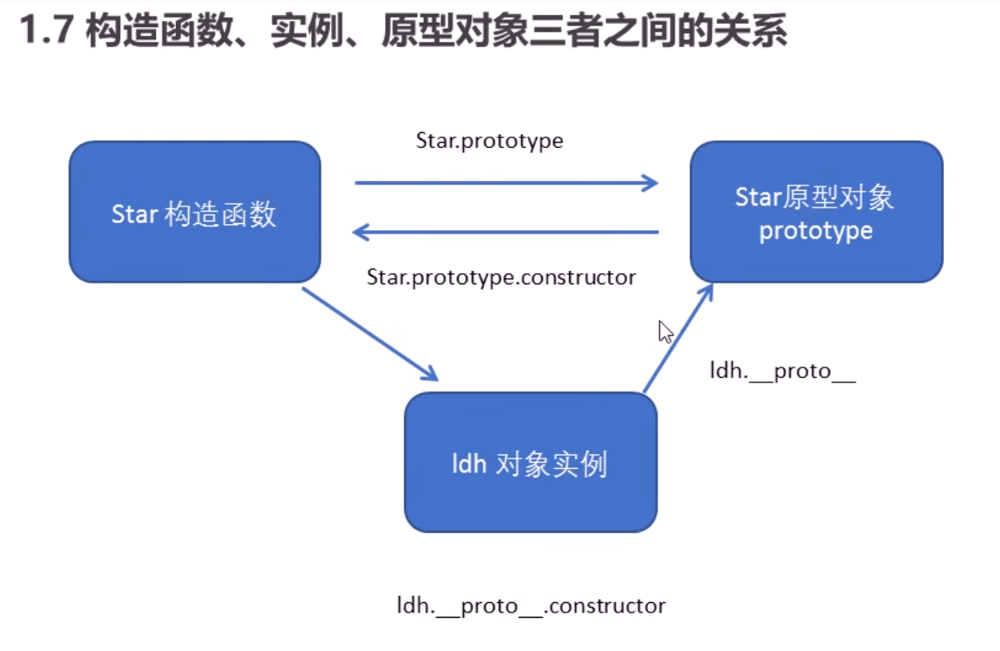
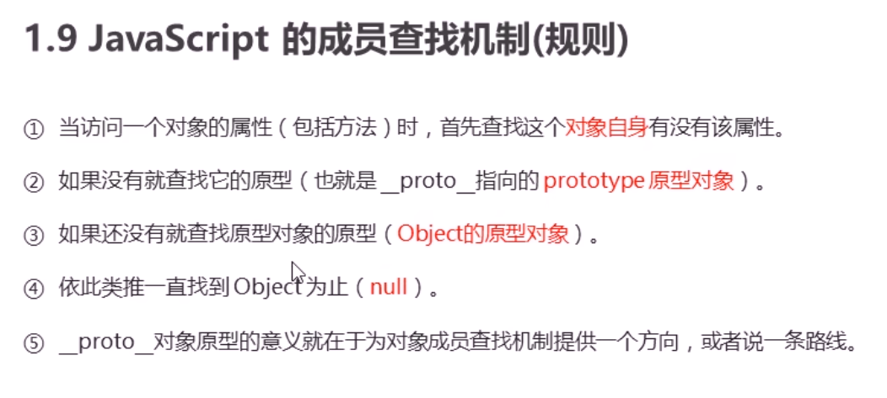

## 原型

### 原型对象

1. 原型是一个对象，
2. 原型的作用就是共享内存
3. 原型分两个
   1. prototype：共开发者使用（存在与函数中）
   2. \__proto\_\_：供浏览器使用（存在与对象中，指向**构造函数**的prototype原型对象）
4. **原型对象**（prototype）等于**对象原型**（\_\_proto\_\_）

### 构造函数

对象原型(\_\_proto\_\_)和构造函数(prototype)原型对象里面都有一个属性constructor属性，constructor我们称为构造函数，因为它**指回构造函数本身**。

constructor 主要用于记录该对象引用于哪个构造函数，它可以让原型对像重新指向原来的构造函数。

```js
function Star(){
    
}
Star.prototype = {
    constructor:Star,//指回构造函数本身
}
```




### 原型链

1. 只要是对象就有 \_\_proto\_\_ 原型，指向 原型对象 prototype

### 原型查找机制



## 数据类型

### 对象

对象的key类型只能有三种：string|number|Symbol