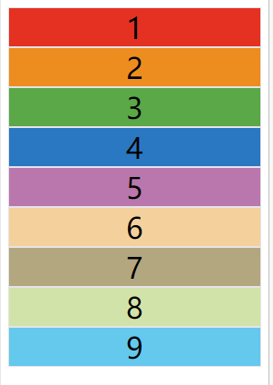
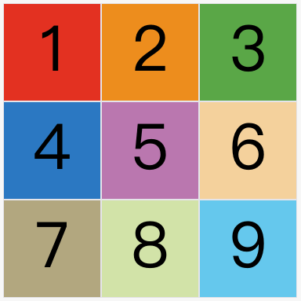
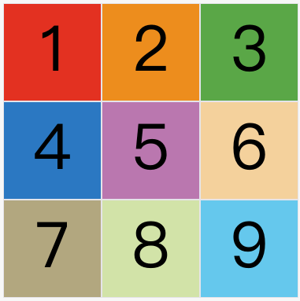
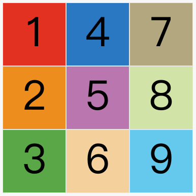
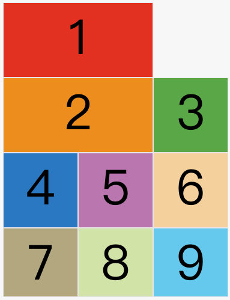
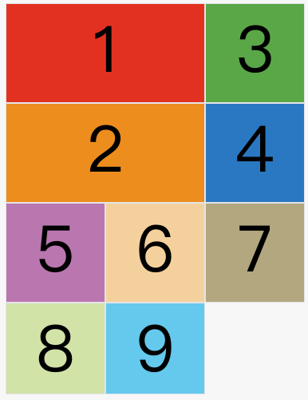
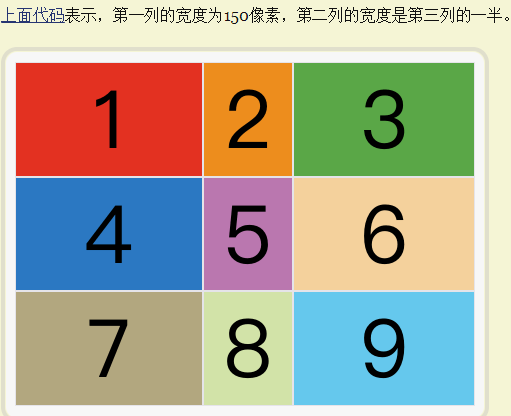
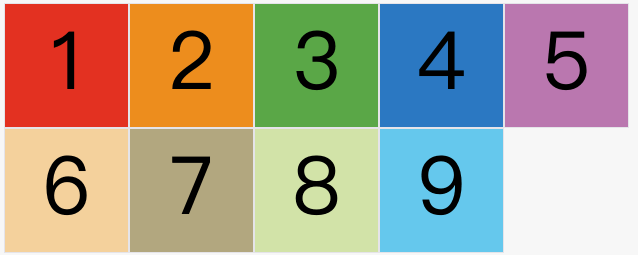
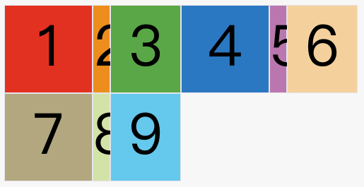

# Grid布局

## 属性

### display

> `display: grid`指定一个容器采用网格布局。

```css
div {
  display: grid;
}
```

**效果：**

> `display：inline-grid`指定容器为行内块元素，元素内部采用网格布局

### grid-template-rows|columns

> 容器指定了网格布局以后，接着就要划分行和列。`grid-template-columns`属性定义每行多少列，每一列的列宽，`grid-template-rows`属性定义每一列多少行，每一行的行高。

```css
.container {
  display: grid;
  grid-template-columns: 100px 100px 100px;
  grid-template-rows: 100px 100px 100px;
}
```

> 上面代码指定了一个三行三列的网格，列宽和行高都是`100px`。

**效果：**

> 除了使用绝对单位，也可以使用百分比

```css
.container {
  display: grid;
  grid-template-columns: 33.33% 33.33% 33.33%;
  grid-template-rows: 33.33% 33.33% 33.33%;
}
```

### 网格间隙 gap

1. grid-row-gap 属性，**（已弃用）新写法：row-gap**

   > `grid-row-gap`属性设置行与行的间隔（行间距），

2.  grid-column-gap 属性， **（已弃用）新写法：column-gap**

   > `grid-column-gap`属性设置列与列的间隔（列间距）。

3. grid-gap 属性 **（已弃用）新写法：gap**

   > `grid-gap`属性是`grid-column-gap`和`grid-row-gap`的合并简写形式，语法如下。

   ```css
   grid-gap: <grid-row-gap> <grid-column-gap>;
   ```

   > 如果`grid-gap`省略了第二个值，浏览器认为第二个值等于第一个值。

### grid-template-areas 范围

1. 网格布局允许指定"区域"（area），一个区域由单个或多个单元格组成。`grid-template-areas`属性用于定义区域。

   ```css
   .container {
     display: grid;
     grid-template-columns: 100px 100px 100px;
     grid-template-rows: 100px 100px 100px;
     grid-template-areas: 'a b c'
                          'd e f'
                          'g h i';
   }
   one{
       grid-area: a;//给one元素指定区域
   }
   ```

   > 上面代码先划分出9个单元格，然后将其定名为`a`到`i`的九个区域，分别对应这九个单元格。多个单元格合并成一个区域的写法如下。


2. 多个单元格合并成一个区域的写法如下。

   ```css
   grid-template-areas: 'a a a'
                        'b b b'
                        'c c c';
   ```

   > 上面代码将9个单元格分成`a`、`b`、`c`三个区域。

3. 如果某些区域不需要利用，则使用"点"（`.`）表示。

   ```css
   grid-template-areas: 'a . c'
                        'd . f'
                        'g . i';
   ```

### grid-auto-rows 指定行高


### grid-auto-flow 自动布局

[grid-auto-flow - CSS（层叠样式表)](https://developer.mozilla.org/zh-CN/docs/Web/CSS/grid-auto-flow?qs=grid-auto-flow)

> 划分网格以后，容器的子元素会按照顺序，自动放置在每一个网格。默认的放置顺序是"先行后列"，即先填满第一行，再开始放入第二行，即下图数字的顺序。这个顺序由`grid-auto-flow`属性决定，默认值是`row`，即"先行后列"。也可以将它设成`column`，变成"先列后行"。

```css
grid-auto-flow: row;
```

**效果：**

```css
grid-auto-flow: column;
```

**效果：**


> `grid-auto-flow`属性除了设置成`row`和`column`，还可以设成`row dense`和`column dense`。这两个值主要用于，某些项目指定位置以后，剩下的项目怎么自动放置。例如：让1号项目和2号项目各占据两个单元格，然后在默认的`grid-auto-flow: row`情况下，会产生下面这样的布局。

**效果：**

> 1号项目后面的位置是空的，这是因为3号项目默认跟着2号项目，所以会排在2号项目后面。现在修改设置，设为`row dense`，表示"先行后列"，并且尽可能紧密填满，尽量不出现空格。

**效果：**


### justify|align-items 

> `justify-items`属性**设置单元格内容**的水平位置（左中右），`align-items`属性设置单元格内容的垂直位置（上中下）。

```css
.container {
  justify-items: start | end | center | stretch;
  align-items: start | end | center | stretch;
}
```

> 这两个属性的写法完全相同，都可以取下面这些值。

```
- start：对齐单元格的起始边缘。
- end：对齐单元格的结束边缘。
- center：单元格内部居中。
- stretch：拉伸，占满单元格的整个宽度（默认值）。
```

> `place-items`属性是`align-items`属性和`justify-items`属性的合并简写形式。

```css
place-items: <align-items> <justify-items>;
```


### justify|align-content 属性

> `justify-content`属性是**整个内容区域 ** 在 **容器**里面的水平位置（左中右），`align-content`属性是**整个内容区域**的垂直位置（上中下）。

```css
.container {
  justify-content: start | end | center | stretch | space-around | space-between | space-evenly;
  align-content: start | end | center | stretch | space-around | space-between | space-evenly;  
}
```

- start - 对齐容器的起始边框。
- end - 对齐容器的结束边框。
- center - 容器内部居中。
- stretch - 项目大小没有指定时，拉伸占据整个网格容器。
- space-around - 每个项目两侧的间隔相等。所以，项目之间的间隔比项目与容器边框的间隔大一倍。
- space-between - 项目与项目的间隔相等，项目与容器边框之间没有间隔。
- space-evenly - 项目与项目的间隔相等，项目与容器边框之间也是同样长度的间隔。

> `place-content`属性是`align-content`属性和`justify-content`属性的合并简写形式。

```css
place-content: <align-content> <justify-content>
```


### 网格线命名

> `grid-template-columns`属性和`grid-template-rows`属性里面，还可以使用方括号，指定每一根网格线的名字，方便以后的引用。

```css
.container {
  display: grid;
  grid-template-columns: [c1] 100px [c2] 100px [c3] auto [c4];
  grid-template-rows: [r1] 100px [r2] 100px [r3] auto [r4];
}
```

> 上面代码指定网格布局为3行 x 3列，因此有4根垂直网格线和4根水平网格线。方括号里面依次是这八根线的名字。
>
> 网格布局允许同一根线有多个名字，比如`[fifth-line row-5]`。

## 项目属性

待学习。。。

## 关键字

### fr 

> 为了方便表示比例关系，网格布局提供了`fr`关键字（fraction 的缩写，意为"片段"）。如果两列的宽度分别为`1fr`和`2fr`，就表示后者是前者的两倍。

```css
.container {
  display: grid;
  grid-template-columns: 1fr 1fr;
}
```

> `fr`可以与绝对长度的单位结合使用，这时会非常方便

```css
.container {
  display: grid;
  grid-template-columns: 150px 1fr 2fr;
}
```

**效果：**

### auto

> `auto`关键字表示由浏览器自己决定长度。

```css
grid-template-columns: 100px auto 100px;
```

> 上面代码中，第二列的宽度，基本上等于该列单元格的最大宽度，除非单元格内容设置了`min-width`，且这个值大于最大宽度。

### auto-fill

> 有时，单元格的大小是固定的，但是**容器**的大小不确定。如果希望**容器的**每一行（或每一列）容纳尽可能多的单元格，这时可以使用`auto-fill`关键字表示自动填充。

```css
.container {
  display: grid;
  grid-template-columns: repeat(auto-fill, 100px);
}
```

> [上面代码](https://jsbin.com/himoku/edit?css,output)表示每列宽度`100px`，然后自动填充，直到容器不能放置更多的列

**效果：**

### min-content

指明由网格元素中占用空间最小的那一个来决定轨道的尺寸。

### max-content

指明由网格元素中占用空间最大的那一个来决定轨道的尺寸。

## 函数

### repeat()

1. `repeat()`接受两个参数，第一个参数是重复的次数（上例是3），第二个参数是所要重复的值。

   ```css
   /*使用repeat函数前*/
   .container {
     display: grid;
     grid-template-columns: 33.33% 33.33% 33.33%;
     grid-template-rows: 33.33% 33.33% 33.33%;
   }
   /*使用repeat函数后*/
   .container {
     display: grid;
     grid-template-columns: repeat(3,33.3%);
     grid-template-rows: repeat(3,33.3%);
   }
   ```

2. `repeat()`重复某种模式也是可以的。

   ```css
   grid-template-columns: repeat(2, 100px 20px 80px);
   ```

   **效果：**

### minmax()

1. `minmax()`函数产生一个长度范围，表示长度就在这个范围之中。它接受两个参数，分别为最小值和最大值。

   ```css
   rid-template-columns: 1fr 1fr minmax(100px, 1fr);
   ```

   上面代码中，`minmax(100px, 1fr)`表示列宽不小于`100px`，不大于`1fr`。


# 总结

基础行列布局


grid布局，可以随意混搭 auto、minmax等关键字与函数


## 网格区域

grid-template-areas

### 使用方式

```css
/*定义区域*/
.grid:{
  grid-template-areas:
    "header header"
    "sider content"
    "footer footer"
}
/*关联区域*/
.grid-item-1{
  grid-area: header;
}
.grid-item-2{
  grid-area：sider;
}
```

## 行列单独布局

```css
// 分开写
.grid-item-1{
  grid-row-start: 2;
  grid-row-end: 4;
  grid-column-start: 1;
  grid-column-end: 3;

}
// 简写
.grid-item-1{
  grid-row: 2/4;
  grid-column: 1/3;
}
// 合并单元写法 span 单位
.grid-item-1{
    grid-row: span 2;
    grid-column: span 2;
}
```


## 学习链接

[【第2763期】CSS Grid布局的秘密](https://mp.weixin.qq.com/s/jykFJjxIjw8WTUTvFz__jg)


# Flex布局

align-content 与 align-items 的区别是 items 布局垂直方向，content 也是布局垂直方向，但是只有在一行放不下换行后才生效

# 最新笔记

