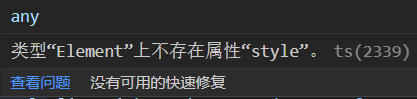

# vue3

## 响应式API

### ref

```vue
<script setup lang="ts">
import {ref,Ref} from 'vue';
//设置返回值类型(方法一、方法二)
const demo = ref<string>("")
const demo2:Ref<string> = ref("")
</script>
```

### computed

```vue
<script setup lang="ts">
import {computed} from 'vue';
//vue3中计算属性的函数中如果只传入一个回调函数，表示的是get
const cal1 = computed(()=>{
    return 1
})
//计算属性中的函数如果传入的是对象，则表示get/set
const msg = ref("")
const cal2 = computed<T>({
    get(){
        return 1
    },
    set(val){
        //当cal2的值被主动修改时，会触发set方法
        msg.value = val
    }
})
</script>
```

### watch

```vue
<script setup lang="ts">
    let msg = ref(0)
    //监听单个源
    watch(msg,(newVal,oldVal)=>{
        console.log("newVal",newVal,"oldVal":oldVal)
    }),
    //深度监听，传入第三个参数（配置参数）
    watch(msg,(newVal,oldVal)=>{
        console.log("newVal",newVal,"oldVal":oldVal)
    },{
        deep:true,//深度监听
    })
    //监听多个源
    watch([msg1,msg2],(newVal,oldVal)=>{
        console.log("新：",newVal)
        console.log("旧：",oldVal)
    })
    //监听对象中的某个单一的值，使用箭头函数的返回值
    watch(()=>obj.name,(newVal,oldVal)=>{
        console.log("新：",newVal)
        console.log("旧：",oldVal)
    })
</script>
```

### watchEffect

> 非惰性的监听，页面一加载就会监听值，并且会一直监听。
>
> 同时他会返回一个停止监听的**函数句柄**，执行这个**函数句柄**即可停止监听

```vue
<script setup lang="ts">
import {watchEffect,ref} from 'vue';
const msg = ref("watch的高级监听特性")
const obj = ref({
    zs:{
        name:"张三"
    }
})
//页面一加载就会监听值
watchEffect(()=>{
    console.log("msg======>:",msg)
})
//前置的回调函数
watchEffect((before) => {
  console.log("李四的姓名：", obj.value.zs.name);
  //before函数，会在watchEffect内部第一个执行
  before(() => {
    console.log("李四before执行了");
  })
})
//返回一个函数句柄，
const stop = watchEffect(()=>{
    console.log(obj.value.zs.name)
})
stop();//执行句柄停止监听
    
//配置选项
watchEffect(()=>{
    const input:HTMLInputElement = document.querySelector("input") as HTMLInputElement
    console.log("input：",input)
},{
    flush:"pre|sync|post",//组件更新前触发|强制效果始终同步触发|组件更新后执行
})
</script>
```

### defineProps

```vue
<script setup lang="ts">
//无需导入，会自动加入宏编译器
//第一种方式
defineProps<{msg:string}>()
//第二种方式
const props = defineProps({
    msg:string
})
//第三种方式
type Leixing = {
    msg:string
}
defineProps<Leixing>()
</script>
```

## 组件与生命周期

### 生命周期

```vue
<script setup lang="ts">
setup(){
    console.log("在 beforeCreate()之前执行")
}
onBeforeMount(()={
    console.log("挂载前")
})
onMounted(()={
    console.log("挂载前")
})
onBeforeUpdate(()={
    console.log("更新前")
})
onUpdated(()={
    console.log("更新后")
})
onBeforeUnmount(()={
    console.log("卸载前")
})
onUnmount(()={
    console.log("卸载后")
})
</script>
```

### 父子传值

#### defineProps

> 父给子传值

```vue
<!--父组件传递msg-->
<template>
	<son :msg="msg"></son>
</template>
<!--子组件接受msg-->
<script setup lang="ts">
//无需导入defineProps，只有在<script setup>中才能使用的宏编译器，且会随着 <script setup> 处理过程一同被编译掉。
//第一种方式
defineProps<{msg:string}>()
//第二种方式
const props = defineProps({
    msg:string
})
//第三种方式
type Leixing = {
    msg:string
}
defineProps<Leixing>()
    
//默认值（仅限于在ts中使用）
type Leixing = {
    msg:string
}
widthDefaults(defineProps<Leixing>(),{
    msg:"我是默认值"
})
</script>
```

#### defineEmit

> 子组件向父组件分发事件

```vue
<!--子组件派发-->
<script setup lang="ts">
const emit = defineEmits(['send-val'])
const sendVal = function () {
    emit('send-val', "我是子组件派发的值")
}
</script>
<template>
    <div class="wrap">
        <button @click="sendVal">子组件派发</button>
    </div>
</template>
<style scoped></style>

<!--父组件-->
<template>
	<Sider class="sider" @send-val="getVal"></Sider>
</template>
<script setup lang="ts">
import { ref } from 'vue'
const msg = ref("")
const getVal = function (val: string) {
    console.log("父组件获取的值：", val);
    msg.value = val
}
</script>
```

#### defineExpose

> 父组件获取子组件的实例

```vue
<!--父组件-->
<template>
	<son ref="example"></son>
</template>
<script setup lang="ts">
import {ref,onMounted} from 'vue'
const example = ref(null)//声明 example，用来通过ref属性获取子组件的实例
onMounted(()=>{
    console.log("子组件中的list值：",example.list)
})
</script>


<!--子组件-->
<script setup lang="ts">
    import {ref} from 'vue'
    const list = ref([1,2,3,4,5])
	defineExpose({
        list
    })
</script>
```


# typescript

## tsconfig.ts

#### 配置简单的映射路径

https://www.tslang.cn/docs/handbook/module-resolution.html#path-mapping

```bash
#安装
npm i @types/node -D
```

```ts
//vite.config.ts
import { defineConfig } from 'vite'
import { resolve } from 'path'

export default defineConfig {
    // ...
    resolve: {
        alias: {
            "@": resolve(__dirname, 'src'), // 路径别名
        },
        extensions: ['.js', '.json', '.ts'] // 使用路径别名时想要省略的后缀名，可以自己 增减
    }
    // ...
}
```

```ts
//tsconfig.ts
{
    "compilerOptions""{
    "baseUrl": ".",
    "paths": {
        "@": [
            "src/*"
        ]
    }
}
}
```

## vue3+ts语法问题

#### 使用ref获取DOM，并操作DOM



```ts
//解决方法一
const wrap = <HTMLElement>document.querySelector(".wrap");
//解决方法二
const wrap = document.querySelector(".wrap") as HTMLElement;
```


#### 导入 .ts 类型文件错误

首先去除路径中的 .ts 后缀

然后修改配置文件

```ts
//在tsconfig.ts配置文件中添加如下配置
"baseUrl":".",
"paths":{
    "@/*":[
        "src/*"
    ]
}


  const wrap = <HTMLElement>document.querySelector(".wrap");
  wrap.style.lineHeight = document.documentElement.clientHeight / 2 + "px";
```


#### UI样式穿透

```scss
//vue2是如下写法	
::v-deep input{}
//vue3是如下写法
:deep(input){}
```

## scss

#### 函数

#### 代码重用

@mixin与@include是一对

```scss
@mixin .example{
    color:red;
}
div{
    @include .example;
}
```

mixin强大之处在于指定参数与缺省值

```scss
@mixin .example($val:10px){
    left:$val;
}
div{
    @include .example(10px);
}
```

## pinia使用

https://segmentfault.com/a/1190000041246156

