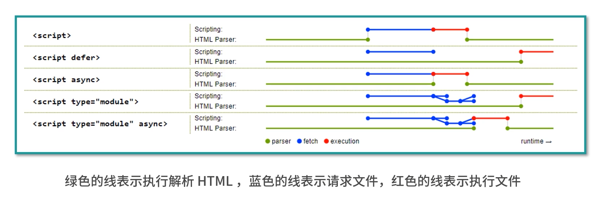
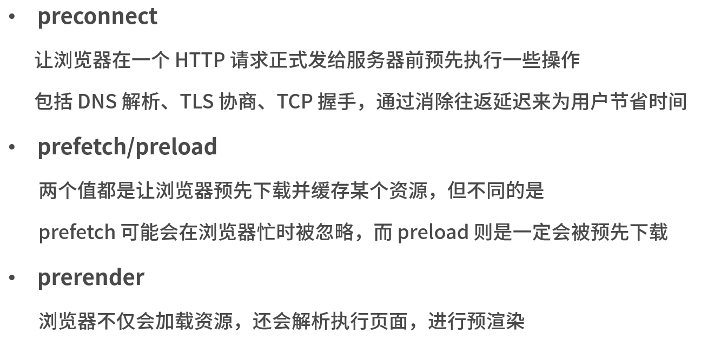
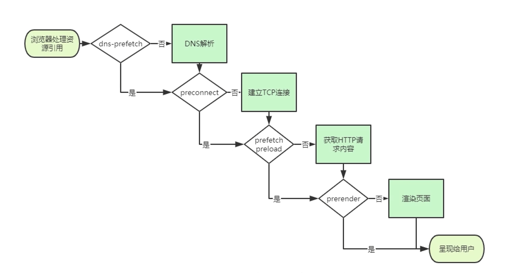
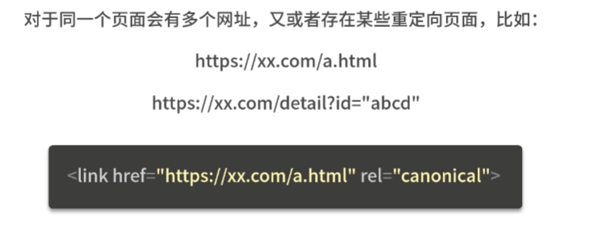
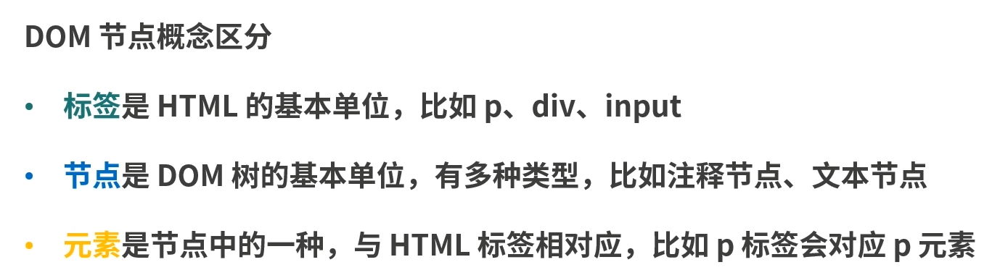
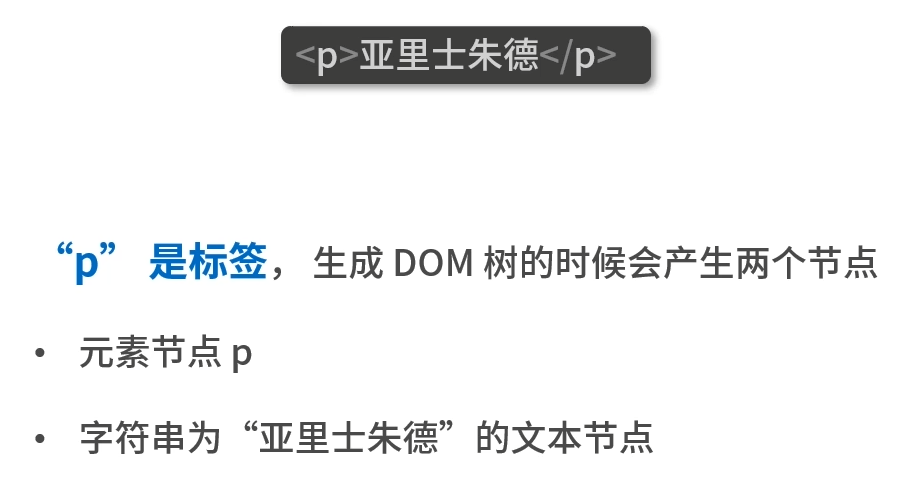

# 前端进阶


## 事件循环

1. js的执行会影响页面的执行
2. js会阻止渲染，因为js在渲染线程上

## HTML

### meta标签

#### 自动刷新与跳转

```html
<meta http-equiv="Refresh"content="5;URL=page2.html">
```

比如每隔一分钟就需要刷新页面的大屏幕监控，也可以通过meta标签来实现，只需去掉后面的URL即可

```html
<meta http-equiv="Refresh"content="60">
```


### script标签

- async属性一一立即请求文件，但不阻塞渲染引擎，文件加载完毕后阻塞渲染引擎并立即执行文件内容
- defer属性一一立即请求文件，但不阻塞渲染引擎，等到解析完HTML之后再执行文件内容
- HTML5标准type属性一对应值为“module”
  - 让浏览器按照ECMA Script6标准将文件当作模块进行解析，默认阻塞效果同defer
  - 也可以配合async在请求完成后立即执行



#### 调整加载顺序提升渲染速度

**当渲染引擎解析HTML遇到script标签引入文件时，会立即进行一次渲染**

构建工具会把编译好的引用JavaScript代码的script标签放入到body标签底部

当渲染引擎执行到body底部时会先将已解析的内容渲染出来，然后再去请求相应的JavaScript文件

如果是**内联脚本**（即不通过**src属性**引用外部脚本文件直接在HTML编写JavaScript代码的形式）渲染引擎则不会渲染


### link标签

#### 通过预处理提升渲染速度

**dns-prefetch**

当link标签的rel属性值为 dns-prefetch 时，浏览器会对某个域名预先进行**DNS解析并缓存**





#### 减少重复




### DOM操作





#### DOM操作耗时


