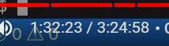

## 学习进度

[Golang Tutorial for Beginners | Full Go Course - YouTube](https://www.youtube.com/watch?v=yyUHQIec83I&ab_channel=TechWorldwithNana)



## 安装

...待整理

## Hello World

### 初始化项目

```bash
# 初始化项目，并生成一个 go.mod 文件，用来描述项目基本信息与依赖管理
go mod init hello-golang
```

### 创建main.go文件并打印hello world

```go
package main //声明当前包

import ’fmt'

func main(){
    fmt.Print("Hello golang")
}
```

### 运行程序

```bash
# go run 命令跟上需要运行的文件名
go run main.go
```


## 变量

### 声明变量

#### 变量与常量基础声明方式

```go
func main(){
    var valiable = 10;//使用关键字 var 声明变量
    const constant = 10;//使用关键字 const 声明常量
}
```

#### 变量简化声明方式

```go
func main(){
    valiable := 123//简化声明变量
}
```


### 变量指定类型

```go
func main(){
    var useName string//初始化指定 string 类型
    
}
```

### 数据类型

#### 整型

int：代表所有的整数类型

细分之下有 

1. int8：正127 负128
2. int16：正负3w2左右
3. int32：正负21亿左右（10位上下）
4. int64：正负19位
5. uint：正整数，不能为负数，为负数则会报错提示
6. uint8
7. uint16
8. uint32
9. uint64


#### Array

声明数组

```go
func main(){
    var arr [10]string//声明一个长度为10的字符串数组
}
```

#### slice

声明切片

```go
func main(){
    var sli []string
}
```

切片的增删改

```go
func main(){
    var sli = []string{}
    sli = append(sli,"hello")//增
}
```


#### map

```go
//定义map[key]value
var m1 map[string]string//声明map类型变量
var m2 = make(map[string]string)//通过make内建方法创建map
//只要创建map，就需要make函数，
var m3 = make([]map[string]string,1)//创建一个map集合，需要为 m3 集合指定一个集合初始值大小，这是一个动态集合（slice），后期可以自动扩展数据
```

#### 结构体 struct

```go
type User struct {
    name string
    age uint8
}
func main(){
    user := User{
        name = "张三",
        age:16
    }
}
```


### 内置函数

#### 长度

```go
len(varible)//查询varible变量的长度
```

#### 追加

```go 
slice = append(slice,ele)//将ele追加到slice中
```


## 打印 Print

### 换行打印

```go
func main(){
	fmt.Println("hello world")
}
```

### 格式化打印

```go
func main(){
	const constant = 10
	fmt.Printf("hello %v",constant)
}

//%v 默认格式打印
//%T 输入数据类型
```

## 流程控制

### 循环

```go
// for无限循环
for{
    fmt.Println("无线循环执行")
}

// for范围循环
for index,item : range slice {
    fmt.Print(index)
    fmt.Print(item)
}
// for条件循环
for len(slice)<50{
    fmt.Println("当slice长度小于50时，执行循环语句")
}
```

#### break、continue

break：终止当前语句并跳出循环

continue：跳过当前循环执行下一个循环语句

### 开关switch

```go
func main(){
    city := "大连"
    switch city{
        case "大连":
        //执行代码

        default:
        fmt.Println("无匹配条件执行语句")
    }
}
```

## 分包

同一个文件夹下文件属于同一个包，他们的包名相同，如果需要引入自定义的包的方法，只需要在 go.mod 文件中，找到 module 关键字声明的字段，以它为根路径，拼接上包名即可

```go
//导入demo包下的Tdemo方法
package main

import "hello-golang/demo"

func main() {
	demo.Tdemo()
}
```


## 练手demo

### 询问demo

```go
package main

import "fmt"

func main() {
	var (
		userName string
		age      uint8
		phone    uint64
		address  string
	)

	fmt.Println("请输入你的姓名")
	fmt.Scan(&userName)
	fmt.Println("请输入你的年龄")
	fmt.Scan(&age)
	fmt.Println("请输入你的手机号码")
	fmt.Scan(&phone)
	fmt.Println("请输入地址")
	fmt.Scan(&address)
	fmt.Printf("姓名：%v，年龄：%v，手机号：%v，地址：%v", userName, age, phone, address)
}
```


### 协程与主程序退出等待

```go 
package main

import (
	"fmt"
	"sync"
	"time"
)

type User struct {
	name string
	age  uint8
}

var wg = sync.WaitGroup{}

func main() {
	var (
		name string
		age  uint8
	)
	fmt.Println("请输入姓名")
	fmt.Scan(&name)
	fmt.Println("请输入年龄")
	fmt.Scan(&age)
	wg.Add(1)
	go createUser(name, uint(age))
	wg.Wait()
}
func createUser(name string, age uint) {
	time.Sleep(2 * time.Second)
	user := User{
		name: name,
		age:  uint8(age),
	}
	fmt.Printf("用户信息：%v\n", user)
	wg.Done()
}
```

