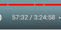

## 学习进度

[Golang Tutorial for Beginners | Full Go Course - YouTube](https://www.youtube.com/watch?v=yyUHQIec83I&ab_channel=TechWorldwithNana)



## 安装

...待整理

## Hello World

### 初始化项目

```bash
# 初始化项目，并生成一个 go.mod 文件，用来描述项目基本信息与依赖管理
go mod init hello-golang
```

### 创建main.go文件并打印hello world

```go
package main //声明当前包

import ’fmt'

func main(){
    fmt.Print("Hello golang")
}
```

### 运行程序

```bash
# go run 命令跟上需要运行的文件名
go run main.go
```


## 变量

### 声明变量

#### 变量与常量基础声明方式

```go
func main(){
    var valiable = 10;//使用关键字 var 声明变量
    const constant = 10;//使用关键字 const 声明常量
}
```

#### 变量简化声明方式

```go
func main(){
    valiable := 123//简化声明变量
}
```


### 变量指定类型

```go
func main(){
    var useName string//初始化指定 string 类型
    
}
```

### 数据类型

#### 整型

int：代表所有的整数类型

细分之下有 

1. int8：正127 负128
2. int16：正负3w2左右
3. int32：正负21亿左右（10位上下）
4. int64：正负19位
5. uint：正整数，不能为负数，为负数则会报错提示
6. uint8
7. uint16
8. uint32
9. uint64

## 打印 Print

### 换行打印

```go
func main(){
	fmt.Println("hello world")
}
```

### 格式化打印

```go
func main(){
	const constant = 10
	fmt.Printf("hello %v",constant)
}
```


## 练手demo

### 询问demo

```go
package main

import "fmt"

func main() {
	var (
		userName string
		age      uint8
		phone    uint64
		address  string
	)

	fmt.Println("请输入你的姓名")
	fmt.Scan(&userName)
	fmt.Println("请输入你的年龄")
	fmt.Scan(&age)
	fmt.Println("请输入你的手机号码")
	fmt.Scan(&phone)
	fmt.Println("请输入地址")
	fmt.Scan(&address)
	fmt.Printf("姓名：%v，年龄：%v，手机号：%v，地址：%v", userName, age, phone, address)
}
```

