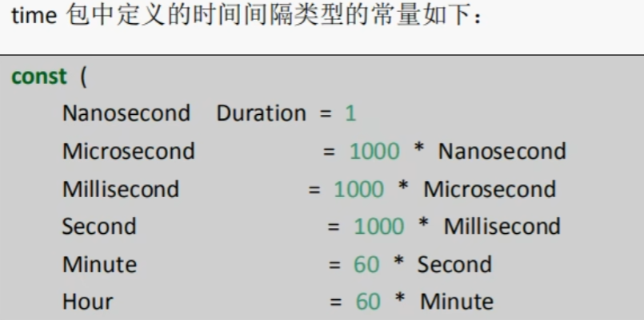
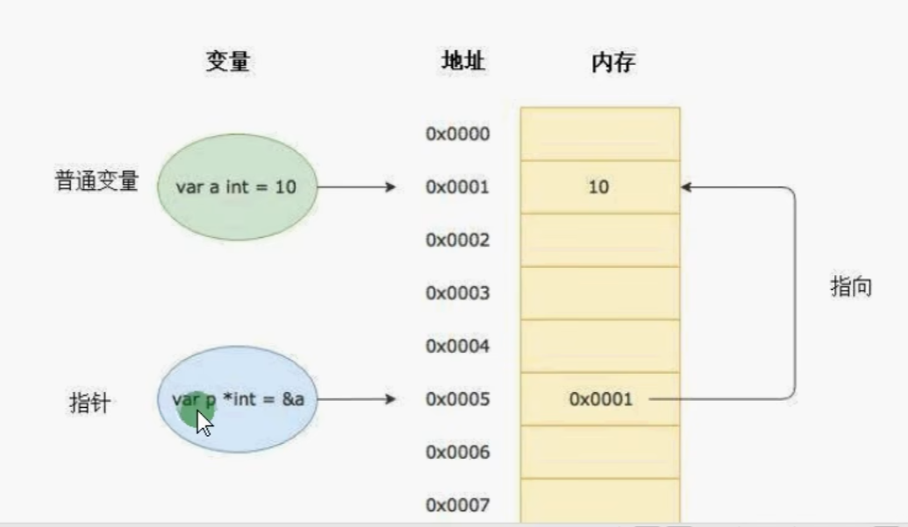
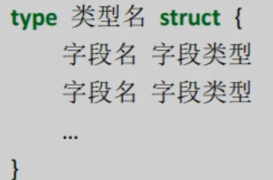

## 安装

...待整理

## Hello World

### 初始化项目

```bash
# 初始化项目，并生成一个 go.mod 文件，用来描述项目基本信息与依赖管理
go mod init hello-golang
```

### 创建main.go文件并打印hello world

```go
package main //声明当前包

import ’fmt'

func main(){
    fmt.Print("Hello golang")
}
```

### 运行程序

```bash
# go run 命令跟上需要运行的文件名
go run main.go
```


## 变量

### 声明变量

```go
func main(){
    //声明常量
    const constant = 10;//使用关键字 const 声明常量
    //声明变量
    var useName string//初始化指定 string 类型
    var valiable = 10;//使用关键字 var 声明变量
    valiable := 123//字面量声明 字面量语法：当前电脑是64位则为64位，电脑为32位，则为32位
}
```

## 基本数据类型

### 整型


```go
num := 18
fmt.Printf("num值：%v,类型：%T\n", num, num)
fmt.Printf("size:%v", unsafe.Sizeof(num))
```

#### 类型转换

go语言中只有强转类型，没有隐式转换，高位向低位转换要注意不能超出低位类型范围

```go
var num1 int16 = 130
//高向低转换（错误，超出低位类型范围）
fmt.Println(int8(num1))//得出的值超出预期
```

### 浮点型

浮点类型默认是 float64

#### 精度丢失

引入第三方包解决

### bool 布尔类型

Go语言中以bool类型进行声明布尔型数据，布尔型数据只true(真)和false(假)两个值。
注意：
1.布尔类型变量的默认值为false。
2.G0语言中不允许将其他类型强制转换为布尔型
3.布尔型无法参与数值运算，也无法与其他类型进行转换。

### 字符串

Go 语言中，默认使用的是 UTF-8

#### 字符串拼接

1. 通过 + 拼接
2. resStr :=  fmt.Sprintf("%v", str)，把打印的结果字符串返回给变量

#### 多行字符串

定义多行字符串时，需要用反引号

```go
str := `
	hello gay
	你好呀 兄弟
	`
fmt.Println(str)
```


### byte 与 rune

组成每个字符串的元素叫做“字符”，可以通过遍历字符串元素获得字符。字符用单引号包裹起来

Go 语言中，字符有两种类型

1. uint8，或者叫 byte ，代表一个ASCII 的字符
2. rune，代表一个 UTF-8 字符

当需要处理中文、日文或者其他复合字符时，则需要用到rune类型。rune类型实际是一个 int32。
Go使用了特殊的 rune 类型来处理 Unicode ,让基于 Unicode 的文本处理更为方便，也可以使用 byte 型进行默认字符串处理，性能和扩展性都有照顾。

一个汉子占用3个字节(utf-8)，一个字母占用一个字节

#### 处理汉字与字母共存打印错误问题

```go
func main() {
	s := "你好 go"
	for i := 0; i < len(s); i++ { // 使用 byte 处理
		fmt.Printf("%v(%c)", s[i], s[i])
	}
	fmt.Println()
	fmt.Println("分隔符")
	for _, value := range s { //range 使用 rune 处理
		fmt.Printf("%v(%c)", value, value)
	}
}
```

#### 修改字符串

要修改字符串，需要先将其转换成**[]rune**或**[]byte**,完成后再转换为**string**。无论哪种转换，都会重新分配内存，并复制字节数组。

```go
func main() {
	s := "hello"
	fmt.Printf("s改变前打印：%v\n", s)
	rune8 := []byte(s)
	rune8[0] = 'H'
	s = string(rune8)
	fmt.Printf("s改变后打印：%v\n", s)

	s2 := "你好"
	fmt.Printf("s2改变前打印：%v\n", s2)
	rune32 := []rune(s2)
	rune32[0] = '我'
	s2 = string(rune32)
	fmt.Printf("s2改变后打印：%v\n", s2)
}
```

## 基本类型转换

### 数值类型转换

注意：转换时建议低位转高位，整形转浮点型

```go
//整形与整形之间转换
var num1 int8 = 12
var num2 int16 = 120
var num3 = int16(num1) + num2
//浮点型与浮点型之间转换
var f1 float32 = 3.14
var f2 float64 = 6.18
var f3 = float64(f1) + f2
//浮点型与整形之间转换
var num int8 = 10
var f float32 = 3.14
var fn = float32(num) + f
```

### 其他类型转string

```go
//方式一 ：通过 Sprintf
func main(){
    num := 100
    f := 3.14
    b := true
    by := 'a'
    strNum := fmt.Sprintf("%d", num)
    fmt.Printf("strNum:%v\n", strNum)
    strF := fmt.Sprintf("%f", f)
    fmt.Printf("strF:%v\n", strF)
    strB := fmt.Sprintf("%t", b)
    fmt.Printf("by:%v\n", strB)
    strBy := fmt.Sprintf("%c", by)
    fmt.Printf("strBy:%v\n", strBy)
}

//方式二 ：通过strconv格式化转换
func main() {
    num := 100
    f := 3.14
    b := true
    by := 'a'
    /**
	参数1：要格式化变量
	参数2：格式化的类型
	*/
    strNum := strconv.FormatInt(int64(num), 10)
    fmt.Printf("strNum:%v\n", strNum)
    /**
	参数1：要格式化的变量
	参数2：格式化类型
			'f' (常用的小数类型)
			'b' (二进制类型)
			'e' (十进制指数)
			'E' (十进制指数)
			'g' (指数很大时用 'e' 格式，否则 'f' 格式)
			'G' (指数很大时用 'E' 格式，否则 'f' 格式)
	参数3：保留的小数点
	参数4：格式化的类型
			64 或 32
	*/
    strF := strconv.FormatFloat(f, 'f', 2, 64)
    fmt.Printf("strF:%v\n", strF)
    strB := strconv.FormatBool(b)
    fmt.Printf("by:%v\n", strB)
    strBy := strconv.FormatUint(uint64(by), 10)
    fmt.Printf("strBy:%v\n", strBy)
}

```

### string 转其他类型

```go
func main(){
    str := "1234"
    //string 转 int
    /*
    	参数1：字符串变量
    	参数2：输出的进制（2，8，10，16）
    	参数3：输出的数据类型 （8，16，32，64）int8,int16...
    */
    num, ok := strconv.ParseInt(str, 10, 16)
    if ok == nil {
        fmt.Printf("num:%v", num)
    } else {
        fmt.Println("转换错误", ok)
    }
	//string 转 float
    f, ok := strconv.ParseFloat(str, 64)
    if ok == nil {
        fmt.Printf("f:%f", f)
    } else {
        fmt.Println("转换错误", ok)
    }
}
```

## 运算符

算术运算符
关系运算符
逻辑运算符
位运算符
赋值运算符

| 运算符 | 描述                                                         |
| ------ | ------------------------------------------------------------ |
| +      | 相加                                                         |
| -      | 相减                                                         |
| *      | 相乘                                                         |
| /      | 相除。即被整除的数 100 / 9 = 11                              |
| %      | 求余。即被整除后剩余的数 100 % 9 = 1                         |
| ++、-- | 自增与自减，在Go语言中是单独的语句，并不是运算符，<br />1. 不能参与赋值运算： num := i++ （错误，不能参与赋值运算）<br />2. 没有前置运算：++i   （错误，只有后置++ 、--） |

### 位运算符

位运算符对整数在内存中的二进制位进行操作

| 运算符 | 描述                                                         |
| ------ | ------------------------------------------------------------ |
| &      | 参与运算的两数各对应的二进制位相与（两位均为1 才为 1）       |
| \|     | 参与运算的两数各对应的二进制位相与（两位有一个为 1 就为 1）  |
| ^      | 参与运算的两数各对应的二进制位相异，或当两对应的二进制位相异时，结果为 1（两位不一样则为 1） |
| <<     | 左移n位就是乘以2的n次方。“a<<b”是把a的各二进位全部左移b位，高位丢弃，低位补0。 |
| >>     | 右移n位就是除以2的n次方。“a>>b”是把a的各二进位全部右移b位。  |

```go
func main(){
    a := 5                         //二进制 101
    b := 2                         //二进制 010
    fmt.Printf("a|b:,%v\n", a|b)   //二进制 000     二进制两位都为1才为1，十进制：0
    fmt.Printf("a&b:,%v\n", a&b)   //二进制 111		二进制一位为1则为1，十进制：7
    fmt.Printf("a^b:,%v\n", a^b)   //二进制 111		两位不同则为1，十进制：7
    fmt.Printf("a<<b:,%v\n", a<<b) // 5 * 2的2次方  101向左进两位，低位补0 10100 十进制：20
    fmt.Printf("a>>b:,%v\n", a>>b) // 5 / 2的2次方  101向右进两位，高位补0 001	 十进制：1
}
```

## 流程控制

### 循环

```go
// for无限循环
for{
    fmt.Println("无线循环执行")
}

// for范围循环
for index,value : range slice {
    fmt.Print(index)
    fmt.Print(value)
}
// for条件循环
for len(slice)<50{
    fmt.Println("当slice长度小于50时，执行循环语句")
}

//该 i 变量只能在for循环中使用，属于局部变量
for i:=0;i<10;i++{
    fmt.Println("i:",i)
}
```

### break、continue，goto

#### break

break默认跳出一层循环，并终止后面的执行语句

```go
//break：只能终止一层循环，并且不执行break后面的语句
for i:=0;i<10;i++{
    fmt.Println("i:",i)
    if i==2{
        break
    }
    fmt.Println("继续执行")
}
```

break跳出多层循环，需要结合标记 label，标记出break想要跳出的位置

```go
func main() {
label_b:
	for j := 0; j < 10; j++ {
		fmt.Printf("j层：%v\n", j)
		for i := 0; i < 10; i++ {
			fmt.Printf("i:%v\n", i)
			if i == 2 {
				break label_b
			}
			fmt.Println("继续执行")
		}
	}
}
```

#### continue

语句可以结束当前循环，开始下一次的循环迭代过程，仅限在f0循环内使用

```go
func main() {
	for i := 0; i < 5; i++ {
		fmt.Printf("i:%v\n", i)
		if i == 2 {
			continue
		}
		fmt.Println("继续执行")
	}
}
```

控制跳出循环后的开始执行位置，类似于break跳出多层循环一个意思

```go
func main() {
label1:
	for j := 0; j < 5; j++ {
		for i := 0; i < 5; i++ {
			fmt.Printf("j:%v, i:%v\n", j, i)
			if i == 2 {
				continue label1
			}
		}
	}
}
```

#### 小结

可以通过在关键字后面追加标签形式，以达到跨循环操作

### goto

got0语句通过标签进行代码间的无条件跳转。

```go
func main() {
	num := 10
	if num > 9 {
		goto label1
	}
	fmt.Println("执行第一条")
	fmt.Println("执行第二条")
label1:
	fmt.Println("执行第三条")
	fmt.Println("执行第四条")
}

```


### switch

```go
func main() {
	str := "你好"
    
    //基础用法
	switch str {
	case "nihao":
		fmt.Println("nihao")
	case "你好呀":
		fmt.Println("你好")
	default:
		fmt.Println("default")
	}
    
    
    //一个分支多个值，多个case值可以使用英文逗号分隔
	switch str {
	case "nihao":
		fmt.Println("nihao")
        break//break可以写也可以不写
	case "你好呀","你好":
		fmt.Println("你好")
	default:
		fmt.Println("default")
	}
   
    
    //分支后面可以使用表达式
    num := 59
	switch num {
	case num>60:
		fmt.Println("及格了")
        break//break可以写也可以不写
	case num<60:
		fmt.Println("不及格")
	default:
		fmt.Println("刚好60分")
	}
    
    // case 穿透
	switch str {
	case "nihao":
		fmt.Println("nihao")
        fallthrough//只会穿透一层case，不会多层穿透
	case "你好呀":
		fmt.Println("你好")
	default:
		fmt.Println("default")
	}
    
}
```

## Array与slice

### Array

**值类型**

声明数组

```go
func main(){
    var arr1 [10]string//声明一个长度为10的字符串数组
    var arr2 = [10]string{"java","html"}//初始化并赋值
    var arr2 = [...]string{"java","html"}//初始化并赋值，根据初始化赋值，自动推算数组长度 
    var num4 = [...]int{3:5,5:6}//第四种，根据下标来决定数组长度，下标为3的赋值5，下标为5赋值6
    arr := [2][2]int{}//二维数组
    arr := [2][2]int{{1,2},{3,4}}//二维数组赋值
}
```

### slice

切片是一个引用类型，它的内部结构包含**地址、长度和容量**。

声明切片

```go
func main(){
    var slice []string//切片声明
    //make函数创建切片 make([]T,len,cap)
    slice2 := make([]int,8,8)
}
```

#### slice的长度与容量

我们可以通过 len() 求长度，通过 cap() 求容量

1. 切片的**长度**就是它所包含的元素个数。
2. 切片的**容量**是从它的第一个元素开始数，到其**底层数组元素末尾的个数**。

```go
func main(){
   slice := []int{1, 2, 3, 4, 5, 6, 7}
	fmt.Printf("slice的长度%v与容量%v\n", len(slice), cap(slice)) //7,7
	slice1 := slice[4:]
	fmt.Printf("slice1的长度%v与容量%v\n", len(slice1), cap(slice1)) //3,3
	slice2 := slice[1:3]
	fmt.Printf("slice2的长度%v与容量%v\n", len(slice2), cap(slice2)) //2,6
	slice3 := slice[:3]
	fmt.Printf("slice3的长度%v与容量%v\n", len(slice3), cap(slice3)) //3,7
}
```

#### 切片的本质

切片的本质就是**对底层数组**的封装，它包含了三个信息：底层数组的指针、切片的长度和切片的容量


#### 切片扩容策略

每次扩容时，扩容的大小是上次容量的两倍，如果就**切片长度**大于1024，则每次扩容时**新容量**只会增加**旧容量的四分之一**大小

需要注意的是，切片扩容还会根据切片中元素的类型不同而做不同的处理，比如 int 和 string类型的处理方式就不一样。

```go
func main() {
	var slice = []int{}
	for i := 0; i < 10; i++ {
		slice = append(slice, i)
		fmt.Printf("大小：%v，长度：%v，容量：%v\n", slice, len(slice), cap(slice))
	}
}
```

#### 切片的增删改查

```go
//切片的截取
func interceptSlice(){
    slice := []int{1,2,3,4,5,6,7}
    //区间截取
    slice1 := slice[1:4]//截取切片，截取下标1到4之间的数据，左闭右开：[2,3,4]
    slice2 := slice[:4]//从头截取到下标为4的区间：[1,2,3,4]
    slice3 := slice[4:]//从下标为4开始截取：[5,6,7]
    slice4 := slice[:]//复制切片内容：[1,2,3,4,5,6,7]
}

//切片拷贝
func sliceCopy(){
    slice1 := []int{1, 2, 3, 4, 5}
    var slice2 = make([]int, 5)
    copy(slice2, slice1)
    fmt.Printf("slice2:%v,slice1:%v\n", slice2, slice1)
}

//切片新增
func sliceAdd(){
    slice := []int{1,2}
    slice = append(slice,slice...)
    fmt.Printf("slice：%v\n",slice)
}

//切片删除：go中没有切片删除的方法，只能通过自己去实现
func sliceDel(){
    slice := []int{1,2}
    slice = slice[:1]
}
```

### sort包排序

```go
func main() {
	slice := []int{4, 2, 35, 2, 6, 4, 3, 0, 6, 7, 4}
	sort.Ints(slice) //默认升序
	fmt.Println(slice)
	sort.Sort(sort.Reverse(sort.IntSlice(slice))) //降序处理
	fmt.Println(slice)
}
```

## map

引用类型

map是一种无序的基于**key-value**的数据结构，Go语言中的map是引用类型，**必须初始化**才能使用。

```go
var uMap = make(map[string]string)//初始化map
uMap['name'] = "张三"
uMap['age'] = "24"
//初始化赋值
var uMap2 = map[string]string{
    "name":"张三",
    "age":"20"
}
```

#### 循环map

```go
func main(){
   	uMap := map[string]string{
		"name": "漳卅",
		"age":  "24",
	}
	for k, v := range uMap {
		fmt.Printf("key:%v,value:%v\n", k, v)
	}
}
```

#### map类型crud

```go
func main(){
   uMap := map[string]string{
		"name": "漳卅",
		"age":  "24",
	}
	//查找属性值，并判断属性是否存在
	value, ok := uMap["xxx"]
	if ok {
		fmt.Println("name属性值：", value)
	}
    //删除属性值
    delete(uMap,"name")
}
```

#### map类型切片

```go
func main() {
	slice := make([]map[string]string, 3)
	if slice[0] == nil {
		slice[0] = map[string]string{
			"name": "张三",
		}
	}
	if slice[1] == nil {
		slice[1] = map[string]string{
			"name": "张三",
		}
	}
	if slice[2] == nil {
		slice[2] = map[string]string{
			"name": "张三",
		}
	}
	for k, v := range slice {
		fmt.Printf("k:%v,v:%v\n", k, v)
	}
}
```


## 函数

G0语言中支持：函数、匿名函数和闭包

```go
func test() string {
	fmt.Print("这是一个函数")
	return "这是函数的返回值"
}
```

### 参数

```go
//最常见的基础写法
func test(a int,b int){
    
}
//参数类型相同时的简写
func test(a ,b int){
    
}
```

#### 可变参数

```go
func test(arr ...int){
    for _,v := range arr{
        fmt.Printf("value:%v",v)
    }
    fmt.Println("接收一个int类型arr的切片")
}
```

### 返回值

```go
//一个返回值
func test() int{
    fmt.Println("返回一个int类型数据")
    return 1
}

//返回多个返回值
func test()(int,string){
    fmt.Println("返回两个参数，类型分别为int与string")
    return 1,"2"
}
```

#### 返回值命名

```go
func test()(sum int){
    fmt.Println("这里返回值不需要把返回变量放在return 后面")
    sum = 1 + 2
    return 
}
//返回值变量简化声明
func test(a, b int) (sum1, sum2 int) {
	sum1 = a
	sum2 = b
	fmt.Println("这里返回值不需要把返回变量放在return 后面")
	return
}
```

### 作用域

**全局变量：**全局变量是定义在函数外部的变量，它在程序整个运行周期内都有效
**局部变量：**局部变量是函数内部定义的变量，函数内定义的变量无法在该函数外使用

## 函数类型与变量

我们可以使用type关键字来定义一个函数类型**（不仅仅是函数类型，还可以用type定义其他自定义的类型）**, type 字段可以用来声明自定义类型

```go
type calc func(int,int) int
```

上面语句定义了一个**calc类型**，它是一种函数类型，这种函数接收两个 int 类型的参数并且返回一个 int 类型的返回值。

```go
type calc func(int, int) int

func main() {
	var c calc
	c = test
	fmt.Printf("c:%v\n%T", c(1, 3), c)
}

func test(a, b int) int {
	return a + b
}
```

### 函数作为参数

```go
func test(x,y int,callback func(f string)){
    fmt.Println("callback是函数类型参数")
}
```

类型声明与参数调用

```go
//声明一个函数类型
type calcType func(int, int) int

func main() {
	fmt.Printf("%v", calc(1, 2, add))
}
func add(x, y int) int {
	return x + y
}
func calc(x, y int, callback calcType) int {
    //将函数作为返回值
	return callback(x, y)
}
```

### 函数作为返回值

```go
type calcType func(int, int) int

func main() {
	calc := do("-")
	fmt.Printf("%v", calc(5, 2))
}
func do(o string) calcType {
	switch o {
	case "+":
		return add//函数作为返回值
	case "-":
		return minus//函数作为返回值
	default:
		return nil
	}
}
func add(x, y int) int {
	return x + y
}
func minus(x, y int) int {
	return x - y
}
```

### 匿名函数

```go
func main(){
    func(){
        fmt.Println("匿名函数自执行")
    }()//匿名函数自执行
    fn := func()string{
        return "匿名函数赋值"
    }
    fmt.Println(fn())
}
```

### 闭包

常驻内存，不污染全局

```go
func main() {
	fn := add()
	fmt.Printf("fn:%v\n", fn(10))
	fmt.Printf("fn:%v\n", fn(10))
	fmt.Printf("fn:%v\n", fn(10))
}
func add() func(int) int {
	i := 0
	return func(y int) int {
		i += y
		return i
	}
}
```

## 错误处理

### defer

Go语言中的defer语句会将其后面跟随的语句进行延迟处理。在defer归属的函数即将返回时，将延迟处理的语句按defer定义的逆序进行执行，也就是说，先被defer的语句最后被执行，最后被defer的语句，最先被执行

```go
func main() {
	defer fmt.Println("1")
	defer fmt.Println("2")
	defer fmt.Println("3")
}
```

在Go语言的函数中return语句在底层并不是原子操作，它分为给**返回值变量**赋值和**RET指令**两步。而defr语句执行的时机就在 返回值变量赋值 操作后，RET（return）指令执行前。具体如下图所示：


```go
func main() {
	fmt.Println(fn1())
	fmt.Println(fn2())
}
//匿名返回值结果为0
/*
解释：方法体内部，变量a，在执行到return这步时，程序会执行如下操作
	xxx(即将作为return的变量) = a（a这时还是0）
	defer语句执行 a++ （a = 1），
	但是由于是值传递，所以 xxx 的值还是 0 
	最后执行 return xxx
*/
func fn1() int {
	var a int
	defer func() {
		a++
	}()
	return a
}
//命名返回值结果为1
/*
解释：程序声明时对返回值变量进行了命名，在执行到return这步时，
程序操作如下
	a(命名的返回值变量) = 0
	defer语句执行 a++ (a = 1)
	最后执行 return a 
*/
func fn2() (a int) {
	defer func() {
		a++
	}()
	return a
}
```

##### defer注册执行函数

defer注册的要延迟执行的函数时，该函数的所有参数都需要确定其值

```go
func calc(s string, a, b int) int {
	ret := a + b
	fmt.Println(s, a, b, ret)
	return ret
}
func main() {
	x := 1
	y := 2
	defer calc("AA", x, calc("A", x, y))
	x = 10
	defer calc("BB", x, calc("B", x, y))
	y = 20
}
```

**解释**


### panic/recover

Go语言中目前(Go1.12)是没有异常机制，但是使用panic/recover模式来处理错误。panic可以在任何地方引发，**但recover只有在defer调用的函数中有效**。

```go
func main() {
	defer func() {
		err := recover()
		if err != nil {
			fmt.Printf("err:%v", err)
		}
	}()
	panic("抛出一个异常")
}
```

## time包与日期函数

```go
func main() {
	uTime := time.Now()

	fmt.Printf("uTime:%v\n", uTime)
	year := uTime.Year()
	month := uTime.Month()
	day := uTime.Day()
	hour := uTime.Hour()
	minutes := uTime.Minute()
	second := uTime.Second()
	fmt.Printf("%d-%02d-%02d %02d:%02d:%02d\n", year, month, day, hour, minutes, second)
}
```

### 日期格式化

```go
func main() {
	uTime := time.Now()
	/*
		使用Go的诞生时间2006年1月2号15点84分（记忆口诀为2006 1 2 3 4 5）
		2006 年
		01 月
		02 日
		03 时 12小时制	+ 12 = 15 24小时制
		04 分
		05 秒
	*/
	// 模板格式化输出 12小时制
	formatTime := uTime.Format("2006-01-02 03:04:05")
	fmt.Printf("模板格式化输出 12小时制：%v\n", formatTime)

	// 模板格式化输出 24小时制
	formatTime = uTime.Format("2006-01-02 15:04:05")
	fmt.Printf("模板格式化输出 24小时制：%v\n", formatTime)
}
```

### 常用方法

1. 获取当前时间
2. 获取时间戳
3. 获取纳秒时间戳
4. 时间戳格式化
5. 纳秒时间戳格式化
6. 日期字符串转时间戳

```go
func main() {
	// 获取当前时间
	uTime := time.Now()
	fmt.Printf("获取当前时间：%v\n", uTime)
	/*
	   时间戳是自1970年1月1日(08：00：00GMT)至当前时间的总毫秒数。它也被称为Uniⅸ时
	   间戳(UnixTimestamp)
	*/
	//获取时间戳
	uTimestamp := uTime.Unix()
	fmt.Printf("获取时间戳：%v\n", uTimestamp)
	//获取纳秒时间戳
	uNaTimestamp := uTime.UnixNano()
	fmt.Printf("获取纳秒时间戳：%v\n", uNaTimestamp)
    
	//时间戳格式化
	nowTime := time.Unix(int64(uTimestamp), 0)
	nowTimeFormat := nowTime.Format("2006-01-02 15:04:05")
	fmt.Printf("时间戳格式化：%v\n", nowTimeFormat)
	//纳秒时间戳格式化
	nowNaTime := time.Unix(0, int64(uNaTimestamp))
	nowNaTimeFormat := nowNaTime.Format("2006-01-02 15:04:05")
	fmt.Printf("纳秒时间戳格式化：%v\n", nowNaTimeFormat)

	// 日期字符串转时间戳
	timeStr := "2022-12-12 21:16:59"
	patternFormat := "2006-01-02 15:04:05"
	uTimestamp2, ok := time.ParseInLocation(patternFormat, timeStr, time.Local)
	if ok == nil {
		fmt.Printf("日期字符串转时间戳：%v\n", uTimestamp2.Unix())
	}
}
```

### 时间间隔




### 时间操作函数

对时间进行加减乘除

```go
func main(){
    // 获取当前时间
	uTime := time.Now()
	fmt.Printf("获取当前时间：%v\n", uTime)
    //加时间
	uTime = uTime.Add(time.Hour)
	fmt.Printf("一小时后：%v\n", uTime)
    //减时间
	uTime = uTime.Sub(time.Hour)
    //加时间
	uTime = uTime.Add(time.Hour)
    //时间对比
	uTime = uTime.Equal(time.Hour)
}
```


### 定时器

```go
func main() {
	ticker := time.NewTicker(time.Second)
	i := 0
	// 这里range循环只有一个value
	for task := range ticker.C {
		fmt.Printf("定时器执行%v\n", task)
		i++
		if i == 5 {
			// 取消定时器
			ticker.Stop()
			break
		}
	}
    
    for{
        time.Sleep(time.Second)
        fmt.Println("休眠定时器")
    }
}
```

### 日期语法练习


### 小结

1. 日期类的转换，都先把字符串或者数字 使用 time 方法转成 time.Time 类型，然后调用 time 方法进行互相转换


## 指针

指针也是一个变量，但它是一种特殊的变量，它存储的数据不是一个普通的值，而是另一个变量的内存地址。



要搞明白G0语言中的指针需要先知道3个概念：指针地址、指针类型和指针取值G0语言中的指针操作非常简单，我们只需要记住两个符号：**&（取地址）和*（根据地取值)**

### 指针地址与类型

每个变量在运行时都拥有一个地址，这个地址代表变量在内存中的位置。G0语言中使用&字符放在变量前面对变量进行取地址操作。Go语言中的值类型(int、float、bool、string、array、struct)都有对应的指针类型，如：\*int  \*int64、\*string等。

```go
func main(){
    b := 10
    ptr := &b
    fmt.Printf("ptr的值：%v,ptr的指针值:%v",ptr,*ptr)
    *ptr = 20
    fmt.Printf("改变后的ptr的值：%v,ptr的指针值:%v",ptr,*ptr)
}
/*
b：代表被取地址的变量，类型为T
ptr:用于接收地址的变量，ptr的类型就为*T,称做T的指针类型。*代表指针。
*/
```

### new与make

1. 二者都是用来做内存分配的。
2. make只用于**slice、map以及channel**的初始化，返回的还是这三个引用类型本身
3. 而new用于**类型的内存分配**，并且内存对应的值为类型零值，返回的是指向**类型的指针**。


## 结构体 struct

使用type和struct关键字来定义结构体。



```go
type User struct {
	Name string
	Age  uint8
}

func main() {
    //实例化方式一
	var user User
	user.Age = 12
	user.Name = "曹瑾昆"
	fmt.Printf("user:%v,类型：%T\n", user, user)
    //实例化方式二
	user1 := User{
		Name: "张三",
		Age:  23,
	}
	fmt.Printf("user1：%v,类型：%T\n", user1, user1)
    //实例化方式三
	user2 := new(User)
	user2.Age = 24
	user2.Name = "里斯"
	fmt.Printf("user2:%v，类型：%T\n", user2, user2)
    //实例化方式四
	user3 := &User{}
	user3.Age = 25
	user3.Name = "乌桑五"
	fmt.Printf("user3:%v，类型：%T\n", user3, user3)
    //实例化方式五
	user4 := &User{
		Name: "张三",
		Age:  23,
	}
	fmt.Printf("user4：%v,类型：%T\n", user4, user4)
    //实例化方式六
	user5 := &User{
		Name: "张三",
	}
	fmt.Printf("user5：%v,类型：%T\n", user5, user5)
    //实例化方式七
	// 初始化结构体的时候可以简写，也就是初始化的时候不写键，直接写值，但是要保证值的顺序与类型声明时的顺序一致
	user6 := &User{
		"张三",
		12,
	}
	fmt.Printf("user6：%v,类型：%T\n", user6, user6)
}
```

注意：在Golang中支持对结构体指针直接使用 . 来访问结构体的成员。user.name="张三" 其实在底层是 (*user).name="张三"

### 内置函数

#### 长度

```go
len(varible)//查询varible变量的长度
```

#### 追加

```go 
slice = append(slice,ele)//将ele追加到slice中
```

## 数据类型默认值

不同类型数据声明未赋值时的默认值

| 数据类型   | 默认值 |
| ---------- | ------ |
| bool       | false  |
| number     | 0      |
| string     | ""     |
| slice      | nil    |
| maps       | nil    |
| channels   | nil    |
| functions  | nil    |
| interfaces | nil    |
|            |        |


## 打印 Print

### 换行打印

```go
func main(){
	fmt.Println("hello world")
}
```

### 格式化打印

```go
func main(){
	const constant = 10
	fmt.Printf("hello %v",constant)
}

//%v 默认格式打印
//%T 输入数据类型
//%d 十进制输出
//%o 八进制输出
//%b 二进制输出
//%x 十六进制输出
//%f 输出浮点型，与%v的打印区别在于 %f 会输出6位小数位
//%.2f 输出浮点型，保存两位小数
//%02d 输出十进制，如果输出的数值不够两位数，高位补零，在日期输出时，可以使用
//%c 输出字符，原样输出字符
//%t 输出布尔值
//%p 输出内存地址
```


## package分包

同一个文件夹下文件属于同一个包，他们的包名相同，如果需要引入自定义的包的方法，只需要在 go.mod 文件中，找到 module 关键字声明的字段，以它为根路径，拼接上包名即可

```go
//导入demo包下的Tdemo方法
package main

import "hello-golang/demo"

func main() {
	demo.Tdemo()
}
```


# 总结

1. go只有类型强转

2. 布尔值不能与其他类型互换（没意义）

3. string与其他类型转换可以通过 Sprintf，或者 strconv 包，进行转换

4. 值类型：改变变量副本值的时候，不会改变变量本身的值
   (基本数据类型、数组)
   引用类型：改变变量副本值的时候，会改变变量本身的值
   (切片、map)

5. 引用类型必须**初始化分配内存空间**才能使用，初始化通过 make 内置函数创建

   1. ```go
      var num *int
      *num = 123//错误，没有初始化分配内存
      var num2 = new(int)//通过new分配内存空间
      *num2 = 456//正确
      ```

   2. 

6. 函数可以声明返回值变量，声明了返回值变量后，则不必在return 后面追加已声明的返回值变量

7. defer 语句

   1. defer 语句先声明的后执行，后声明的先执行
   2. defer注册的要延迟执行的函数时，该函数的所有参数都需要确定其值

8. Go语言中的return语句并不是原子操作，分两步，

   1. 第一步：对返回值变量（xxx）进行赋值
   2. 第二步：执行RET(return)指令，返回返回值变量（xxx）

   如果有defer语句的存在，则分三步

   1. 第一步：对返回值变量（xxx）进行赋值
   2. 第二步：执行defer语句
   3. 第二步：执行RET(return)指令，返回返回值变量（xxx）

9. 作用域：Go语言中的变量（属性）首字母区分大小写，大写字面代表公有，小写字母代表私有

## 练手demo

### 询问demo

```go
package main

import "fmt"

func main() {
	var (
		userName string
		age      uint8
		phone    uint64
		address  string
	)

	fmt.Println("请输入你的姓名")
	fmt.Scan(&userName)
	fmt.Println("请输入你的年龄")
	fmt.Scan(&age)
	fmt.Println("请输入你的手机号码")
	fmt.Scan(&phone)
	fmt.Println("请输入地址")
	fmt.Scan(&address)
	fmt.Printf("姓名：%v，年龄：%v，手机号：%v，地址：%v", userName, age, phone, address)
}
```


### 协程与主程序退出等待

```go 
package main

import (
	"fmt"
	"sync"
	"time"
)

type User struct {
	name string
	age  uint8
}

var wg = sync.WaitGroup{}

func main() {
	var (
		name string
		age  uint8
	)
	fmt.Println("请输入姓名")
	fmt.Scan(&name)
	fmt.Println("请输入年龄")
	fmt.Scan(&age)
	wg.Add(1)
	go createUser(name, uint(age))
	wg.Wait()
}
func createUser(name string, age uint) {
	time.Sleep(2 * time.Second)
	user := User{
		name: name,
		age:  uint8(age),
	}
	fmt.Printf("用户信息：%v\n", user)
	wg.Done()
}
```

