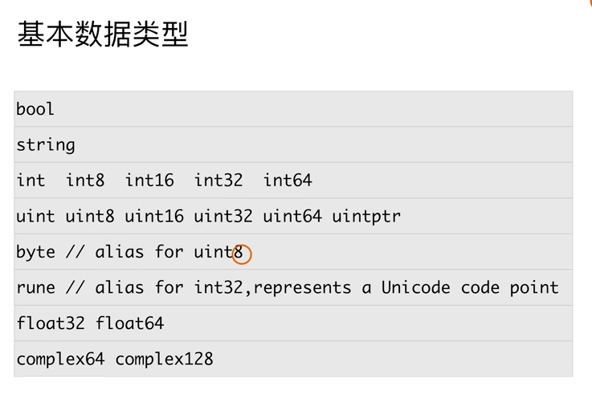
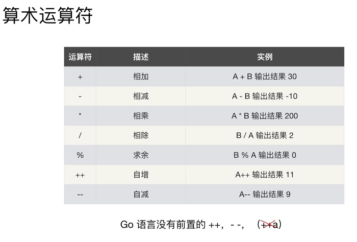
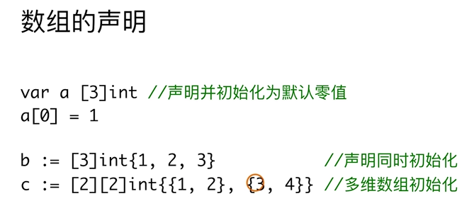
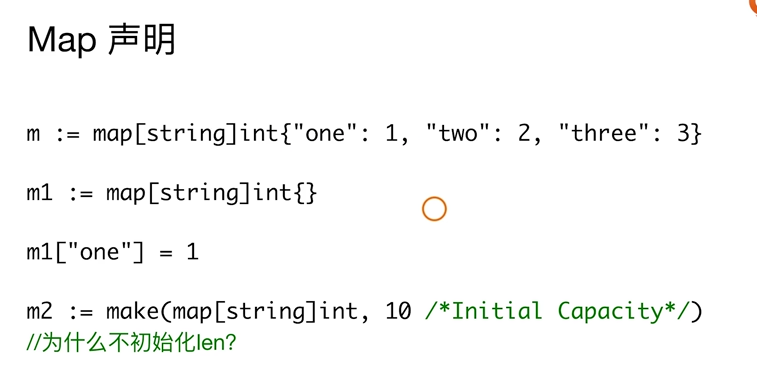
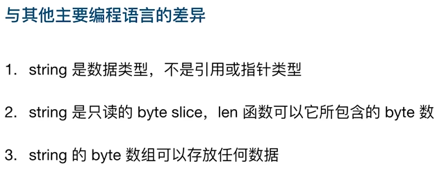
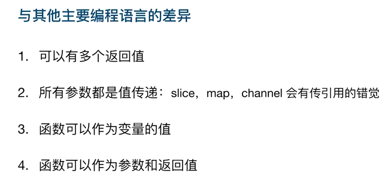
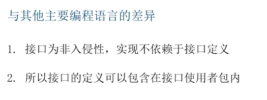

## 单元测试

1. 文件名要以 _test结尾：demo_test.go

2. 测试方法名要以 Testxxx 命名

   ```go
   func TestDemo(t *testing.T) {
   	fmt.Println("执行测试方法")
   }
   ```


## 命令行参数

通过 os.Args 获取命令行参数

```bash
go run . hello 命令行参数
```

示例代码

```go
func main() {
	fmt.Println("命令行参数：", os.Args)
	fmt.Println("命令行参数通过下标去取值：", os.Args[1])
}
```


## 变量与常量

### 变量

go语言可以在一句代码中对多个变量进行赋值

```go
func TestFZ(t *testing.T) {
	var (
		a = 10
		b = 20
	)
	fmt.Printf("a:%v,b:%v\n", a, b)
	a, b = b, a
	fmt.Printf("a:%v,b:%v\n", a, b)
}
```

### 常量

#### 日常使用案例

位运算

```go
const (
	Open = 1 << iota
	Close
	Wait
)

func TestConst(t *testing.T) {
	fmt.Printf("Open:%b,Close:%b,Wait:%b", Open, Close, Wait)
}
```

周末常量

```go
const (
	Mon = 1 + iota
	Tues
	Wed
	Thur
	Fri
	Sat
	Sun
)

func TestConst(t *testing.T) {
	fmt.Printf("Mon:%v,Tues:%v,Wed:%v,\nThur:%v,Fri:%v,Sat:%v,\nSun:%v", Mon, Tues, Wed, Thur, Fri, Sat, Sun)
}
```


## 数据类型



### 类型转换

1. Go语言完全不支持隐式类型转换
2. 别名和原有类型也不能进行隐式类型转换


### string类型

string 在Go中是一个值类型，在初始化时，会初始化为一个空字符串，而不是 nil ，所以在对比字符串变量是否为空时使用 str == ""


## 运算符



1. Go中的数组可以通过 == 判断数组是否一致
   1. 一致的前提是长度、元素顺序一致

### 按位清零运算符

&^

只要右边操作数为 1，结果都是 0 

如果左侧操作数为 0，则结果为 0

```go
1 &^ 0 // 1
1 &^ 1 // 0
0 &^ 1 // 0
0 &^ 0 // 0
```

代码示例

```go
const (
	Read = 1 << iota //读
	Write			 //写
	Exec			 //执行
)

func TestConst(t *testing.T) {
	a := 7
	a = a &^ Read // 清空读权限
	fmt.Printf("Read:%v,Write:%v,Exec:%v", a&Read == Read, a&Write == Write, a&Exec == Exec)
}
```

走我们钓鱼去的总结口诀：101，010

## 条件与循环

### switch

```go
func TestSwitch(t *testing.T) {

	a := 10
	switch a {
	case 1:
		fmt.Println("为1")
	case 2:
		fmt.Println("为2")
	case 10:
		fmt.Println("为10")
	default:
		fmt.Println("无匹配条件")
	}

	b := 1
	switch {
	case b < 10:
		fmt.Println("小于10")
	case b > 10:
		fmt.Println("大于10")
	default:
		fmt.Println("无匹配条件")
	}

	c := 2
	switch c {
	case 1, 2, 3, 4:
		fmt.Println("小于5")
	case 5, 6, 7, 8, 9:
		fmt.Println("小于10大于等于5")
	default:
		fmt.Println("无匹配条件")
	}
}
```


## 数组与切片

### 数组



数组的值可以通过下标获取与修改

#### 数组截取

```go
func TestSub(t *testing.T) {
	arr := [...]int{1, 2, 3, 4, 5}
	arr2 := arr[0:3] //截取arr数组，从下标0开始到下标2结束
    arr3 := arr[:] //完全截取，等于copy
	fmt.Printf("arr2:%v\n", arr2)
}
```

## Map

map通过 make 初始化，携带初始化容量降低性能消耗



#### 判断key是否存在

当key值不存在时，会默认赋零值

```go
if v,ok := m["Name"];!ok{
    fmt.Println("Name属性值不存在")
}
```


## 字符串




## 函数




## 接口



### 多态

```go
type Programmer interface {
	Eat()
}

func Eat(p Programmer) {
	p.Eat()
}

type Dog struct{}
type Cat struct{}

func (d Dog) Eat() {
	fmt.Println("小狗吃")
}
func (c Cat) Eat() {
	fmt.Println("小猫吃")
}

func TestImp(t *testing.T) {
	d := new(Dog)
	c := new(Cat)
	Eat(d)
	Eat(c)
}
```

## 学习进度18讲


