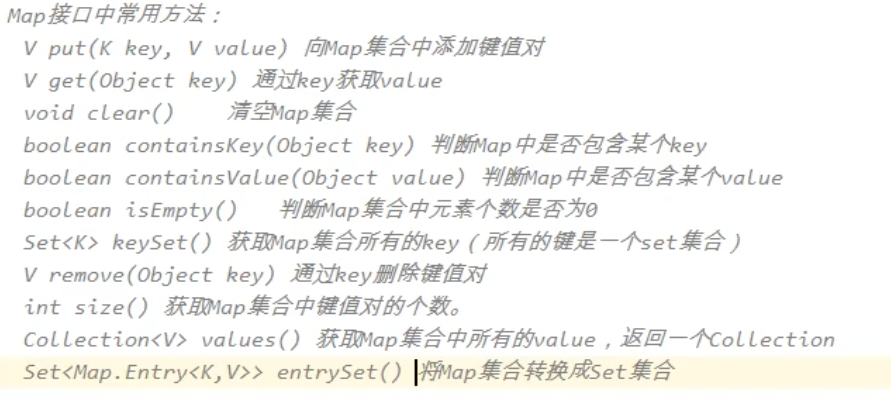
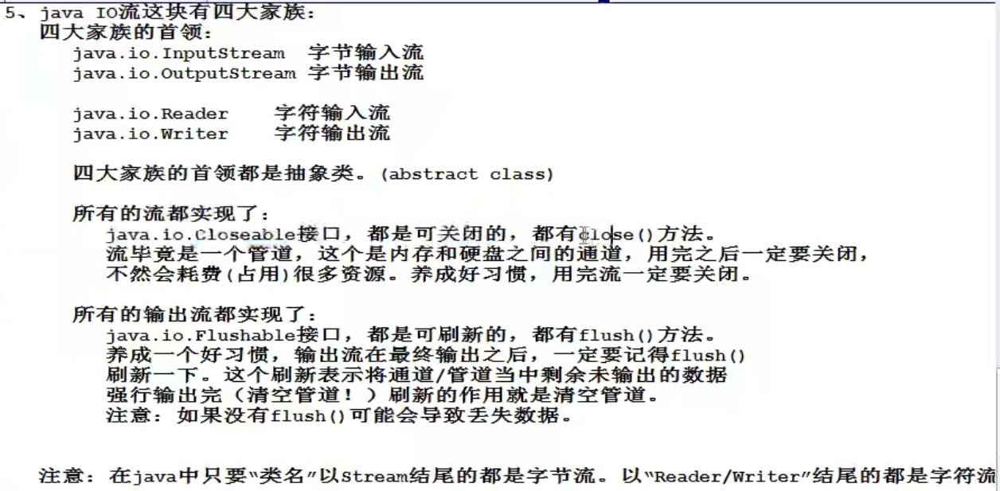
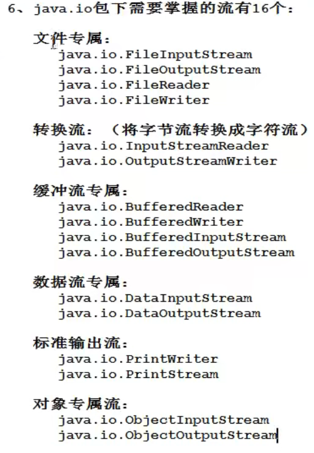
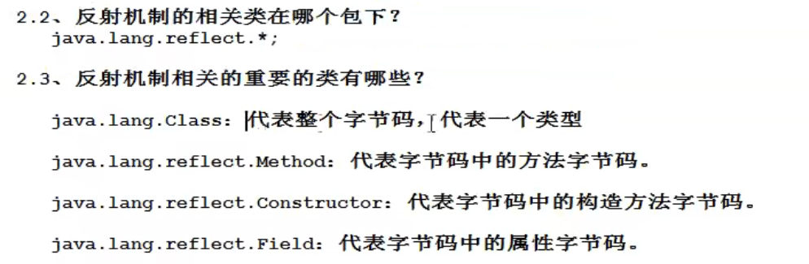
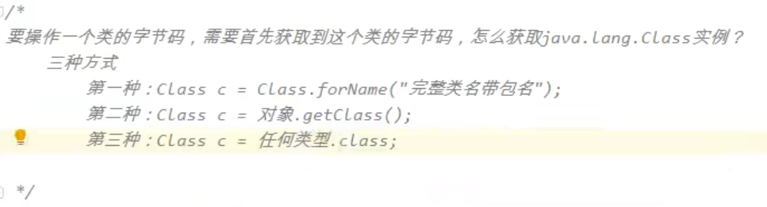

## 集合

视频地址：https://www.bilibili.com/video/BV1Rx411876f?p=716&spm_id_from=pageDriver

### Iterable

> 可迭代的，可遍历的，所有集合元素都是可迭代的，可遍历的

#### Iterator

> 迭代器对象

```java
hashNext()
next()
remove()
```


#### Collection

> 所有集合继承Iterable的含义是，所有集合都是可迭代的


##### List

>List集合存储元素特点：
>有序可重复，
>存储的元素有下标
>有序实际上是说存进去是这个顺序：
>取出来还是这个顺序。
>这里的顺序不是说按照大小排序
>有序是因为List集合都有下标，
>下标从0开始，以1递增

###### ArrayList

> ArrayList集合底层采用了数组这种数据结构
> ArrayList集合是非线程安全的

###### LinkedList

> linkedList集合底层采用了双向链表数据结构

###### Vector

> vector集合底层采用了数组这种数据结构，vector是线程安全的。他的所有方法都有 synchronized关键字修饰，所以线程安全，但是效率较低，现在保证线程安全


##### Set

>Set集合存储元素特点：
>无序不可重复
>无序表示存进去是这个顺序:
>取出来就不一定是这个顺序了
>另外Set集合中元素没有下标
>Set集合中的元素还不能重复

###### HashSet

> 实际上HashSet集合在new的时候：
> 底层实际上new了一个HashMap集台
> 向HashSet集合中存储元素：
> 实际上是存储到HashMap集合中了
> HashMap集合是个哈希表数据结构

###### TreeSet

> TreeSet底层实际上是TreeMap
>
> new TreeSet集合的时候，底层实际上new 了一个 TreeMap

#### Map

> 1、Map集合和Collection集合没有关系。
> 2、Map集合以key和value的这种键值对的方式存储元素。
> 3、key和value都是存储java对象的内存地址。
> 4、所有Map集合的key特点：无序不可重复的。
> Map集合的key和Set集合存储元素特点相同。



## File文件流





## 反射





## 注解

#### 内置注解

**@Override** - 检查该方法是否是重写方法。如果发现其父类，或者是引用的接口中并没有该方法时，会报编译错误。

**@Deprecated** - 标记过时方法。如果使用该方法，会报编译警告。

**@SuppressWarnings** - 指示编译器去忽略注解中声明的警告。

#### 元注解

> 注解注解的注解就是元注解

**@Retention** - 标识这个注解怎么保存，是只在代码中，还是编入class文件中，或者是在运行时可以通过反射访问。

**@Documented** - 标记这些注解是否包含在用户文档中。

**@Target** - 标记这个注解应该是哪种 Java 成员。

**@Inherited** - 标记这个注解是继承于哪个注解类(默认 注解并没有继承于任何子类)


#### 属性

属性名为value时，可以忽略key，直接写value值，前提是只有一个属性值