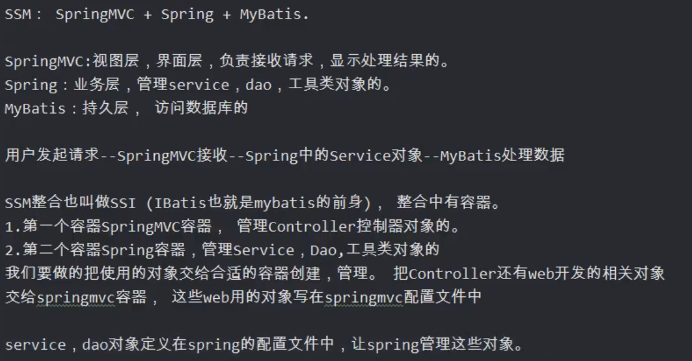
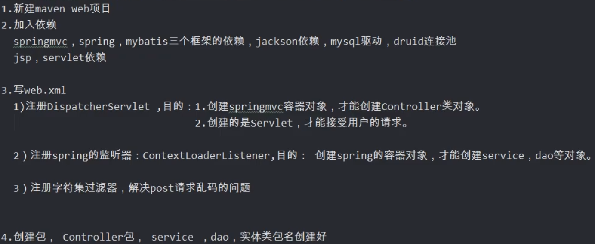
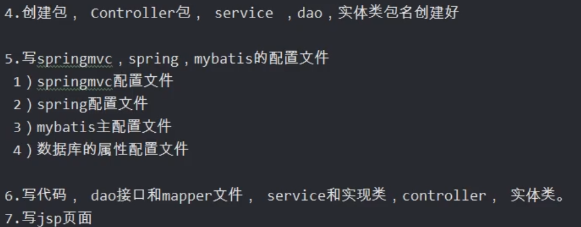
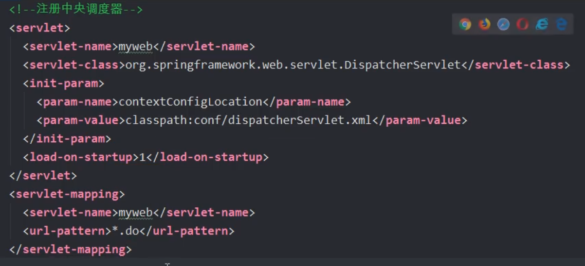
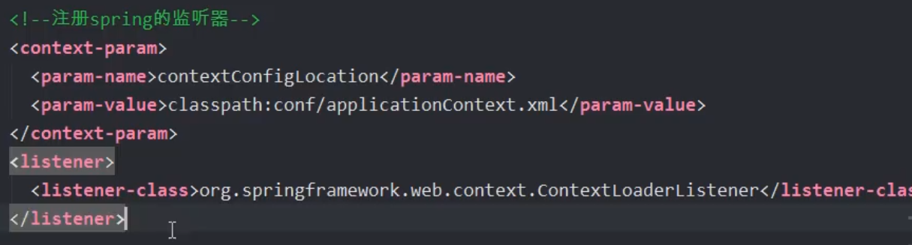
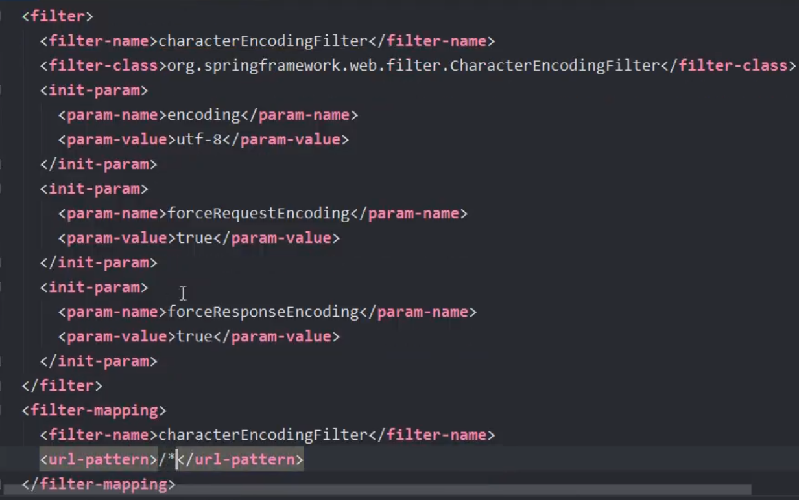
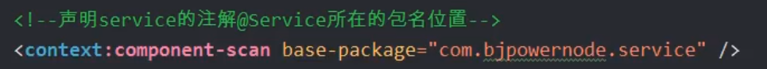

## SSM整合

#### 思路

#### web.xml注册

##### DispatchServlet 中央调度器

##### ContextLoaderListener 监听器

##### CharacterEncodingFilter 字符集过滤器

#### spring.xml

##### mybatis配置

##### spring service层注入

