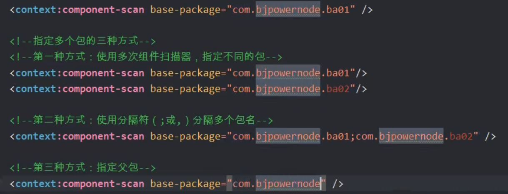
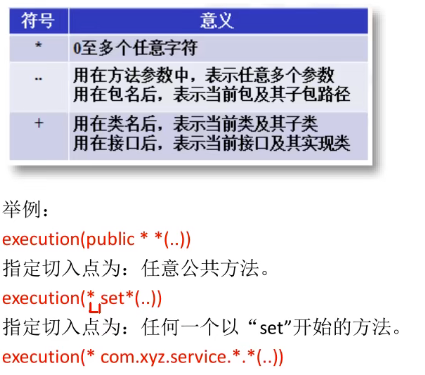

## IOC

### 注入

#### set注入

> spring调用set方法，可以在set方法中完成属性赋值

##### 简单注入

```xml
<bean id="xxx" class="xxx">
    <property name="name" value="张阿三"/>
    <property name="age" value="23"/>
</bean>
```

##### 引用类型注入

```xml
<bean id="mySchool" class="com.cth.School">
    <property name="name" value="张阿三"/>
    <property name="age" value="23"/>
</bean>
<!--引用类型:引用类型使用ref来赋值-->
<bean id="myClass" class="com.cth.MyClass">
    <property name="school" ref="mySchool"/>
</bean>
```

#### 构造注入

```xml
<bean id="mySchool" class="com.cth.School">
    <property name="name" value="张阿三"/>
    <property name="age" value="23"/>
</bean>
<!--构造注入:引用类型使用ref来赋值-->
<bean id="myClass" class="com.cth.MyClass">
    <constructor-arg name="school" ref="mySchool"/>
    <constructor-arg name="name" value="小学"/>
</bean>
```

#### 自动注入

##### byName

```xml
<bean id="school" class="com.cth.demo.School">
    <property name="name" value="横山小学"/>
    <property name="address" value="东程"/>
</bean>
<bean id="person" class="com.cth.demo.Person" autowire="byName">
    <property name="name" value="张三"/>
    <property name="phone" value="13505659421"/>
</bean>
```

##### byType

> java类型中引用类型的数据类型和spring容器中（配置文件）<bean>的class是同源关系，这样的bean能够赋值给引用类型
>
> 同源就是一类的意思：
>
> - Java类中引用类型的数据类型和bean的class值是一样的
> - Java类中引用类型的数据类型和bean和class的值父子类关系的
> - Java类中引用类型的数据类型和bean的class的值接口和实现类的关系
>
> 注意：在byType中，在xml配置文件中声明的bean只能有一个符合条件的，多余一个都是错误的

```xml
<bean id="school" class="com.cth.demo.School">
    <property name="name" value="横山小学"/>
    <property name="address" value="东程"/>
</bean>
<bean id="person" class="com.cth.demo.Person" autowire="byType">
    <property name="name" value="张三"/>
    <property name="phone" value="13505659421"/>
</bean>
```

### 多配置文件

> classpath:表示类路径（class文件所在目录），在spring配置文件中要指定其他文件的位置，需要使用classpath，告诉spring到哪里去找配置文件

```xml
<inport resource="classpath:spring02.xml"/>
<!--路径通配符:*-->
<inport resource="classpath:*/spring02.xml"/>
```

### 基于注解注入

使用注解的步骤：

- **加入maven的依赖 spring-context**，在你加入spring-context 的同时，间接加入 spring-aop 的依赖。使用注解必须使用 spring-aop 依赖

- 在类中加入spring的注解

- 在spring配置文件中，加入一个组件扫描器的标签，说明注解在你的项目中的位置

  ```xml
  <context:component-scan baes-package="包路径"/>
  ```

  

##### 简单注入

```java
@Component
public class Animal {
    @Value(value = "小猫")
    private String name;

    @Override
    public String toString() {
        return "Animal{" +
                "name='" + name + '\'' +
                '}';
    }

    public String getName() {
        return name;
    }

    public void setName(String name) {
        this.name = name;
    }
}

```

##### 引用类型注入

```java
/*@Autowired:spring框架提供的注解，实现引用类型的赋值
    spring中通过注解给引用类型赋值，使用的是自动注入原理，支持byName，byType。默认使用byType自动注入*/
@Autowired
private School school;

//byName使用方式
@Autowired
@Qualifier("school")//school:bean的id值
private School school;

@Autowired(required=true)
//表示引用类型赋值失败，报错并终止执行代码
//如果是false，则表示引用类型赋值失败，程序正常执行，引用类型为null


/*@Resource自动注入是JDK中的注解，spring提供了对该注解的支持。支持byName,byType。默认是byName，如果byName赋值失败，则自动切换为byType。
如果指定@Resource只能使用byName，则需要使用 name属性
@Resource(name="classBeanDefineName")
*/

```


### 加载属性配置文件

```xml
<context:property-placeholder location="classpath:test.properties"/>
<!--可以搭配springEL表达式-->
```

## AOP

### 切入点表达式




### 使用aspectj实现aop的基本步骤

- 加入spring依赖

- 加入aspectj依赖

- 创建切面类：普通类

  - 在类上加入@Aspect
  - 在类中定义方法，方法就是切面要执行的功能代码，在方法上加入aspectj中的通知注解，例如@Before，有需要指定切入点表达式execution()

- 创建spring配置文件，把aspect交给spring管理

  ```xml
  <bean id="myAspectj" class="com.cth.Aspectj"/>
  <!--自动代理生成器-->
  <aop:aspectj-autoproxy/>
  ```

  