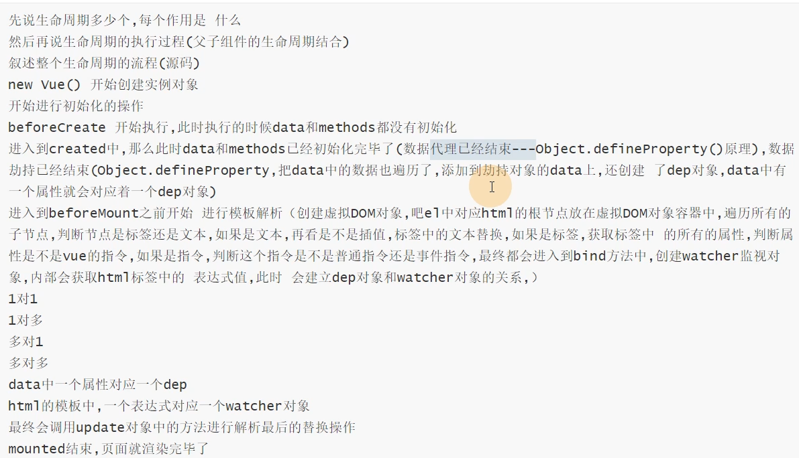
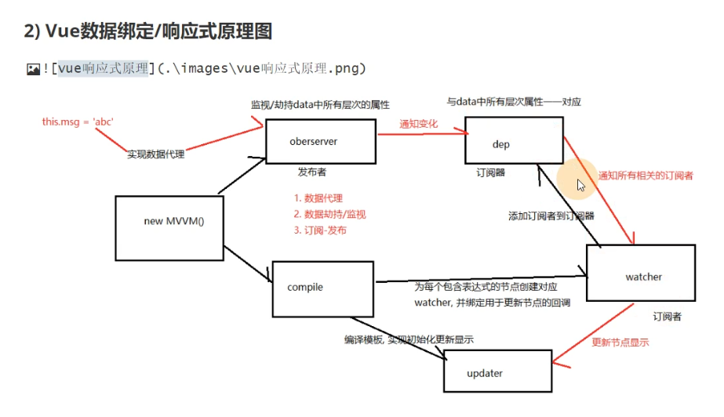

### 生命周期

1. vue中有11个生命周期函数

#### 生命周期分类

1. 子孙组件报错生命周期
   1. 用来捕捉子孙组件的错误信息，可以通过return false 来组织错误继续向上传播
2. 组件缓存的时候调用的生命周期
   1. 被keep-alive组件包裹的组件，在被激活和停止调用时触发
3. 组件自身的8个生命周期
   1. beforeCreate生命周期期间，data与methods还没有初始化
   2. updated、beforeUpdate生命周期由于数据更改导致的虚拟 DOM 重新渲染和打补丁
   3. mounted生命周期，如果有子孙组件，则要等到子孙组件的前四个生命周期函数结束后执行
   4. destroyed生命周期，同mounted，在子孙组件销毁后才会触发。v-if也会触发

### Vue响应式

