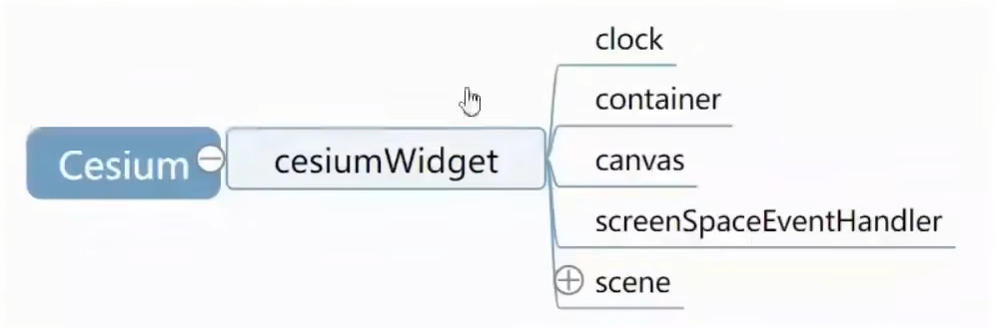

### CesiumWidget



```
clock用来记录时间，毕竟三维场景需要进行动态展示，需要通过时间来确定某一帧的绘制内容。container则是构造函数的参数，也就是传入的div,这里记录下。canvas则是在container上构建的Canvas类的对象，可以据此获取WebGL绘制的画笔。screenSpaceEventHandler则是对Canvas对象上各种鼠标的交互事件的封装，方便传递给三维场景。三维场景干之后可以据此改变相机姿态等。scenel则承载着整个三维场景中的对象。
```

#### Scene中装载了所有的三维对象

```
Scene中有一些内置的图元对象：地球(globe)、skyBox(天空盒)、sun(太阳)、moon(月亮)等等；另外还有两个用来由用户自行控制存放对象的数组：primitives和groundPrimitives。
```

#### 图元类对应一个三维渲染对象

```
图元是Cesium,用来绘制三维对象的一个独立的结构。图元类有：Globe、Model、Primitive、BillboardCollection、ViewportQuad等。
Globe绘制的是全球地形，它需要两个东西，一个是地形高程信息，另外一个是影像图层，也就是地球的表皮。影像图层可以叠加多个，但是地形高程只能有一个。整个地形的绘制也是渐进式的，即视线看到的地方才会去调度相关的地形高程信息，找到对应位置的地形影像贴上。
然而Globe只是一个图元。由此可见一个图元可以相当复杂。
需要注意的地方：1图元没有基类，但是所有的图元都会有update函数；2 Primitive类直译过来是图元的意思，但是它不是基类，只是图元的一种，起作用是用来绘制各种几何体。3图元是一类对象绘制的集合，可以包含多个WebGL的drawcall
```

