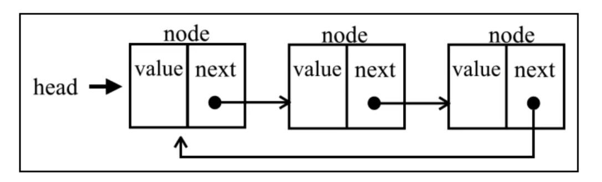
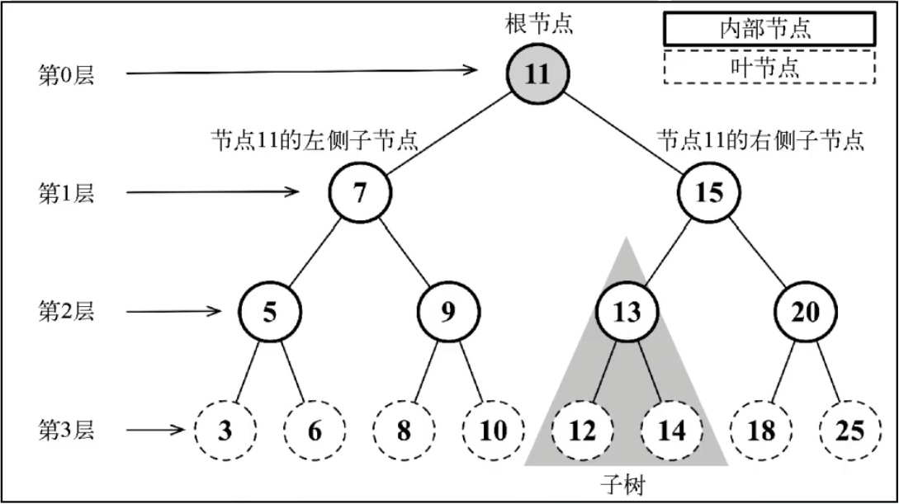
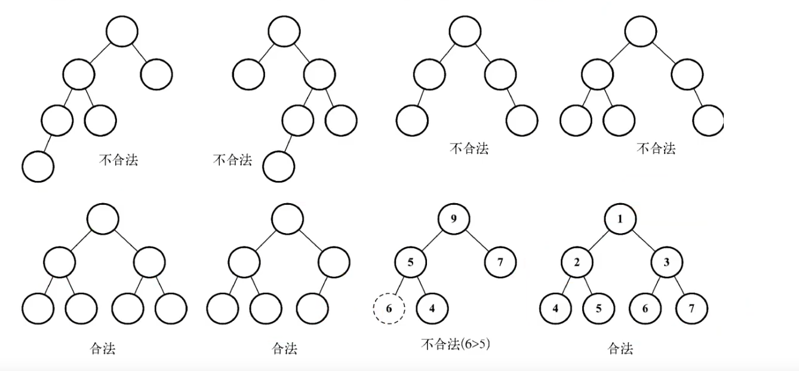
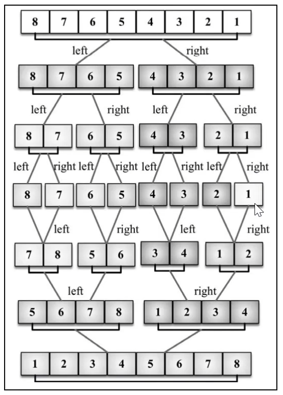
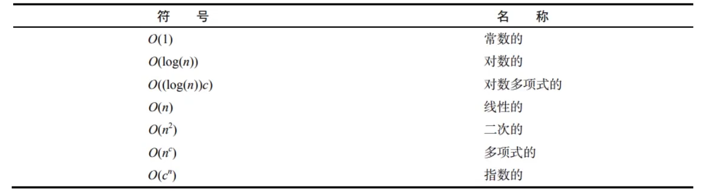
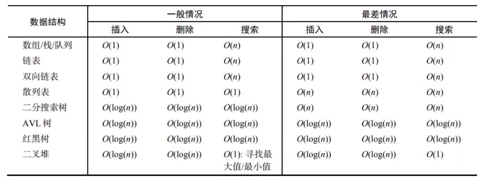
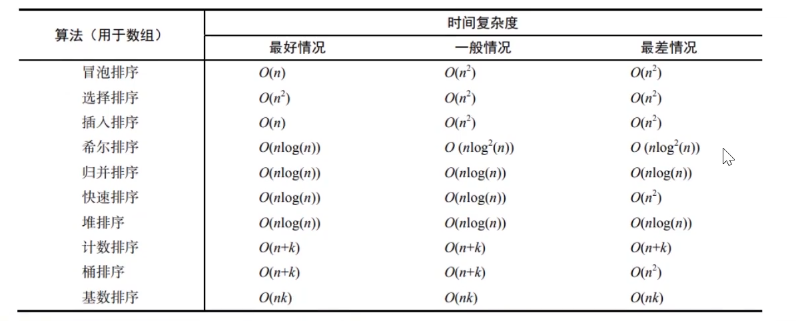

# 数据结构与算法

"数据结构(data structure)是计算机中存储、组织数据的方式。通常情况下，精心选择的数据结构可以带来最优效率的算法。”

#### 常见的数据结构

- 数组(Array)
- 栈(Stack)
- 链表(Linked List)
- 图(Graph)
- 散列表(Hash)
- 队列(Queue)
- 堆(Heap)
- 树(Tree)

## 数据结构

### 栈

栈(stck)又名堆栈，它是一种运算受限的**线性表**。**限定仅在表尾进行插入和删除操作的线性表**。这一端被称为栈顶，相对地，把另一端称为栈底。向一个栈插入新元素又称作进栈、入栈或压栈，它是把新元素放到栈顶元素的上面，使之成为新的栈顶元素；从一个栈删除元素又称作出栈或退栈，它是把栈顶元素删除掉，使其相邻的元素成为新的栈顶元素。

**先进后出**

#### 应用场景

1. 函数调用
2. 浏览器前进后退

```js
//进制转换
function convert(decNumber, base = 2) {
    const arr = []
    const baseStr = "0123456789ABCDEF"
    while (decNumber != 0) {
        arr.unshift(baseStr[decNumber % base])
        decNumber = Math.floor(decNumber / base)
    }
    console.log('转换后的值：', arr.join(""));
}
```


### 队列

队列是一种特殊的线性表，特殊之处在于它只允许在**表的前端(front)进行删除操作，而在表的后端(rear)进行插入操作**，和栈一样，队列是一种操作受限制的线性表。进行插入操作的端称为队尾，进行删除操作的端称为队头。队列中没有元素时，称为空队列。

**先进先出**

```js
// 模拟队列数据结构
class Stack {
    #items = {}
    #idx = 0
    #begin = 0
    size = 0
    // 进栈
    push(val) {
        this.#items[this.#idx++] = val
        this.size = this.#idx
    }
    // 出栈
    shift() {
        if (this.size > 0) {
            const item = this.#items[this.#begin]
            Reflect.deleteProperty(this.#items, this.#begin++)
            this.size = this.#idx - this.#begin
            return item
        }
    }
}
```


#### 应用场景

击鼓传花

```js

const arr = ['段洋', '谭晓庆', '白国贤', '蔡子璇', '戴瑾春', '赵建林', '常诗悦', '郭雨泽', '何文轩']
// 队列-击鼓传花游戏
function Result(arr, times) {
    const stack = new Stack()
    stack.shift()
    arr.forEach(item => {
        stack.push(item)
    })
    while (stack.size > 1) {
        for (let i = 0; i < times; i++) {
            stack.push(stack.shift())
        }
        console.log(`%c淘汰：${stack.shift()}`, 'background:#c12c1f;color:white;padding:2px 5px;border-radius:2px;');
    }
    console.log(`%c胜者：${stack.shift()}`, 'background:#4f6f46;color:white;padding:2px 5px;border-radius:2px;');
}
Result(arr, 6)
```


### 双端队列

对首，队尾都可以进行插入，删除操作

```js
class DeQueue {
    #items = {}
    #count = 0
    size = 0
    push(val) {
        this.#items[this.#count++] = val
        this.size++
    }
    unshift(val) {
        for (let i = this.size; i > 0; i--) {
            this.#items[i] = this.#items[i - 1]
        }
        this.#items[0] = val
        this.size++
        this.#count++
    }
    pop() {
        if (this.size <= 0) {
            return
        }
        const item = Reflect.get(this.#items, --this.#count)
        Reflect.deleteProperty(this.#items, this.#count)
        this.size--
        return item
    }
    shift() {
        if (this.size <= 0) {
            return
        }
        const item = Reflect.get(this.#items, 0)
        for (let i = 0; i < this.size; i++) {
            this.#items[i] = this.#items[i + 1]
        }
        Reflect.deleteProperty(this.#items, --this.#count)
        this.size--
        return item
    }
}
const deQ = new DeQueue()
deQ.push("史诗悦")
deQ.push("邹欣汝")
deQ.push("萧强")
deQ.push("谭晶滢")
deQ.push("邵明远")
deQ.unshift("朱秀兰")
deQ.shift()
deQ.pop()
console.log('deQ:', deQ);
```


### 单链表封装

#### 特点

1. 有一个表头，加单向指针节点模型
2. 插入、删除效率高，随机访问效率低
3. 和数组相比，内存空间消耗更大，

```tsx
class SigleNode {
  data: any;
  next: SigleNode | null;
  constructor(data: any) {
    this.data = data;
    this.next = null;
  }
}
class LinkedList {
  head: SigleNode | null;
  count: number;
  constructor() {
    this.head = null;
    this.count = 0;
  }
  // 插入操作
  insert(data: any, index: number) {
    if (index >= 0 && index <= this.count) {
      const node = new SigleNode(data);
      let currentNode = this.head;
      let previous: SigleNode | null;
      if (index === 0) {
        node.next = this.head;
        this.head = node;
        this.count++;
        return true;
      } else {
        for (let i = 0; i <= this.count; i++) {
          if (i === index) {
            previous!.next = node;
            node.next = currentNode;
            this.count++;
            return true;
          }
          previous = currentNode;
          currentNode = currentNode?.next || null;
        }
      }
    }
    return false;
  }
  // 链表添加
  push(data: any) {
    const node = new SigleNode(data);
    if (!this.head) {
      this.head = node;
    } else {
      let currentNode = this.head;
      while (currentNode.next !== null) {
        currentNode = currentNode.next;
      }
      currentNode.next = node;
    }
    this.count++;
  }
  remove(data: any) {
    // 先找到对应下标
    const idx = this.indexOf(data);
    if (idx !== -1) {
      return this.removeAt(idx);
    }
    return -1;
    // 根据下标删除
  }
  indexOf(data: any) {
    let currentNode = this.head;
    for (let i = 0; i < this.count; i++) {
      if (this.equals(currentNode?.data, data)) {
        return i;
      }
      currentNode = currentNode?.next || null;
    }
    return -1;
  }
  equals(data1: any, data2: any) {
    return data1 === data2;
  }
  // 链表删除:根据下标来删除
  removeAt(index: number) {
    if (index >= 0 && this.count > index) {
      let currentNode = this.head;
      let previous: SigleNode | null;
      if (index === 0) {
        currentNode = currentNode?.next || null;
        this.head = currentNode;
        return 0;
      } else {
        for (let i = 0; i < this.count; i++) {
          if (i === index) {
            previous!.next = currentNode?.next || null;
            this.count--;
            return i;
          }
          previous = currentNode;
          currentNode = currentNode?.next || null;
        }
      }
    }
    return -1;
  }
}
const link = new LinkedList();
link.push(100);
link.push(200);
link.push(300);
link.push(400);
console.log("link:", link);
```


### 双向链表

1. 有一个首节点 head，一个尾节点 tail；还有一个双向指针节点模型

```tsx
class SigleNode {
  data: any;
  next: SigleNode | null;
  constructor(data: any) {
    this.data = data;
    this.next = null;
  }
}
class LinkedList {
  head: SigleNode | null;
  count: number;
  constructor() {
    this.head = null;
    this.count = 0;
  }
  // 插入操作
  insert(data: any, index: number) {
    if (index >= 0 && index <= this.count) {
      const node = new SigleNode(data);
      let currentNode = this.head;
      let previous: SigleNode | null;
      if (index === 0) {
        node.next = this.head;
        this.head = node;
        this.count++;
        return true;
      } else {
        for (let i = 0; i <= this.count; i++) {
          if (i === index) {
            previous!.next = node;
            node.next = currentNode;
            this.count++;
            return true;
          }
          previous = currentNode;
          currentNode = currentNode?.next || null;
        }
      }
    }
    return false;
  }
  // 链表添加
  push(data: any) {
    const node = new SigleNode(data);
    if (!this.head) {
      this.head = node;
    } else {
      let currentNode = this.head;
      while (currentNode.next !== null) {
        currentNode = currentNode.next;
      }
      currentNode.next = node;
    }
    this.count++;
  }
  remove(data: any) {
    // 先找到对应下标
    const idx = this.indexOf(data);
    if (idx !== -1) {
      return this.removeAt(idx);
    }
    return -1;
    // 根据下标删除
  }
  getNodeAt<T>(index: number): T | undefined {
    let currentNode = this.head;
    for (let i = 0; i < this.count; i++) {
      if (index === i) {
        return <T>currentNode;
      }
      currentNode = currentNode?.next || null;
    }
    return;
  }
  indexOf(data: any) {
    let currentNode = this.head;
    for (let i = 0; i < this.count; i++) {
      if (this.equals(currentNode?.data, data)) {
        return i;
      }
      currentNode = currentNode?.next || null;
    }
    return -1;
  }
  equals(data1: any, data2: any) {
    return data1 === data2;
  }
  // 链表删除:根据下标来删除
  removeAt(index: number) {
    if (index >= 0 && this.count > index) {
      let currentNode = this.head;
      let previous: SigleNode | null;
      if (index === 0) {
        currentNode = currentNode?.next || null;
        this.head = currentNode;
        return 0;
      } else {
        for (let i = 0; i < this.count; i++) {
          if (i === index) {
            previous!.next = currentNode?.next || null;
            this.count--;
            return i;
          }
          previous = currentNode;
          currentNode = currentNode?.next || null;
        }
      }
    }
    return -1;
  }
}

// 双向链表
class DoubleLinkedList extends LinkedList {
  tail: DoubleNode | null;
  head: DoubleNode | null;
  constructor() {
    super();
    this.tail = null;
    this.head = null;
  }
  // 链表添加
  push(data: any): void {
    const node = new DoubleNode(data);
    if (!this.head) {
      this.head = node;
      this.tail = node;
    } else {
      // 精髓代码片段
      this.tail!.next = node;
      node.previous = this.tail;
      this.tail = node;
    }
    this.count++;
  }
  // insert插入方法
  insert(data: any, index: number): boolean {
    if (index >= 0 && index <= this.count) {
      const node = new DoubleNode(data);
      if (index === 0) {
        if (this.head === null) {
          this.head = node;
          this.tail = node;
          this.count++;
          return true;
        } else {
          // 精髓代码
          node.next = this.head;
          this.head.previous = node;
          this.head = node;
          this.count++;
          return true;
        }
      } else if (index === this.count) {
        this.tail!.next = node;
        node.previous = this.tail;
        this.tail = node;
        this.count++;
        return true;
      } else {
        const currentNode = this.getNodeAt<DoubleNode>(index);
        const previous = currentNode?.previous;
        node.next = currentNode || null;
        currentNode!.previous = node;
        previous!.next = node;
        node.previous = previous || null;
        this.count++;
        return true;
      }
    }
    return false;
  }
  // 链表删除 通过下标删除
  removeAt(index: number): any {
    if (index >= 0 && index < this.count) {
      if (index === 0) {
        if (this.count === 1) {
          this.head = null;
          this.tail = null;
        } else {
          this.head = <DoubleNode>this.head?.next || null;
          this.head.previous = null;
        }
        this.count--;
        return 0;
      } else if (index === this.count - 1) {
        this.tail = <DoubleNode>this.tail?.previous || null;
        this.tail.next = null;
        return --this.count;
      } else {
        let currentNode = this.getNodeAt<DoubleNode>(index);
        let next = <DoubleNode>currentNode?.next;
        let previous = <DoubleNode>currentNode?.previous;
        previous!.next = next;
        next.previous = previous;
        this.count--;
        return index;
      }
    }
    return;
  }
}
class DoubleNode extends SigleNode {
  previous: SigleNode | null;
  constructor(data: any) {
    super(data);
    this.previous = null;
  }
}
const dbLink = new DoubleLinkedList();
console.log("dbLink.insert(100, 0):", dbLink.insert(100, 0));
console.log("dbLink.insert(200, 0):", dbLink.insert(200, 0));
// console.log("dbLink.insert(300, 0):", dbLink.insert(300, 0));
// console.log("dbLink.insert(300, 0):", dbLink.insert(400, 2));
// console.log("dbLink.insert(300, 0):", dbLink.insert(500, 2));

console.log("dbLink:", dbLink);

```


### 循环列表

循环链表和单链表之间唯一的区别在于，最后一个元素指向下一个元素的指针（tail.next）不是引用undefined,而是指向第一个元素（head）




```tsx
class SigleNode {
  data: any;
  next: SigleNode | null;
  constructor(data: any) {
    this.data = data;
    this.next = null;
  }
}
class LinkedList {
  head: SigleNode | null;
  count: number;
  constructor() {
    this.head = null;
    this.count = 0;
  }
  // 插入操作
  insert(data: any, index: number) {
    if (index >= 0 && index <= this.count) {
      const node = new SigleNode(data);
      let currentNode = this.head;
      let previous: SigleNode | null;
      if (index === 0) {
        node.next = this.head;
        this.head = node;
        this.count++;
        return true;
      } else {
        for (let i = 0; i <= this.count; i++) {
          if (i === index) {
            previous!.next = node;
            node.next = currentNode;
            this.count++;
            return true;
          }
          previous = currentNode;
          currentNode = currentNode?.next || null;
        }
      }
    }
    return false;
  }
  // 链表添加
  push(data: any) {
    const node = new SigleNode(data);
    if (!this.head) {
      this.head = node;
    } else {
      let currentNode = this.head;
      while (currentNode.next !== null) {
        currentNode = currentNode.next;
      }
      currentNode.next = node;
    }
    this.count++;
  }
  remove(data: any) {
    // 先找到对应下标
    const idx = this.indexOf(data);
    if (idx !== -1) {
      return this.removeAt(idx);
    }
    return -1;
    // 根据下标删除
  }
  getNodeAt<T>(index: number): T | undefined {
    let currentNode = this.head;
    for (let i = 0; i < this.count; i++) {
      if (index === i) {
        return <T>currentNode;
      }
      currentNode = currentNode?.next || null;
    }
    return;
  }
  indexOf(data: any) {
    let currentNode = this.head;
    for (let i = 0; i < this.count; i++) {
      if (this.equals(currentNode?.data, data)) {
        return i;
      }
      currentNode = currentNode?.next || null;
    }
    return -1;
  }
  equals(data1: any, data2: any) {
    return data1 === data2;
  }
  // 链表删除:根据下标来删除
  removeAt(index: number) {
    if (index >= 0 && this.count > index) {
      let currentNode = this.head;
      let previous: SigleNode | null;
      if (index === 0) {
        currentNode = currentNode?.next || null;
        this.head = currentNode;
        return 0;
      } else {
        for (let i = 0; i < this.count; i++) {
          if (i === index) {
            previous!.next = currentNode?.next || null;
            this.count--;
            return i;
          }
          previous = currentNode;
          currentNode = currentNode?.next || null;
        }
      }
    }
    return -1;
  }
}

// 双向链表
class CircleLinkedList extends LinkedList {
  constructor() {
    super();
  }
  // 链表添加
  push(data: any): void {
    const node = new SigleNode(data);
    if (this.head === null) {
      this.head = node;
      node.next = this.head;
    } else {
      let currentNode = this.head;
      while (currentNode.next !== this.head && currentNode.next !== null) {
        currentNode = currentNode.next;
      }
      node.next = this.head;
      currentNode.next = node;
    }
    this.count++;
  }
  // insert插入方法
  insert(data: any, index: number): boolean {
    if (index >= 0 && index <= this.count) {
      const node = new SigleNode(data);
      if (this.head === null) {
        this.head = node;
        node.next = this.head;
      } else if (index === 0) {
        let currentNode = this.head;
        node.next = currentNode;
        const endNode = this.getNodeAt<SigleNode>(this.count - 1);
        this.head = node;
        if (!endNode) {
          return false;
        }
        endNode!.next = this.head;
      } else {
        const previous = this.getNodeAt<SigleNode>(index - 1);
        const currentNode = previous?.next || null;
        previous!.next = node;
        node.next = currentNode;
      }

      this.count++;
      return true;
    }
    return false;
  }
  // 链表删除 通过下标删除
  removeAt(index: number): any {
    if (index >= 0 && index < this.count) {
      if (index === 0) {
        let currentNode = this.head;
        this.head = currentNode?.next || null;
        if (!this.head) {
          return false;
        }
        currentNode!.next = this.head;
      } else if (index === this.count - 1) {
        const endNode = this.getNodeAt<SigleNode>(index - 1);
        if (!endNode) {
          return false;
        }
        endNode!.next = this.head;
      } else {
        let previous = this.getNodeAt<SigleNode>(index - 1);
        let currentNode = previous!.next || null;
        if (!currentNode) {
          return false;
        }
        previous!.next = currentNode.next;
      }
      this.count--;
      return true;
    }

    return false;
  }
}
const circleLink = new CircleLinkedList();
circleLink.push(100);
circleLink.push(200);
circleLink.push(300);
circleLink.push(400);
circleLink.push(500);
console.log("circleLink:", circleLink);
```


### 集合

集合是由一组**无序且唯一**（即不能重复）的项组成的。

自定义集合实现

```tsx
class MySet {
  items: object;
  constructor() {
    this.items = {};
  }
  add(data: PropertyKey) {
    if (!this.has(data)) {
      return Reflect.set(this.items, data, data);
    }
    return false;
  }
  delete(data: any) {
    if (this.has(data)) {
      return Reflect.deleteProperty(this.items, data);
    }
    return false;
  }
  clear() {
    this.items = {};
  }
  values() {
    return Object.values(this.items);
  }
  has(data: any) {
    return data in this.items;
  }
}
const s = new MySet();
s.add(100);
s.add(200);
s.add(300);
console.log("s:", s);

```


### 字典数据结构

字典和集合很相似，集合以 **[值，值]** 的形式存储元素，字典则是以 **[键，值]** 的形式来存储元素。字典也称作映
射、符号表或关联数组。


### 散列表

HashMap类，它是Dictionary类的一种散列表实现方式。散列算法的作用是尽可能快地在数据结构中找到一个值。

```tsx
hashCode(key: any) {
    const str = key.toString();
    let hash = 5381;
    for (let i = 0; i < str.length; i++) {
        hash = hash * 33 + str.charCodeAt(i);
    }
    return hash % 1013;
}
```


### 树

树是一种分层数据的抽象模型



#### 二叉树

二叉树中的节点最多只能有两个子节点：一个是左侧子节点，另一个是右侧子节点

#### 二叉搜索树

二叉搜索树(BST)是二叉树的一种，但是只允许你在左侧节点存储（比父节点）小的值，在右侧节点存储(比父节点)天的值。

**有一个根节点模型和一个节点模型**

**左小右大**


##### 遍历

- 中序遍历是一种以上行顺序访问BST所有节点的遍历方式，也就是以从最小到最大的顺序访问所有节点。中序遍历的一种应用就是对树进行排序操作。
- 先序遍历是以优先于后代节点的顺序访问每个节点的。先序遍历的一种应用是打印一个结构化的文档。
- 后序遍历则是先访问节点的后代节点，再访问节点本身。后序遍历的一种应用是计算一个目录及其子目录中所有文件所占空间的大小。


```tsx
class SingleNode {
  root: number;
  left: SingleNode | null;
  right: SingleNode | null;
  constructor(root: number) {
    this.root = root;
    this.left = null;
    this.right = null;
  }
}
class Tree {
  root: SingleNode | null;

  constructor() {
    this.root = null;
  }
  insert(key: number) {
    if (this.root === null) {
      this.root = new SingleNode(key);
    } else {
      this.insertTree(key, this.root);
    }
  }
  insertTree(key: number, tree: SingleNode) {
    if (tree.root > key) {
      if (tree.left === null) {
        tree.left = new SingleNode(key);
      } else {
        this.insertTree(key, tree.left);
      }
    } else if (tree.root < key) {
      if (tree.right === null) {
        tree.right = new SingleNode(key);
      } else {
        this.insertTree(key, tree.right);
      }
    }
  }
  // 遍历
  order(callback: (val: any) => void) {
    this.inOrderMap(this.root!, callback);
  }
  inOrderMap(root: SingleNode, callback: (val: any) => void) {
    if (root != null) {
      this.inOrderMap(root.left!, callback);
      callback(root.root);
      this.inOrderMap(root.right!, callback);
    }
  }

  // 查询
  find(key: number) {
    if (this.root != null) {
      return this.findTreeNode(key, this.root);
    }
    return false;
  }
  findTreeNode(key: number, root: SingleNode): boolean {
    if (root != null) {
      if (root.root === key) {
        return true;
      }
      return (
        this.findTreeNode(key, root.left!) ||
        this.findTreeNode(key, root.right!)
      );
    }
    return false;
  }

  // 删除
  remove(key: number) {
    this.root = this.removeTreeNode(key, this.root);
  }
  removeTreeNode(key: number, treeNode: SingleNode | null): null | SingleNode {
    if (treeNode === null) {
      return null;
    }
    /**
     * 三种情况：
     * 第一种情况，开头被删了，需要找到右侧最小的节点，把该节点移到删除的节点位置
     * 第二种情况，末端被删了，置空
     * 第三种情况，中间节点被删除，找到该节点右侧最小节点，对其进行删除操作，并将期移动到中间被删除的节点位置
     */
    if (treeNode.root > key) {
      treeNode.left = this.removeTreeNode(key, treeNode.left!);
      return treeNode;
    } else if (treeNode.root < key) {
      treeNode.right = this.removeTreeNode(key, treeNode.right!);
      return treeNode;
    } else {
      // 末端节点
      if (treeNode.left === null && treeNode.right === null) {
        return null;
      }
      // 只有右侧节点
      else if (treeNode.left === null) {
        return treeNode.right;
      }
      // 只有左侧节点
      else if (treeNode.right === null) {
        return treeNode.left;
      }
      // 左右节点都有
      else {
        let minRight = this.min(treeNode.right!);
        minRight.right = this.removeTreeNode(minRight.root, treeNode.right);
        minRight.left = treeNode.left;
        treeNode = minRight;
        return treeNode;
      }
    }
  }
  min(treeNode: SingleNode): SingleNode {
    if (treeNode.left !== null) {
      return this.min(treeNode.left!);
    }
    return treeNode;
  }
}
const tree = new Tree();
tree.insert(3);
tree.insert(2);
tree.insert(1);
tree.insert(9);
tree.insert(6);
tree.insert(4);
tree.insert(7);
tree.insert(10);
tree.insert(11);
console.log("tree:", tree);
```


#### 二叉堆

二叉堆是一种特殊的二叉树，有以下两个特性。

- 它是一棵完全二叉树，表示树的每一层都有左侧和右侧子节点（除了最后一层的叶节点），**并且最后一层的叶节点尽可能都是`左侧子节点`**，这叫作**结构特性**

- 二叉堆不是最小堆就是最大堆。最小堆允许你快速导出树的最小值，最大堆允许你快速导出树的最大值。所有的节点都大于等于（最大堆）或小于等于（最小堆）每个它的子节点。这叫作**堆特性**。

  


```tsx
class MinHeap {
  heap: Array<number>;
  constructor() {
    this.heap = [];
  }
  getRightIndex(idx: number) {
    return 2 * idx + 2;
  }
  getLeftIndex(idx: number) {
    return 2 * idx + 1;
  }
  getParentIndex(idx: number) {
    return Math.floor((idx - 1) / 2);
  }
  // 新增插入
  insert(data: number) {
    if (data != null) {
      this.heap.push(data);
      this.shiftUp(this.heap.length - 1);
      return true;
    }
    return false;
  }
  // 删除：删除根元素
  extract() {
    if (this.heap.length === 0 || this.heap.length === 1) {
      return null;
    }
    this.heap[0] = this.heap.pop()!;
    this.shiftDown(0);
  }
  shiftDown(idx: number) {
    let current = idx;
    let leftIdx = this.getLeftIndex(idx);
    let rightIdx = this.getRightIndex(idx);
    if (leftIdx < this.heap.length && this.heap[idx] > this.heap[rightIdx]) {
      current = rightIdx;
    }
    if (rightIdx < this.heap.length && this.heap[idx] > this.heap[leftIdx]) {
      current = leftIdx;
    }

    if (current !== idx) {
      this.swap(idx, current);
      this.shiftDown(current);
    }
  }

  shiftUp(idx: number) {
    const parentIdx = this.getParentIndex(idx);

    while (this.heap[parentIdx] > this.heap[idx]) {
      this.swap(parentIdx, idx);
      this.shiftUp(parentIdx);
    }
  }
  swap(parentIdx: number, currentIdx: number) {
    const parent = this.heap[parentIdx];
    this.heap[parentIdx] = this.heap[currentIdx];
    this.heap[currentIdx] = parent;
  }
}
const heap = new MinHeap();
heap.insert(10);
heap.insert(1);
heap.insert(3);
heap.insert(2);
heap.insert(12);
heap.insert(22);
heap.insert(32);
heap.insert(5);
heap.extract();
console.log("heap:", heap);

```


## 算法

演示动画网站：https://visualgo.net/zh/sorting

#### 冒泡排序

```tsx
const arr = [1, 231, 31, 23, 12, 3, 424, 2, 42, 342, 4, 234];
// 冒泡排序
function BubblingSort() {
  for (let i = 0; i < arr.length; i++) {
    for (let j = 0; j < arr.length - 1 - i; j++) {
      if (arr[j] > arr[j + 1]) {
        const temp = arr[j];
        arr[j] = arr[j + 1];
        arr[j + 1] = temp;
      }
    }
  }
}
```

#### 选择排序

选择排序是一种简单直观的排序算法，无论什么数据进去都是 O(n²) 的时间复杂度。所以用到它的时候，数据规模越小越好。唯一的好处可能就是不占用额外的内存空间了吧。

```tsx
const choiceArr = [21, 32, 34, 24, 24, 23, 42, 5, 235345, 3, 52, 34, 2, 4];
// 选择排序
function ChoiceSort() {
  for (let i = 0; i < choiceArr.length; i++) {
    let idx = i;
    for (let j = i + 1; j < choiceArr.length; j++) {
      if (choiceArr[idx] > choiceArr[j]) {
        idx = j;
      }
    }
    let temp = choiceArr[idx];
    choiceArr[idx] = choiceArr[i];
    choiceArr[i] = temp;
  }
}
```


#### 插入排序（待复习）

对于少量元素的排序，它是一个有效的算法。插入排序是一种最简单的排序方法，它的基本思想是将一个记录插入到已经排好序的有序表中，从而一个新的、记录数增 1 的有序表。在其实现过程使用双层循环，外层循环对除了第一个元素之外的所有元素，内层循环对当前元素前面有序表进行待插入位置查找，并进行移动

```tsx
const insertArr = [
  23, 123, 1, 313, 1, 3, 13, 4, 2, 423, 5, 3, 72, 43, 23, 6, 24, 78, 53, 25,
];
// 插入排序
function InsertSort(arr: Array<number>) {
  for (let i = 0; i < arr.length - 1; i++) {
    let j = i + 1;
    let temp = arr[j];
    while (j > 0 && temp < arr[j - 1]) {
      arr[j] = arr[j - 1];
      j--;
    }
    arr[j] = temp;
  }
}
```


#### 归并排序

归并排序是一种**分而治之**算法。其思想是将原始数组切分成较小的数组，直到每个小数组只有一个位置，接着将小数组归并成较大的数组，直到最后只有一个排序完毕的大数组。



```tsx
// 归并排序
function MergeSort(arr: Array<number>): Array<number> {
  const { length } = arr;
  debugger;
  if (length > 1) {
    const middle = Math.floor(length / 2);
    const leftArr = MergeSort(arr.slice(0, middle));
    const rightArr = MergeSort(arr.slice(middle, length));
    arr = Merge(leftArr, rightArr);
  }
  return arr;
}
function Merge(leftArr: Array<number>, rightArr: Array<number>): Array<number> {
  let i = 0,
    j = 0;
  const result = [];
  // 核心精髓代码：当leftArr.length>1的时候，while循环不停的对比左右两个数组的元素大小，挨个对比。
  while (i < leftArr.length && j < rightArr.length) {
    result.push(leftArr[i] < rightArr[j] ? leftArr[i++] : rightArr[j++]);
  }
  // 核心精髓代码
  return result.concat(
    i < leftArr.length ? leftArr.slice(i) : rightArr.slice(j)
  );
}
```


#### 快速排序（待复习）

对数组设置一个基数（随便取值），然后将小于这个基数的数组元素归为一类，大于基数的数组元素归为一类；然后对分类后的数组再次同操作递归处理

```tsx
const quickArr = [2, 1, 4, 5, 3, 4, 7, 6, 8, 47, 86, 56, 9];
// 快速排序
function QuickSort(arr: Array<number>): Array<number> {
  if (arr.length < 2) {
    return arr;
  }
  const base = arr[0];
  const minArr = arr.slice(1).filter((item) => item <= base);
  const maxArr = arr.slice(1).filter((item) => item > base);
  return QuickSort(minArr).concat(base).concat(QuickSort(maxArr));
}
```


#### 计数排序

计数排序使用一个用来存储每个元素在原始数组中出现次数的临时数组。在所有元素都计数完成后，临时数组已排好序并可迭代以构建排序后的结果数组。

```tsx
let countArr = [2, 1, 5, 6, 45, 4, 7, 57, 5, 8, 97, 8, 4, 54, 858, 5];
// 计数排序
function CountSort() {
  const count = {};
  const temp = [];
  countArr.forEach((item) => {
    let value = Reflect.get(count, item) || 0;
    Reflect.set(count, item, ++value);
  });
  for (let item in count) {
    while (Reflect.get(count, item) > 0) {
      let value = Reflect.get(count, item);
      Reflect.set(count, item, --value);
      temp.push(+item);
    }
  }
  countArr = temp;
}
```


#### 桶排序

桶排序（也被称为箱排序）也是分布式排序算法，它将元素分为不同的桶（较小的数组），再使用一个简单的排序算法，例如插入排序（用来排序小数组的不错的算法），来对每个桶进行排序。然后，它将所有的桶合并为结果数组。

```tsx
const bucketArr = [3, 2, 4, 6, 5, 98, 7, 7, 9, 0, 1];
// 桶排序
function BucketSort(arr: Array<number>, bucketSize: number = 3): Array<number> {
    let min = arr[0];
    let max = arr[0];
    for (let i = 1; i < arr.length; i++) {
        if (min > arr[i]) {
            min = arr[i];
        }
        if (max < arr[i]) {
            max = arr[i];
        }
    }
    const capacity = Math.floor((max - min) / bucketSize) + 1;
    const tempArr = [];
    for (let i = 0; i < capacity; i++) {
        tempArr[i] = [] as Array<number>;
    }
    for (let i = 0; i < arr.length; i++) {
        const idx = Math.floor((arr[i] - min) / bucketSize);
        tempArr[idx].push(arr[i]);
    }
    arr = [];
    tempArr.forEach((item) => {
        if (item) {
            InsertSort(item);
            arr = arr.concat(item);
        }
    });
    return arr;
}
function InsertSort(arr: Array<number>) {
    const { length } = arr;
    if (length < 2) {
        return arr;
    }
    for (let i = 0; i < length - 1; i++) {
        let j = i + 1;
        let temp = arr[j];
        while (temp < arr[j - 1] && j > 0) {
            arr[j] = arr[j - 1];
            j--;
        }
        arr[j] = temp;
    }
}
```


#### 基数排序

基数排序是一种非比较型整数排序算法，其原理是将整数按位数切割成不同的数字，然后按每个位数分别比较。由于整数也可以表达字符串（比如名字或日期）和特定格式的浮点数，所以基数排序也不是只能使用于整数。

```tsx
const baseArr = [3, 23, 44, 53, 2, 34, 12, 2, 1, 8, 9, 6, 0, 100];
// 基数排序
function BaseSort(arr: number[]) {
    let base = 10;
    let divider = 1;
    let max = Math.max(...arr);
    while (divider <= max) {
        const buckets = [...Array(10)].map(() => [] as number[]);
        for (let val of arr) {
            buckets[Math.floor(val / divider) % base].push(val);
        }
        arr = ([] as Array<number>).concat(...buckets);
        divider *= base;
    }
    return arr;
}
```


### 搜索算法

#### 顺序搜索

顺序或线性搜索是最基本的搜索算法。它的机制是，将每一个数据结构中的元素和我们要找的元素做比较。顺序搜索是最低效的一种搜索算法。

```tsx
const searchArr = [3, 2, 6, 7, 8, 94, 0, 6, 85, 67, 4];
function SearchAlgorithm(arr: number[], searchItem: number) {
  for (let i = 0; i < arr.length; i++) {
    if (arr[i] === searchItem) {
      return i;
    }
  }
  return -1;
}
console.log("搜索算法:", SearchAlgorithm(searchArr, 4));
```


#### 二分搜索

```tsx
//二分搜索，数组要先排序
function BinarySearch(
  arr: number[],
  item: number,
  start?: number,
  end?: number
): number {
  const { length } = arr;
  start = start || 0;
  end = end == null ? length - 1 : end;
  if (item >= arr[start] && item <= arr[end] && start <= end) {
    const middle = Math.floor((end + start) / 2);
    if (item === arr[middle]) {
      return middle;
    }
    if (item > arr[middle]) {
      return BinarySearch(arr, item, middle + 1, end);
    } else {
      return BinarySearch(arr, item, start, middle - 1);
    }
  }
  return -1;
}
```


#### 内插搜索

内插搜索是改良版的二分搜索。二分搜索总是检查 middle 位置上的值，而内插搜索可能会根据要搜索的值检查数组中的不同地方。

适用于数据密集的情况下使用

```tsx
const interInsertArr = [1, 2, 3, 4, 5, 6, 7, 8, 9, 10];

function InterpolationSort(
  arr: number[],
  item: number,
  start?: number,
  end?: number
): number {
  const { length } = arr;
  start = start || 0;
  end = end == null ? length - 1 : end;
  if (item >= arr[start] && item <= arr[end] && start <= end) {
    // 核心精髓
    const middle =
      start +
      Math.floor(
        ((item - arr[start]) / (arr[end] - arr[start])) * (end - start)
      );
    if (item === arr[middle]) {
      return middle;
    }
    if (item > arr[middle]) {
      return InterpolationSort(arr, item, middle + 1, end);
    } else {
      return InterpolationSort(arr, item, start, middle - 1);
    }
  }
  return -1;
}
```


#### 随机算法

迭代数组，从最后一位开始并将当前位置和一个随机位置进行交换。这个随机位置比当前位置小。这样，这个算法可以保证随机过的位置不会再被随机一次

```tsx
// 随机算法
function RandomAlgorithm(arr: number[]) {
  for (let i = arr.length - 1; i > 0; i--) {
    const idx = Math.floor(Math.random() * i);
    swap(arr, idx, i);
  }
  return arr;
}
function swap(arr: number[], idx1: number, idx2: number) {
  const temp = arr[idx1];
  arr[idx1] = arr[idx2];
  arr[idx2] = temp;
}
console.log("随机算法：", RandomAlgorithm([1, 2, 3, 4, 5, 6, 7, 8]));
```

#### 滑动窗口

求一个字符串中不重复元素的最长子字符串

滑动窗口思想就是从左侧边界开始向右囊括，判断囊括的子字符串中是否有重复元素，直到有重复元素时，开始移动最左侧边界指针，直到囊括的子字符串中没有重复元素为止，然后继续周而复始操作

```go
func TestFindFirst(t *testing.T) {
	s := "accb"
	res := lengthOfLongestSubstring(s)
	fmt.Printf("middleNode(s):%#v\n", res)
}
func lengthOfLongestSubstring(s string) int {
	// 哈希集合，记录每个字符是否出现过
	newMap := map[byte]int{}
	length := len(s)
	// 右指针，初始值为 -1，相当于我们在字符串的左边界的左侧，还没有开始移动
	right, strLen := 0, 0
	for i := 0; i < length; i++ {
		if i != 0 {
			// 一直删除，直到没有重复元素为止
			delete(newMap, s[i-1])
		}
		for right < length && newMap[s[right]] == 0 {
			// 不断地移动右指针
			newMap[s[right]]++
			right++
		}
		// 第 i 到 right 个字符是一个极长的无重复字符子串
		strLen = max(strLen, right-i)
	}
	return strLen
}

func max(x, y int) int {
	if x < y {
		return y
	}
	return x
}
```


#### 图遍历

- 深度优先遍历（DFS）
  - 以“深度”为第一关键词，每次都沿路径到不能再前进时才退回到最近的岔路
- 广度优先遍历（BFS）
  - 以“广度”为第一关键词，每次以扩散的方式向外访问顶点

### 算法设计

#### 分而治之

分而治之是算法设计中的一种方法。它将一个问题分成多个和原问题相似的小问题，递归解决小问题，再将解决方式合并以解决原来的问题。


#### 动态规划

动态规划(dynamic programming.,DP)是一种将复杂问题分解成更小的子问题来解决的优化技术。

##### 状态转移方程

> 斐波那契数列状态转移方程：
>
> 当 n > 2
>
> ```
> dp(n) = dp(n - 1) + dp(n -2)
> ```
>
> 当 n <= 2
>
> ```
> dp(n) = 1
> ```

寻找状态转移方程的一般性步骤：

1. 找到相同问题（重叠子问题）

   【相同问题】必须能适配不同的**规模**

2. 找到重叠问题之间的关系

3. 找到重叠子问题**特殊解**


#### 贪心算法

在对问题求解时，总是做出在当前看来是最好的选择。也就是说，不从整体最优上加以考虑，他所做出的仅
是在某种意义上的局部最优解。贪心算法不是对所有问题都能得到整体最优解，但对范围相当广泛的许多问
题他能产生整体最优解或者是整体最优解的近似解。


#### 回溯算法

回溯法采用试错的思想，它尝试分步的去解决一个问题。在分步解决问题的过程中，当它通过尝试发现现有的分步答案不能得到有效的正确的解答的时候，它将取消上一步甚至是上几步的计算，再通过其它的可能的分步解答再次尝试寻找问题的答案。


#### 算法复杂度

O表示法用于描述算法的性能和复杂程度。O表示法将算法按照消耗的时间进行分类，依据随输入增大所需要的空间/内存。








