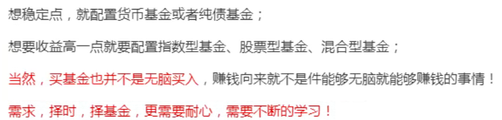
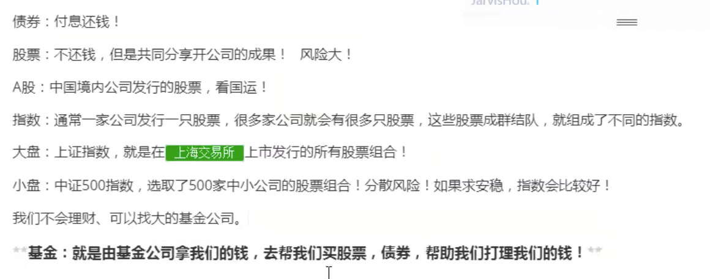
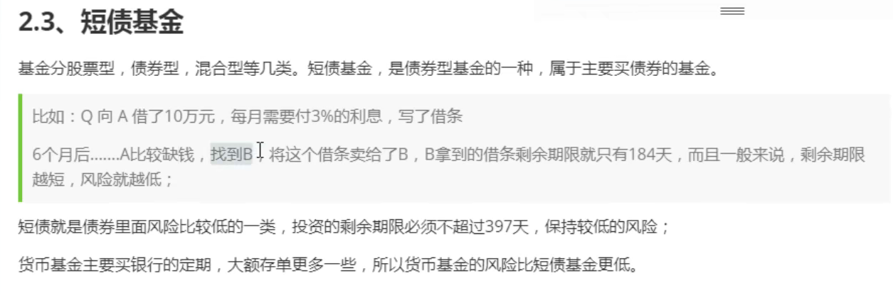
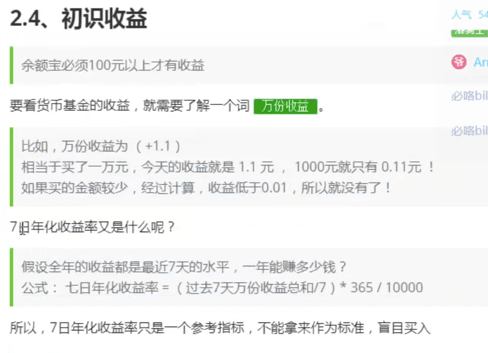
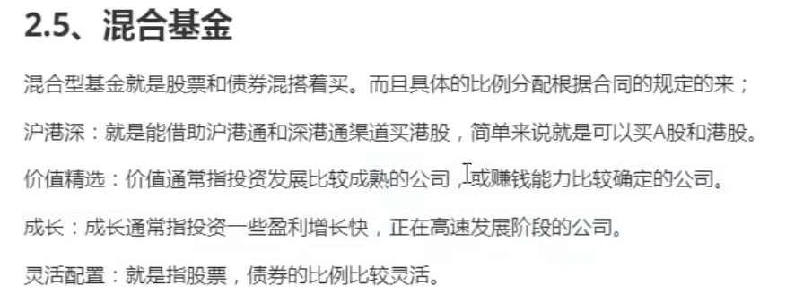
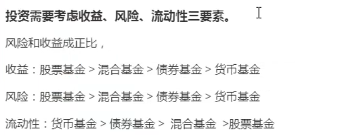
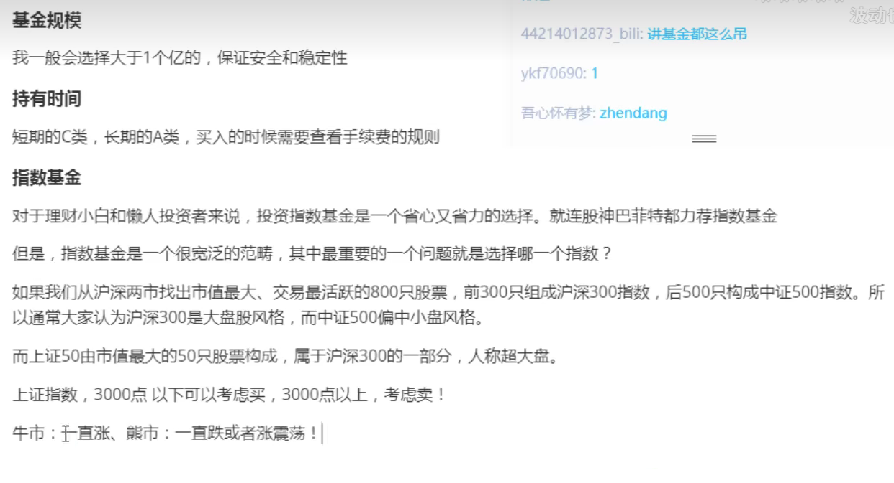

# 理财

## 基金

### A股、指数

## 总结

最好在13点半到15点前买，这个时候能看到净值，

低买高卖，定投摊风险

## 基本面

### 理解基金类型：

- 股票基金：主要投资于上市公司的股票。
- 债券基金：主要投资于债券等固定收益类资产。
- 混合基金：兼具股票和债券等多种资产类别的投资组合。
- 指数基金：追踪特定市场指数的基金。
- 行业基金：专注于特定行业的基金，例如科技、医疗等。
- 地区基金：重点投资于特定地区或国家的基金。