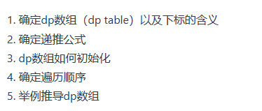

# 算法

### 链表

1. 单向链表常用解决方案就是：**虚拟头节点**

### 哈希表

当给你一个元素，判断这个元素是否在这个集合里出现过的时候，适合用哈希表解决问题

### 栈与队列

栈适合做相邻元素之间的关联处理

### 二叉树

## 动态规划

[视频地址](https://www.bilibili.com/video/BV13Q4y197Wg/?spm_id_from=333.999.0.0&vd_source=4db4edf8e68a4ceac9f0a41212e6f026)

### 背包问题

# 点

## KMP

