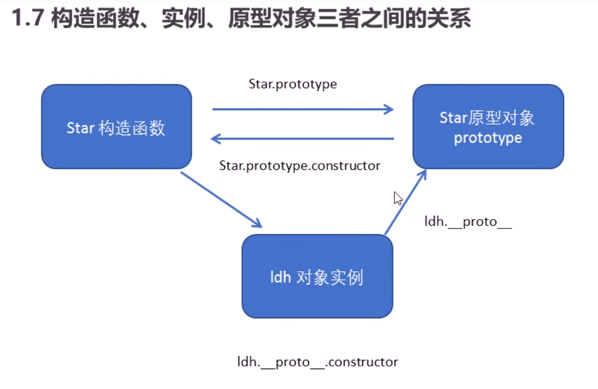
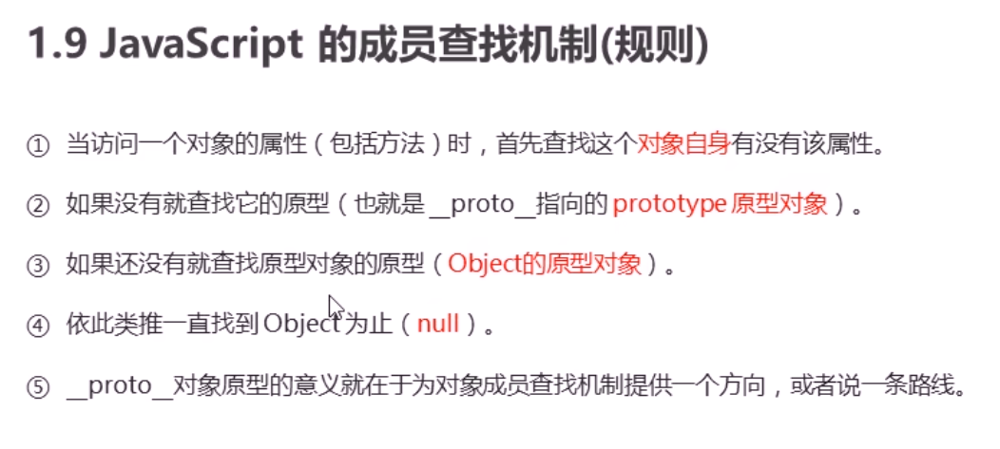

## 原型

### 原型对象

1. 原型是一个对象，
2. 原型的作用就是共享内存
3. 原型分两个
   1. prototype：共开发者使用（存在与函数中）
   2. \__proto\_\_：供浏览器使用（存在与对象中，指向**构造函数**的prototype原型对象）
4. **原型对象**（prototype）等于**对象原型**（\_\_proto\_\_）

### 构造函数

对象原型(\_\_proto\_\_)和构造函数(prototype)原型对象里面都有一个属性constructor属性，constructor我们称为构造函数，因为它**指回构造函数本身**。

constructor 主要用于记录该对象引用于哪个构造函数，它可以让原型对像重新指向原来的构造函数。

```js
function Star(){
    
}
Star.prototype = {
    constructor:Star,//指回构造函数本身
}
```




### 原型链

1. 只要是对象就有 \_\_proto\_\_ 原型，指向 原型对象 prototype

### 原型查找机制



## 数据类型

### 对象

对象的key类型只能有三种：string|number|Symbol

# ESNext

## 数组扩展

### 方法

##### Array.from

将类数组对象转换为真正数组


##### Array.of

将一组值转化为数组


##### Array.prototype.fill(fillVal,startIdx,endIdx)

将数组元素快速填充

```js
const arr = new Array(10).fill(0)//将数组元素全部填充为0
const arr = new Array(10).fill(0,1,5)//从下标1到下标4，将元素填充为0
const arr = new Array(10).fill(0,5)//从下标5开始到数组结束，将元素填充为0
```


##### Array.prototype.flatMap(item=>item)

指定元素进行扁平化处理

```js
const options = [
    {
        name:"崔汝鑫",
        children:[
            {
                name:"黎榕汕"
            },
            {
                name:"唐宜豪"
            }
        ]
    },
    {
        name:"龚萌",
        children:[
            {
                name:"姚艳"
            },
            {
                name:"余淼"
            }
        ]
    }
]
const arr = options.flatMap(item=>item.children)
```


## 对象扩展

### 属性表达式

```js
let name = "a"
const obj = {
    [name]:"易建政",//这里[name]是变量，代表a。
}
console.log(obj)//{a:"易建政"}
```


## Symbol

```js
const VIDEO = Symbol(),
      AUDIO = Symbol(),
      IMAGE = Symbol()
function play(type) {
    switch (type) {
        case VIDEO:
            console.log('视频播放');
            break
        case AUDIO:
            console.log('音频播放');
            break
        case IMAGE:
            console.log('图片展示');
            break
        default:
            console.log('类型不匹配');
    }
}
play(VIDEO)
```


## Iterator迭代器

实现 Iterator 接口

```js
function objPro() {
    let name = "ab"
    const obj = {
        [name]: "邹桂英",
        [Symbol.iterator]: function () {
            return {
                next() {
                    return {
                        value: undefined,
                        done: true,//为true时，终止迭代
                    }
                }
            }
        }
    }
    for (let item of obj) {
        console.log('item:', item);
    }
},
```

迭代数组

```js
const arr = [1,2,3,4,5]
let ite = arr[Symbol.iterator]()
console.log(ite.next())
```


## Set

类似于数组，成员唯一

```js
const set = new Set([1,2,3,4,6])
```

### 方法

##### has

判断是否有该元素

```js
const set = new Set([1,2,3,4])
console.log(set.has(1))
```

##### delete

删除元素

```js
set.delete(3)
```

##### clear

清空set

```js
set.clear()
```


## Map

类似于对象，是键值对的集合，但是“键”的范围不限于字符串，各种类型的值（包括对象）都可以当作键值

```js
const map = new Map([
    ["age",12],
    ["address","山西省晋城市阳城县寺头乡"],
    [{name:"贾甜"},"对象键值"]
])
map.set("name","文文轩")
```

方法基本同 Set


# File&Blob&FileReader&DataView

FIle的原型是Blob

File与Blob基本上没有什么区别，只是File比Blob多了一些磁盘属性，比如文件名，文件路径

File与Blob都只能看，不能修改，DataView可以修改


#### File

```js
const file = new File(["123"], "./file.txt")
console.log('file:', file);
var reader = new FileReader();
reader.onload = function (evt) {
    console.log("数据读取结果：", evt.target.result);
};
reader.readAsText(file);
```

#### Blob

```js
const blob = new Blob(['456'])
console.log('blob:', blob);
const reader2 = new FileReader()
reader2.onload = evt => {
    console.log('blob数据读取结果：', evt.target.result);
}
reader2.readAsText(blob)
```

#### DataView

```js
async function init() {
    const file = new File(['123'], "123.txt")
    const dv = new DataView(await file.arrayBuffer())
    // 根据下标获取数据
    console.log('dv:', dv.getUint8(1));
    // 根据下标设置数据
    dv.setUint8(1, 101)
    console.log('dv:', dv.getUint8(1));
}
init()
```


### showOpenFilePicker

```js
// 创建用于存放文件句柄的变量。
async function getFile() {
    const pickerOpts = {
        types: [
            {
                description: "Images",
                accept: {
                    "image/*": [".png", ".gif", ".jpeg", ".jpg"],
                },
            },
        ],
        excludeAcceptAllOption: true,
        multiple: false,
    };
    // 打开文件选择器，解构返回的数组中的第一个元素
    const [fileHandle] = await window.showOpenFilePicker(pickerOpts);
    // 操作 fileHandle 的后续代码
    const file = await fileHandle.getFile()
    console.log('file:', file);
    console.log('file.arrayBuffer():', await file.arrayBuffer());
}
```

