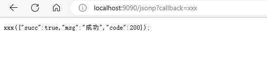

# gin
## 热加载

1. ```bash
   go get github.com/pilu/fresh
   ```

2. ```bash
   go get github.com/codegangsta/gin
   ```

3. 

## 返回数据类型

### c.String()

返回一个字符串

### c.JSON()

返回一个json数据

### c.JSONP()

当访问的地址后面带上了 callback=xxx 的时候，返回的结果，会以xxx为函数，返回结果为函数参数，执行函数

```bash
localhost:8080/jsonp?callback=xxx
```



### c.XML()

返回xml结构内容

### c.HTML()

```go
// 全局 html 文件加载
r.LoadHTMLGlob("templates/*")
r.GET("/goods", func(ctx *gin.Context) {
    ctx.HTML(http.StatusOK, "index.html", map[string]interface{}{
        "title": "行葡萄",
    })
})
```

## 模板渲染

### 加载多目录模板

```go
//载入多目录模板
r.loadHTMLGlob("templates/**/*")
```

#### 模板命名

```html
<!--相当于给模板定义一个名字define end成对出现-->
{{ define "admin/index.html"}}

	html内容...

{{ end }}//成对出现
```

```go
// 全局 html 文件加载
r.LoadHTMLGlob("templates/**/*")
r.GET("/goods", func(ctx *gin.Context) {
    ctx.HTML(http.StatusOK, "admin/index.html", map[string]interface{}{
        "title": "admin后台",
    })
})
```

### 传递数据

模板中使用 {{.变量名}} 来接收变量

#### 定义变量

```html
{{$t := .title}}
{{$t}}
```


#### 抽取公共模板

使用 template 关键字声明，加上模板名称，以 . 结尾

```html
{{ template "admin/public/page_header.html" .}}
```


## 静态文件服务

当我们渲染的HTML文件中引用了静态文件时，我们需要配置静态web服务

r.Static("/static'","./static'")前面的/static表示路由，后面的./static表示路径

## 路由传值

### get传值

```go
r.GET("/query", func(ctx *gin.Context) {
    name := ctx.Query("name")
    age := ctx.DefaultQuery("age", "25")
    ctx.JSON(http.StatusOK, gin.H{
        "name": name,
        "age":  age,
    })
})
```

### post传值

```go
r.POST("/post", func(ctx *gin.Context) {
    name := ctx.PostForm("name")
    age := ctx.DefaultPostForm("age", "20")
    ctx.JSON(http.StatusOK, gin.H{
        name: name,
        age:  age,
    })
})
```

### 请求参数自动绑定结构体

```go
r.POST("/post", func(ctx *gin.Context) {
    var result = &Result{}
    ctx.ShouldBind(&result)
    ctx.JSON(http.StatusOK, gin.H{
        "result": result,
    })
})
```

### 解析xml数据

也可以接收 json 数据

```go
r.POST("/xml", func(ctx *gin.Context) {
    b, _ := ctx.GetRawData()
    result := &Result{}
    if err := xml.Unmarshal(b, &result); err == nil {
        ctx.JSON(http.StatusOK, gin.H{
            "result": result,
        })
    } else {
        ctx.JSON(http.StatusOK, gin.H{
            "error": err.Error(),
        })
    }
})
```

### 动态路由传参

```go
r.GET("/user/:id",func(ctx *gin.Context){
    id:=ctx.Param("id")
    ctx.String(200,"id",id)
})
```

### 获取token 

```go
c.Request.Header.Get("token")
```


## 路由分组

```go
r := gin.Default()
defaultGroup := r.Group("/api")
{
    defaultGroup.GET("/u1", func(ctx *gin.Context) {
        ctx.String(200, "/api/u2", "哈喽")
    })
}
gepGroup := r.Group("/user")
{
    gepGroup.GET("/u1", func(ctx *gin.Context) {
        ctx.String(200, "/user/u1", "你好")
    })
}
r.Run(":9090")
```

## 自定义控制器

将控制器方法抽离出去

## 中间件

### 路由中间件

```go
func middleware(ctx *gin.Context) {
	fmt.Println("中间件执行了")
}
func UserRouter(r *gin.Engine) {
	userGroup := r.Group("/user")
	userGroup.GET("/list", middleware, controller.UserController{}.List)
	userGroup.GET("/succ", middleware, controller.UserController{}.Succ)
}
```

中间件里面加上**ctx.Next()**可以让我们在路由匹配完成后执行一些操作。

```go
func middleware(ctx *gin.Context) {
	start := time.Now().UnixMicro()
	fmt.Println("中间件执行了")
	ctx.Next()
	fmt.Printf("程序执行时间:%v\n", time.Now().UnixMicro()-start)
}
func UserRouter(r *gin.Engine) {
	userGroup := r.Group("/user")
	userGroup.GET("/list", middleware, func(ctx *gin.Context) {
		fmt.Println("执行了用户列表")
		ctx.String(200, "用户列表")
	})
}
```

ctx.Abort() 终止调用该请求剩余处理程序

```go
func middleware(ctx *gin.Context) {
	start := time.Now().UnixMicro()
	fmt.Println("中间件执行了")
	ctx.Abort()
	fmt.Printf("程序执行时间:%v\n", time.Now().UnixMicro()-start)
}
func UserRouter(r *gin.Engine) {
	userGroup := r.Group("/user")
	userGroup.GET("/list", middleware, func(ctx *gin.Context) {
		fmt.Println("执行了用户列表")
		ctx.String(200, "用户列表")
	})
}
```

### 全局中间件

```go
r.Use(middleWare)
```

### 分组中间件

```go
userGroup := r.Group("/user", groupMiddleWare)
```

### 中间件和对应控制器之间的数据共享

```go
//设置值
ctx.Set("name","张三")
//获取值
name,_:=ctx.Get("name")
```


### 创建干净的路由

gin.Default()默认使用了Logger和Recovery中间件，其中：

- Logger中间件将日志写入gin.DefaultWriter,即使配置了GIN_MODE=release。
- Recovery中间件会recover任何panic。如果有panic的话，会写入500响应码。

```go
r := gin.New()
```

### 中间件中使用goroutine

当在中间件或handler中启动新的goroutine时，不能使用原始的上下文(c*gin.Context),
必须使用其只读副本(c.Copy())

```go
userGroup := r.Group("/user")
userGroup.GET("/list", middleware, func(ctx *gin.Context) {
    cCp := ctx.Copy()
    go func() {
        time.Sleep(time.Second * 3)
        fmt.Println("执行了用户列表", cCp.Request.URL)
    }()
    ctx.String(200, "用户列表")
})
```


## 自定义Model

如果我们的应用非常简单的话，我们可以在Controller里面处理常见的业务逻辑。但是如果我们有一个功能想在多个控制器、或者多个模板里面复用的话，那么我

们就可以把公共的功能单独抽取出来作为一个模块(Model)。Model是逐步抽象的过程，一般我们会在Mode里面封装一些公共的方法让不同Controller使用，也可

以在Model中实现和数据库打交道


## 文件上传

### 单文件上传

前端

```html
<form action="http://localhost:9090/file/upload" method="post" enctype="multipart/form-data">
    姓名：<input type="text" name="name">
    头像：<input type="file" name="avatar">
    <button type="submit">提交信息</button>
</form>
```

server

```go
func UserRouter(r *gin.Engine) {
	userGroup := r.Group("/file")
	userGroup.POST("/upload", func(ctx *gin.Context) {
		name := ctx.PostForm("name")
		file, err := ctx.FormFile("avatar")
		if err == nil {
			dst := path.Join("./static", file.Filename) // ./static 当前目录是基于 main.go 文件的位置
			ctx.SaveUploadedFile(file, dst)
			ctx.JSON(http.StatusOK, gin.H{
				"succ":     true,
				"name":     name,
				"filename": file.Filename,
				"path":     dst,
			})
		} else {
			ctx.JSON(http.StatusOK, gin.H{
				"succ":     false,
				"name":     name,
				"filename": "无",
			})
		}
	})
}
```


### 多文件上传（相同名称文件）

前端

```html
<form action="http://localhost:9090/file/upload" method="post" enctype="multipart/form-data">
    姓名：<input type="text" name="name"><br>
    头像：<input type="file" name="avatar"><br>
    头像：<input type="file" name="avatar"><br><!--这里的name随便起名字，不用刻意-->
    <button type="submit">提交信息</button>
</form>
```

server

```go
func UserRouter(r *gin.Engine) {
	userGroup := r.Group("/file")
	userGroup.POST("/upload", func(ctx *gin.Context) {
		name := ctx.PostForm("name")
		files, err := ctx.MultipartForm()
		if err == nil {
			fileArr := files.File["avatar[]"]
			for _, v := range fileArr {
				dst := path.Join("./static", v.Filename) // ./static 当前目录是基于 main.go 文件的位置
				ctx.SaveUploadedFile(v, dst)
			}
		}

		if err == nil {
			ctx.JSON(http.StatusOK, gin.H{
				"succ": true,
				"name": name,
			})
		} else {
			ctx.JSON(http.StatusOK, gin.H{
				"succ": false,
				"name": name,
			})
		}
	})
}
```


### 按照日期存储文件

1. 获取上传的文件
2. 获取后缀名判断类型是否正确.jpg.png.gif.jpeg
3. 创建图片保存目录static./up1oad/20200623
4. 生成文件名称和文件保存的目录
5. 执行上传


## Cookie

gin中可以通过 c.SetCookie() 实现

参数一：cookie名称

参数二：cookie的值

参数三：cookie的有效时间

参数四：cookie的路径

参数五：cookie的路径Domain作用域，本地为localhost，线上为域名

参数六：为true时，表示cookie在http环境下无效，在https中才有效

参数七：httpOnly,是微软对COOKIE做的扩展。如果在COOKIE中设置了“httpOnly"属性，则通过程序(JS脚本、applet等)将无法读取到COOKIE信息，防止SS攻击产生


```go
//设置cookie
c.SetCookie("name","张三",3600,"/","localhost",false,true)
//获取cookie
c.Cookie("name")

//删除cookie
c.SetCookie("name","张三",-1,"/","localhost",false,false)
```

### 多个二级域名共享cookie

分别把a.itying.com和b.itying.com解析到我们的服务器

```go
//设置cookie
c.SetCookie("name","张三",3600,"/",".itying.com",false,true)
```


## Session

session是另一种记录客户状态的机制，不同的是Cookie保存在客户端浏览器中，而session保存在服务器上。

当客户端浏览器第一次访问服务器并发送请求时服务器端会创建一个session对象，生成一个类似于key,value的键值对，然后将value保存到服务器将key(cookie)

返回到浏览器（客户)端。浏览器下次访问时会携带key(cookie),找到对应的session(value)。

参考第三方中间件：https://github.com/gin-contrib/sessions

# GORM操作MySQL

[GORM 指南](https://gorm.io/zh_CN/docs/index.html)

#### 创建对应的表的model

```go
type User struct {//默认情况表名是结构体名称的复数形式：users
    Id int
    Name string
    AddTime int
}
//我们可以使用结构体中的自定义方法TableName改变结构体的默认表名称，表示把User结构体默认操作的表改为user表
func (User) TableName() string{
    return "user"
}
```

## 查询

### 条件查询

```go
//查询id大于3的数据
db.Where("id > ?",id).Find(&user)

//查询id在3、4、5之间的数据
db.Where("id in (?)",[]int{3,4,5}).Find(&user)

//模糊查询
db.Where("name like ?","%德%").Find(&user)

//查询指定的字段
db.Select("name,age").Find(&user)

//分页
db.Limit(2).Offset(10).Find(&user)

//查询总数据量,Count()要放在Find()后面执行
db.Find(&models.User{}).Count(&num)
```

### 执行原生SQL

#### 原生查询SQL

执行查询sql

```go
db.Raw("select * from user where id = ?",10).Scan(&user)
```

#### 执行SQL

执行非查询sql（增删改）

```go
//删除
db.Exec("delete from user where id = ?",5)

//修改
db.Exec("update user set name = ? where id = ?","张三",3)
```

### 模糊查

```
Where(fmt.Sprintf(" dns like '%%%s' ", name))
或者
Where(fmt.Sprintf(" dns like %q ", ("%" + name)))

```


### 关联查询

https://blog.csdn.net/Douz_lungfish/article/details/121614898

#### belongs to

外键在主表中

#### has one

外键在子表中

#### has many


#### many2many

学生与教师，多对多的关系，建立如下模型，gorm会根据引用关系自动创建中间表：student_teachers

```go
type Student struct {
	Id       int `gorm:"autoIncrement:true"`
	Name     string
	Teachers []Teacher `gorm:"many2many:student_teachers"`//自定义需要关联的中间表表名，需要与关联表定义一致
}
type Teacher struct {
	Id       int `gorm:"autoIncrement:true"`
	Name     string
	Students []Student `gorm:"many2many:student_teachers"`//自定义需要关联的中间表表名，需要与关联表定义一致
}
```


### 事务

GORM默认是开启事务的

##### 禁用默认事务

```go
dsn := "root:123456@tcp(127.0.0.1:3306)/lsgfish?charset=utf8mb4&parseTime=True&loc=Local"
DB, err = gorm.Open(mysql.Open(dsn), &gorm.Config{
    SkipDefaultTransaction: true, //禁用事务
    QueryFields:            true, //打印sql
})
```


### 小结

1. 默认的主键字段：id，外键字段：表名+Id，可以指定主、外键
   1. 指定外键：\`gorm:"foreignKey:userId"\`
   2. 指定主键：\`gorm:"references:userId"\`
   3. 同时指定主、外键：\`gorm:"foreignKey:userId;references:Id"\`

## ini配置文件

Github地址：https://github.com/go-ini/ini

官方文档：https://ini.unknwon.io/
