## 安装

...待整理

## Hello World

### 初始化项目

```bash
# 初始化项目，并生成一个 go.mod 文件，用来描述项目基本信息与依赖管理
go mod init hello-golang
```

### 创建main.go文件并打印hello world

```go
package main //声明当前包

import ’fmt'

func main(){
    fmt.Print("Hello golang")
}
```

### 运行程序

```bash
# go run 命令跟上需要运行的文件名
go run main.go
```


## 变量

### 声明变量

```go
func main(){
    //声明常量
    const constant = 10;//使用关键字 const 声明常量
    //声明变量
    var useName string//初始化指定 string 类型
    var valiable = 10;//使用关键字 var 声明变量
    valiable := 123//字面量声明 字面量语法：当前电脑是64位则为64位，电脑为32位，则为32位
    
    //一次声明多个变量
    name,address := "张三","五道口"
    
    var (
    	name string
        age int
    )
    
    var name,address string
    
    // const 同时声明多个常量时，如果省略了值则表示和上面一行的值相同，b,c的值和a相同
    const (
        a = "张三"
        b
        c
    )
}
```

#### iota

```go
// iota 是golang语言的 常量计数器，只能在 常量 的表达式中使用
const (
    a1 = iota//0，第一次出现设置为0，后面每行常量声明都自增1
    _
    a3 = iota //2
)

const (
    a1 = iota//0，第一次出现设置为0，后面每行常量声明都自增1
    a2 = 200
    a3 = iota //2
)
```


## 基本数据类型

### 整型

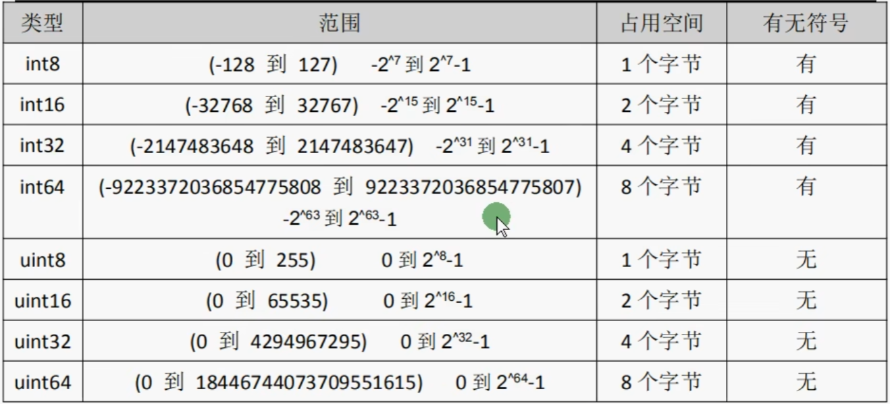

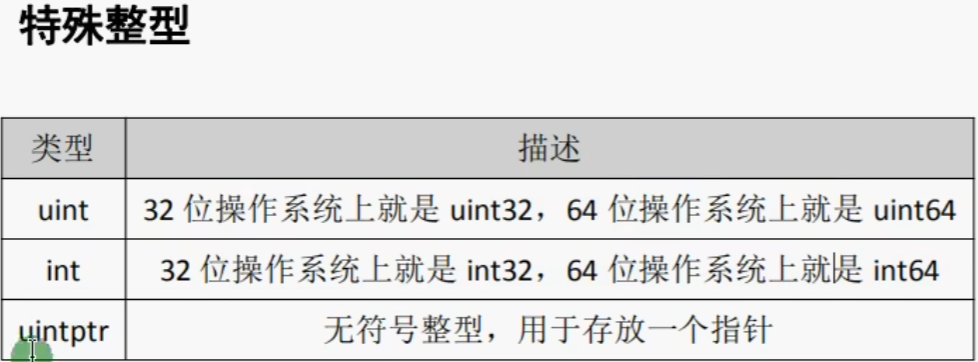

```go
num := 18
fmt.Printf("num值：%v,类型：%T\n", num, num)
fmt.Printf("size:%v", unsafe.Sizeof(num))
```

#### 类型转换

go语言中只有强转类型，没有隐式转换，高位向低位转换要注意不能超出低位类型范围，推荐低位向高位转换

```go
var num1 int16 = 130
//高向低转换（错误，超出低位类型范围）
fmt.Println(int8(num1))//得出的值超出预期
```

### 浮点型

浮点类型默认是 float64

#### 精度丢失

引入第三方包解决

### bool 布尔类型

Go语言中以bool类型进行声明布尔型数据，布尔型数据只true(真)和false(假)两个值。
注意：
1.布尔类型变量的默认值为false。
2.G0语言中不允许将其他类型强制转换为布尔型
3.布尔型无法参与数值运算，也无法与其他类型进行转换。

### 字符串

Go 语言中，默认使用的是 UTF-8

#### 字符串拼接

1. 通过 + 拼接
2. resStr :=  fmt.Sprintf("%v", str)，把打印的结果字符串返回给变量

#### 多行字符串

定义多行字符串时，需要用反引号

```go
str := `
	hello gay
	你好呀 兄弟
	`
fmt.Println(str)
```


### byte 与 rune

组成每个字符串的元素叫做“字符”，可以通过遍历字符串元素获得字符。字符用单引号包裹起来

Go 语言中，字符有两种类型

1. uint8，或者叫 byte ，代表一个ASCII 的字符
2. rune，代表一个 UTF-8 字符

当需要处理中文、日文或者其他复合字符时，则需要用到rune类型。rune类型实际是一个 int32。
Go使用了特殊的 rune 类型来处理 Unicode ,让基于 Unicode 的文本处理更为方便，也可以使用 byte 型进行默认字符串处理，性能和扩展性都有照顾。

一个汉子占用3个字节(utf-8)，一个字母占用一个字节

#### 处理汉字与字母共存打印错误问题

```go
func main() {
	s := "你好 go"
	for i := 0; i < len(s); i++ { // 使用 byte 处理
		fmt.Printf("%v(%c)", s[i], s[i])
	}
	fmt.Println()
	fmt.Println("分隔符")
	for _, value := range s { //range 使用 rune 处理
		fmt.Printf("%v(%c)", value, value)
	}
}
```

#### 修改字符串

要修改字符串，需要先将其转换成**[]rune**或**[]byte**,完成后再转换为**string**。无论哪种转换，都会重新分配内存，并复制字节数组。

```go
func main() {
	s := "hello"
	fmt.Printf("s改变前打印：%v\n", s)
	rune8 := []byte(s)
	rune8[0] = 'H'
	s = string(rune8)
	fmt.Printf("s改变后打印：%v\n", s)

	s2 := "你好"
	fmt.Printf("s2改变前打印：%v\n", s2)
	rune32 := []rune(s2)
	rune32[0] = '我'
	s2 = string(rune32)
	fmt.Printf("s2改变后打印：%v\n", s2)
}
```

## 基本类型转换

### 数值类型转换

注意：转换时建议低位转高位，整形转浮点型

```go
//整形与整形之间转换
var num1 int8 = 12
var num2 int16 = 120
var num3 = int16(num1) + num2
//浮点型与浮点型之间转换
var f1 float32 = 3.14
var f2 float64 = 6.18
var f3 = float64(f1) + f2
//浮点型与整形之间转换
var num int8 = 10
var f float32 = 3.14
var fn = float32(num) + f
```

### 其他类型转string

```go
//方式一 ：通过 Sprintf
func main(){
    num := 100
    f := 3.14
    b := true
    by := 'a'
    strNum := fmt.Sprintf("%d", num)
    fmt.Printf("strNum:%v\n", strNum)
    strF := fmt.Sprintf("%f", f)
    fmt.Printf("strF:%v\n", strF)
    strB := fmt.Sprintf("%t", b)
    fmt.Printf("by:%v\n", strB)
    strBy := fmt.Sprintf("%c", by)
    fmt.Printf("strBy:%v\n", strBy)
}

//方式二 ：通过strconv格式化转换
func main() {
    num := 100
    f := 3.14
    b := true
    by := 'a'
    /**
	参数1：要格式化变量
	参数2：格式化的类型
	*/
    strNum := strconv.FormatInt(int64(num), 10)
    fmt.Printf("strNum:%v\n", strNum)
    /**
	参数1：要格式化的变量
	参数2：格式化类型
			'f' (常用的小数类型)
			'b' (二进制类型)
			'e' (十进制指数)
			'E' (十进制指数)
			'g' (指数很大时用 'e' 格式，否则 'f' 格式)
			'G' (指数很大时用 'E' 格式，否则 'f' 格式)
	参数3：保留的小数点
	参数4：格式化的类型
			64 或 32
	*/
    strF := strconv.FormatFloat(f, 'f', 2, 64)
    fmt.Printf("strF:%v\n", strF)
    strB := strconv.FormatBool(b)
    fmt.Printf("by:%v\n", strB)
    strBy := strconv.FormatUint(uint64(by), 10)
    fmt.Printf("strBy:%v\n", strBy)
}

```

### string 转其他类型

```go
func main(){
    str := "1234"
    //string 转 int
    /*
    	参数1：字符串变量
    	参数2：输出的进制（2，8，10，16）
    	参数3：输出的数据类型 （8，16，32，64）int8,int16...
    */
    num, ok := strconv.ParseInt(str, 10, 16)
    if ok == nil {
        fmt.Printf("num:%v", num)
    } else {
        fmt.Println("转换错误", ok)
    }
	//string 转 float
    f, ok := strconv.ParseFloat(str, 64)
    if ok == nil {
        fmt.Printf("f:%f", f)
    } else {
        fmt.Println("转换错误", ok)
    }
}
```

## 运算符

算术运算符
关系运算符
逻辑运算符
位运算符
赋值运算符

| 运算符 | 描述                                                         |
| ------ | ------------------------------------------------------------ |
| +      | 相加                                                         |
| -      | 相减                                                         |
| *      | 相乘                                                         |
| /      | 相除。即被整除的数 100 / 9 = 11                              |
| %      | 求余。即被整除后剩余的数 100 % 9 = 1                         |
| ++、-- | 自增与自减，在Go语言中是单独的语句，并不是运算符，<br />1. 不能参与赋值运算： num := i++ （错误，不能参与赋值运算）<br />2. 没有前置运算：++i   （错误，只有后置++ 、--） |

### 位运算符

位运算符对整数在内存中的二进制位进行操作

反码：**正数的反码还是等于原码；负数的反码就是它的原码除符号位外，按位取反**。

补码：**正数的补码等于它的原码；负数的补码等于反码+1**

**补码转原码**

- 如果补码的最高位是0，则它表示正数，原码与补码相同。
- 如果补码的最高位是1，则它表示负数，需要将补码转换为其反码加1得到原码。

| 运算符 | 描述                                                         |
| ------ | ------------------------------------------------------------ |
| &      | 参与运算的两数各对应的二进制位相与（两位均为1 才为 1）       |
| \|     | 参与运算的两数各对应的二进制位相与（两位有一个为 1 就为 1）  |
| ^      | 参与运算的两数各对应的二进制位相异，或当两对应的二进制位相异时，结果为 1（值不同为 1，相同则为0） |
| <<     | 左移n位就是乘以2的n次方。“a<<b”是把a的各二进位全部左移b位，高位丢弃，低位补0。 |
| >>     | 右移n位就是除以2的n次方。“a>>b”是把a的各二进位全部右移b位。  |

```go
func main(){
    a := 5                         //二进制 101
    b := 2                         //二进制 010
    fmt.Printf("a|b:,%v\n", a|b)   //二进制 000     二进制两位都为1才为1，十进制：0
    fmt.Printf("a&b:,%v\n", a&b)   //二进制 111	 二进制一位为1则为1，十进制：7
    fmt.Printf("a^b:,%v\n", a^b)   //二进制 111	 两位不同则为1，十进制：7
    fmt.Printf("a<<b:,%v\n", a<<b) // 5 * 2的2次方  101向左进两位，低位补0 10100 十进制：20
    fmt.Printf("a>>b:,%v\n", a>>b) // 5 / 2的2次方  101向右进两位，高位补0 001	 十进制：1
}
```

## 流程控制

### 循环

```go
// for无限循环
for{
    fmt.Println("无线循环执行")
}

// for范围循环
for index,value :=  range slice {
    fmt.Print(index)
    fmt.Print(value)
}
// for条件循环
for len(slice)<50{
    fmt.Println("当slice长度小于50时，执行循环语句")
}

//该 i 变量只能在for循环中使用，属于局部变量
for i:=0;i<10;i++{
    fmt.Println("i:",i)
}
```

### break、continue，goto

#### break

break默认跳出一层循环，并终止**当前循环层的break**后面的执行语句

```go
//break：只能终止一层循环，并且不执行break后面的语句
for i:=0;i<10;i++{
    fmt.Println("i:",i)
    if i==2{
        break
    }
    fmt.Println("继续执行")
}
```

break跳出多层循环，需要结合标记 label，标记出break想要跳出的位置

```go
func main() {
label_b://自定义标签的名称，以冒号结尾，以此为标记跳出多层循环来到标记点然后执行循环体后面的代码。该标记点与循环语句中间不能添加其他执行代码，否则报错
	for j := 0; j < 10; j++ {
		fmt.Printf("j层：%v\n", j)
		for i := 0; i < 10; i++ {
			fmt.Printf("i:%v\n", i)
			if i == 2 {
				break label_b
			}
			fmt.Println("继续执行")
		}
	}
}
```

#### continue

语句可以结束当前循环，开始下一次的循环迭代过程，仅限在for循环内使用

```go
func main() {
	for i := 0; i < 5; i++ {
		fmt.Printf("i:%v\n", i)
		if i == 2 {
			continue
		}
		fmt.Println("继续执行")
	}
}
```

控制跳出循环后的开始执行位置，类似于break跳出多层循环一个意思

```go
func main() {
label1:
	for j := 0; j < 5; j++ {
		for i := 0; i < 5; i++ {
			fmt.Printf("j:%v, i:%v\n", j, i)
			if i == 2 {
				continue label1
			}
		}
	}
}
```

#### 小结

可以通过在关键字后面追加标签形式，以达到跨循环操作

### goto

goto语句通过标签进行代码间的无条件跳转。

```go
func main() {
	num := 10
	if num > 9 {
		goto label1
	}
	fmt.Println("执行第一条")
	fmt.Println("执行第二条")
label1:
	fmt.Println("执行第三条")
	fmt.Println("执行第四条")
}

```


### switch

```go
func main() {
	str := "你好"
    
    //基础用法
	switch str {
	case "nihao":
		fmt.Println("nihao")
	case "你好呀":
		fmt.Println("你好")
	default:
		fmt.Println("default")
	}
    
    
    //一个分支多个值，多个case值可以使用英文逗号分隔
	switch str {
	case "nihao":
		fmt.Println("nihao")
        break//break可以写也可以不写
	case "你好呀","你好":
		fmt.Println("你好")
	default:
		fmt.Println("default")
	}
   
    
    //分支后面可以使用表达式
    num := 59
	switch num {
	case num>60:
		fmt.Println("及格了")
        break//break可以写也可以不写
	case num<60:
		fmt.Println("不及格")
	default:
		fmt.Println("刚好60分")
	}
    
    // case 穿透
	switch str {
	case "nihao":
		fmt.Println("nihao")
        fallthrough//只会穿透一层case，不会多层穿透
	case "你好呀":
		fmt.Println("你好")
	default:
		fmt.Println("default")
	}
    
}
```

#### 小结

1. switch中的case语句可以写表达式
2. switch可以一个case分支判断多个条件，每个条件用逗号进行分割
3. switch默认不穿透case

## Array与slice

### Array

**值类型**

声明数组

```go
func main(){
    var arr1 [10]string//声明一个长度为10的字符串数组
    var arr2 = [10]string{"java","html"}//初始化并赋值
    var arr2 = [...]string{"java","html"}//初始化并赋值，根据初始化赋值，自动推算数组长度 
    var num4 = [...]int{3:5,5:6}//第四种，根据下标来决定数组长度，下标为3的赋值5，下标为5赋值6
    arr := [2][2]int{}//二维数组
    arr := [2][2]int{{1,2},{3,4}}//二维数组赋值
}
```

### slice

切片是一个引用类型，它的内部结构包含**地址、长度和容量**。

声明切片

```go
func main(){
    var slice []string//切片声明
    //make函数创建切片 make([]T,len,cap)
    slice2 := make([]int,8,8)
}
```

#### slice的长度与容量

我们可以通过 len() 求长度，通过 cap() 求容量

1. 切片的**长度**就是它所包含的元素个数，**可访问的长度**。
2. 切片的**容量**是从它的第一个元素开始数，到其**底层数组元素末尾的个数**。

```go
func main(){
   slice := []int{1, 2, 3, 4, 5, 6, 7}
	fmt.Printf("slice的长度%v与容量%v\n", len(slice), cap(slice)) //7,7
	slice1 := slice[4:]
	fmt.Printf("slice1的长度%v与容量%v\n", len(slice1), cap(slice1)) //3,3
	slice2 := slice[1:3]
	fmt.Printf("slice2的长度%v与容量%v\n", len(slice2), cap(slice2)) //2,6
	slice3 := slice[:3]
	fmt.Printf("slice3的长度%v与容量%v\n", len(slice3), cap(slice3)) //3,7
}
```

#### 切片的本质

切片的本质就是**对底层数组**的封装，它包含了三个信息：底层指向数组的指针、切片的长度和切片的容量

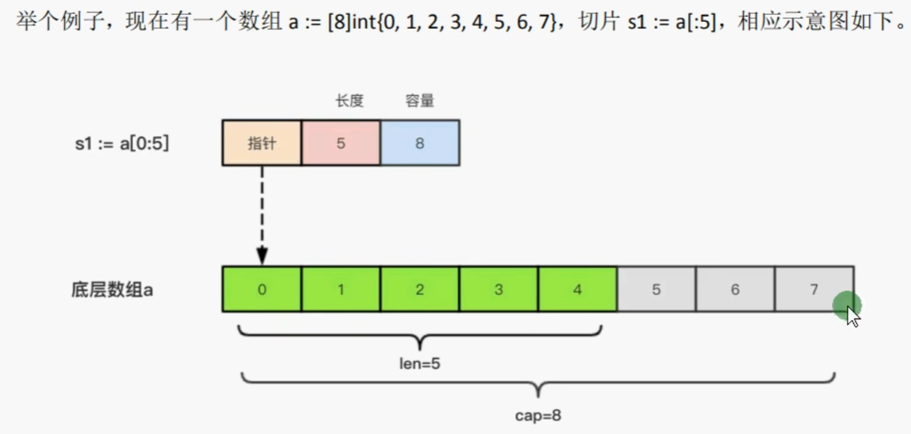


#### 切片扩容策略

每次扩容时，扩容的大小是上次容量的两倍，如果就**切片长度**大于1024，则每次扩容时**新容量**只会增加**旧容量的四分之一**大小

需要注意的是，切片扩容还会根据切片中元素的类型不同而做不同的处理，比如 int 和 string类型的处理方式就不一样。

```go
func main() {
	var slice = []int{}
	for i := 0; i < 10; i++ {
		slice = append(slice, i)
		fmt.Printf("大小：%v，长度：%v，容量：%v\n", slice, len(slice), cap(slice))
	}
}
```

#### 切片的增删改查

```go
//切片的截取
func interceptSlice(){
    slice := []int{1,2,3,4,5,6,7}
    //区间截取
    slice1 := slice[1:4]//截取切片，截取下标1到4之间的数据，左闭右开：[2,3,4]
    slice2 := slice[:4]//从头截取到下标为4的区间：[1,2,3,4]
    slice3 := slice[4:]//从下标为4开始截取：[5,6,7]
    slice4 := slice[:]//复制切片内容：[1,2,3,4,5,6,7]
}

//切片拷贝
func sliceCopy(){
    slice1 := []int{1, 2, 3, 4, 5}
    var slice2 = make([]int, 5)
    copy(slice2, slice1)
    fmt.Printf("slice2:%v,slice1:%v\n", slice2, slice1)
}

//切片新增
func sliceAdd(){
    slice := []int{1,2}
    slice = append(slice,slice...)
    fmt.Printf("slice：%v\n",slice)
}

//切片删除：go中没有切片删除的方法，只能通过自己去实现
func sliceDel(){
    slice := []int{1,2}
    slice = slice[:1]
}
```

### sort包排序

```go
func main() {
	slice := []int{4, 2, 35, 2, 6, 4, 3, 0, 6, 7, 4}
	sort.Ints(slice) //默认升序
	fmt.Println(slice)
	sort.Sort(sort.Reverse(sort.IntSlice(slice))) //降序处理
	fmt.Println(slice)
}
```

## map

引用类型

map是一种无序的基于**key-value**的数据结构，Go语言中的map是引用类型，**必须初始化**才能使用。

```go
var uMap = make(map[string]string)//初始化map
uMap['name'] = "张三"
uMap['age'] = "24"
//初始化赋值
var uMap2 = map[string]string{
    "name":"张三",
    "age":"20"
}
```

#### 循环map

```go
func main(){
   	uMap := map[string]string{
		"name": "漳卅",
		"age":  "24",
	}
	for k, v := range uMap {
		fmt.Printf("key:%v,value:%v\n", k, v)
	}
}
```

#### map类型crud

```go
func main(){
   uMap := map[string]string{
		"name": "漳卅",
		"age":  "24",
	}
	//查找属性值，并判断属性是否存在
	value, ok := uMap["xxx"]
	if ok {
		fmt.Println("name属性值：", value)
	}
    //删除属性值
    delete(uMap,"name")
}
```

#### map类型切片

```go
func main() {
	slice := make([]map[string]string, 3)
	if slice[0] == nil {
		slice[0] = map[string]string{
			"name": "张三",
		}
	}
	if slice[1] == nil {
		slice[1] = map[string]string{
			"name": "张三",
		}
	}
	if slice[2] == nil {
		slice[2] = map[string]string{
			"name": "张三",
		}
	}
	for k, v := range slice {
		fmt.Printf("k:%v,v:%v\n", k, v)
	}
}
```


## 函数

G0语言中支持：函数、匿名函数和闭包

```go
func test() string {
	fmt.Print("这是一个函数")
	return "这是函数的返回值"
}
```

### 参数

```go
//最常见的基础写法
func test(a int,b int){
    
}
//参数类型相同时的简写
func test(a ,b int){
    
}
```

#### 可变参数

```go
func test(arr ...int){
    for _,v := range arr{
        fmt.Printf("value:%v",v)
    }
    fmt.Println("接收一个int类型arr的切片")
}
```

### 返回值

```go
//一个返回值
func test() int{
    fmt.Println("返回一个int类型数据")
    return 1
}

//返回多个返回值
func test()(int,string){
    fmt.Println("返回两个参数，类型分别为int与string")
    return 1,"2"
}
```

#### 返回值命名

```go
func test()(sum int){
    fmt.Println("这里返回值不需要把返回变量放在return 后面")
    sum = 1 + 2
    return 
}
//返回值变量简化声明
func test(a, b int) (sum1, sum2 int) {
	sum1 = a
	sum2 = b
	fmt.Println("这里返回值不需要把返回变量放在return 后面")
	return
}
```

### 作用域

**全局变量：**全局变量是定义在函数外部的变量，它在程序整个运行周期内都有效
**局部变量：**局部变量是函数内部定义的变量，函数内定义的变量无法在该函数外使用

## 函数类型与变量

我们可以使用type关键字来定义一个函数类型**（不仅仅是函数类型，还可以用type定义其他自定义的类型）**, type 字段可以用来声明自定义类型

```go
type calc func(int,int) int
```

上面语句定义了一个**calc类型**，它是一种函数类型，这种函数接收两个 int 类型的参数并且返回一个 int 类型的返回值。

```go
type calc func(int, int) int

func main() {
	var c calc
	c = test
	fmt.Printf("c:%v\n%T", c(1, 3), c)
}

func test(a, b int) int {
	return a + b
}
```

### 函数作为参数

```go
func test(x,y int,callback func(f string)){
    fmt.Println("callback是函数类型参数")
}
```

类型声明与参数调用

```go
//声明一个函数类型
type calcType func(int, int) int

func main() {
	fmt.Printf("%v", calc(1, 2, add))
}
func add(x, y int) int {
	return x + y
}
func calc(x, y int, callback calcType) int {
    //将函数作为返回值
	return callback(x, y)
}
```

### 函数作为返回值

```go
type calcType func(int, int) int

func main() {
	calc := do("-")
	fmt.Printf("%v", calc(5, 2))
}
func do(o string) calcType {
	switch o {
	case "+":
		return add//函数作为返回值
	case "-":
		return minus//函数作为返回值
	default:
		return nil
	}
}
func add(x, y int) int {
	return x + y
}
func minus(x, y int) int {
	return x - y
}
```

### 匿名函数

```go
func main(){
    func(){
        fmt.Println("匿名函数自执行")
    }()//匿名函数自执行
    fn := func()string{
        return "匿名函数赋值"
    }
    fmt.Println(fn())
}
```

### 闭包

常驻内存，不污染全局

```go
func main() {
	fn := add()
	fmt.Printf("fn:%v\n", fn(10))
	fmt.Printf("fn:%v\n", fn(10))
	fmt.Printf("fn:%v\n", fn(10))
}
func add() func(int) int {
	i := 0
	return func(y int) int {
		i += y
		return i
	}
}
```

## 错误处理

### defer

Go语言中的defer语句会将其后面跟随的语句进行延迟处理。在defer归属的函数即将返回时，将延迟处理的语句按defer定义的逆序进行执行，也就是说，先被defer的语句最后被执行，最后被defer的语句，最先被执行

```go
func main() {
	defer fmt.Println("1")
	defer fmt.Println("2")
	defer fmt.Println("3")
}
```

在Go语言的函数中return语句在底层并不是原子操作，它分为给**返回值变量**赋值和**RET指令**两步。而defer语句执行的时机就在 返回值变量赋值 操作后，RET（return）指令执行前。具体如下图所示：

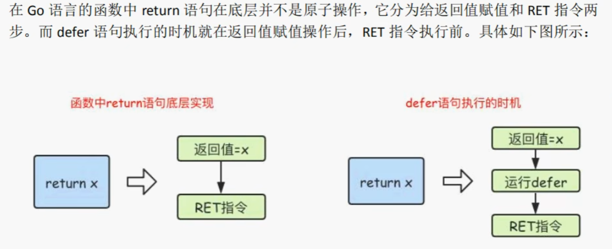

```go
func main() {
	fmt.Println(fn1())
	fmt.Println(fn2())
}
//匿名返回值结果为0
/*
解释：方法体内部，变量a，在执行到return这步时，程序会执行如下操作
	xxx(即将作为return的变量) = a（a这时还是0）
	defer语句执行 a++ （a = 1），
	但是由于是值传递，所以 xxx 的值还是 0 
	最后执行 return xxx
*/
func fn1() int {
	var a int
	defer func() {
		a++
	}()
	return a
}
//命名返回值结果为1
/*
解释：程序声明时对返回值变量进行了命名，在执行到return这步时，
程序操作如下
	a(命名的返回值变量) = 0
	defer语句执行 a++ (a = 1)
	最后执行 return a 
*/
func fn2() (a int) {
	defer func() {
		a++
	}()
	return a
}
```

##### defer注册执行函数

defer注册的要延迟执行的函数时，该函数的所有参数都需要确定其值

```go
func calc(s string, a, b int) int {
	ret := a + b
	fmt.Println(s, a, b, ret)
	return ret
}
func main() {
	x := 1
	y := 2
	defer calc("AA", x, calc("A", x, y))//AA 1 2 3
	x = 10
	defer calc("BB", x, calc("B", x, y))//BB 10 2 12
	y = 20
}
```

**解释**

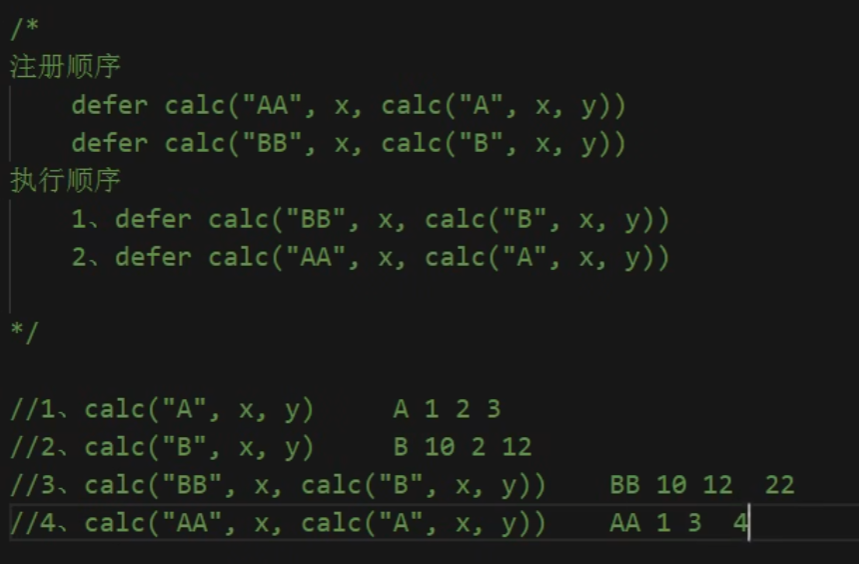


#### 小结

1. defer注册函数时，同步执行代码，这时候就需要确定函数参数值
2. defer注册的函数**执行的时机**在 return 赋值后，ret 返回前

### panic/recover

Go语言中目前(Go1.12)是没有异常机制，但是使用panic/recover模式来处理错误。panic可以在任何地方引发，**但recover只有在defer调用的函数中有效**。

```go
func main() {
	defer func() {
		err := recover()
		if err != nil {
			fmt.Printf("err:%v", err)
		}
	}()
	panic("抛出一个异常")
}
```

## time包与日期函数

```go
func main() {
	uTime := time.Now()
	fmt.Printf("uTime:%v\n", uTime)
	year := uTime.Year()
	month := uTime.Month()
	day := uTime.Day()
	hour := uTime.Hour()
	minutes := uTime.Minute()
	second := uTime.Second()
	fmt.Printf("%d-%02d-%02d %02d:%02d:%02d\n", year, month, day, hour, minutes, second)
}
```

### 日期格式化

```go
func main() {
	uTime := time.Now()
	/*
		使用Go的诞生时间2006年1月2号15点84分（记忆口诀为2006 1 2 3 4 5）
		2006 年
		01 月
		02 日
		03 时 12小时制	+ 12 = 15 24小时制
		04 分
		05 秒
	*/
	// 模板格式化输出 12小时制
	formatTime := uTime.Format("2006-01-02 03:04:05")
	fmt.Printf("模板格式化输出 12小时制：%v\n", formatTime)

	// 模板格式化输出 24小时制
	formatTime = uTime.Format("2006-01-02 15:04:05")
	fmt.Printf("模板格式化输出 24小时制：%v\n", formatTime)
}
```

### 常用方法

1. 获取当前时间
2. 获取时间戳
3. 获取纳秒时间戳
4. 时间戳格式化
5. 纳秒时间戳格式化
6. 日期字符串转时间戳

```go
func main() {
	// 获取当前时间
	uTime := time.Now()
	fmt.Printf("获取当前时间：%v\n", uTime)
	/*
	   时间戳是自1970年1月1日(08：00：00GMT)至当前时间的总毫秒数。它也被称为Uniⅸ时
	   间戳(UnixTimestamp)
	*/
	//获取时间戳
	uTimestamp := uTime.Unix()
	fmt.Printf("获取时间戳：%v\n", uTimestamp)
	//获取纳秒时间戳
	uNaTimestamp := uTime.UnixNano()
	fmt.Printf("获取纳秒时间戳：%v\n", uNaTimestamp)
    
	//时间戳格式化
	nowTime := time.Unix(int64(uTimestamp), 0)
	nowTimeFormat := nowTime.Format("2006-01-02 15:04:05")
	fmt.Printf("时间戳格式化：%v\n", nowTimeFormat)
	//纳秒时间戳格式化
	nowNaTime := time.Unix(0, int64(uNaTimestamp))
	nowNaTimeFormat := nowNaTime.Format("2006-01-02 15:04:05")
	fmt.Printf("纳秒时间戳格式化：%v\n", nowNaTimeFormat)

	// 日期字符串转时间戳
	timeStr := "2022-12-12 21:16:59"
	patternFormat := "2006-01-02 15:04:05"
	uTimestamp2, ok := time.ParseInLocation(patternFormat, timeStr, time.Local)
	if ok == nil {
		fmt.Printf("日期字符串转时间戳：%v\n", uTimestamp2.Unix())
	}
}
```

### 时间间隔

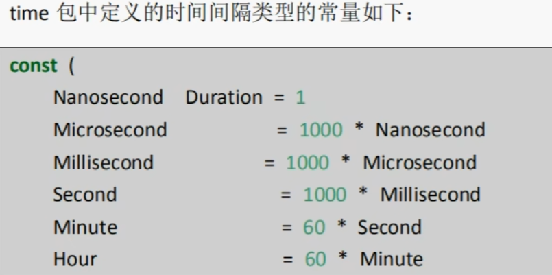


### 时间操作函数

对时间进行加减乘除

```go
func main(){
    // 获取当前时间
	uTime := time.Now()
	fmt.Printf("获取当前时间：%v\n", uTime)
    //加时间
	uTime = uTime.Add(time.Hour)
	fmt.Printf("一小时后：%v\n", uTime)
    //减时间
	uTime = uTime.Sub(time.Hour)
    //加时间
	uTime = uTime.Add(time.Hour)
    //时间对比
	uTime = uTime.Equal(time.Hour)
}
```


### 定时器

```go
func main() {
	ticker := time.NewTicker(time.Second)
	i := 0
	// 这里range循环只有一个value
	for task := range ticker.C {
		fmt.Printf("定时器执行%v\n", task)
		i++
		if i == 5 {
			// 取消定时器
			ticker.Stop()
			break
		}
	}
    
    for{
        time.Sleep(time.Second)
        fmt.Println("休眠定时器")
    }
}
```

### 日期语法练习

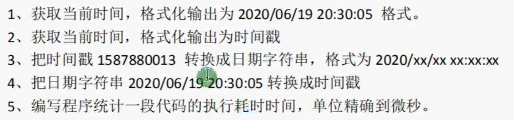

### 小结

1. 日期类的转换，都先把字符串或者数字 使用 time 方法转成 time.Time 类型，然后调用 time 方法进行互相转换


## 指针

指针也是一个变量，但它是一种特殊的变量，它存储的数据不是一个普通的值，而是另一个变量的内存地址。

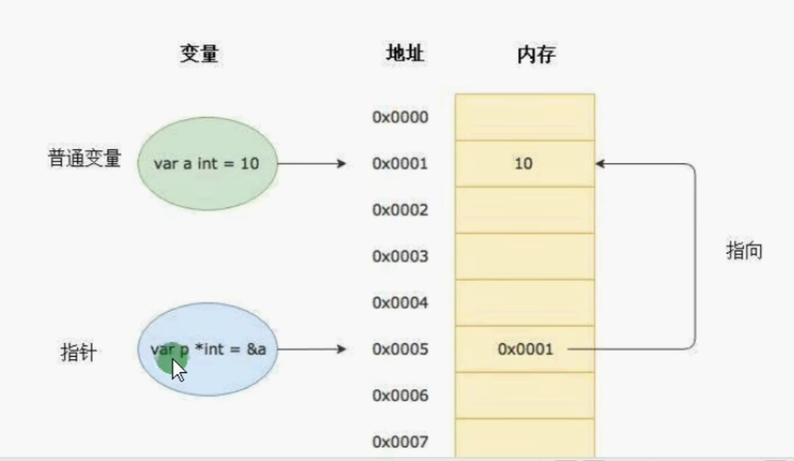

要搞明白G0语言中的指针需要先知道3个概念：指针地址、指针类型和指针取值G0语言中的指针操作非常简单，我们只需要记住两个符号：**&（取地址）和*（取指针变量对应的值)**

```go
func main(){
   	var i *int
	num := 10
	i = &num
	fmt.Println("&i:", &i) //0xc00000a038
	fmt.Println("*i:", *i) //10
}
```


### 指针地址与类型

每个变量在运行时都拥有一个地址，这个地址代表变量在内存中的位置。G0语言中使用&字符放在变量前面对变量进行取地址操作。Go语言中的值类型(int、float、bool、string、array、struct)都有对应的指针类型，如：\*int  \*int64、\*string等。

```go
func main(){
    b := 10
    ptr := &b
    fmt.Printf("ptr的值：%v,ptr的指针值:%v",ptr,*ptr)
    *ptr = 20
    fmt.Printf("改变后的ptr的值：%v,ptr的指针值:%v",ptr,*ptr)
}
/*
b：代表被取地址的变量，类型为T
ptr:用于接收地址的变量，ptr的类型就为*T,称做T的指针类型。*代表指针。
*/
```

### new与make

1. 二者都是用来做内存分配的。
2. make只用于**slice、map以及channel**的初始化，返回的还是这三个引用类型本身
3. 而new用于**类型的内存分配**，并且内存对应的值为类型零值，返回的是指向**类型的指针**。


## 结构体 struct

**值类型**

使用type和struct关键字来定义结构体。

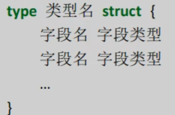

```go
type User struct {
	Name string
	Age  uint8
}

func main() {
    //实例化方式一
	var user User
	user.Age = 12
	user.Name = "曹瑾昆"
	fmt.Printf("user:%v,类型：%T\n", user, user)
    //实例化方式二
	user1 := User{
		Name: "张三",
		Age:  23,
	}
	fmt.Printf("user1：%v,类型：%T\n", user1, user1)
    //实例化方式三
	user2 := new(User)
	user2.Age = 24
	user2.Name = "里斯"
	fmt.Printf("user2:%v，类型：%T\n", user2, user2)
    //实例化方式四
	user3 := &User{}
	user3.Age = 25
	user3.Name = "乌桑五"
	fmt.Printf("user3:%v，类型：%T\n", user3, user3)
    //实例化方式五
	user4 := &User{
		Name: "张三",
		Age:  23,
	}
	fmt.Printf("user4：%v,类型：%T\n", user4, user4)
    //实例化方式六
	user5 := &User{
		Name: "张三",
	}
	fmt.Printf("user5：%v,类型：%T\n", user5, user5)
    //实例化方式七
	// 初始化结构体的时候可以简写，也就是初始化的时候不写键，直接写值，但是要保证值的顺序与类型声明时的顺序一致
	user6 := &User{
		"张三",
		12,
	}
	fmt.Printf("user6：%v,类型：%T\n", user6, user6)
}
```

注意：在Golang中支持对结构体指针直接使用 . 来访问结构体的成员。user.name="张三" 其实在底层是 (*user).name="张三"

### 结构体方法和接收者

在Go语言中，没有类的概念但是可以给类型（结构体，自定义类型）定义方法。所谓方法就是定义了接收者的函数。接收者的概念就类似于其他语言中的this或者self。

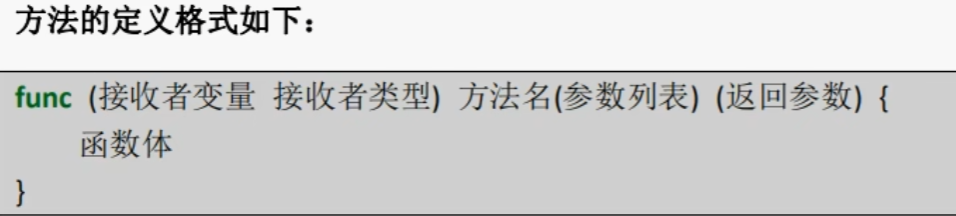

```go
type User struct {
	Name string
	Age  uint8
}

func (u User) Print() {
	fmt.Println(u.Name, "今年", u.Age, "岁")
}
// 传入指针类型，可以修改结构体数据
func (u *User) SetName(name string) {
	u.Name = name
}
func main() {
	user := User{
		Name: "漳卅",
		Age:  24,
	}
	user.Print()
	user.SetName("里斯")
	user.Print()
}
```

### 结构体嵌套

结构体的字段类型可以是：基本数据类型、也可以是切片、Map以及结构体
如果结构体的字段类型是：指针，slice,和map的零值都是ni1,即还没有分配空间
如果需要使用这样的字段，需要先make,才能使用

```go
type User struct {
	Name  string
	Age   uint8
	Hobby []string
	prop  map[string]string
}

func main() {
	user := &User{}
	user.Name = "张三"
	user.Age = 25
	user.prop = make(map[string]string)
	user.prop["weight"] = "180kg"
	user.Hobby = make([]string, 5)
	fmt.Printf("user:%v,类型：%T\n", user, user)
}
```

#### 匿名字段与匿名嵌套结构体

结构体允许其成员字段在声明时没有字段名而只有类型，这种没有名字的字段就称为匿名字段
匿名字段默认采用类型名作为字段名，结构体要求字段名称必须唯一，因此一个结构体中同种类型的匿名字段则会报错

```go
type User struct {
	Name string
	Age  uint8
	// 匿名属性
	Address
}
type Address struct {
	AddressName string
}

func main() {
	user := &User{}
	user.Name = "张三"
	user.Age = 25
	// 当访问结构体成员时会先在结构体中查找该字段，找不到再去匿名结构体中查找
	user.AddressName = "东程"
	fmt.Printf("user.Address.Name:%v\n", user.Address)
	fmt.Printf("user:%v,类型：%T\n", user, user)
}
```


### 结构体继承

结构体的继承是通过结构体嵌套完成的

```go
type Person struct {
	Name  string
	Age   uint8
	Phone uint32
}

func (p *Person) say() {
	fmt.Printf("%v在说话\n", p.Name)
}

type Teacher struct {
	Person
}
type Student struct {
	Person
}

func main() {

	teacher := &Teacher{}
	teacher.Name = "顾超"
	teacher.say()
	stud := &Student{}
	stud.Name = "韩运昊"
	stud.say()
}

```

## 序列化与反序列化

### JSON序列号与结构体

 JSON序列化是指把结构体数据转化成JSON格式的字符串

反序列化是指把JSON数据转化成Golang中的结构体对象

Golang中的序列化和反序列化主要通过"encoding/json"包

**私有属性不能被 json 包访问**

#### 序列化

```go
type Teacher struct {
	Name  string
	Age   uint8
	Phone uint64
}
func main() {
	teacher := &Teacher{}
	teacher.Name = "顾超"
	teacher.Age = 23
	teacher.Phone = 18752945619
	byteJson, err := json.Marshal(teacher)
	if err != nil {
		fmt.Printf("json转换错误：%v\n", err)
	}
	fmt.Printf("strJson:%v\n", string(byteJson)) //{"Name":"顾超","Age":23,"Phone":18752945619}
}
```

#### 反序列化

```go
type Teacher struct {
    Name  string
    Age   uint8
    Phone uint64
}
func main() {
    str := `{"Name":"顾超","Age":23,"Phone":18752945619}`
    var teach Teacher
    json.Unmarshal([]byte(str), &teach)
    fmt.Printf("反序列化：%v\n", teach)
    fmt.Printf("name:%v\n", teach.Name)
}
```

### 结构体Tag

Tag是结构体的元信息，可以在运行的时候通过反射的机制读取出来。Tag在结构体字段的后方定义，由一对反引号包裹起来，具体的格式如下：

key1:"value1"key2:"value2"

结构体tg由一个或多个键值对组成。键与值使用冒号分隔，值用双引号括起来。同一个结构体字段可以设置多个键值对tag,不同的键值对之间使用空格分隔。

注意事项：为结构体编写Tg时，必须严格遵守键值对的规则。结构体标签的解析代码的容错能力很差，一旦格式写错，编译和运行时都不会提示任何错误，通过反

射也无法正确取值。例如不要在key和value之间添加空格。

```go
type Teacher struct {
	Name  string `json:"name"`
	Age   uint8  `json:"age"`
	Phone uint64 `json:"phone"`
}

func main() {
	teacher := &Teacher{}
	teacher.Name = "顾超"
	teacher.Age = 23
	teacher.Phone = 18752945619
	byteJson, err := json.Marshal(teacher)
	if err != nil {
		fmt.Printf("json转换错误：%v\n", err)
	}
	fmt.Printf("strJson:%v\n", string(byteJson)) //{"Name":"顾超","Age":23,"Phone":18752945619}
}
```

## package分包

Golang中的包可以分为三种：

1. 系统内置包
   1. 系统内置包：Golang语言给我们提供的内置包，引入后可以直接使用，
   2. 如fmt、strconv、strings、sort、errors、time、encoding/json、os、io等。
2. 自定义包
   1. 自定义包：开发者自己写的包
3. 第三方包
   1. 第三方包：属于自定义包的一种，需要下载安装到本地后才可以使用，
   1. 如前面给大家介绍的"github.com/shopspring/decimal"包解决float精度丢失问题

### 初始化项目

```bash
#生成一个 go.mod文件，用来管理项目依赖
go mod init demo
```

### 自定义包

同一个文件夹下文件属于同一个包，他们的包名相同，如果需要引入自定义的包的方法，只需要在 go.mod 文件中，找到 module 关键字声明的字段，以它为根路径，拼接上包名即可

```go
//导入demo包下的Tdemo方法
package main //包名

import (
	"hello-golang/demo"
    _ "hello-golang/demo2"//匿名引入包
)//导入自定义包

func main() {
	demo.Tdemo()//自定义包方法
}
```

**注意：**

1. 一个文件夹下面直接包含的文件只能归属一个package,同样一个package的文件不能在多个文件夹下。
2. 包名可以不和文件夹的名字一样，包名不能包含   **—**   符号。
3. 包名为mai的包为应用程序的入口包，这种包编译后会得到一个可执行文件，而编译不包含main包的源代码则不会得到可执行文件。


### init函数

单个包执行顺序

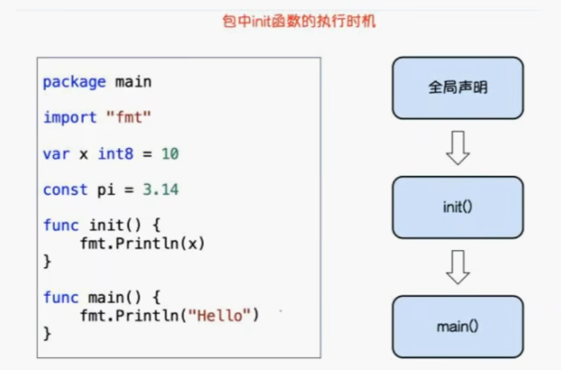

多个包 init 函数执行顺序，先引入后执行，最后引入的先执行

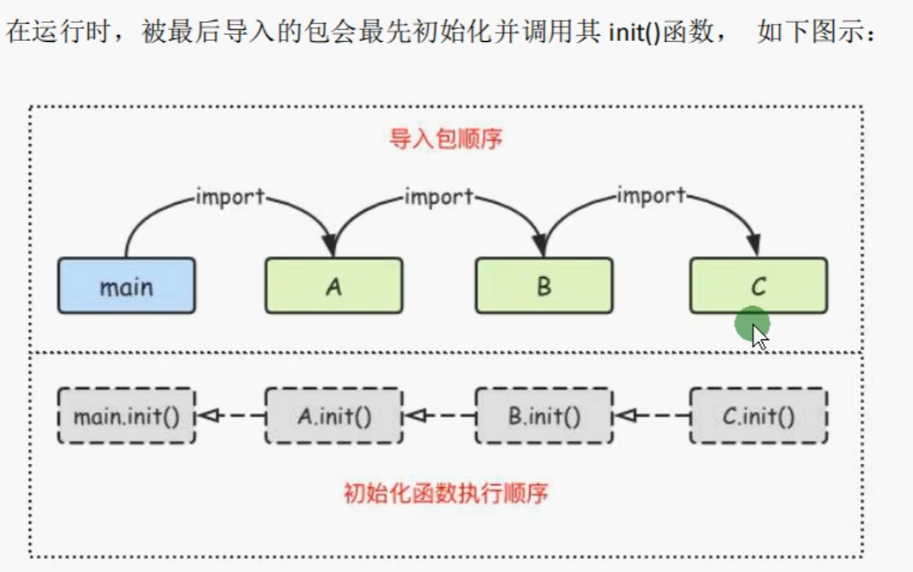


### 第三方包使用

在 [Go Packages](https://pkg.go.dev/) 查找看常见的golang第三方包

#### 安装

1. 第一种方法：go get 包名称（全局）

   ```bash
   go get github.com/shopspring/decimal
   ```

2. 第二种方法：go mod download （全局）

   ```go
   import "未下载的包名"
   ```

   ```bash
   # 执行 go mod download，将未下载的已使用的包下载下来
   go mod download
   ```

3. 第三种方法：go mod vendor（当前项目）

   ```go
   import "未下载的包名"
   ```

   ```bash
   # 执行 go mod vendor，将未下载的已使用的包下载到本地来
   go mod vendor
   ```

4. 第四种方法：在网络畅通的情况下，引入包可以直接使用，他会自动下载包

### go mod命令

```bash
# 下载依赖的module到本地cache
go mod download

# 编辑go.mod文件
go mod edit

# 打印模块依赖图
go mod graph

# 再当前文件夹下初始化一个新的 module,创建go.mod文件
go mod init

# 增加丢失的module,去掉未用的 module
go mod tidy

# 将依赖复制到vendor下
go mod vendor

# 校验依赖检查下载的第三方库有没有本地修改，如果有修改则返回非 0，否则校验成功
go mod verify
```


## 接口

在Golang中接口是一种类型，**一种抽象的类型**。接口是一组函数 method 的集合，Golang中的接口不能包含任何变量。

Golang中的接口也是一种数据类型，不需要显示实现。只需要一个变量含有接口类型中的所有方法，那么这个变量就实现了这个接口。

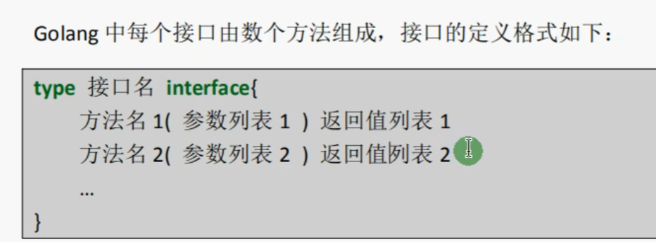

```go
package main

import "fmt"

type Usb interface {
	charge()
}
type Phone struct {
	Name string
}

func (p Phone) charge() {
	fmt.Println(p.Name, "充电")
}
func main() {
	xm := Phone{
		Name: "小米12",
	}
	var useb Usb = xm
	useb.charge()
}
```

### 空接口

空接口就是任意类型

```go
import "fmt"

type A interface{} //空类型，表示任意类型，就像js中的变量类型一样

func main() {
	var anyObj A
	anyObj = "我是字符串"
	fmt.Printf("anyObj值：%v,类型：%T\n", anyObj, anyObj)
	anyObj = true
	fmt.Printf("anyObj值：%v,类型：%T\n", anyObj, anyObj)
	anyObj = 123
	fmt.Printf("anyObj值：%v,类型：%T\n", anyObj, anyObj)
}

```

#### 用例

```go 
type Person struct {
	Name string
}

func (p Person) say(anyObj interface{}) {
	fmt.Println(p.Name, anyObj)
}
func main() {
		// 1.作为函数参数
	p := Person{
		Name: "张三",
	}
	p.say("我今年24岁了")

	// 2.作为 map 的类型
	uMap := map[string]interface{}{
		"姓名": "张三",
		"年龄": 24,
		"身高": 174,
	}
	fmt.Printf("uMap:%v\n", uMap)

	// 3. 切片类型
	uSlice := []interface{}{1, 2, 3, "hello", "world"}
	fmt.Printf("uSlice:%v\n", uSlice...)
}
```


### 类型断言

语法格式

```go
x.(T)
```

X：表示类型为interface}的变量
T：表示断言×可能是的类型。

该语法返回两个参数，第一个参数是×转化为T类型后的变量，第二个值是一个布尔值，若为true则表示断言成功，为false则表示断言失败。

```go
func main() {
	var anyObj interface{} = "hello assert"
	v, ok := anyObj.(string)
	if ok {
		fmt.Printf("断言成功：%v,类型：%T", v, v)
	} else {
		println("断言失败")
	}
}
```

**注意：类型.(type)**，判断类型，只能结合switch语句使用

```go
func test(anyObj interface{}) {
	switch anyObj.(type) { //特殊语法，仅限switch使用
	case string:
		fmt.Println("string类型")
	case int:
		fmt.Println("int类型")
	default:
		fmt.Println("类型错误")
	}
}
```

### 空接口与类型断言补充

```go
type User struct {
	Name string
	Age  uint8
}

func main() {
	uMap := map[string]interface{}{
		"hobby": []string{"游泳", "唱歌"},
		"name":  "张三",
		"frends": User{
			Name: "里斯",
			Age:  13,
		},
	}
	fmt.Printf("uMap：%v\n", uMap)
	// fmt.Printf("uMap的朋友姓名：%v\n", uMap["frends"].Name) //报错：uMap["frends"].Name undefined (type interface{} has no field or method Name)
	// fmt.Printf("uMap的兴趣爱好：%v\n", uMap["hobby"][1]) //报错：cannot index uMap["hobby"] (map index expression of type interface{})
	// 正确取值方法：配置断言使用
	frends, ok := uMap["frends"].(User)
	if ok {
		fmt.Printf("朋友的姓名：%v\n", frends.Name)
	}
	hobby2, ok2 := uMap["hobby"].([]string)
	if ok2 {
		fmt.Printf("第二个兴趣爱好：%v\n", hobby2[1])
	}
}
```


### 结构体值接收者与指针接收者实现接口的区别

#### 值接收者

如果结构体中的方法是值接收者，那么实例化后的结构体值类型和结构体指针类型都可以赋值给接口变量

```go
type Person struct {
	Name string
}

func (p Person) stop() { //值接收者
	fmt.Printf("%v停止了\n", p.Name)
}
func (p Person) start() { //值接收者
	fmt.Printf("%v开始了\n", p.Name)
}

type Usb interface {
    start()
	stop()
}

func main() {
	var p1 = Person{
		Name: "张三",
	}
	var p2 = &Person{
		Name: "里斯",
	}

	var usb1 Usb = &p1
	var usb2 Usb = p2
	usb1.start()
	usb2.stop()
}
```


#### 指针类型接收者

如果结构体中的方法是指针接收者，那么实例化后的结构体指针类型可以被赋值给接口变量，结构体值类型没法赋值给接口变量

```go
type Person struct {
	Name string
}

func (p *Person) say() { //指针接收者
	fmt.Printf("%v说话了\n", p.Name)
}

type Do interface {
	say()
}

func main() {
	var p1 = Person{
		Name: "张三",
	}
	var p2 = &Person{
		Name: "里斯",
	}
    testDo(p1)//执行报错：Person does not implement Do (method say has pointer receiver)
    testDo(p2)//执行正确：里斯说话了
}
func testDo(do Do){
    do.stop()
}
```

### 接口嵌套

```go
type Ainterface interface {
	stop()
}
type Binterface interface {
	start()
}
type NestInterface interface {
	Ainterface
	Binterface
}
type Person struct {
	Name string
}

func (p Person) stop() {
	fmt.Printf("%v停止了\n", p.Name)
}
func (p Person) start() {
	fmt.Printf("%v开始了\n", p.Name)
}

func main() {
	var p1 = Person{
		Name: "张三",
	}

	var nest NestInterface = p1
	nest.start()
}

```


### 小结

1. 接口是一种抽象的**数据类型**
2. 接口是一组方法的集合
3. 只要实现了接口内部的所有方法，即实现了接口
4. 空接口与类型断言结合使用，解决空接口无类型访问问题
5. **指针类型接收者**只接收指针类型数据，**值类型接收者**即接收值类型，也接受指针类型

## 协程goroutine

**并发：**多个线程同时竞争一个位置，竞争到的才可以执行，每一个时间段只有一个线程在执
行。
**并行：**多个线程可以同时执行，每一个时间段，可以有多个线程同时执行。


**协程：**可以理解为用户级线程，这是对内核透明的，也就是系统并不知道有协程的存在，是
完全由用户自己的程序进行调度的。Golang的一大特色就是从语言层面原生支持协程，在
函数或者方法前面加go关键字就可创建一个协程。可以说Golang中的协程就是goroutine

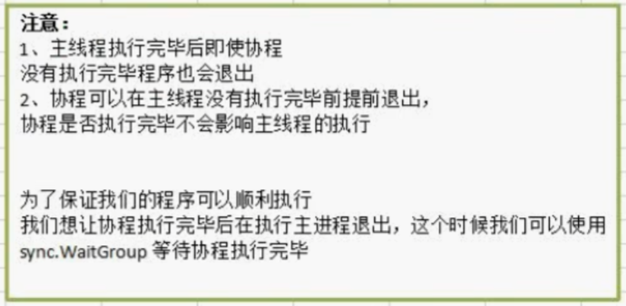

### 线程等待

```go
var wg sync.WaitGroup

func test() {
	for i := 0; i < 10; i++ {
		fmt.Printf("test()--%v\n", i)
		time.Sleep(time.Millisecond * 50)
	}
	wg.Done()
}
func main() {
	wg.Add(1)
	go test()
	for i := 0; i < 10; i++ {
		fmt.Printf("main--%v\n", i)
		time.Sleep(time.Millisecond * 20)
	}
	wg.Wait()
}
```

### 设置计算机CPU使用个数

```go
// 获取电脑cpu数量
cpuNums := runtime.NumCPU()
// 设置使用CPU个数
runtime.GOMAXPROCS(cpuNums)
```


## 管道channel

管道是Go语言在语言级别上提供的goroutine间的通讯方式，我们可以使用channel在多个goroutine之间传递消息。如果说goroutine是Go程序并发的执行体，

channel就是它们之间的连接。channel是可以让一个goroutine发送特定值到另一个goroutine的通信机制。Go语言的并发模型是CSP(Communicating 

Sequential Processes),提倡通过通信共享内存而不是通过共享内存而实现通信。Go语言中的管道(channel)是一种特殊的类型。管道像一个传送带或者队列，总是

遵循先入先出(First In First Out.)的规则，保证收发数据的顺序。每一个管道都是一个具体类型的导管，也就是声明channel的时候需要为其指定元素类型。


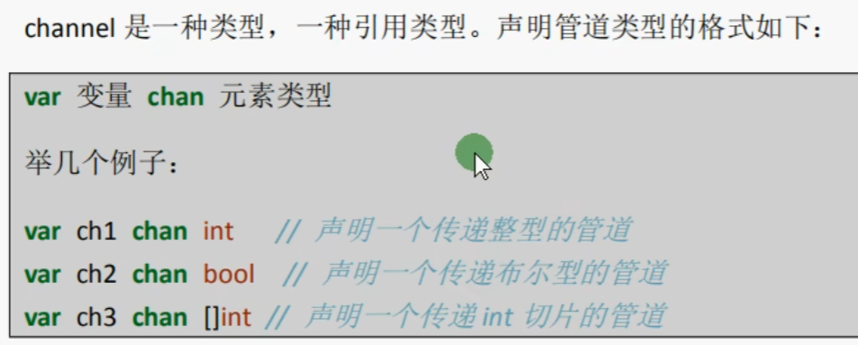


### 管道操作

```go
// 创建管道
ch := make(chan int, 3) //管道类型，容量
ch <- 10                //管道赋值
ch <- 20
ch <- 30
a := <-ch //管道发送数据
b := <-ch
c := <-ch
fmt.Printf("a:%v\n", a)
fmt.Printf("b:%v\n", b)
fmt.Printf("c:%v\n", c)
```

### 管道阻塞

```go
ch := make(chan int, 1)
ch <- 1
ch <- 2 //管道阻塞
```

#### 死锁

在没有使用协程的情况下 

1. 当管道内已经存满了值后，再往管道里存值就会出现死锁
2. 当管理内值都已经取完后，再取值也会出现死锁
3. 死锁是一种等待的状态


### 管道循环与关闭

```go
ch := make(chan int, 10)
for i := 0; i < 10; i++ {
    ch <- i
}
close(ch)           //使用 for range 遍历通道，当通道被关闭的时候就会退出 for range，如果没有关闭管道就会死锁
for v := range ch { //这里也没有ok
    fmt.Printf("管道取值：%v\n", v)
}

ch := make(chan int, 10)
for i := 0; i < 10; i++ {
    ch <- i
}
// 使用for循环遍历管道的时候可以不关闭管道
for i := 0; i < 10; i++ {
    v := <-ch
    fmt.Printf("管道取值：%v\n", v)
}
```


### channel结合goroutine

管道是安全的（死锁，等待取值），在协程中，如果管道取不到值会一直等待取值，直到取到值为止

```go
package main

import (
	"fmt"
	"sync"
	"time"
)

func readChan(ch chan int) {
	for i := 0; i < 10; i++ {
		v := <-ch
		fmt.Printf("【读取】管道值：%v\n", v)
		time.Sleep(time.Millisecond * 500)
	}
	wg.Done()
}
func writeChan(ch chan int) {
	for i := 0; i < 10; i++ {
		ch <- i
		fmt.Printf("【写入】管道值：%v\n", i)
		time.Sleep(time.Millisecond * 50)
	}
	close(ch)
	wg.Done()
}

var wg sync.WaitGroup

func main() {
	wg.Add(2)
	ch := make(chan int, 10)
	go readChan(ch)
	go writeChan(ch)
	wg.Wait()
	fmt.Printf("退出程序。。。")
}

```

#### 计算质数

```go
package main

import (
	"fmt"
	"sync"
	"time"
)

// 初始化数量
func initInputChan(inputChan chan int) {
	for i := 2; i < 120000; i++ {
		inputChan <- i
	}
	close(inputChan)
	wg.Done()
}

// 计算质数
func calcPrintChan(inputChan, printChan chan int, calcChan chan bool) {
	for v := range inputChan {
		flag := false
		for i := 2; i < v; i++ {
			if v%i == 0 {
				flag = false
				break
			} else {
				flag = true
			}
		}
		if flag {
			printChan <- v
		}
	}
	calcChan <- true
	wg.Done()
}

// 打印质数
func printNumsChan(printChan chan int) {
	for i := 2; i < 120000; i++ {
		<-printChan
	}
	wg.Done()
}

// 等待关闭通道
func waitClose(calcChan chan bool, printChan chan int) {
	for i := 0; i < 16; i++ {
		<-calcChan
	}
	close(printChan)
	wg.Done()
}

var wg sync.WaitGroup

// 计算质数
func main() {
	printChan := make(chan int, 100)
	inputChan := make(chan int, 100)
	calcChan := make(chan bool, 1)
	start := startTime()
	wg.Add(1)
	go initInputChan(inputChan)
	for i := 0; i < 16; i++ {
		wg.Add(1)
		go calcPrintChan(inputChan, printChan, calcChan)
	}
	wg.Add(1)
	go printNumsChan(printChan)
	wg.Add(1)
	go waitClose(calcChan, printChan)
	wg.Wait()
	endTime(start)
	fmt.Println("计算完成，退出。。。")
}
func startTime() int64 {
	return time.Now().UnixMilli()
}
func endTime(startTime int64) {
	fmt.Println("程序运行时间：", time.Now().UnixMilli()-startTime, "毫秒")
}
```

### 单向管道

多数用于定义参数类型

有的时候我们会将管道作为参数在多个任务函数间传递，很多时候我们在不同的任务函数中使用管道都会对其进行限制，比如限制管道在函数中只能发送或只能接收。

在默认情况下下，管道是双向的

```go
func main(){
    //声明只读管道
    var ch <- chan int//将箭头放置在变量与chan关键字之间为只读
    //或者以下
    ch := make(<- chan int,10)
    
    
    //声明只写管道
    var ch chan <- int//将箭头放置在chan关键字与类型之间为只写
    //或者以下
    ch := make(chan <- int,10)
    
}
//只读取管道
func readChan(ch <- chan int){
    ...
}
//只写入管道
func writeChan(ch chan <- int){
    ...
}
```


### 管道复用select

select的使用类似于switch语句，它有一系列case分支和一个默认的分支。每个case会对应一个管道的通信（接收或发送）过程。select会一直等待，直到某个case的通信操作完成时，就会执行case分支对应的语句。具体格式如下：

```go
func main() {
	intChan := make(chan int, 10)
	stringChan := make(chan string, 10)
	for i := 0; i < 10; i++ {
		intChan <- i
		stringChan <- "hello" + strconv.FormatInt(int64(i), 10)
	}
    //select要结合for循环使用
	for {
		select {
		case i := <-intChan:
			fmt.Println(i)
		case v := <-stringChan:
			fmt.Println(v)
		default:
			return
		}
	}
}
```


### 互斥锁

读写都上锁，调用 sync.Mutex 包

```go
var wg sync.WaitGroup
var metx sync.Mutex
var count = 0

func test() {
	metx.Lock()
	count++
	fmt.Println("count:", count)
	wg.Done()
	metx.Unlock()
}

func main() {
	for i := 0; i < 20; i++ {
		wg.Add(1)
		go test()
	}
	wg.Wait()
}

```


### 读写互斥锁

读写锁可以让多个读操作并发，同时读取，但是对于写操作是完全互斥的。也就是说，当一
个goroutine进行写操作的时候，其他goroutine既不能进行读操作，也不能进行写操作。

```go
var wg sync.WaitGroup
var rwMutex sync.RWMutex

func read() {
	// 读互斥锁
	rwMutex.RLock()
	fmt.Println("执行了读操作")
	time.Sleep(time.Second * 2)
	rwMutex.RUnlock()
	wg.Done()
}
func write() {
	// 写互斥锁
	rwMutex.Lock()
	fmt.Println("---执行了写操作")
	time.Sleep(time.Second * 2)
	rwMutex.Unlock()
	wg.Done()
}
func main() {
	for i := 0; i < 20; i++ {
		wg.Add(1)
		go write()
		wg.Add(1)
		go read()
	}
	wg.Wait()
}
```


### 小结

1. 管道是一种引用类型
2. 管道在接收数据时，如果没有数据可以接收将会发生阻塞。
3. 使用**for range**遍历管道时，记得遍历前关闭管道
4. 单项管道多数使用于函数参数定义
5. 多路复用select
   1. 同时从多个管道获取数据时，可以使用**select**搭配**for**循环
   2. select每次会随机从一个case中获取数据并执行对应代码
   3. 复用select时，不能关闭管道


## 反射

Go语言中的变量分为两部分

1. 类型信息：预先定义好的元信息。
2. 值信息：程序运行过程中可动态变化的。

在G0语言的反射机制中，任何接口值都由是一个 **具体类型** 和 **具体类型的值** 两部分组成的。在Go语言中反射的相关功能由内置的reflect包提供，任意接口值在反

射中都可以理解为由 **reflect.Type** 和 **reflect.Value** 两部分组成，并且reflect包提供了 **reflect..TypeOf** 种 **reflect..ValueOf** 两个重要函数来获取任意对象的Value和Type。

### reflect.TypeOf 获取任意值的类型对象

```go
package main

import (
	"fmt"
	"reflect"
)

func getType(x interface{}) {
	v := reflect.TypeOf(x)
	fmt.Printf("%v的类型：%v\n", x, v)
	fmt.Println("--------")
}
func main() {
	a := 1
	b := 3.14
	c := true
	d := "hello"
	getType(a)
	getType(b)
	getType(c)
	getType(d)
	getType(&d)
}
```

#### Type 和 Kind

在反射中关于类型还划分为两种：类型(Type)和种类(Kind)。因为在Go语言中我们可以使用type关键字构造很多自定义类型，而种类(Kind)就是指**底层的类型**，但

在反射中，当需要区分指针、结构体等大品种的类型时，就会用到种类(Kind)。举个例子，我们定义了两个指针类型和两个结构体类型，通过反射查看它们的类型

和种类。

```go
package main

import (
	"fmt"
	"reflect"
)

type Person struct {
	Name string
	Age  uint8
}
type myInt int8

func getType(x interface{}) {
	v := reflect.TypeOf(x)
	fmt.Printf("%v的类型：%v\n", x, v)
	fmt.Printf("%v的底层类型（种类）:%v\n", v, v.Kind())
	fmt.Printf("%v的类型名称：%v\n", v, v.Name())
	fmt.Println("--------")
}
func main() {
	e := Person{
		"张三",
		19,
	}
	var f myInt = 10
	getType(e)//底层类型：struct
	getType(f)//底层类型：int8
}
```

### reflect.ValueOf获取值

reflect.ValueOf() 方法获取的值类型是 reflect.Value，可以通过 **.类型()** 来获取原始值

```go
package main

import (
	"fmt"
	"reflect"
)

type Person struct {
	Name string
	Age  uint8
}
type myInt int8

func getValue(x interface{}) {
	v := reflect.ValueOf(x)
	switch v.Kind() {
	case reflect.Int:
		num := v.Int() + 10
		fmt.Printf("int类型，值：%v，与10相加后等于：%v\n", v, num)
	case reflect.Float32:
		f := 3.3 + v.Float()
		fmt.Printf("Float32类型，值：%v，与3.3相加后等于：%v\n", v, f)
	case reflect.Float64:
		f := 3.3 + v.Float()
		fmt.Printf("Float64类型，值：%v，与3.3相加后等于：%v\n", v, f)
	case reflect.Bool:
		fmt.Printf("Bool类型，值：%v\n", v)
	case reflect.String:
		fmt.Printf("String类型，值：%v\n", v)
	case reflect.Pointer:
		fmt.Printf("Pointer类型，值：%v\n", v)
	default:
		fmt.Println("没有该类型")
	}

}
func main() {
	a := 1
	b := 3.14
	c := true
	d := "hello"
	e := Person{
		"张三",
		19,
	}
	var f myInt = 10
	getValue(a)
	getValue(b)
	getValue(c)
	getValue(d)
	getValue(&d)
	getValue(e)
	getValue(f)
}
```

#### 设置值

给基础类型属性设置值（非引用类型），需要传入变量地址，反射中使用 **Elem()** 方法获取指针变量的**原始类型与值**

Elem() 方法仅当传入的是指针类型才能使用，可以通过 v.Kind() == reflect.Ptr 来判断是否是指针类型

```go
func setValueByReflect(x interface{}) {
	v := reflect.ValueOf(x)
	fmt.Printf("v.Kind：%v，%T\n", v.Kind(), v.Kind())
	fmt.Printf("v.Elem：%v，%T\n", v.Elem(), v.Elem())
	if v.Elem().Kind() == reflect.Int {
		v.Elem().SetInt(128)
	}
}
func main() {
	a := 1
	setValueByReflect(&a)
	fmt.Println("a的值：", a)
}
```

### 结构体反射

任意值通过reflect.TypeOf(0获得反射对象信息后，如果它的类型是结构体，可以通过反射值对象

(reflect..Type)的NumField0和Field0方法获得结构体成员的详细信息。


#### StructField

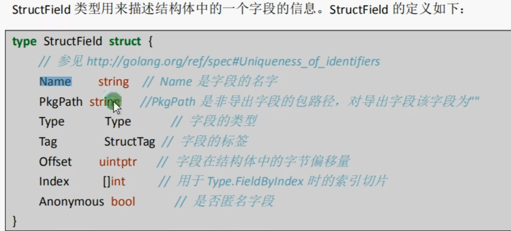

#### 常用方法

##### 获取属性

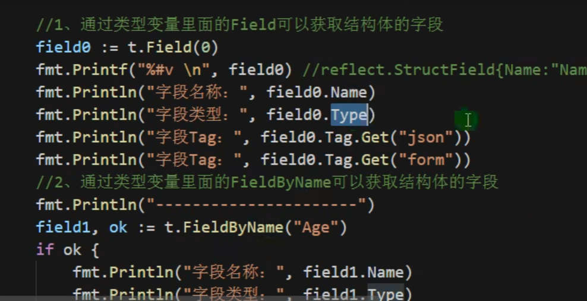

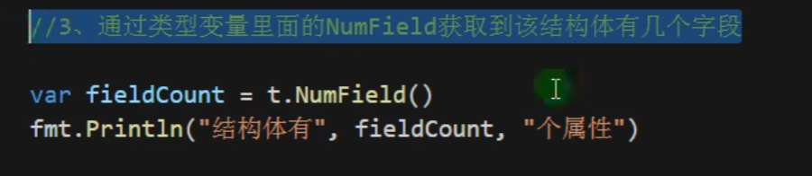

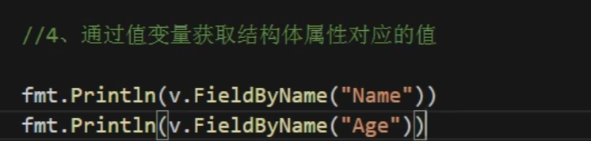

##### 获取方法

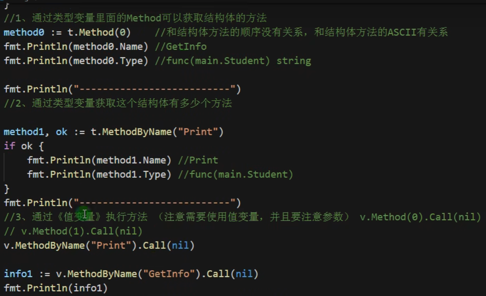

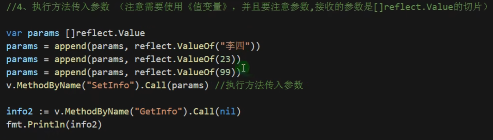


### 小结

1. 可以通过reflect包下的 TypeOf、ValueOf 两个方法去获取任意值的**类型与值**
2. 通过 reflect 包函数获取的变量对象，都包含有 Kind、Name 两个方法，
   1. Kind：获取任意值的底层类型
   2. Name：获取任意值的类型名称


## 文件操作

### 读取文件

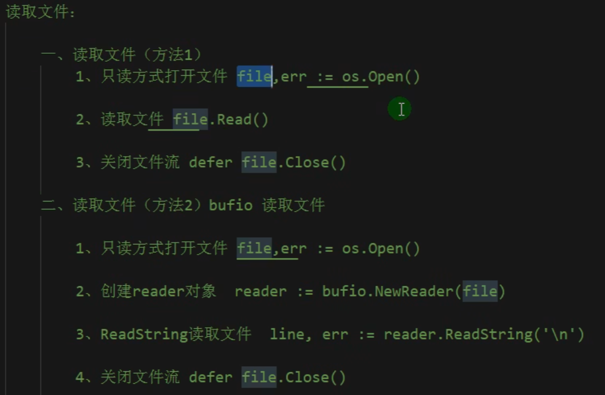

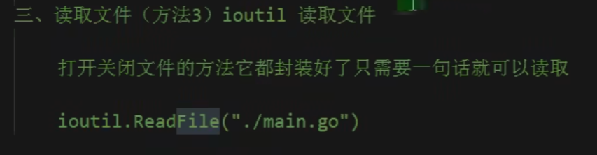

#### os 读取文件

```go
func readFile(path string) {
	file, err := os.Open(path)
	if err != nil {
		fmt.Println("文件异常")
		return
	}
	var readSlice []byte
	fileSlice := make([]byte, 128)
	for {
		num, readErr := file.Read(fileSlice)
		if readErr == io.EOF {
			fmt.Println("文件读取完毕")
			break
		}
		if readErr != nil {
			fmt.Println("文件读取异常:", readErr)
			break
		}
		readSlice = append(readSlice, fileSlice[:num]...)
	}
	defer file.Close()
	fmt.Println("读取的文件：")
	fmt.Println(string(readSlice))
}
func main() {
	path := "E:/workspace/markdown-notes/工作日志/安徽建云/工作日志.md"
	readFile(path)
}
```

#### bufio 读取文件

```go

func readFileBuff(path string) {
	file, err := os.Open(path)
	defer func() {
		err := file.Close()
		if err != nil {
			fmt.Println("文件关闭错误：", err)
		}
	}()
	if err != nil {
		fmt.Println("文件异常")
		return
	}
	var content string
	reader := bufio.NewReader(file)
	for {
		str, readErr := reader.ReadString('\n')
		if readErr == io.EOF {
			content += str // 需要在此处再次拼接内容
			break
		}
		if readErr != nil {
			fmt.Println("文件读取异常：", readErr)
			break
		}
		content += str
	}
	fmt.Println("文件内容：")
	fmt.Println(content)
}
func main() {
	path := "E:/workspace/markdown-notes/工作日志/安徽建云/工作日志.md"
	readFileBuff(path)
}
```

#### ioutil 读取文件

一次读取文件全部内容，自动关闭文件

```go
func readFile3(path string) {
	// 一次性读取文件内容并返回
	bt, err := ioutil.ReadFile(path)
	if err != nil {
		fmt.Println("文件读取异常：", err)
		return
	}
	fmt.Println("读取的文件内容：", string(bt))
}
func main() {
	path := "E:/workspace/markdown-notes/工作日志/安徽建云/工作日志.md"
	readFile3(path)
}
```


### 写入文件

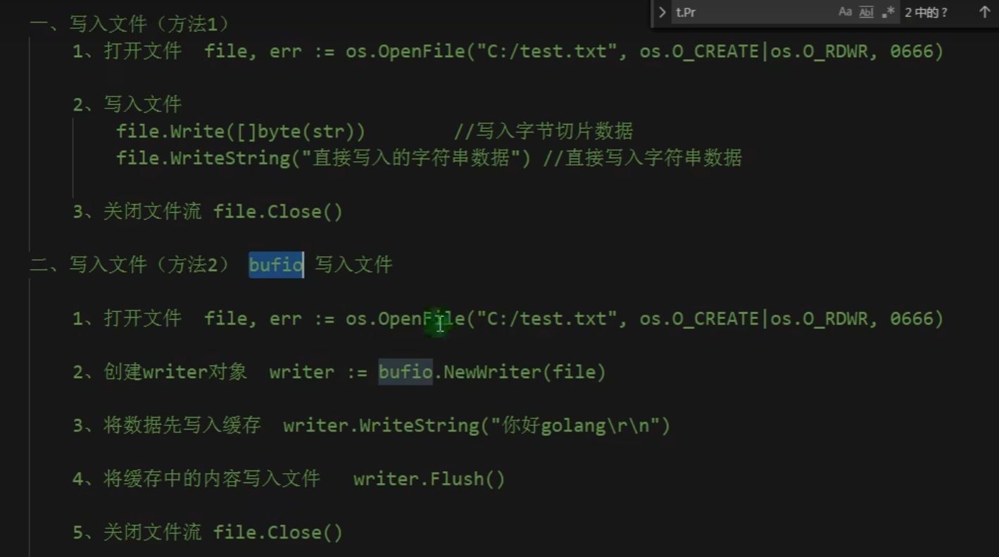

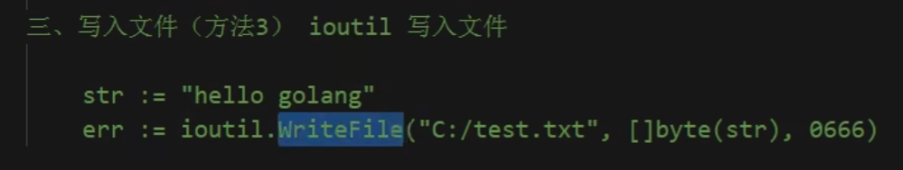

#### 文件操作模式

| 模式        | 含义     |
| ----------- | -------- |
| os.O_WRONLY | 只写     |
| os.O_CREATE | 创建文件 |
| os.O_RDONLY | 只读     |
| os.O_RDWR   | 读写     |
| os.O_TRUNC  | 清空     |
| os.O_APPEND | 追加     |

perm:文件权限，一个八进制数。r (读) 4，w (写) 2，x (执行) 1。

```go
func writeTxt() {
	// 文件创建，文件仅写入，文件内容清空
	file, err := os.OpenFile("E:/test.txt", os.O_CREATE|os.O_WRONLY|os.O_TRUNC, 0666)
	defer func() {
		closeErr := file.Close()
		if closeErr != nil {
			fmt.Println(closeErr)
		}
	}()

	if err != nil {
		fmt.Println(err)
		return
	}
	for i := 0; i < 5; i++ {
		file.WriteString("写入一段话：这是一段废11话\r\n")
	}

}
func main() {
	writeTxt()
}
```


### 文件crud

```go
//创建文件、目录
os.Mkdir("./abc.txt",0666)
//创建多层级目录
os.MkdirAll("./a/b/c",0666)
//删除文件、目录
os.Remove("./abc.txt")
//删除多级目录
os.RemoveAll("./a/b/c")
//文件重命名
os.Rename("需要重命名的文件","重新的命名")
```


### 小结

1. os.Open() 函数打开的文件是**只读状态**

## 内置函数

#### 长度

```go
len(varible)//查询varible变量的长度
```

#### 追加

```go 
slice = append(slice,ele)//将ele追加到slice中
```

## 数据类型默认值

不同类型数据声明未赋值时的默认值

| 数据类型   | 默认值 |
| ---------- | ------ |
| bool       | false  |
| number     | 0      |
| string     | ""     |
| slice      | nil    |
| maps       | nil    |
| channels   | nil    |
| functions  | nil    |
| interfaces | nil    |
|            |        |


## 打印 Print

### 换行打印

```go
func main(){
	fmt.Println("hello world")
}
```

### 格式化打印

```go
func main(){
	const constant = 10
	fmt.Printf("hello %v",constant)
}

//%v 默认格式打印
//%#v 打印数据详细格式
//%T 输入数据类型
//%d 十进制输出
//%o 八进制输出
//%b 二进制输出
//%x 十六进制输出
//%f 输出浮点型，与%v的打印区别在于 %f 会输出6位小数位
//%.2f 输出浮点型，保存两位小数
//%02d 输出十进制，如果输出的数值不够两位数，高位补零，在日期输出时，可以使用
//%c 输出字符，原样输出字符
//%t 输出布尔值
//%p 输出内存地址
```


# 总结

1. go只有类型强转

2. 布尔值不能与其他类型互换（没意义）

3. string与其他类型转换可以通过 Sprintf，或者 strconv 包，进行转换

4. 值类型：改变变量副本值的时候，不会改变变量本身的值
   (基本数据类型、数组、结构体)
   引用类型：改变变量副本值的时候，会改变变量本身的值
   (切片、map)

5. 引用类型必须**初始化分配内存空间**才能使用，初始化通过 make 内置函数创建

   1. ```go
      var num *int
      *num = 123//错误，没有初始化分配内存
      var num2 = new(int)//通过new分配内存空间
      *num2 = 456//正确
      ```

   2. 

6. 函数可以声明返回值变量，声明了返回值变量后，则不必在return 后面追加已声明的返回值变量

7. defer 语句

   1. defer 语句先声明的后执行，后声明的先执行
   2. defer注册的要延迟执行的函数时，该函数的所有参数都需要确定其值

8. Go语言中的return语句并不是原子操作，分两步，

   1. 第一步：对返回值变量（xxx）进行赋值
   2. 第二步：执行RET(return)指令，返回返回值变量（xxx）

   如果有defer语句的存在，则分三步

   1. 第一步：对返回值变量（xxx）进行赋值
   2. 第二步：执行defer语句
   3. 第二步：执行RET(return)指令，返回返回值变量（xxx）

9. 作用域：Go语言中的变量（属性）首字母区分大小写，大写字面代表公有，小写字母代表私有

10. 接口

    1. 是一种抽象的数据类型，是一组方法的集合，只要实现了接口中的所有方法，即实现了接口
    2. 空接口表示任意类型，可以增加编程的类型使用灵活性

11. 

# 练手demo

### 询问demo

```go
package main

import "fmt"

func main() {
	var (
		userName string
		age      uint8
		phone    uint64
		address  string
	)

	fmt.Println("请输入你的姓名")
	fmt.Scan(&userName)
	fmt.Println("请输入你的年龄")
	fmt.Scan(&age)
	fmt.Println("请输入你的手机号码")
	fmt.Scan(&phone)
	fmt.Println("请输入地址")
	fmt.Scan(&address)
	fmt.Printf("姓名：%v，年龄：%v，手机号：%v，地址：%v", userName, age, phone, address)
}
```


### 协程与主程序退出等待

```go 
package main

import (
	"fmt"
	"sync"
	"time"
)

type User struct {
	name string
	age  uint8
}

var wg = sync.WaitGroup{}

func main() {
	var (
		name string
		age  uint8
	)
	fmt.Println("请输入姓名")
	fmt.Scan(&name)
	fmt.Println("请输入年龄")
	fmt.Scan(&age)
	wg.Add(1)
	go createUser(name, uint(age))
	wg.Wait()
}
func createUser(name string, age uint) {
	time.Sleep(2 * time.Second)
	user := User{
		name: name,
		age:  uint8(age),
	}
	fmt.Printf("用户信息：%v\n", user)
	wg.Done()
}
```

 
