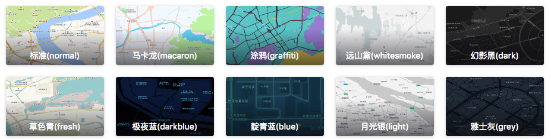

### 地图常用名词与组成

[地图组成&常用名词-入门-教程](https://lbs.amap.com/api/jsapi-v2/guide/abc/components)

### 创建地图常用参数

[全部参数](https://lbs.amap.com/api/jsapi-v2/documentation#map)

```js
var map = new AMap.Map('container',{
    zoom: 10,  //设置地图显示的缩放级别
    center: [116.397428, 39.90923],//设置地图中心点坐标
    layers: [new AMap.TileLayer.Satellite()],  //设置图层,可设置成包含一个或多个图层的数组
    mapStyle: 'amap://styles/whitesmoke',  //设置地图的显示样式
    viewMode: '2D',  //设置地图模式
});
```

### 地图加载完成后立即触发

```js
map.on('complete', function(){
    // 地图图块加载完成后触发
});
// 销毁地图，并清空地图容器
map.destroy( );
```

### 给地图绑定事件

[地图和覆盖物事件-事件系统-教程](https://lbs.amap.com/api/jsapi-v2/guide/events/map_overlay)

```js
var map = new AMap.Map("container");
var clickHandler = function(e) {
  alert('您在[ '+e.lnglat.getLng()+','+e.lnglat.getLat()+' ]的位置点击了地图！');
};
// 绑定事件
map.on('click', clickHandler);
// 解绑事件
map.off('click', clickHandler);
```

### 地图颜色

官方提供的地图颜色



```js
var map = new AMap.Map('container',{
    mapStyle: 'amap://styles/normal', //标准
    mapStyle: 'amap://styles/macaron', //马卡龙
    mapStyle: 'amap://styles/graffiti', //涂鸦
    mapStyle: 'amap://styles/whitesmoke', //远山黛
    mapStyle: 'amap://styles/dark', //幻影黑
    mapStyle: 'amap://styles/fresh', //草色青
    mapStyle: 'amap://styles/darkblue', //极夜蓝
    mapStyle: 'amap://styles/blue', //青蓝
    mapStyle: 'amap://styles/light', //月光银
    mapStyle: 'amap://styles/grey', //雅土灰
});
```


### 行政区域

简称区域高亮

#### 获取行政区域信息

```javascript
AMap.plugin('AMap.DistrictSearch', function () {
    console.log('执行插件');
    console.log('districtSearch前：', districtSearch);

    var districtSearch = new AMap.DistrictSearch({
        // 关键字对应的行政区级别，country表示国家，可选值： country：国家 province：省/直辖市 city：市 district：区/县 biz_area：商圈
        level: 'country',
        //  显示下级行政区级数，1表示返回下一级行政区
        subdistrict: 1
    })
    console.log('districtSearch后：', districtSearch);


    // 搜索所有省/直辖市信息
    districtSearch.search('中国', function (status, result) {
        // 查询成功时，result即为对应的行政区信息
        console.log('执行了search');

    })
})
```


