# 第二章 变量

## 1 数据和直接量

- 计算器运算的就是数据，计算中用到的数据会存储到内存中
- 数据如果直接取用，就称之为直接量 `console.log(100)`

## 2 什么是变量

- 把数据取个名字，放在内存中，就称之为**变量**。
- 通过变量名可以取到数据。

## 3 为什么需要变量

**程序：** 代码的集合，一般指的是文件，*静态*的。

**进程：**程序的一次执行过程，*动态*的。

(1) 程序执行过程其实就是：*输入*数据、*运算*数据和*输出*数据的过程。

(2) 数据需要*存储\，那么就需要容器，变量扮演的就是*容器*的角色。

**变量的本质归根结底就是一块内存**

## 4 定义变量

- 定义变量要使用 `var` 关键字。
- 定义变量可以先定义后赋值，也可以在定义的同时赋值。
- 一次可以同时定义多个变量。
- 变量的值可以进行修改。

```js
//1、先定义后赋值
var a;    //定义了一个变量，取名字叫a
a = 100;  //然后把100这个数据 存储到a这个变量当中
a = 200;  //变量内部的东西是随时可以改变的；


//2、定义的同时进行赋值（初始化）
var b = 100; //完全等价于  var b; b = 100;
b = 300;     //变量内部的东西是随时可以改变的；


//3、一次定义多个变量；
var d = 20,e = 30;    //var d = 20;var e = 30;是完全等价的；
```

## 5 变量名的命名规范

- 包含数字、字母、下划线和$,且不能以数字开头。
- 变量名严格区分大小写。
- 变量名不能是关键字和保留字。
- 变量名要取得有意义 。
- 如果变量名有多个单词组成，推荐使用小驼峰命名法。
- 命名时，尽量使用英语，如果不会写英语，可以使用拼音，但是不要英语拼音混着用。

**保留字：**

|          |           |            |           |              |
| -------- | --------- | ---------- | --------- | ------------ |
| abstract | arguments | boolean    | break     | byte         |
| case     | catch     | char       | class*    | const        |
| continue | debugger  | default    | delete    | do           |
| double   | else      | enum*      | eval      | export*      |
| extends* | false     | final      | finally   | float        |
| for      | function  | goto       | if        | implements   |
| import*  | in        | instanceof | int       | interface    |
| let      | long      | native     | new       | null         |
| package  | private   | protected  | public    | return       |
| short    | static    | super*     | switch    | synchronized |
| this     | throw     | throws     | transient | true         |
| try      | typeof    | var        | void      | volatile     |
| while    | with      | yield      |           |              |

**几种常见的命名方式：**

```
小驼峰命名法
  - 首字母小写，每一个单词的开头字母大写
  - maxlength --> maxLength
  - 基本结构：xxxYyyZzz
  - JS变量名通常都会使用小驼峰

大驼峰命名法
  - 首字母大写，每一个单词的开头字母大写
  - maxLength --> MaxLength
  - 基本结构：XxxYyyZzz
  - 大驼峰用于类名的设置

帕斯卡命名法
- 所有的字母都小写，单词之间使用_隔开
- maxlength --> max_length
- 基本结构：xxx_yyy_zzz
- 在JS中使用的并不常见
```

# 第三章 数据类型

## 1 JS 中数据类型的划分

### 1.1 原始类型

- Number 数值
- String 字符串
- Boolean 布尔值 true(真)/false（假）
- Null 空
- Undefind 未定义

### 1.2 对象类型

- Array
- Object
- Function
- RegExp
- Error
- Math
- Date
- ..........

## 2 数据类型检测

```
typeof()
```

## 3 原始类型介绍

### 3.1 number 数值类型

#### ① 整型 （整数）

- 十进制表示
- 八进制表示 `010` (不推荐)
- 十六进制表示 `0xf90`

#### ② 浮点 （小数）

- 直接写小数
- 科学计数法，表示较大的数；`2.3e3`
- 浮点的精度问题（十进制小数转为二进制小数，大部分无法精确转换；整数不存在这个问题）

#### ③ JS中数值的范围

- 5e324 ~ 1.7976931348623157e+308
- 如果超过范围，会表示为 Infinity 或者 -Infinity

#### ④ 特殊的数值 NaN

- NaN是number类型，是一个数值
- 特点1：NaN与任何数进行任何运算结果都是NaN
- 特点2：NaN与任何数都不相等，包括自己

#### ⑤ 数值相关的运算符

```
+  -  *  /  %
```

#### ⑥相关函数

```
isNaN()   判断数据是否是NaN， 是返回true，否则返回false
isFinite（） 判断数据是否在范围内，在范围内返回true，否则false
```

### 3.2 string 字符串类型

#### ① 定义字符串

- 使用单引号或者双引号，没有区别
- 单引号不要嵌套单引号；双引号，同理； 非要嵌套对引号进行转义 `\'` `\"`

#### ② 转义字符

```
\n  表示换行符
\r  表示回车符
\t  水平制表符 tab
\' 单引号     
\" 双引号     
\\ 反斜杠 
\uXXXX 四位十六进制表示unicode字符串
\xXX 两位十六进制表示拉丁字符
```

#### ③ 字符串连接符

```
+
```

### 3.3 boolean 布尔值

布尔值表示 真或假 开或关 是或否。

有 true 和 false 两个值

### 3.4 null 和 undefined

**`null`表示没有对象，即该处不应该有值：**

1） 作为函数的参数，表示该函数的参数不是对象。

2） 作为对象原型链的终点。

3） 获取 DOM 获取不到的时候。

**`undefined`表示缺少值，即此处应该有值，但没有定义：**

1）定义了变量没有给值，显示 undefined。

1）定义了形参，没有传实参，显示 undefined。

2）对象属性名不存在时，显示 undefined。

3）函数没有写返回值，即没有写return，拿到的是 undefined。

4）写了return，但没有赋值，拿到的是 undefined。

## 4 数据类型的转换

### 4.1 强制转换（显示转换）

#### ① 转换函数

```
Number()    把其他类型数据转为Number类型
parseInt()    
parseFloat()

String()      把其他类型数据，转为Stirng

Boolean()   把其他类型的数据转为布尔值
```

#### ② 其他类型数据转为 Number 规则

```
其他类型数据转为数值类， 使用Number()函数
    字符串：  纯数字字符串转为对应数字、空字符串转为0， 其他都是NaN
    布尔值： true->1  false->0
    null： 转为 0
    undefined: 转为 NaN

其他类型数据转为数值类， 使用parseInt()和parseFloat函数
    用于从字符串中提取数字，其他类型的数据都是转为NaN
    以数字开头或者纯数字，可用从字符串中提取数字部分；
    空字符转为NaN
    parseInt获取小数点之后，提取整数；parseFloat提取浮点数
```

#### ③ 其他类型数据转为 String 规则

```
数字转为字符串： 原样转换， 十六机制和科学计数法表示的数字转换后是十进制的数字
其他类型，原样转换输出
```

#### ④ 其他类型数据转为 Boolean 规则

```
数字转为布尔值： 0转为false；其他都是true
字符串转为布尔值：  空字符串转为false， 其他都是true
null 转为 flase
undefined 转为 false
```

### 4.2 自动转换（隐式转换）

JavaScript 是弱类型语言，所以可以进行自动类型转换。

在某种运算环境下，数据自动转换类型：

```
数值的运算环境，  表达式中有数字运算符： + - * / % ++ --
字符串的运算环境， 表达式中有+，且一边是字符串， 另外边的数据肯定自动转为字符串
布尔值的运算环境， 条件判断的时候 if (数据)  数据会自动转为布尔值
```

自动类型转换的规则同强制类型转换的规则是一致的。

# 第四章 运算符和表达式

## 1. 运算符和表达式的概念

### 1.1 运算符

运算符就是参与运算的符号，像`+`、`-`、`*`、`/` 等。

与运算符一起运算的变量、直接量称之为**操作数**。

### 1.2 表达式

1) 表达式是变量或者直接量与运算符组成的式子，表达式会有一个计算结果，称之为**表达式的值**，也就是说表达式是有值的。

2) 最简单的表达式是"原始表达式", 如 直接量、 变量名、 关键字等。

3) 复杂表达式由简单表达式组成, 运算符何以将简单表达式组合成复杂表达式。

4) 注意**带有副作用的表达式**，这样的表达式除了有表达式的计算结果之外，还会对表达式中的变量产生影响。

## 2. 运算符的分类

### 2.1 按照操作数个数

- 一元运算符
- 二元运算符
- 三元运算符

### 2.2 按照运算符功能

- 算数运算符
- 关系运算符
- 逻辑运算符
- 位运算符
- 赋值运算符
- 其他运算符

## 3 运算符详解（按照功能）

### 3.1 算术运算符

| 运算符 | 运算符含义         | 操作数个数 | 组成的表达式的值的类型 | 组成的表达式有无副作用 |
| ------ | ------------------ | ---------- | ---------------------- | ---------------------- |
| `+`    | 加法运算符         | 2          | number                 | 无                     |
| `-`    | 加法运算符         | 2          | number                 | 无                     |
| `*`    | 乘法运算符         | 2          | number                 | 无                     |
| `/`    | 除法运算符         | 2          | number                 | 无                     |
| `%`    | 取余（取模）运算符 | 2          | number                 | 无                     |
| `+`    | 正号运算符         | 1          | number                 | 无                     |
| `-`    | 负号运算符         | 1          | number                 | 无                     |
| `++`   | 递增运算符         | 1          | number                 | 有                     |
| `--`   | 递减运算符         | 1          | Number                 | 有                     |

### 3.2 关系运算符

| 运算符       | 运算符含义                                             | 操作数个数 | 组成的表达式的值的类型 | 组成的表达式有无副作用 |
| ------------ | ------------------------------------------------------ | ---------- | ---------------------- | ---------------------- |
| `==`         | 相等运算符                                             | 2          | boolean                | 无                     |
| `!=`         | 不等运算符                                             | 2          | boolean                | 无                     |
| `===`        | 全等运算符                                             | 2          | boolean                | 无                     |
| `!==`        | 不全等运算符                                           | 2          | boolean                | 无                     |
| `<`          | 小于运算符                                             | 2          | boolean                | 无                     |
| `>`          | 大于运算符                                             | 2          | boolean                | 无                     |
| `<=`         | 小于或等于运算符                                       | 2          | boolean                | 无                     |
| `>=`         | 大于或等于运算符                                       | 2          | boolean                | 无                     |
| `in`         | 判断一个值是否属于某个数组或者一个属性是否属于一个对象 | 2          | boolean                | 无                     |
| `instanceof` | 判断一个对象的实例是否属于某个对象                     | 2          | boolean                | 无                     |

> 两个数据在使用关系运算符进行判等的时候，会发生自动类型转换，规则如下：
>
> 1）判等的时候（`==`）：
>
> - 先看两边是不是同种数据类型，如果是直接看是不是一样；如果不是那么两边都转数字
> - 当遇到 null 的时候，会有特殊情况发生。
>   - 特殊情况：空串和null不相等
>   - 特殊情况：false和null不相等
>   - 特殊情况：0和null不相等
>   - 特殊情况：undefined 和 null 相等；
>
> 2）判断全等（`===`）：（不会出现类型转换）
>
> - 在判断全等的时候，必须类型和值都相同。
> - 如果有一个不一样，就不全等；

### 3.3 逻辑运算符

| 运算符 | 运算符含义   | 操作数个数 | 组成的表达式的值的类型                   | 组成的表达式有无副作用 |
| ------ | ------------ | ---------- | ---------------------------------------- | ---------------------- |
| &&     | 逻辑与运算符 | 2          | 会把其中一个操作数的值作为整个表达式的值 | 无                     |
| \|\|   | 逻辑或运算符 | 2          | 会把其中一个操作数的值作为整个表达式的值 | 无                     |
| !      | 逻辑非运算符 | 1          | boolean                                  | 无                     |

### 5.4 位运算符

| 运算符 | 运算符含义           | 操作数个数 | 组成的表达式的值的类型 | 组成的表达式有无副作用 |
| ------ | -------------------- | ---------- | ---------------------- | ---------------------- |
| &      | 按位与运算符         | 2          | interger               | 无                     |
| \|     | 按位或运算符         | 2          | interger               | 无                     |
| ^      | 按位异或运算符       | 2          | interger               | 无                     |
| ~      | 按位非运算符         | 1          | interger               | 无                     |
| <<     | 按位左移运算符       | 1          | interger               | 无                     |
| >>     | 按位右移运算符       | 1          | interger               | 无                     |
| >>>    | 按位无符号右移运算符 | 1          | interger               | 无                     |

### 5.5 赋值运算符

| 运算符 | 运算符含义             | 操作数个数 | 组成的表达式的值的类型 | 组成的表达式有无副作用 |
| ------ | ---------------------- | ---------- | ---------------------- | ---------------------- |
| =      | 赋值运算符             | 2          | 取决于右边的操作数     | 有                     |
| +=     | 赋值求和运算符         | 2          | number                 | 有                     |
| -=     | 赋值求差运算符         | 2          | number                 | 有                     |
| *=     | 赋值求积运算符         | 2          | number                 | 有                     |
| /=     | 赋值商运算符           | 2          | number                 | 有                     |
| %=     | 赋值求余运算           | 2          | number                 | 有                     |
| &=     | 赋值按位与运算符       | 2          | interger               | 有                     |
| \|=    | 赋值按位或运算符       | 2          | interger               | 有                     |
| ^=     | 赋值按位异或运算符     | 2          | interger               | 有                     |
| <<=    | 赋值左位移运算符       | 2          | interger               | 有                     |
| >>=    | 赋值右位移运算符       | 2          | interger               | 有                     |
| >>>=   | 赋值无符号右位移运算符 | 2          | interger               | 有                     |
| +=     | 赋值字符串连接运算符   | 2          | string                 | 有                     |

### 5.6 其他运算符

| 运算符   | 运算符含义                                  | 操作数个数 | 组成的表达式的值的类型   | 组成的表达式有无副作用 |
| -------- | ------------------------------------------- | ---------- | ------------------------ | ---------------------- |
| `?:`     | 条件运算符（JavaScript 中唯一的三元运算符） | 3          | 取决于中间和后面的操作数 | 无                     |
| `typeof` | 判断操作数类型                              | 1          | string                   | 无                     |
| `+`      | 字符串连接符                                | 2          | string                   | 无                     |
| `delete` | 删除对象属性或者数组元素                    | 1          | boolean                  | 有                     |
| `,`      | 逗号运算符                                  | 2          | 取决于第二个操作数的值   | 无                     |

## 4 运算符优先级

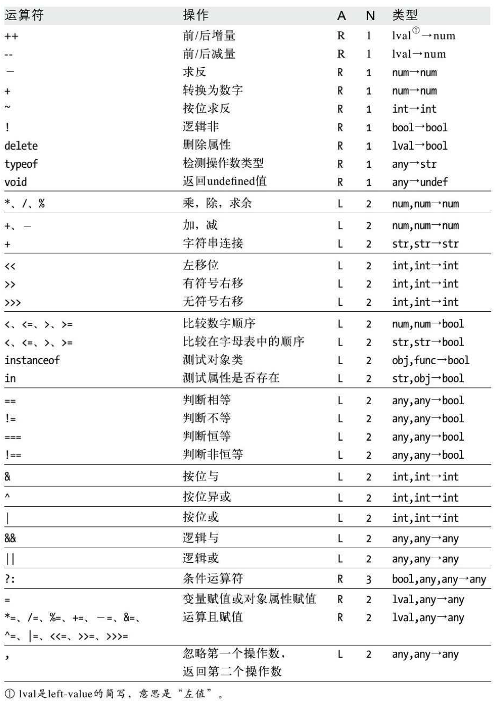

> **注意：**
>
> 给表达式中的一部分添加`()`，可以提高此处的优先级。

# 第五章 流程控制语句

## 1 语句

### 1.1 什么是语句

1）**表达式**在 JavaScript 中是短语, 那么**语句**就是 JavaScrip t的整句或命令。

2）JavaScript 语句，以分号或换行结尾。

3）JavaScript程序就是一系列可执行语句的集合。

4）默认情况下, JavaScrip t解释器会按照语句的编写顺序依次执行,但有些语句或控制结构改变语句的默认执行顺序。如 "条件语句" "循环语句" "跳转语句"。

### 1.2 语句分类

- 表达式语句，是js中最简单的语句
- 复合语句，用花括号把多条语句括起来,形成复合语句
- 空语句
- 声明语句，声明变量、声明函数等
- 条件语句
- 循环语句
- 跳转语句

## 2 流程控制结构

### 2.1 顺序结构

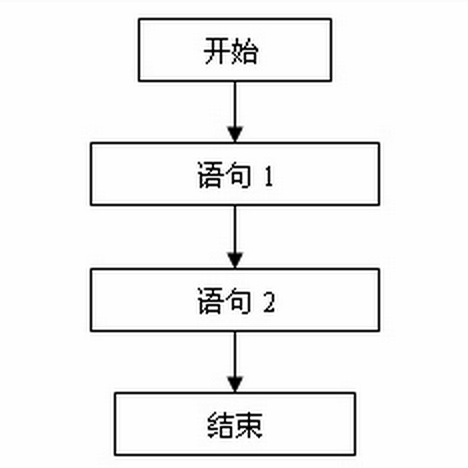

### 2.2 分支结构

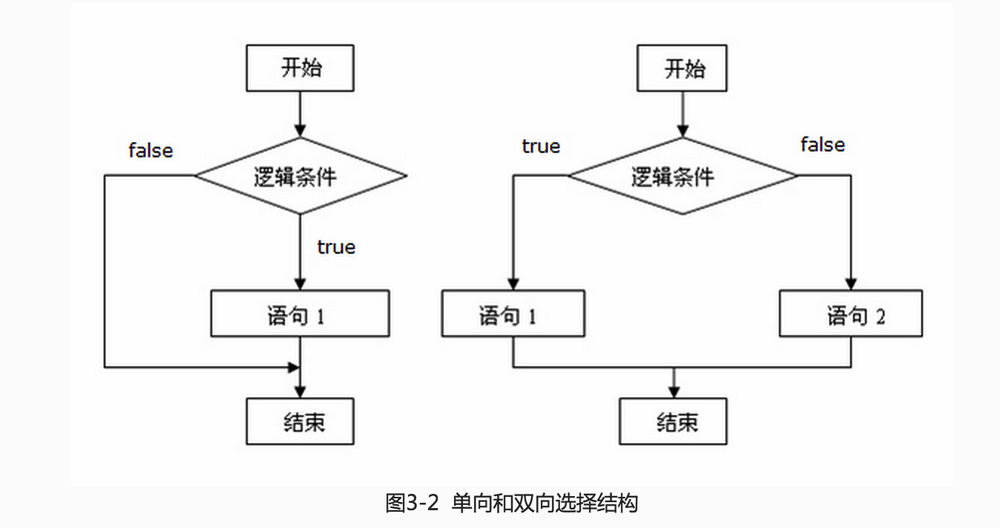

### 2.3 循环结构

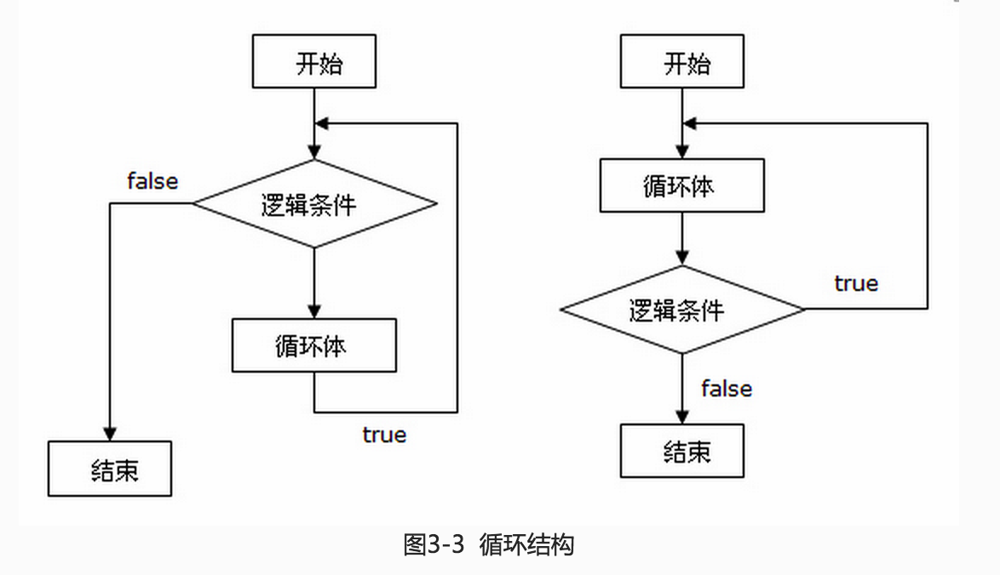

## 3 条件语句（实现分支结构）

### 3.1 单向分支 if

```js
if (表达式) {
    code...
}
```

### 3.2 双向分支 if...else

```js
if (表达式) {
    code...
} else {
    code...
}
```

### 3.3 多向分支 if... else if

```js
if (表达式) {
    code...
} else if (表达式) {
    code...
} else if (表达式) {
    code...
} else {
    code...
}
```

### 3.4 多向分支 switch...case

```js
switch (表达式) {
    case 表达式可能的值: code....; break;
    case 表达式可能的值: code....; break;
    case 表达式可能的值: code....; break;
    case 表达式可能的值: code....; break;
    default: code....;
}
```

### 3.5 分支结构嵌套

```js
if (表达式) {
    if (表达式) {
        code....
    }
    code ...
} else {
    code...
}
```

## 4 循环语句（实现循环结构）

### 4.1 while 循环

```js
while (循环条件) {
    code...
}
```

### 4.3 do...while循环

```js
do {
    code...
} while (循环条件)
```

### 4.4 for 循环

```js
for (循环变量; 循环条件; 循环变量变化) {
    code ...
}

//循环输出 0-10
for (var i = 0; i <= 10; i ++) {
    console.log(i)
}
```

## 5 跳转语句

- `break`语句 结束整个循环
- `continue`语句 结束当前循环
- `return`语句 返回函数值

## 6 其他语句

### 6.1 异常处理语句

- `throw` 抛出异常
- `try`/`catch`/`finally`

```js
try {
    tryCode - 尝试执行代码块
}
catch(err) {
    catchCode - 捕获错误的代码块
} 
finally {
    finallyCode - 无论 try / catch 结果如何都会执行的代码块
}
```

### 6.2 严格模式

```js
"use strict"
code...
```

### 6.3 with 语句

```js
with (document) {
    write('hello,100<br>');
  write('hello,200<br>');
  write('hello,300<br>');
  write('hello,400<br>');
}
```

# 第六章 数组

## 1 什么是数组

1) 数组是值的**有序集合**。

2) 每个值叫做一个**元素**。

3) 每个元素在数组中有一个位置, 以数字表示,称为**索引** (有时也称为下标)。

4) 数组的元素可以是任何类型。

5) 数组索引从 0 开始, 最大为 2^32-2，数组最大能容纳 4294967294 个元素。

## 2 创建数组

### 2.1 使用数组直接量

```js
// 定义所有的姓名组成的集合
var nameList = ['曹操', '诸葛亮', '刘备', '吕布', '安妮'];

//定义由数字组成的数组
var numList = [112,232,34,34234,3434,3434,121,112,112,112];

//数组的元素各种类型都有
var list = ['孙悟空', 100, true, false, '猪八戒', [1, 2, 3]];
```

> `[]` 这种写法，结构简单，`[]`里面的内容都是数组元素，用逗号隔开。

### 2.2 使用 Array 函数

```js
// 定义数组，使用Array函数
var list1 = Array(10, 20, 30);

var list2 = Array(30);

var list3 = Array('芳芳');
```

> `Array()` 如果只有一个参数且该参数是数字，那么数字表示数组的长度，数组元素是空。
>
> `Array()` 如果参数不止一个，或只有一个但类型是字符串，参数都会变为数组的元素。

## 3 读写数组元素

使用操作符 `[]` 来读写数组的每一个元素, `[]`中是数组的索引。

```js
// 读取数组中元素的值
nameList[12];

// 给数组中的元素赋值
nameList[2] = 100;
```

数组可以通过 `length` 属性获取数组的长度，也就是数组中元素的个数。

```js
nameList.length; // 获取数组 nameList 的长度
```

## 4 稀疏数组

数组内**有内容的元素**的**索引**没有连续，这样的数组称之为**稀疏数组**。

JS 要求数组中的元素索引必须是连续的，如果给索引值很大的元素赋值，而中间的索引没有赋值，会把没没赋值的元素补全，但是元素内容是空的， 也就成为了**稀疏数组**。

如果要获取没有内容的元素的值，会得到 undefined。

## 5 遍历数组（迭代）

```js
// for 循环遍历
for (var i = 0; i < arr.length; i ++) {
    arr[i]
}

//for in 循环
fro (var i in arr) {
    arr[i]
}
```

## 6 数组元素的添加和删除

### 6.1 添加元素

```
① 指定索引添加元素，索引需要计算（避免成为稀疏数组或者修改了其他元素的值）
② 把数组长度作为索引；因为没添加元素之间，数组的最大索引就比长度-1
③ arr.push(新元素)  在数组的最后面添加一个元素
④ arr.unshift(新元素)  在数组的最前面添加一个元素
⑥ arr.splice(位置, 0, 新元素)  在指定的位置插入一个元素
```

### 6.2 删除元素

```
① 强制设置数组的length属性，如果设置的length值与原来小，会删除后面想元素 删除一个 arr.legnth -= 1
② arr.pop() 删除数组中最后一个元素
③ arr.shift() 删除数组中第一个元素；剩下的元素自动调整索引
④ arr.splce(位置, 1) 指定位置，删除一个元素； 剩下的元素自动调整索引；
```

## 7 多维数组

```js
// 创建多维数组
var cityList = [
  ['广州', '深圳', '佛山', '东莞', '惠州'],
  ['南京', '苏州', '徐州', '无锡', '南通'],
  ['济南', '青岛', '烟台', '潍坊', '淄博'],
  ['杭州', '宁波', '温州', '绍兴', '湖州']
];

// 多维数组取值
cityList[2][1];

// 多维数组遍历
for (var i = 0; i < cityList.length; i ++) {
  for (var j = 0; j < cityList[i].length; j ++) {
    console.log(cityList[i][j]);
  } 
  console.log('');
}
```

## 8 类数组对象/伪数组对象

具有数组的特性，但却不是数组的一类对象，我们称之为**类数组对象**或者**伪数组对象**。

这类对像数组一样是多个值的组合，可以用`[]`去取其中的值，可以像数组那样去遍历。

## 9 字符串具有数组的特性

字符串可以通过 `[]` 取到指定的字符，只能取值无法修改。

2）字符串属性 `.length` 可获取字符串的长度（字符的个数）。

3）字符串可以向数组那样遍历。

# 第七章 函数

## 1 函数的概念

### 1.1 什么是函数

**函数**具有某种**特定功能**的代码块。

函数其实本质也是**一种数据**，属于**对象数据类型**。

### 1.2 为什么要有函数

1）解决代码的冗余问题，形成代码复用。

2）可以把整个代码项目，通过函数模块化。

3） 封装代码，让函数内部的代码对外部不可见。

## 2. 函数的组成

**函数的声明：**

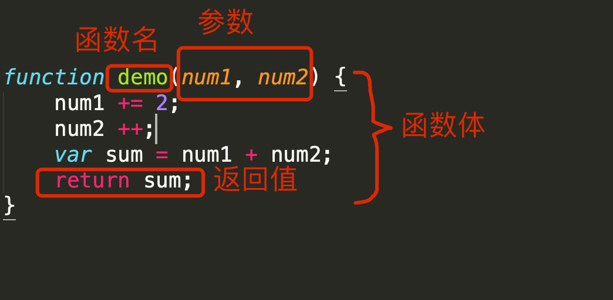

**函数的调用：**

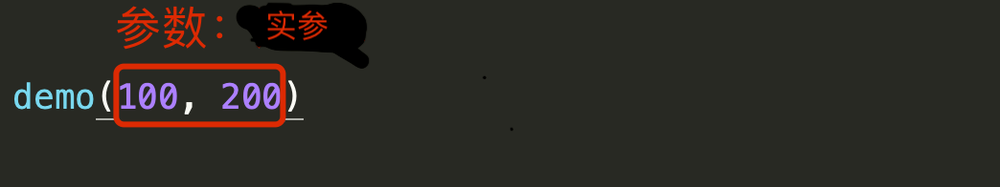

**函数由如下部分组成：**

- **函数名**，命名规则同变量名一致。
- **函数体**， 函数的内容，代码块。
- **参数**， 分为**形参**和**实参**。
- **返回值**， 函数调用表达式的结果

## 3 定义函数的三种方式

- function关键字方式/字面量方式

  ```js
  function 函数名() {
  
  }
  function 函数名(参数) {
  
  }
  ```

- 表达式方式

  ```js
  var 函数名 = function(){
  
  }
  var 函数名 = function(参数) {
  
  }
  ```

- Function构造函数方式

  ```js
  var 函数名 = new Function('函数体');
  var 函数名 = new Function('参数', '函数体')
  ```

## 4 函数调用

1) 在函数名后面加上 () 就是对函数的调用，函数内的代码会执行。

2) 函数名后面不加() 不会调用函数，函数内的代码也不会执行；函数名本质上是个变量名，通过函数名可以引用到函数本身。

## 5 函数的返回值

### 5.1 返回值

1）`函数名()` 被称之为**函数调用表达式**， 表表达式的值就是函数的**返回值**。

2）在函数体内，`return` 右边的表达式（或变量、直接量）便是函数的返回值。

3）函数体内没写 `return` 或者 `return` 的右边是空的，默认默认会返回 `undefined`。

4）`return` 除了设置返回值外，还可以结束函数的执行，return 之后的代码不会执行。

### 5.2 那些函数需要些返回值

**什么样的函数需要写返回值？**

如果函数的作用是进行某种计算，得到的计算结果最后以返回值的形式返回。

**什么样的函数不需要返回值？**

函数的功能是实现某个具体的操作（界面操作），无需返回值。

## 6 函数的参数

### 6.1 形参和实参

**形参：** 声明函数的时候，给的参数， 类似于变量名；在声明函数的时候，参数是没有值。

**实参：**调用函数是给的参数； 实参会按照顺序赋值给形参。

### 6.2 形参和实参的数量问题

正常情况下，实参数量应该等于形参数量。

如果实参数量大于形参数量， 多出来的实参，将被忽略。

如果实参数量小于形参数量， 有的形参没有对应的实参，取默认值 undefined。

### 6.3 形参的默认值

JS函数允许形参有默认值，有默认值的形参，在调用函数的时候，可以没有与之对应的实参！

如何实现形参的默认值？

旧版语法：

```js
function demo(a,b) {
    // 判断形参的值，是否是undefined，如果是undefined说明函数调用的时候没有给值，可以设置默认值。
        if (b === undefined) {
            b = 默认值
        }
}
```

新版语法：

```js
function demo(a, b=默认值) {

}
```

> **注意：** 有默认值的形参一定要放在后面！

### 6.4 arguments

arguments 只能在函数内使用。

arguments 是一个类数组对象，具有数组的一些特性。

arguments可以获取所有的实参，所以我门想获取实参的话有两种方式：①用形参；②使用arguments。

可以用来定义可变参数数量的函数：如计算所有参数和，取参数中的最大值，取参数中的最小值，求所有参数平均数。

```js
/**
 * 取所有参数里面的最大值
 */
function max() {
  //设置遍历 默认值的最大值
  var res = arguments[0];
  // 循环比较
  for (var i = 0; i < arguments.length; i ++) {
    if (arguments[i] > res) {
      res = arguments[i];
    }
  }
  // 返回结果
  return res;
}
```

## 7 函数的嵌套

函数体内是可以再嵌套函数的。

```js
/**
 * 冒泡排序
 * @params arr Array 需要进行排序的数组
 * @params isUp boolean 是否从大到小； 默认值是false（从小到大）
 * @return 排好序的数组
 */
function sortArr(arr, isUp) {
  // 数组遍历
  for (var i = 0; i < arr.length; i ++) {
    // 进行比较。把最大的元素搞到最后面取
    for (var j = 0; j < arr.length-1-i; j ++) {
      // 先判断是从大到小还是从小到大
      if (isUp) { //从大到小
        //如果前面的元素比后面的小，进行交换
        if (arr[j] < arr[j+1]) {
          exchange();
        }
      } else { //从小到大
        //如果前面的元素比后面的大，进行交换
        if (arr[j] > arr[j+1]) {
          exchange();
        }
      }
    }
  }
  // 把排好序的数组返回
  return arr;

  // 交换
  function exchange(){
    var temp = arr[j]; //第三方变量
    arr[j] = arr[j+1];
    arr[j+1] = temp;
  }
}
```

## 8 作用域

### 8.1 变量的作用域

**作用域**是变量的可作用范围，变量只有在自己的作用域下才会生效。

函数会产生作用域，在函数内定义的变量只能在函数内使用。

### 8.2 作用域分类

**局部作用域**： 函数内定义的变量和形参的作用域就是局部作用域；这样的变量称之为**局部变量**。

**全局作用域：** 在函数外面定义的变量的作用域是全局作用域；这样的变量称之为**全局变量**。

**块级作用域**： 在代码块中定义的变量的作用域是块级作用域；这样的变量称之为**块级变量**。 **ES6才支持**

> **局部变量** 只能在定义变量的函数内使用； **全局变量** 在任意地方都可以使用。
>
> **注意：**
>
> 函数内的形参也是局部变量，作用域范围就是所在函数。
>
> **了解：**
>
> 函数内不使用关键字 `var` 声明的变量会被当做全局变量，但不建议这么做，在严格模式下，不使用关键字 `var` 就声明变量，会报错！

### 8.3 作用域链

#### ① 什么是作用域链

1） 函数会限制变量的作用域范围，而函数内是可以再嵌套函数的，函数的层层嵌套，就形成了一个**作用域链**。

2）**作用域链**描述的是程序在执行过程当中**寻找变量**的过程。

#### ② 作用域链寻找变量的过程

当函数内使用某个变量的时候，会按照如下过程找到该变量：

1） 先从**自身**所在**作用域**去查找，如果没有再从**上级作用域**当中去查找，直到找到**全局作用域**当中。

2）如果其中有**找到**，就不会再往上查找，**直接使用**。

3）如果都**没有找到**，那么就会**报引用错误**提示**变量没有定义**。

#### ③ 注意：

一个变量的作用域只与函数声明的位置有关，与函数调用的位置无关！

### 8.4 变量作用域原理

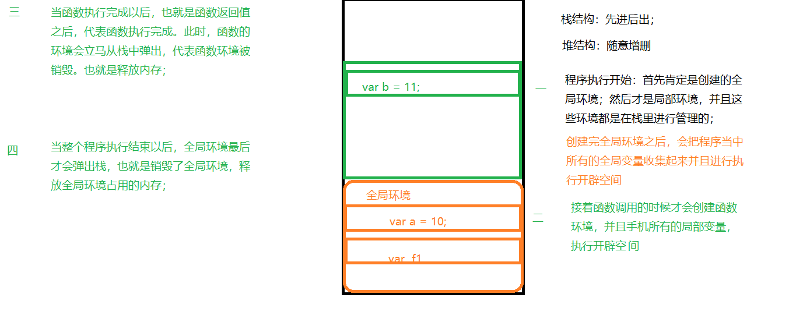

### 8.5 作用域面试题

**请写出以下程序的输出内容**

```js
var num = 10;
function fun() {
    var num = 20;
    fun2();
}

function fun2() {
    console.log(num);
}


fun();
```

## 9 变量提升和函数提升

### 9.1 变量提升

JS 会把变量的声明提升到本作用域的最前面。（只是提前声明了变量，但并没有给变量赋值）

```js
function demo(){
  console.log(num);  // undefined
  var num = 200; //声明局部变量
  console.log(num); // 200
}
demo();
```

### 9.2 函数提升

JS 会把函数连声明带值提升到本作用域的最前面， 函数可以在函数声明之前调用。

只有字面量方式（function关键字方式）声明的函数才能函数提升，表达式方式和构造函数方式声明的函数，只能提升声明没有值（与变量提升相同）！

相对于变量提升，函数提升权重更高（存在与函数同名变量的情况下）

```js
console.log(a);  // undefined
console.log(fn); // 函数提升，不但提升了声明，带着值也提升；
fn(); //可以调用
console.log(demo); //变量提升，提升了变量的声明，没有值
// demo(); 无法调用

var a = 100;
// 字面量方式声明
function fn() {
  console.log('我是fn');
}
// 表达式方式声明
var demo = function(){
  console.log('我是demo');
};
```

### 9.3 预解析

变量和函数之所以会提升，是因为程序在代码执行之前会先进行**预解析**。

与解析遵循如下规则：

- 预解析先去解析函数声明定义的函数，整体会被提升。
- 再去解析带 `var` 的变量。
- 函数重名会覆盖，变量重名会忽略。
- 变量如果不带var，变量是不会进行预解析的；只有带var的变量才会进行预解析。
- 表达式方式和构造函数方式定义的函数也是当做变量去解析。

### 9.4 变量提升面试题

```js
// ① --------------------------------------------------------    
    alert(a);    
    a = 0;

// ② --------------------------------------------------------
    alert(a);    
    var a = 0;
    alert(a);    

// ③ --------------------------------------------------------
    alert(a);    
    var a = '我是变量';
    function a(){ alert('我是函数') }
    alert(a);    

// ④ --------------------------------------------------------
    alert(a); 
    a++;
    alert(a);    
    var a = '我是变量';
    function a(){ alert('我是函数') }
    alert(a)   

// ⑤ --------------------------------------------------------
    alert(a);   
    var a = 0;
    alert(a);   
    function fn(){
         alert(a);    
         var a = 1;
         alert(a);    
    }
    fn()
    alert(a);
```

## 10 自调用函数 IIFE

### 10.1 匿名函数

没有名字的函数称之为 **匿名函数**。

```
function() {
    //匿名函数
}
```

匿名函数声明玩之后要立即调用，否则没有意义。

### 10.2 自调用函数

函数声明完立即调用，称之为**自调用函数**，也叫**立即调用函数**，英文简称 **IIFE**，英文全称 **Immediately Invoked Function Expression**。

```js
// 函数允许匿名，但是匿名的函数要立即使用
// 自调用函数，立即调用函数
(function(){
console.log('哈哈哈，我被调用了');
})();

// 自调用函数 传参
(function(a, b){
console.log(a+'和'+b+'跳舞');
})('曹操', '刘姥姥');


// 当然不匿名的自调用函数也是可以的，不过没有意义
(function fn(){
  console.log('fn 被调用了');
})();
```

> **注意：**
>
> 两个连续的自调用函数，之间必须加分号，告诉浏览器是不同的函数，否则会有语法错误。
>
> 或者，在后面的自调用函数前加 `!` 等没有副作用的一元运算符。

### 10.3 自调用函数的作用

1）减少全局变量的使用，把自己代码或者每个特效的代码写到一个自调用函数中， **防止外部命名空间污染（全局变量污染）**

2）隐藏内部代码暴露接口，实现模块化开发。

## 11 回调函数

### 11.1 什么是回调函数

**回调函数**满足三个条件：

1）函数是我定义的。

2）我没有调用。

3）函数最终执行了。

满足以上三个条件的函数就是**回调函数**。

### 11.2 常见使用回调函数的地方

作为其他函数的参数，函数的参数可以是个函数，而作为参数的那个函数就被称作**回调函数**。

2）事件函数

3）定时器函数

4）ajax 的回调函数

4）生命周期钩子函数

> **注意：**
>
> 匿名函数很适合做回调函数，也就是回调函数很多时候是个匿名函数。

### 11.3 实现一个回调函数

1）声明一个函数 fn，函数的参数类型要求是函数。

2）fn 的函数体内，调用传递进来的回调函数。

3）fn 内部调用回调函数的时候，还可以给回调函数传个实参。

```js
// 声明函数，参数的类型要求是函数
function fun(callback) {
  //使用一下参数 调用参数 调用回调韩
  callback();
}
// 调用fun，传一个匿名函数进去
fun(function(){
  console.log('啊，作为一个回调函数，我被调用了');
});

// -------------------------------------

// 声明函数，参数的类型要求是函数 
function demo(callback) {
  callback(100, 200); // 调用回调函数的时候，还给回调函数传个实参
}
// 接收匿名函数作为参数，回调函数自己得定义两个形参
demo(function(a,b){
  console.log(a, b);
});
//接收非匿名函数作为参数
demo(fn1);
function fn1(a, b) {
  console.log(a+b);
}

/**
 * @param num1
 * @param num2
 * @param call
*/
function progress(num1, num2, call) {
  call(num1, num2);
}

progress(100, 200, function(a,b){console.log(a+b)});
progress(100, 200, function(a,b){console.log(a*b)});
```

## 12 递归函数

### 12.1 递归函数的概念

一个函数的内部如果又调用了自己，称作是**函数的递归调用**，这样的函数就是**递归函数**。

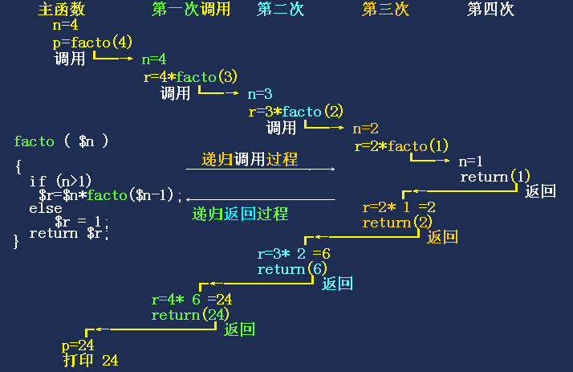

### 12.2 递归函数成功的条件

1）必须有一个明显的**结束条件**。

2）必须有一个**趋近于结束条件的趋势**。

```js
/*
  * 实现某个数字的阶乘
  * */
function fn(n) {
  // 当 n<=1 的时候，就结束了，不再进行递归了。
  if (n <= 1) {
    return 1;
  }
  return n * fn(n-1);
}

console.log(fn(3));


/**
 *  调用 fn(3)
 *       3 * fn(2)
 *       调用fn(2)
 *           2 * fn(1)  结果2
 *           调用fn(1)
 *               return 1
 *           调用完fn(1)
 *        调用完fn(2)
 *   调用完 fn(3)  结果6
 * */
```

### 1.3 递归的缺点

1）函数递归调用很容易发生灾难（**内存泄漏**）而调用失败。

2）函数递归调用**效率不高**，能不用就不用。

### 12.4 递归的应用场景

后端的操作中有些场景必须要递归函数来完成，如：

1）删除文件夹以及里面的内容，需要递归删除（操作系统的原始接口只能删除文件和空文件夹）

2）复制文件夹以及里面的内容。

3）剪切文件夹以及里面的内容。

# 第八章 对象

## 1 对象的概念

**广义的理解：** 一切皆对象，数组、函数都是对象的一种。

**狭义的理解：** Object 数据类型，是对象类型中的一种，与Array、Function是等价的。

## 2 Object 类型

### 2.1 什么是Object

- 对象（Object）是值的无序集合
- 别称：字典、散列、关联数组、散列表。
- 对象由属性组成， 如果属性的类型是 function，该属性称为方法。

### 2.2 声明一个Object类型的数据

1) 直接量方式 `{}`

2) 构造函数方式 `new Object()`

```js
// 定义对象 // 直接量方式
// 指定属性名，属性名对应的值， 属性名
var data = {
  name:'李达康', 
  age:42, 
  numbers:[100, 200, 300, 400], 
  say: function(){
      console.log('我会说话');
    }, 
  eat: function(){
      console.log('我会吃');
    }
};
// 在对象外面给对象添加属性
data.sex = 'male';
data.sleep = function(){
  console.log('我会睡');
};


// 构造函数方式
// 创建对象
var obj = new Object();
// 给对象添加属性和方法
obj.name = '小芳芳';
obj.age = 19;
obj.eat = function(){
    console.log('我喜欢吃')
};
```

### 2.3 属性操作

#### ① 属性的读取和设置（读写操作）

1）`.` 运算符， 如`obj.name`

2）`[]` 运算符，如 `obj['name']`。 属性名要以字符串形式给出，也可以以变量的形式给出。

> **注意：**
>
> 设置属性值的时候，属性已经存在，就修改属性值；如果属性不存在，就添加属性。 获取对象中不存在的属性的时候，返回 `undefined`
>
> **注意：**在以下情况下我们必须使用`[]`语法操作：
>
> ① 如果对象的属性名不符合标识命名规范（变量名的命名规范）。
>
> ② 如果需要使用变量的值作为属性名。

```js
// 指定属性名，属性名对应的值， 属性名
var data = {
  name:'高育良', 
  age:58, 
  numbers:[100, 200, 300, 400], 
  say: function(){
          console.log('我会说话');
    }, 
  eat: function(){
      console.log('我会吃');
    }
};

// 修改和添加属性
data.name = '大艳艳';   // 使用 . 运算符
data.sex = 'female';
data['numbers'] = [1,2,3,4];  // 使用 [] 运算符

// 读取属性 .
console.log(data.name, data.age);
data.eat();
// 读取属性 可以使用 [], 属性名必须以字符串的形式给出。
console.log(data['age']);
data['say']();

//获取对象中不存在的属性，得到 undefined
console.log(data.length);  // undefined
```

#### ② 属性的遍历

使用 `for ... in` 循环可以遍历对象中的属性。

```js
for (var i in data) {
  // i  是属性名
    // obj[i];  是属性值，只能使用[]形式获取属性值。
  console.log(i, data[i]);  
}
```

#### ③ 删除对象中的某个属性

使用 `delete` 运算符

```js
delete obj.name;
ddlete obj['name'];
```

#### ④ 判断对象中是否存在某个属性

判断对象中是否存在某个属性，使用 `in` 运算符，是个二元运算符，表达式的结果是布尔值。

```js
'name' in obj;  //属性名以字符串的形式给出,表达式的结果是布尔值。
```

## 3 构造函数

### 3.1 什么是构造函数

1）对象是一个实际的存在， 构造函数是对对象的描述。

2）对象是构造函数的实例，构造函数是对象的抽象。

3）JS 中的构造函数相当于其他编程语言的**类**（ES6 中也引入了类的概念）。

4）每一对象都有与之对应的构造函数。

5）一个构造函数可以对应很多对象， 一个对象只有一个构造函数。

### 3.2 判断对象的构造函数

1）`instanceof` 运算符，语法：`对象 intanceof 构造函数`。 返回布尔值。

2）`.constructor` 所有的对象都有该属性，返回对象的构造函数

```js
var obj1 = {name:'沙瑞金'};
var obj2 = new Object();
var list = [];
var msg = 'hello';
var num = 1001;
var box = document.getElementById('box');

console.log(obj1.constructor);  // ƒ Object() { [native code] }
console.log(obj2.constructor);  // ƒ Object() { [native code] }
console.log(list.constructor);  // ƒ Array() { [native code] }
console.log(msg.constructor);   // ƒ String() { [native code] }
console.log(num.constructor);   // ƒ Number() { [native code] }
console.log(true.constructor);  // ƒ Boolean() { [native code] }
console.log(box.constructor);   // ƒ HTMLDivElement() { [native code] }
console.log(alert.constructor); // ƒ Function() { [native code] }

console.log(100 instanceof Number); //false  数字是原始类型
console.log(new Number(1000) instanceof Number); //true
console.log([] instanceof Array); //true
console.log(alert instanceof Function);  //true
```

### 3.3 自定义构造函数

定义一个构造函数与定义一个普通函数是一样的，我们通常会把构造函数的名字首字母大写，以示区别（这只是人为区分不是语法）。

```js
// 自定义构造函数 与定义普通函数一个样
//定义描述人的 构造函数
function Person() {
  //描述一下实例所需要的属性
  this.name = '小莉莉';
  this.age = 18;
}

// 根据构造函数 实例化对象
var p1 = new Person();
var p2 = new Person();

console.log(typeof p1);  // object
console.log(typeof p2);  // object
console.log(p1.constructor); // function Person() ...
console.log(p2.constructor); // function Person() ...
```

### 3.4 对象的实例化

使用`new` 运算符可以把构造函数实例化成一个对象，不论构造函数是系统内置的还是我们自定义的。

每实例化一个对象，内存中就会开辟一块空间来存储该对象。

```js
//自定义构造函数
function Person() {
}

// 实例化自定义的构造函数
var p = new Person();

// 实例化内置的构造函数
var arr = new Array();
var obj = new Object();
var fn = new Function();
```

### 3.5 构造函数和普通函数

任何的函数都可以是普通函数，也可以是构造函数，就看我们怎么去使用。

```js
//创建一个类（函数）
function Car(name,color,price){
   this.name = name;
   this.color = color;
   this.price = price;
   this.run = function(){
      console.log('跑的很快~');
   }
}

//普通函数调用
var result = Car('奔驰','black',200000);
console.log(result);

//构造函数调用            
var c1 = new Car('劳斯莱斯','red',10000000);
console.log(c1);
c1.run();
```

## 4 this

### 4.1 this 的概念

1） this 是 JS **内置**的一个**变量**，本质上是一个**对象**。

2）通常在函数或方法当中使用，代表这个函数的调用者。

### 4.2 this 的指向

this 的指向分为以下两种情况：

1）在构造函数使用 this， this 指向实例化之后的对象。

2）在方法（所谓函数本质上其实是 window 对象的方法）中使用this，this 指向调用该方法的对象。

> **注意：**
>
> 在函数中使用 this，this 指向 window 对象。函数本质上其实是 window 对象的方法，所以在函数中使用 this 与第二种情况本质是一样的。

```js
// 在方法中使用this
var obj = {};
obj.name = '曹操';
obj.age = 29;
obj.say = function(){
  console.log('我叫'+this.name+',我今年'+this.age+'岁了');
};
//调用对象的方法
obj.say();   // say 里面的 this 指向 obj。


// 自定义函数（构造函数）
function Dog(name){
  this.name = name;
  console.log(this);
}

//实例化，这么使用 Dog 便是构造函数，里面的 this 指向要实例化成的对象
var d = new Dog('旺财');  

// 调用函数，此时调用改函数的是 window,所以 this 指向window。
Dog('小黄');
```

### 4.3 window 对象

1）window 是浏览器端 JS 的全局对象。

2）打开浏览器，window 对象就会自动生成。

3）所有的全局属性（全局变量和函数）都是 window 对象的属性。

4）使用 window 的属性和方法的时候，通常可以省略window。

5）系统的函数 alert、prompt、Numbe、Boolean、Array、Object等 也是window的属性。


## 5 原型

### 5.1 原型的概念

1）原型是个对象。

2）所有的对象都有原型。

3）对象可以继承原型的属性（包括方法）。

### 5.2 获取原型对象

**隐式原型：** `对象.__proto__`。

**显示原型：** `构造函数.prototype`。

> 一个对象的 `__proto__`属性与其构造函数的`prototype`属性指向同一个对象（该对象的原型对象）

```js
// 定义一个数组对象
var arr = [10,20,30];

// 使用对象直接获取 隐式原型
arr.__proto__
// 通过构造函数来获取原型 显示原型
Array.prototype; 
// 两种获取方式获取的原型是一样的
arr.__proto__ === Array.prototype


// 自定义构造函数
function Person(){
  this.username = '小艳艳';
}
var p = new Person();
console.log(p.__proto__);
console.log(Person.prototype);
console.log(p.__proto__ === Person.prototype); // true
```

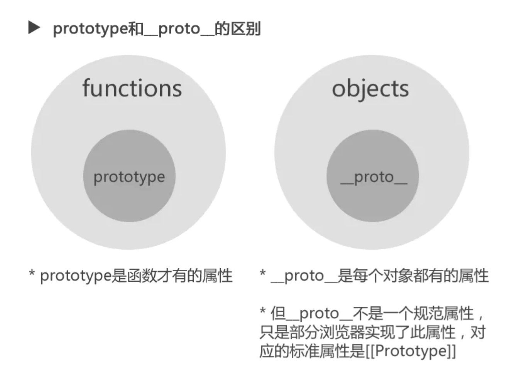

### 5.4 对象、构造函数、原型之间关系

1）**对象和构造函数：** 对象是构造函数的实例， 对象由构造函数产生。

2）**对象和原型：** 每个对象都有原型，可以继承原型上的属性。

3）**构造函数和原型：** 如果对象的构造函数相同，对象的原型也相同。

### 5.4 原型的应用

我们在写构造函数的时候，通常会把方法定义在它的原型上，这样可以让构造函数所有的实例化对象**资源共享**，节省内存。

```js
// 自定义构造函数
function Person(name, age) {
  //设置对象的属性
  this.name = name;
  this.age = age;
}
// 给原型添加方法
// 把方法定义到原型上，可以节省内存
Person.prototype.say = function(){
  console.log('我是'+this.name+'，我今年'+this.age+'岁了');
};


//实例化对象
// p1 和 p2 两个对象都有 say 方法，但 say 方法只存了一次。
var p1 = new Person('曹操', 18);
var p2 = new Person('小乔', 18);
```

### 5.5 判断属性是否属于对象自身

使用方法 hasOwnProperty， 每个对象都有该方法，参数是属性名， 返回布尔值。判断属性是否是对象自身的属性，自身的属性返回 true，不是自身的属性（原型上的属性或者对象自身和原型都没有的属性）返回 false。

```js
// 自定义构造函数
function Person(name, age) {
  //设置对象的属性
  this.name = name;
  this.age = age;
}
// 给原型添加方法
// 把方法定义到原型上，可以节省内存
Person.prototype.say = function(){
  console.log(this); //谁调用了this，this就指向谁。
  console.log('我是'+this.name+'，我今年'+this.age+'岁了');
};


//实例化对象
var p1 = new Person('曹操', 18);

console.log(p1.hasOwnProperty('name'));  // true 自身的属性
console.log(p1.hasOwnProperty('age'));   // true 自身的属性
console.log(p1.hasOwnProperty('say'));   // false 原型上的属性
console.log(p1.hasOwnProperty('constructor'));  // false 原型上的属性
console.log(p1.hasOwnProperty('grade'));  // false 自身和原型都没有的属性
```

### 5.6 创建对象并且指定原型

**`Object.create()`**方法创建一个新对象，使用现有的对象来提供新创建的对象的原型。

> **语法：**
>
> ```js
> Object.create( proto[, propertiesObject])
> ```
>
> **参数**：
>
> - `proto`
>
>   新创建对象的原型对象。如果该参数是 null，那创建的对象就是一个没有原型的对象。
>
> - `propertiesObject`
>
>   可选。如果没有指定为 undefined。则是要添加到新创建对象的不可枚举（默认）属性（即其自身定义的属性，而不是其原型链上的枚举属性）对象的属性描述符以及相应的属性名称。
>
> **返回值：**
>
> 一个新对象，带着指定的原型对象和属性。

```js
var person = {
  isHuman: false,
  printIntroduction: function() {
    console.log(`My name is ${this.name}. Am I human? ${this.isHuman}`);
  }
};

var me = Object.create(person);

me.name = 'Matthew'; // "name" is a property set on "me", but not on "person"
me.isHuman = true; // inherited properties can be overwritten

me.printIntroduction(); // expected output: "My name is Matthew. Am I human? true"
```

## 6 原型链

### 6.1 什么是原型链

任何对象都有原型对象，原型还是一个对象，既然是一个对象就会有自己的原型，那原型的原型仍然还有原型，可以依次向上找原型，直到找到一个没有原型的对象。这样就形成了一条**原型链。**

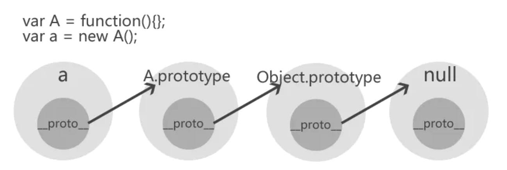

### 6.2 属性查找过程

**原型链**描述的就是是对象查找属性或者方法的过程。

属性的查找会遵循如下过程：

1）对象在查找找属性的时候，先从自身去找看有没有这个属性，如果有，直接使用这个属性的值。

2）如果没有，会沿着原型链向上找，如果找到就使用这个属性的值且停止查找，如果没找到继续向上找直到原型链的终点。

3）如果找到原型链的终点还没有找到，就返回undefined(代表已经找到顶了)

### 6.3 原型链图例

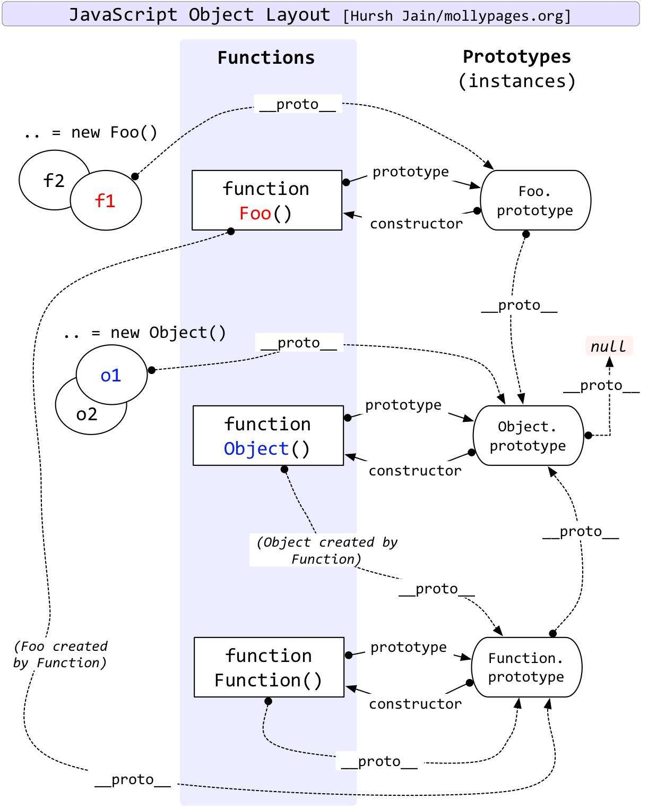

## 7 值类型和引用类型

### 7.1 值类型和引用类型的概念

**原始类型**，也叫**值类型**，还可以被称为**不可变类型**。

**对象类型**，也叫**引用类型**，还可被称为**可变类型**。

```js
// 值类型
var a = 100;
var b = a;
a = 200;
console.log(b); //100
console.log('');


// 引用类型
var obj1 = {age: 100};
var obj2 = obj1;  //由于是引用类型，obj1给obj2是地址，导致obj1和obj2指向一个对象
obj1.age = 200;
console.log(obj2.age); //200
console.log('');


// 对变量重新赋值
// 起始是把obj2指向了新的对象， obj2和obj1再无关系了。
obj2 = {}; // 给obj2重新赋值了一个对象 （和修改obj2的属性不一样）
```

### 7.2 值类型和引用类型的内存存储方式

**值类型的特点：**占用空间固定，变量名和变量都保存在**栈内存**中。


**引用类型的特点：** 变量的值存储在**堆内存**中，而栈内存中存储的是变量名和值的地址。


### 7.3 值类型和引用类型经典面试题

```js
//1、
var num1 = 10;
var num2 = num1;
num1 = 20;
console.log(num1);
console.log(num2);


//2、
var num = 50;
function f1(num) {
    num = 60;
    console.log(num);
}
f1(num);
console.log(num);


//3、
var num1 = 55;
var num2 = 66;
function f1(num, num1) {
    num = 100;
    num1 = 100;
    num2 = 100;
    console.log(num);
    console.log(num1);
    console.log(num2);
}
f1(num1, num2);
console.log(num1);
console.log(num2);
console.log(num);


// 4、
// 函数传参如果传的是基本数据类型和传引用（对象）有什么区别
//4-1、
var a = 10;
var b = 20;
function add(a,b){
    a = 30;
    return a + b;
}
add(a,b);
console.log(a);
//4-2、
function f1(arr){
    for(var i = 0; i < arr.length; i++){
        arr[i] += 2
    }
    console.log(arr);
}
var arr;
arr = [1,2];
f1(arr);
console.log(arr);


// 5、
// 两个对象是同一个对象，不同的操作有什么不同
var a = [1,2];
var b = a;
a[0] = 20;    // 如果a = [20,2]；会怎么样
console.log(b);


//6、
function Person(name, age, salary) {
    this.name = name;
    this.age = age;
    this.salary = salary;
}
function f1(pp) {
    pp.name = "ls";
    pp = new Person("aa", 18, 10);
}
var p = new Person("zs", 18, 1000);
console.log(p.name);
f1(p);
console.log(p.name);
console.log(pp.name);
```

## 8 数据类型的本质

具有相同构造函数的对象，就是同一种数据类型。

# 第九章 内置对象

所谓**内置对象**其实就是系统内置的**构造函数**。

## 1 Boolean

把一个原始值当做对象去使用的时候，会自动包装成对象。

```js
// 直接赋值
var b1 = true;
// 转换函数
var b2 = Boolean(false);
// 构造函数
var b3 = new Boolean(false); //依然可以类型转换 原始值的包装对象形式

console.log(b1,b2,b3);
console.log(b3.constructor);
console.log(b1.constructor);  //把一个原始值当做对象去使用的时候，自动包装成对象
console.log(b3 instanceof Boolean); //true
console.log(b1 instanceof Boolean); //false
```

## 2 Number

### 2.1 属性

| 属性名           | 含义                                                         |
| ---------------- | ------------------------------------------------------------ |
| Number.MAX_VALUE | JS可表示的最大数字，是Number构造函数本身的属性，不是数字对象的属性！！ |
| Number.MIN_VALUE | JS可表示的最小数字，是Number构造函数本身的属性，不是数字对象的属性！！ |

### 2.2 方法

| 方法名            | 含义                                             |
| ----------------- | ------------------------------------------------ |
| toFixed([digits]) | 保留指定位数的小数，如果不指定位数就取整，       |
| toString()        | 转为字符串，指定进制，把数字转换为指定的进制形式 |

## 3 String对象

### 3.1 属性

| 属性名 | 含义       |
| ------ | ---------- |
| length | 字符串长度 |

### 3.2 方法

| 方法名                                     | 含义                                                         |
| ------------------------------------------ | ------------------------------------------------------------ |
| indexOf()                                  | 返回字符串/字符在某个字符串第一次出现的位置 没有-1           |
| lastIndexOf()                              | 返回字符串/字符在某个字符串最后一次出现的位置 没有-1         |
| slice(start, end)                          | 截取字符串，指定开始索引和结束索引，结束索引不会被截取到，第二个参数可以省略（截取到最后） |
| substring(start, end)                      | 同上                                                         |
| substr(start, lenth)                       | 截取字符串，指定开始索引和截取长度； 第二个参数可以省略（截取到最后） |
| split()                                    | 把字符串分割为数组，可以指定分隔符                           |
| toUpperCase()                              | 字符串转为大写                                               |
| toLowerCase()                              | 字符串转为小写                                               |
| chatCodeAt()                               | 返回指定位置字符的unicode字符码                              |
| String.fromCharCode()                      | 根据unicode编码生成指定字符 （不是字符串对象的方法，是String构造函数的方法） |
| search(regexp)                             | 查找字符串 可用于正则匹配                                    |
| match(regexp)                              | 匹配字符串 可用于正则匹配                                    |
| replace(regexp/substr, newSubStr/function) | 替换字符串 可用于正则替换                                    |

## 4 Math

### 4.1 属性

| 属性名  | 含义       |
| ------- | ---------- |
| Math.PI | 返回圆周率 |

### 4.2 方法

| 方法名                  | 含义                                                     |
| ----------------------- | -------------------------------------------------------- |
| Math.abs(x)             | 求绝对值                                                 |
| Math.sqrt(x)            | 求平方根                                                 |
| Math.pow(x,y)           | 求 x 的 y 次幂                                           |
| Math.max([x[, y[, …]]]) | 返回参数里面最大的值                                     |
| Math.min([x[, y[, …]]]) | 返回参数里面最小的值                                     |
| Math.round(x)           | 四舍五入取整                                             |
| Math.floor(x)           | 向下取整                                                 |
| Math.ceil(x)            | 向上取整                                                 |
| Math.random()           | 返回一个 0 到 1 之间的伪随机数，但是不包括 1（左闭右开） |

## 5 Date

### 5.1 创建一个 date 对象

```
new Date();
new Date(value);
new Date(dateString);
new Date(year, monthIndex [, day [, hours [, minutes [, seconds [, milliseconds]]]]]);
```

> 如果没有提供参数，那么新创建的 Date 对象表示实例化时刻的日期和时间。
>
> value 表示一个时间戳
>
> dateString 表示日期的字符串值，如“December 17, 1995 03:24:00” 或者 “1995-12-17T03:24:00”

```js
var today = new Date();
var birthday = new Date('December 17, 1995 03:24:00');
var birthday = new Date('1995-12-17T03:24:00');
var birthday = new Date(1995, 11, 17);
var birthday = new Date(1995, 11, 17, 3, 24, 0);
```

### 5.2 Date 对象方法

| 方法名                                                       | 含义                                                         |
| ------------------------------------------------------------ | ------------------------------------------------------------ |
| Date.now()                                                   | 返回自 1970-1-1 00:00:00 UTC（世界标准时间）至今所经过的毫秒数。 |
| Date.UTC()                                                   | 返回从1970-1-1 00:00:00 UTC到指定日期的的毫秒数。 `Date.UTC(year,month[,date[,hrs[,min[,sec[,ms]]]]])` |
| getYear()                                                    | 根据特定日期返回年份 (通常 2-3 位数)，不推荐使用             |
| getFullYear()                                                | 根据本地时间返回指定日期对象的年份（四位数年份时返回四位数字）。 |
| getMonths()                                                  | 根据本地时间返回指定日期对象的月份（0-11）。                 |
| getDay()                                                     | 根据本地时间返回指定日期对象的星期中的第几天（0-6）。        |
| getDate()                                                    | 根据本地时间返回指定日期对象的月份中的第几天（1-31）。       |
| getHours()                                                   | 根据本地时间返回指定日期对象的小时（0-23）。                 |
| getMinutes()                                                 | 根据本地时间返回指定日期对象的分钟（0-59）。                 |
| getSeconds()                                                 | 根据本地时间返回指定日期对象的秒数（0-59）。                 |
| getMilliseconds()                                            | 根据本地时间返回指定日期对象的毫秒（0-999）。                |
| getUTCYear() getUTCFullYear() getUTCMonth() getUTC... ...    | 根据世界时返回特定日期对象所在的年、月、日、时、分、秒。     |
| getTime()                                                    | 返回从1970-1-1 00:00:00 UTC（协调世界时）到该日期经过的毫秒数，对于1970-1-1 00:00:00 UTC之前的时间返回负值。 |
| getTimezoneOffset()                                          | 返回当前时区的时区偏移。                                     |
| setYear() setFullYear() setMonth() ... setTime() ... setUTCYear() setUTCFullYear() setUTC... ... | 设置 Date 对象中年、月、日、时、分、秒。                     |

## 6 Array

### 6.1 属性

| 属性名 | 含义                         |
| ------ | ---------------------------- |
| length | 数组的长度，数组元素的个数。 |

### 6.2 访问方法

下面的这些方法绝对不会改变调用它们的对象的值，只会返回一个新的数组或者返回一个其它的期望值。

| 方法名                                    | 含义                                                         |
| ----------------------------------------- | ------------------------------------------------------------ |
| concat(value1[, value2[, ...[, valueN]]]) | 返回一个由当前数组和其它若干个数组或者若干个非数组值组合而成的新数组。 |
| slice([begin[, end]])                     | 抽取当前数组中的一段元素组合成一个新数组，数组截取。         |
| join([separator])                         | 连接所有数组元素组成一个字符串。                             |

### 6.3 修改器方法

下面的这些方法会改变调用它们的对象自身的值。

| 方法名                                                | 含义                                                         |
| ----------------------------------------------------- | ------------------------------------------------------------ |
| push(element1, ..., elementN)                         | 在数组的末尾增加一个或多个元素，并返回数组的新长度。         |
| pop()                                                 | 删除数组的最后一个元素，并返回这个元素。                     |
| unshift(element1, ..., elementN)                      | 在数组的开头增加一个或多个元素，并返回数组的新长度。         |
| shift()                                               | 删除数组的第一个元素，并返回这个元素。                       |
| splice(start[, deleteCount[, item1[, item2[, ...]]]]) | 在任意的位置给数组添加或删除任意个元素。                     |
| reverse()                                             | 颠倒数组中元素的排列顺序，即原先的第一个变为最后一个，原先的最后一个变为第一个。 |
| sort([compareFunction])                               | 对数组元素进行排序，并返回当前数组。                         |

### 6.4 ES5 方法

| 方法名                                  | 含义                                                         |
| --------------------------------------- | ------------------------------------------------------------ |
| forEach(callback[, thisArg])            | 为数组中的每个元素执行一次回调函数，用于数组遍历             |
| filter(callback[, thisArg])             | 将所有在过滤函数中返回 `true` 的数组元素放进一个新数组中并返回，用于数组过滤。 |
| map(callback[, thisArg])                | 返回一个由回调函数的返回值组成的新数组。                     |
| every(callback[, thisArg])              | 如果数组中的每个元素都满足测试函数，则返回 `true`，否则返回 `false。` |
| some(callback[, thisArg])               | 如果数组中至少有一个元素满足测试函数，则返回 true，否则返回 false。 |
| reduce(callback[, initialValue])        | 从左到右为每个数组元素执行一次回调函数，并把上次回调函数的返回值放在一个暂存器中传给下次回调函数，并返回最后一次回调函数的返回值。 |
| reduceRight(callback[, initialValue])   | 从右到左为每个数组元素执行一次回调函数，并把上次回调函数的返回值放在一个暂存器中传给下次回调函数，并返回最后一次回调函数的返回值。 |
| indexOf(searchElement[, fromIndex])     | 返回数组中第一个与指定值相等的元素的索引，如果找不到这样的元素，则返回 -1。 |
| lastIndexOf(searchElement[, fromIndex]) | 返回数组中最后一个（从右边数第一个）与指定值相等的元素的索引，如果找不到这样的元素，则返回 -1。 |

## 7 Function

### 7.1 属性

| 属性名 | 含义                     |
| ------ | ------------------------ |
| length | 获取函数的接收参数个数。 |

### 7.2 方法

| 方法名                               | 含义                                                         |
| ------------------------------------ | ------------------------------------------------------------ |
| call(thisArg, arg1, arg2, ...)       | 在一个对象的上下文中应用另一个对象的方法；参数能够以列表形式传入。 |
| apply(thisArg, [argsArray])          | 在一个对象的上下文中应用另一个对象的方法；参数能够以数组形式传入。 |
| bind(thisArg[, arg1[, arg2[, ...]]]) | 创建一个新的函数，这个新函数的 `this` 被指定为 `bind()` 的第一个参数 而 `bind()` 的其余参数将作为新函数的参数，供调用时使用。 |

## 8 JSON

### 8.1 JSON 对象的方法

| 方法名           | 含义                           |
| ---------------- | ------------------------------ |
| JSON.parse()     | 解析JSON字符串并返回对应的值。 |
| JSON.stringify() | 返回与指定值对应的JSON字符串。 |

### 8.2 json 数据格式

1）json（ JavaScript Object Notation）是一种前后端数据交互的数据格式。

2）json本质上是一个字符串，简称json串。

```json
{
  "paramz": {
    "feeds": [
      {
        "id": 299076,
        "oid": 288340,
        "category": "article",
        "data": {
          "subject": "汉东新闻2.0：不止是阅读",
          "summary": "汉东广电旗下资讯类手机应用“汉东新闻”于近期推出全新升级换代的2.0版。",
          "cover": "/Attachs/Article/288340/3e8e2c397c70469f8845fad73aa38165_padmini.JPG",
          "pic": "",
          "format": "txt",
          "changed": "2019-09-22 10:01:42"
        }
      }
    ],
    "PageIndex": 1,
    "PageSize": 20,
    "TotalCount": 53521,
    "TotalPage": 2677
  }
}
```

> **注意：**
>
> json 格式参照 JavaScript 对象、数组的语法，但有些不同，如 ：
>
> ① json 中属性名称必须是双引号括起来的字符串，最后一个属性后不能有逗号。
>
> ② json 中字符串必须用双引号括起来。

## 9 全局对象的方法（全局函数）

**全局对象 （global object）** 是可以在全局作用域里，通过this访问（但只有在 ECMAScript 5 的非严格模式下才可以，在严格模式下得到的是 undefined）。在浏览器端，全局对象就是 window 对象。

**全局的对象**（ global objects ）或称标准内置对象，不要和 **"全局对象**（global object）**"** 混淆。这里说的全局的对象指的是**全局对象的属性**。全局对象的属性都在**全局作用域中**。

### 9.1 属性

| 属性名   | 含义                                 |
| -------- | ------------------------------------ |
| NaN      | 一个 number 类型的值，Not-A-Number。 |
| Infinite | 一个number类型的值，表示无穷大。     |

### 9.2 方法

| 方法名       | 含义                                                         |
| ------------ | ------------------------------------------------------------ |
| eval(string) | 会将传入的字符串当做 JavaScript 代码进行执行。               |
| encodeURI()  | 通过将特定字符的每个实例替换为一个、两个、三或四转义序列来对统一资源标识符 (URI) 进行编码 |
| decodeURI()  | 函数能解码由 encodeURI() 创建或其它流程得到的统一资源标识符（URI） |
| isNaN()      | 确定一个值是否为 NaN。                                       |
| isFinite()   | 判断一个数是否是有限数值。                                   |
| parseInt()   | 从字符串中提取整数。                                         |
| parseFloat() | 从字符串中提取浮点数。                                       |

# 第一章 BOM

## 1 BOM 的概念

### 1.1 什么是 BOM

BOM 全称 Browser Object Model，译为浏览器对象模型。

BOM 是浏览器为 JavaScript 提供的能够对浏览器进行相关操作的 API。

### 1.2 BOM 的作用

1）弹出新浏览器窗口的能力。

2）移动、关闭和更改浏览器窗口大小的能力。

3）可提供WEB浏览器详细信息的导航对象。

4）可提供浏览器载入页面详细信息的本地对象。

5）可提供用户屏幕分辨率详细信息的屏幕对象；

6）支持Cookies。

### 1.3 BOM 对象

浏览器对象模型提供了独立于内容的、可以与浏览器窗口进行互动的对象结构，一共有 5 个对象：

1）window

2）location

3）history

4）navigator

5）screen

## 2 window 对象

BOM 的核心对象是 window，它表示浏览器的一个实例。

在浏览器中，window 对象有双重角色，它既是通过 JavaScript 访问浏览器窗口的一个接口，又是 ECMAScript 规定的 Global 对象。

所有在全局作用域中声明的变量、函数都会变成 window 对象的属性和方法。

其他的 4 个 BOM 对象也都是 window 的属性。

> **注意：**
>
> 使用 window 对象的属性或方法的时候，通常可以省略 window。

### 2.1 属性

| 属性名      | 属性含义                                   |
| ----------- | ------------------------------------------ |
| name        | 获取/设置窗口的名称。                      |
| innerWidth  | 获得浏览器窗口的内容区域的宽度。（只读）   |
| innerHeight | 获得浏览器窗口的内容区域的高度。（只读）   |
| document    | 对当前窗口所包含文档对象的引用。（只读）   |
| location    | 获取、设置 location 对象, 或者当前的 URL。 |
| history     | 对 history 对象的引用。（只读）            |
| navigator   | 对 navigator 对象的引用。（只读）          |
| screen      | 对 screen 对象的引用。（只读）             |

### 2.2 方法

| 方法名          | 方法含义                                                     |
| --------------- | ------------------------------------------------------------ |
| alert()         | 显示带有一段消息和一个确认按钮的警告框。                     |
| confirm()       | 显示带有一段消息以及确认按钮和取消按钮的对话框。             |
| prompt()        | 显示可提示用户输入的对话框。                                 |
| open()          | 打开一个新的浏览器窗口或查找一个已命名的窗口。 `window.open(strUrl, strWindowName, [strWindowFeatures]);` |
| close()         | 关闭浏览器窗口。只有open() 方法打开的窗口才可以用 close() 关闭。 |
| print()         | 打印当前窗口的内容。                                         |
| scrollTo()      | 滚动到文档中的某个坐标。                                     |
| scrollBy()      | 在窗口中按指定的偏移量滚动文档。                             |
| setTimeout()    | 单次定时                                                     |
| clearTimeout()  | 取消单次定时                                                 |
| setInterval()   | 多次定时                                                     |
| clearInterval() | 取消多次定时                                                 |

### 3.3 打开窗口

```js
window.open('test.html');  //新窗口打开页面

window.open('http://www.atguigu.com', 'myWindowName')； //从指定名字的窗口打开页面

window.open('http://www.atguigu.com', '', 'width=400,height=300');  // 指定打开的窗口大小
```

### 3.4 页面滚动

滚动到文档中的某个坐标:

```js
window.scrollTo( 0, 1000 );

// 设置滚动行为改为平滑的滚动
window.scrollTo({ 
    top: 1000, 
    behavior: "smooth" 
});
```

在窗口中按指定的偏移量滚动文档:

```js
// 向下滚动一页：
window.scrollBy(0, window.innerHeight);

// 向上滚动一页：
window.scrollBy(0, window.innerHeight);

// 平滑滚动
window.scrollBy({   
  top: 100,
  left: 100,   
  behavior: "smooth" 
});
```

### 3.5 定时器

#### ① 单次定时器

设置定时：

```js
// 第一个参数可以传递一个字符串，第二个参数是延迟时间
setTimeout("alert('Hello world!') ", 1000); 

// 第一个参数也可以传递一个回调函数，这是推荐的用法
setTimeout(function() { 
 alert("Hello world!"); 
}, 1000);

// 还可传递更多的参数作为回调函数的参数
setTimeout(myCallback, 500, 'Parameter 1', 'Parameter 2');
```

取消定时：

```js
//设置超时调用
var timeoutId = setTimeout(function() { 
 alert("Hello world!"); 
}, 1000); 
//注意：把它取消
clearTimeout(timeoutId);
```

#### ② 多次定时器

设置定时：

```js
// 第一个参数可以传递一个字符串，第二个参数是延迟时间
setInterval ("alert('Hello world!') ", 10000); 

// 第一个参数也可以传递一个回调函数，这是推荐的用法
setInterval (function() { 
 alert("Hello world!"); 
}, 10000); 
IntervalExample01.htm

// 还可传递更多的参数作为回调函数的参数
setInterval(myCallback, 500, 'Parameter 1', 'Parameter 2');
```

取消定时:

```js
//设置定时
var invalId = setInterval(function() { 
 alert("Hello world!"); 
}, 1000); 
//注意：把它取消
clearInterval(timeoutId);
```

## 3 location 对象

location 是最有用的 BOM 对象之一，它提供了与当前窗口中加载的文档有关的信息，还提供了一些导航功能。location 对象的用处不只表现在它保存着当前文档的信息，还表现在它将 URL 解析为独立的片段，让开发人员可以通过不同的属性访问这些片段。

### 3.1 属性

| 属性名   | 属性含义                                                     |
| -------- | ------------------------------------------------------------ |
| href     | 返回当前加载页面的完整URL。直接输出 location 也会返回这个值。 |
| protocol | 设置或返回页面使用的协议。通常是 `http:` 或 `https:`         |
| host     | 返回服务器名称和端口号（如果有）。                           |
| hostname | 返回不带端口号的服务器名称。                                 |
| port     | 返回URL中指定的端口号。                                      |
| pathname | 返回URL中的目录和（或）文件名。                              |
| search   | 返回URL的查询字符串。这个字符串以问号开头。                  |
| hash     | 返回URL中的hash（#号后跟零或多个字符）。                     |

### 3.2 方法

| 方法名    | 方法含义                                           |
| --------- | -------------------------------------------------- |
| reload()  | 重新加载 如果设置参数 true，表示强制从浏览器加载。 |
| assign()  | 打开新的页面。                                     |
| replace() | 打开新的页面替换旧业面，不会产生历史记录。         |

## 4 history 对象

history 对象提供了操作浏览器*会话历史*（浏览器地址栏中访问的页面，以及当前页面中通过框架加载的页面）的接口。

### 4.1 属性

| 属性名 | 属性含义       |
| ------ | -------------- |
| length | 历史记录的数量 |

### 4.2 方法

| 方法名    | 方法含义        |
| --------- | --------------- |
| back()    | 后退一步        |
| forward() | 前进一步        |
| go(n)     | 前进或后台 n 步 |

```js
//后退一步
history.go(-1); 
//前进一步
history.go(1); 
//前进两步
history.go(2);
```

## 5 navigator

最早由 Netscape Navigator 2.0 引入的 navigator 对象，现在已经成为识别客户端浏览器的事实标准。

| 属性名    | 属性含义                                             |
| --------- | ---------------------------------------------------- |
| userAgent | 用户代理信息，改属性可以用来检测用户所使用的浏览器。 |

## 6 screen

screen 对象返回当前渲染窗口中和屏幕有关的属性。

| 属性名 | 属性含义     |
| ------ | ------------ |
| width  | 返回屏幕宽度 |
| height | 返回屏幕高度 |

# 第二章 DOM 概述

## 1 什么是 DOM

1）DOM 英文全称“Document Object Model”，译为“文档对象模型”。

2）DOM 是一个与平台和编程语言无关的接口，通过这个接口程序和脚本可以动态的访问和修改文档的内容、结构和样式。

## 2 DOM 的组成

1）**核心DOM** - 针对任何结构化文档的标准模型。

2）**XML DOM** - 针对 XML 文档的标准模型。

3）**HTML DOM** - 针对 HTML 文档的标准模型。

## 3 DOM 分级（DOM的发展版本）

### DOM0

本没有DOM0，习惯上把未形成标准的试验性质的初级阶段的DOM称为`DOM0`，即：`第0级DOM`。

### DOM1

W3C 于1998年10月完成了第一级 DOM，即：`DOM1`。

`DOM1` 级主要定义了HTML和XML文档的底层结构。在`DOM1` 中，DOM由两个模块组成：`DOM Core`（DOM核心）和 `DOM HTML`。其中，`DOM Core` 规定了基于XML的文档结构标准，通过这个标准简化了对文档中任意部分的访问和操作。`DOM HTML` 则在 DOM 核心的基础上加以扩展，添加了针对HTML的对象和方法，如：JavaScript中的 `Document` 对象。

### DOM2

在 `DOM1` 的基础上 `DOM2` 和 `DOM3` 引入了更多的交互能力，也支持了更高级的XML特性。`DOM2` 和 `DOM3` 将 DOM 分为更多具有联系的模块。DOM2 级在原来DOM的基础上又扩充了鼠标、用户界面事件、范围、遍历等细分模块，而且通过对象接口增加了对CSS的支持。DOM1 级中的 DOM 核心模块也经过扩展开始支持XML命名空间。在 DOM2 中引入了下列模块，在模块包含了众多新类型和新接口：

- `DOM视图`（DOM Views）：定义了跟踪不同文档视图的接口。
- `DOM事件`（DOM Events）：定义了事件和事件处理的接口。
- `DOM样式`（DOM Style）：定义了基于CSS为元素应用样式的接口。
- `DOM遍历和范围`（DOM Traversal and Range）：定义了遍历和操作文档树的接口。

### DOM3

DOM3进一步扩展了DOM，在 DOM3 中引入了以下模块：

- `DOM加载和保存模块`（DOM Load and Save）：引入了以统一方式加载和保存文档的方法。
- `DOM验证模块`（DOM Validation）：定义了验证文档的方法。
- `DOM核心的扩展`（DOM Style）：支持XML 1.0规范，涉及XML Infoset、XPath和XML Base

## 4 DOM 树

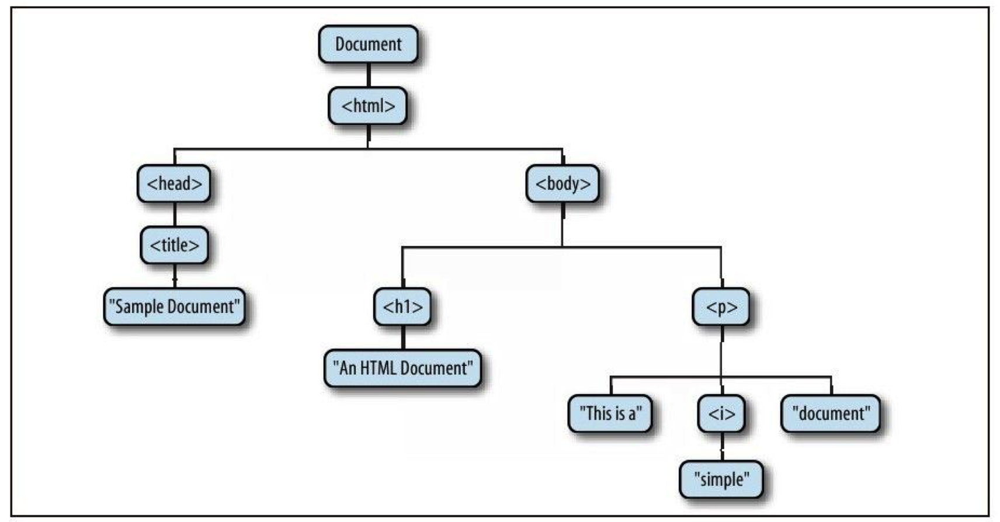

## 5 节点 Node

文档中的每一个部分都是节点,包括document 元素 属性 文本...

### 5.1 节点分类

- document 文档节点
- elementNode 元素节点
- attributeNode 属性节点
- textNode 文本节点
- commentNode 注释节点

### 5.2 节点属性

- nodeName 节点名 元素节点通过nodeName可以获取标签名
- nodeValue 节点值
- nodeType 节点类型 值是数字： document（9） element(1) attribute(2) text(3) comment(8)

# 第三章 DOM 操作

## 1 获取元素

### 1.1 根据id名获取

```js
document.getElementById(idName)
```

### 1.2 根据标签名获取

```js
document.getElementsByTagName(tagName)   // 返回一个集合 （类数组对象）  从整个文档获取
element.getElementsByTagName(tagName)    // 从element的后代元素中获取
```

### 1.3 根据类名获取

```js
document.getElementsByClassName(className)   // 返回一个集合（类数组对象）  从整个文档获取
element.getElementsByClassName(className)   // 从element的后代中获取
```

> 需要 IE9 以上浏览器支持！

### 1.4 根据 name 属性值获取

```js
document.getElementsByName()  //返回集合  只有document才有该方法
```

### 1.5 根据选择器获取

```js
document.querySelector(选择器)   //选择器第一个满足选择器条件的
document.querySelectorAll(选择器) //选择所有满足选择器条件的，返回nodeList（类数组对象）
element.querySelector(选择器)
element.querySelectorAll(选择器)
```

> 需要 IE8 以上浏览器支持！
>
> 比较推荐这种用法。

### 1.6 获取所有的元素

```js
document.all  //所有的元素组成的集合（类数组对象）
//document.all的妙用
if (document.all) {
    //说明是IE浏览器   IE10以及以下版本
} else {
    // 说明非IE浏览器 IE11以及EDGE 
}
```

## 2 文档结构

### 2.1 作为节点树

```
parentNode    父节点
childNode     所有子节点的集合
firstChild    第一个子节点
lastChild     最后一个子节点
previousSibling   上一个兄弟节点
nextSibling       下一个兄弟节点
```

### 2.2 作为元素树

```
parentElement  父元素
children     所有子元素的集合
firstElementChild   第一个子元素  IE9+
lastElementChild    最后一个子元素 IE9+
previousElementSibling  上一个兄弟元素
nextElementSibling    下一个兄弟元素
childElementCount    子元素的数量
ownerDocument     元素所属的文档对象（document）
```

## 3 属性操作

### 3.1 内置属性

```
element.属性名;
```

### 3.2 自定义属性

```
element.getAttribute(attrName)  获取属性的值（只有写到html上的属性，都可获取；一般用于自定义属性）
element.setAttribute(attrName, value)   设置属性的值（一般用于自定义属性）
```

### 3.3 `data-`开头的自定义属性

```
element.dataset.名字
```

## 4 CSS操作

### 4.1 style属性

```js
element,style.属性名  读写css属性

只能读写标签内写在style里面的css属性，设置的css属性添加到标签内的style里
```

### 4.2 读取计算样式（只读）

```
getComputed(元素).属性； //非IE(IE11和Edge)
元素.currentStyle.属性   //IE   获取不到复合属性(background、border)
```

### 4.3 元素的 class 属性

#### ① className

```
element.className 可读可写
返回字符串
元素的class属性的值
```

#### ② classList (IE9+)

```
对象，类数组对象。元素所有class值的列表。
方法：
add() 添加一个class值
remove()  删除一个class值
toggle()  切换一个class值（没有就添加，有就删除）
```

## 5 元素的文本内容

```
用于双标签元素
可读可写

把内容当做HTML：
innerHTML
outerHTML

把内容当做文本
innerText
textContent
```

## 6 元素尺寸位置

### 6.1 元素的尺寸(只读)

```
offsetWidth / offsetHeight   元素尺寸(内容宽高+内边距宽高+边框)
clientWidth / clientHeihgt   元素尺寸（内容宽高+内边距宽高）
scrollWidth / scrollHeight   元素尺寸（如果子元素没有溢出，同client系列；如果子元素溢出：子元素宽度+一个方向的内边距）

getBoundingClientRect()  返回对象（对象中包含width和height属性）   IE8中没有width和heihgt属性
```

### 6.2 元素的位置（只读）

```
offsetLeft / offsetTop  元素位置，在第一个定位的祖先元素上的位置，如果都没定位在根元素上的位置
clientLeft / clientTop  元素边框的宽度

getBoundingClientRect()  返回对象  元素在视口上的位置 
    left        元素的坐左边距离视口左边的距离
    top         
    right        元素的最右边距离视口左边的距离
    bottom
    x    同left
    y   同top
```

### 6.3 内容位置 （可读可写）

```
scrollLeft   元素内容的滚动位置； 值增大，内容向左滚；
scrollTop

生效前提： 子元素溢出父元素，设置父元素overflow：hidden/auto/scroll
```

## 7 节点的添加/删除/替换/克隆

### 7.1 创建元素节点

```
document.createElement(tagName)
```

### 7.2 添加子节点

```
parentElement.appendChild(node)  追加子节点
parentElement.insertBefore(newNode, oldNode)   指定位置插入节点
```

### 7.3 删除子节点

```
parentElement.removeChild(node)
```

### 7.4 替换子节点

```
parentElement.replaceChild(newNode, oldNode)   会把旧的节点删掉换成新的节点
```

### 7.5 克隆节点

```
element.cloneNode(true)  克隆节点
参数 true  深度克隆，元素自己和后代元素都会克隆
    false (默认)  只克隆元素自己，不克隆后代元素
```

## 8 Document

### 8.1 属性

```
referrer   历史记录中上一个地址（只读）
URL            页面地址（只读）
domain        域名（只读）
lastModified   文件的最后一次修改时间（只读）
title       网页标题（可读可写）
cookie        会话内容（可读可写）

documentElement  获取html元素
body              获取body元素
head            获取的head元素
all                获取所有的元素
```

### 8.2 方法

```
write()
```

## 

## 9 documentFragment

### 9.1 关于documentFragment 对象

1）documentFragment 也是一类节点， nodeType 是 11，并不是元素对象，它通常作为其他节点的一个临时的容器。

2）可以给 documentFragment 对象添加子节点，documentFragment 节点也可以作为其他节点（元素）的子节点。

3）documentFragment 不是真实 DOM 树的一部分，它的变化不会触发 DOM 树的重新渲染，且不会导致性能等问题。

### 9.2 创建 documentFragment 对象

```js
document.createDocumentFragment();
```

### 9.3 documentFragment 对象的应用场景

1）如果连续给一个元素添加多个子元素，可以先把子元素添加到 documentFragment 对象中，最后把 documentFragment 对象添加到父元素中，减少浏览器渲染次数。

2）利用 documentFragment 实现对一组元素进行倒序排列。

# 第四章 HTML DOM

## 1 表相关的元素

### 1.1 获取表单元素以及表单控件元素（了解）

```
document.forms   获取页面中所有form元素组成的集合
document.formName   通过form元素的name属性值
formElement.inputName   通过表单控件的name属性值
formElement.elements    所有的表单控件组成的集合 (类数组)
formElement[index]      form元素本身也可以取索引
```

### 1.2 form 元素

```
属性：
length   返回所有表单控件的数量
elements  所有表单控件组成的集合

方法：
submit()
reset()
```

### 1.3 input元素

```
方法：
blur()  失去焦点
focus()  获取焦点
select()  选中里面的文字
```

### 1.4 textarea 元素

```
方法：
blur()  失去焦点
focus()  获取焦点
select()  选中文本
```

### 1.5 select元素

```
属性：
    options  所有option元素的集合
    selectedIndex  被选中的option的索引（如果选中了多个，取第一个）
    length   option元素的个数

方法：
    add(option元素)  追加一个option
    remove(index)  删除指定的索引
    focus()
    blur()

创建option元素：
    new Option(innerText值， value值)
```

## 2 表格相关的元素

### 2.1 table 元素

```
属性：
    rows  所有tr的集合
    cells  所有td和th的集合

方法：
    insertRow(index) 创建并插入一个tr
    deleteRow(index) 删除一行
```

### 2.2 tr 元素 tableRow

```
属性：
    cells  行内所有的单元格的集合
    rowIndex   行的索引

方法：
    insertCell(index)  创建并添加一个td
    deleteCell(index)  删除一个单元格
```

### 2.3 td\th 单元格元素

```
属性：
    cellIndex  单元格的索引（在行内）
```

# 第五章 事件

## 1. 给元素监听/绑定事件

### 1.1 事件的监听/绑定

```js
// 第一种方法  把事件当做标签的属性
<button onclick="fn()"></button>

// 第二种方法， 把事件当做元素对象的方法
btnElement.onclick = fn;

// 第三种方法 事件监听方式
element.addEvenetListener('click', fn);
```

### 1.2 解除事件绑定

```js
// 如果是第一种方式绑定 把事件当做标签属性
element.onclick = null;  //覆盖

// 如果是第二种方式绑定 把事件当做元素对象方法
element.onclick = null;   //覆盖

// 如果是第三种方式绑定 事件监听， 移除监听者
element.removeEventListener('click', fn);
```

### 1.3 事件监听方式的兼容性问题

```js
//IE9+ 以及其他浏览器
addEventListener()
removeEventListener()

// IE8以及以下
attachEvent()  //添加监听 事件名加on
detachEvent()  //移除监听
```

## 2. 事件流

“DOM2级事件”规定的事件流包括三个阶段：

1）**事件捕获阶段**

2）**目标阶段**

3）**事件冒泡阶段**

首先发生的是事件捕获，为截获事件提供了机会。然后是实际的目标接收到事件。最后一个阶段是冒泡阶段，可以在这个阶段对事件做出响应。

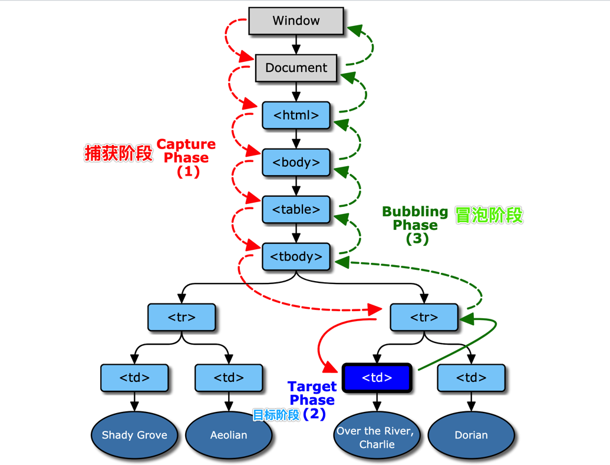

> 默认，事件是在冒泡阶段触发。
>
> addEventListener（） 第三个参数是布尔值，默认是(false)表示冒泡阶段触发，如果设置为true，会在捕获阶段触发。
>
> 其他绑定事件的方式，无法设置在冒泡阶段触发还是捕获阶段触发，统一在冒泡阶段触发。

## 3 this 在事件中的指向

```
① 第一种绑定事件方式 事件当做标签属性
this 在事件属性的值中使用表示触发事件的元素。
通常把 this 当实参，把元素对象传入函数中。

② 第二种方式 把事件当做元素对象的方法
this 指向触发事件的元素对象。

③ 第三种方式 事件监听方式。
this 指向调用 addEventListener 的元素。
```

## 4 常用事件介绍

### 4.1 鼠标事件

```
click              单击
dblclick         双击
contextmenu        右击
mousedown        鼠标按键按下
mouseup            鼠标按键抬起
mousemove        鼠标移动
mouseover        鼠标悬停在元素上
mouseout        鼠标离开元素
mouseenter        mouseover的代替方案 鼠标悬停在元素上        （IE9+）
mouseleave        mouseout的代替方法  鼠标离开元素          (IE9+)
```

### 4.2 键盘事件

```
keydown   键盘的按键按下
keyup      键盘的按键抬起
keypress  键盘的按键按下（字符按键）
```

### 4.3 文档事件

```
load               加载完成
unload           文档关闭  浏览器绑定该事件的时候，不允许弹框。
beforeunload    文档关闭之前
```

### 4.4 表单事件

```
submit        表单提交的时候
reset        表单重置的时候
blur        当表单控件失去焦点的时候
focus        当表单控件获取焦点的时候
select      当输入框内的文本被选中的时候
change        表单控件内容改变的时候 用于select或者input:radio以及input:checkbox
```

### 4.5 图片事件

```
load       图片加载完毕
error      图片加载错误
abort        图片加载中断
```

### 4.6 其他事件

```
scroll     内容发生滚动  绑定给有滚动条的元素或者window
resize     视口大小发生变化  绑定给window
```

## 5 Event对象

在触发 DOM 上的某个事件时，会产生一个事件对象 event，这个对象中包含着所有与事件有关的信息。包括导致事件的元素、事件的类型以及其他与特定事件相关的信息。例如，鼠标操作导致的事件对象中，会包含鼠标位置的信息，而键盘操作导致的事件对象中，会包含与按下的键有关的信息。

### 5.1 Event 对象的获取

浏览器会将一个 event 对象传入到事件处理程序中。无论指定事件处理程序时使用什么方法（DOM0 级或 DOM2 级），都会传入 event 对象。

```js
var btn = document.getElementById("myBtn"); 
btn.onclick = function(event){ 
 alert(event.type); //"click" 
}; 

btn.addEventListener("click", function(event){ 
 alert(event.type); //"click" 
}, false);
```

### 5.2 鼠标事件对象 MouseEvent

```
clientX / clientY        鼠标在视口上的位置
offsetX / offsetY        鼠标在元素上的位置
pageX / pageY            鼠标在页面上（根元素上）的位置
screenX / screenY        鼠标在屏幕上的位置    
button                    鼠标按键键值 （0表示左键，1表示滑轮， 2表示右键）
```

### 5.3 键盘事件对象 KeyboardEvent

```
keyCode  键盘按键对应的ascii值
which    同keyCode
key         键盘按键的值 （返回是字符串）  dom3
```

### 5.4 所有的事件对象共有的属性

```
type        返回事件类型（事件名）
timestamp   触发事件时的时间戳（从页面打开的那一刻开始计算）
target        获取目标元素 可以用于事件委托
stopPropagation()   阻止冒泡
preventDefault()    阻止默认行为（一些元素发生某些事件之后又默认行为）
```

## 6 事件委托

**事件委托**，就是把一个元素响应事件的函数委托到另一个元素。

一般来讲，会把一个或者一组元素的事件委托到它的父层或者更外层元素上，真正绑定事件的是外层元素，当事件响应到目标元素上时，会通过事件冒泡机制从而触发它的外层元素的绑定事件上，然后在外层元素上去执行函数。

我们可以使用 event 对象中的 target 属性来判断目标元素。

```js
 //给一个一直都存在的元素绑定事件
box.onclick = function(event){
  //判断 如果点击的 .item元素
  if (event.target.className.indexOf('item') >= 0) {
    event.target.classList.toggle('active');
  }
};
```

**事件委托的优势：**

1）减少内存消耗。

2）可以动态绑定事件，给动态添加的元素也绑定事件。

# 第一章 基础深入总结

## 1 数据类型

#### ① 分类

```
原始类型/基础类型/值类型：
    String
    Number
    Boolean
    Null
    Undefined

对象类型/引用类型
    Object  基本对象
    Array
    Function
    .....
```

#### ② 类型判断

```
typeof    
    两种形式：typeof函数，typeof运算符
    能判断： string、boolean、number、undefined、function
    不能判断： null和除了Function的对象类型

instanceof
    判断对象类型

==== 全等
    两个操作数，类型和值都要相等，不会自动类型转换，区分==
    判断 null和undefined
```

#### ③ 相关问题

```
1. null和undefined的区别
    undefined 代表变量没有赋值
    null 代表变量赋值，只是值为null

2. 什么情况下数据类型是undefined
    ① 变量未赋值
    ② 函数的形参没有对应的实参
    ③ 函数没有返回值
    ④ 使用对象中不存在的属性

3. 什么情况下给变量赋值为null
    ① 定义变量，暂时不需要设置其他值，先设置为null
    ② 定义对象的某个属性，暂时不需要值
    ③ 如果一个不使用的对象，设置为null，对象会变为垃圾对象，被回收。
```

## 2 数据、变量和内存

#### ① 什么是数据？

```
* 存储于内存中代表特定信息的'东东', 本质就是0101二进制
* 具有可读和可传递的基本特性
* 万物(一切)皆数据, 函数也是数据
* 程序中所有操作的目标: 数据
```

#### ② 什么是变量?

```
变量就是可变的量
变量就是一小块内存的标识，里面存的数据
```

#### ③ 什么是内存？

```
* 内存条通电后产生的存储空间(临时的)
* 产生和死亡: 内存条(集成电路板)==>通电==>产生一定容量的存储空间==>存储各种数据==>断电==>内存全部消失
* 内存的空间是临时的, 而硬盘的空间是持久的
* 一块内存包含2个数据
  * 内部存储的数据(一般数据/地址数据)
  * 内存地址值数据
* 内存分类
  * 栈: 全局变量, 局部变量 (空间较小)
  * 堆: 对象 (空间较大)
```

#### ④ 数据、变量、内存之间的关系

```
内存是一块存储空间，里面存数据
变量是对象这块内存标识，通过变量名可以找到这块内存，从而获取数据
```

#### ⑤ 相关问题

```
var a = xxx, a内存中到底保存的是什么?
    xxx是基本类型/原始类型
    xxx是对象类型
    xxx是变量
var a = 100;
//在栈里面把100这个值存下来

var a = new Date();
// 堆中开辟控件，存储对象；  栈存地址

var b = a;
// a变量的栈存的是什么， b就复制一份
```

## 3 垃圾回收机制 Garbage Collection

#### ① 什么是垃圾？

- 一个对象没有被引用，就是垃圾对象。

#### ② 垃圾回收

- 清空垃圾对象，释放内存。
- JavaScript/Java/Python等: 自动垃圾回收
- C/C++: 手动回收

#### ③ 内存泄漏

- 垃圾对象没有被清除，导致内存空间被占用
- 内存空间越占越多，导致程序卡顿甚至死机

#### ④ 垃圾回收的算法（机制）

- 引用计数 （IE9以及以下）
- 标记清除 （除了IE和新的IE）

#### ⑤ 引用计数

```
- ① 对象有个引用标记
- ② 如果对对象进行了引用 +1
- ③ 取消了对象对象的引用 -1
- ④ 当引用标记=0的时候，变为垃圾对象，并删除
- 优点： 及时清除垃圾对象
- 缺点： 互相引用的对象导致内存泄漏
```

#### ⑥ 标记清除

```
- 标记阶段：从根对象出发，每一个可以从根对象访问到的对象都会被添加一个标记，于是这个对象就被标识为可到达对象。
- 清除阶段：垃圾回收器，会对内存从头到尾进行线性遍历，如果发现有对象没有被标记为可到达对象，那么就将此对象占用的内存回收。
                  并且将原来标记为可到达对象的标识清除，以便进行下一次垃圾回收操作。
- 优点：  不会内存泄漏
- 缺点：  深度递归变量，定时的标记定时取清除
```

# 第二章 函数高级

## 1 执行上下文和执行栈

### 1.1 执行上下文

```
全局执行上下文
    ① 在执行全局代码前将window确定为全局执行上下文
    ② 对全局数据进行预处理
        var定义的全局变量==>undefined, 添加为window的属性
        function声明的全局函数==>赋值(fun), 添加为window的方法
        this==>赋值(window)
     ③ 开始执行全局代码

函数执行上下文：
    ① 在调用函数, 准备执行函数体之前, 创建对应的函数执行上下文对象
    ② 对局部数据进行预处理
        形参变量==>赋值(实参)==>添加为执行上下文的属性
        arguments==>赋值(实参列表), 添加为执行上下文的属性
        var定义的局部变量==>undefined, 添加为执行上下文的属性
        function声明的函数 ==>赋值(fun), 添加为执行上下文的方法
        this==>赋值(调用函数的对象)
    ③ 开始执行函数体代码
```

### 1.2 执行栈

执行栈，也就是在其它编程语言中所说的“调用栈”，是一种拥有 LIFO（后进先出）数据结构的栈，被用来存储代码运行时创建的所有执行上下文。

当 JavaScript 引擎第一次遇到你的脚本时，它会创建一个全局的执行上下文并且压入当前执行栈。每当引擎遇到一个函数调用，它会为该函数创建一个新的执行上下文并压入栈的顶部。

引擎会执行那些执行上下文位于栈顶的函数。当该函数执行结束时，执行上下文从栈中弹出，控制流程到达当前栈中的下一个上下文。

```js
1. 在全局代码执行前, JS引擎就会创建一个栈来存储管理所有的执行上下文对象
2. 在全局执行上下文确定后, 将其添加到栈中(压栈)
3. 在函数执行上下文创建后, 将其添加到栈中(压栈)
4. 在当前函数执行完后,将栈顶的对象移除(出栈)
5. 当所有的代码执行完后, 栈中只剩下全局执行上下文
<!--
1. 依次输出什么?
2. 整个过程中产生了几个执行上下文?
-->
<script type="text/javascript">
  console.log('global begin: '+ i); //globa begin undeifined
  var i = 1;
  foo(1);
  function foo(i) {
    if (i == 4) {
      return;
    }
    console.log('foo() begin:' + i);
    foo(i + 1);
    console.log('foo() end:' + i);
  }
  console.log('global end: ' + i); 
</script>
```

## 2 作用域和作用域链

#### ① 作用域

```
作用域就是变量的作用范围

分类：
    全局作用域
    函数作用域（局部作用域）

特点：
    在函数声明的时候就决定了，跟函数在哪里调用没有关系
```

#### ② 作用域和执行上下文的关系

```
1. 区别1
  * 全局作用域之外，每个函数都会创建自己的作用域，作用域在函数定义时就已经确定了。而不是在函数调用时
  * 全局执行上下文环境是在全局作用域确定之后, js代码马上执行之前创建
  * 函数执行上下文环境是在调用函数时, 函数体代码执行之前创建
2. 区别2
  * 作用域是静态的, 只要函数定义好了就一直存在, 且不会再变化
  * 上下文环境是动态的, 调用函数时创建, 函数调用结束时上下文环境就会被释放
3. 联系
  * 上下文环境(对象)是从属于所在的作用域
  * 全局上下文环境==>全局作用域
  * 函数上下文环境==>对应的函数使用域
```

#### ③ 作用域链

```
函数内嵌套函数，产生作用域链

在函数内使用某个变量，先从本函数作用域中查找；如果查找不到取上层函数作用域查找；直到全局作用域
```

## 3 闭包

#### ① 什么是闭包

```
1）简单讲，闭包就是指有权访问另一个函数作用域中的变量的函数。
2）MDN 上面这么说：闭包是一种特殊的对象。它由两部分构成：函数，以及创建该函数的环境。环境由闭包创建时在作用域中的任何局部变量组成。
```

#### ② 如何产生闭包

```
1)在一个函数 A 内部创建另一个函数 B；
2)函数 B 中引用上层函数也就是函数 A 中的数据（函数 A 声明的变量）；
3)函数A 把函数 B 作为返回值返回，或者函数 B 被其他方式引用（如作为事件监听函数）。
function A(){  
  var a = 1,b = 2;  

  function B(){  
    return a+b;  
  }  
  return B;  
}  
var fn = A(); // 返回的是函数B
```

> **闭包常见的形式：**
>
> 1. 把被嵌套的函数返回
> 2. 把被嵌套的函数作为回调函数（事件的回调函数、定时器）

#### ③ 闭包的作用（影响）

```
1. 函数内部的变量长时间存储在内存中（被内部的函数引用了），延长了局部变量的声明周期
2. 在函数的外部操作（读写）函数内部的数据（变量\函数）
```

#### ④ 闭包与作用域

```
1) 函数外不能引用函数内的变量，在函数外无法使用 A 中的变量 a 和 b；
2) 函数 B 可以引用上层作用域中的变量 a 和 b；
3) 函数 A 调用结束后的返回值赋值给了 fn，通过调用 fn 我们就间接在函数外部调用了 A 中的变量 a 和 b。
```

#### ⑤ 闭包与垃圾回收机制

```
1）在javascript中，如果一个对象不再被引用，那么这个对象就会被垃圾回收机制回收；
2）通常，函数的作用域及其所有变量都会在函数执行结束后被销毁。
3）但是，在创建了一个闭包以后，及时函数执行结束，函数作用域内的变量也不会被销毁；
4）以上面代码的函数 A 为例，由于A 最后返回了函数 B，而B中引用了 A中的变量a和变量b，在 A 调用结束后，由于返回值中引用了 a 和 b（引用关系存在不会触发垃圾回收机制），所以a和b都不会被销毁。
```

#### ⑥ 闭包：定义js模块

```
JS模块：具有特定功能的文件
把模块内所有的数据和功能封装在一个函数内（私有的）
模块向外暴露一个对象，对象中想要对外的方法和属性

暴露方式： ①直接return  ②作为window的属性
```

#### ⑦ 闭包的缺点

```
函数闭包之后，里面的变量会长时间存在于内存中，可能会造成内存泄漏

解决方案：
    闭包能不用不用
    减少对闭包引用次数
    及时释放，把引用闭包的对象变为null（垃圾）
```

#### ⑧ 相关面试题

##### 题目 1

```js
/*
   说说它们的输出情况
*/

//代码片段一
var name = "The Window";
var object = {
  name: "My Object",
  getNameFunc: function () {
    return function () {
      return this.name;
    };
  }
};
console.log(object.getNameFunc()());  

//代码片段二
var name2 = "The Window";
var object2 = {
  name2: "My Object",
  getNameFunc: function () {
    var that = this;
    return function () {
      return that.name2;
    };
  }
};
console.log(object2.getNameFunc()()); //? MyObject
```

##### 题目 2

```js
/*
   说说它们的输出情况
   */

function fun(n, o) {
  console.log(o);
  return {
    fun: function (m) {
      return fun(m, n)
    }
  }
}
var a = fun(0);  
a.fun(1);           
a.fun(2);           
a.fun(3);           

var b = fun(0).fun(1).fun(2).fun(3);

var c = fun(0).fun(1);  
c.fun(2);  
c.fun(3);
```

# 第三章 对象高级

## 1. 创建对象的方式

#### ① Object构造函数

```js
new Object()
适用场景： 开始不确定对象的内部数据
缺点： 添加属性方法的时候，代码比较多
```

#### ② 字面量/直接量方式

```
{属性:值}
适用场景： 一开始明确对象内部的数据
缺点： 如果创建多个对象，代码量大
```

#### ③ 工厂模式

```js
function factory() {
    return {

    }
}
var obj = factory();
适用场景： 需要创建的对象比较多
缺点： 对象的类型都是Object类型的，无法拥有自己的类型
```

#### ④ 自定义构造函数

```js
function Person(){
    this.属性 = 值
}
```

#### ⑤ 自定义构造函数与原型相结合

```js
function Person(){
    this.属性 = 值
}
Person.prototype,getName = function(){}
属性定义在构造函数内部，方法定义在构造函数的显示原型（实例的原型）
```

## 2 实现面向对象的继承

#### ① 利用原型链继承

**示例代码：**

```js
function Super() {}


function Sub() {

}
Sub.prototype = new Super();
Sub.prototype.constructor = Sub;
```

**实现思路：**

```
1. 让子类（Sub）的显示原型 = 父类(Super)的一个实例。
2. 设置子类(Sub)的显示原型的 constructor 属性指向子类。
```

**缺点：**

```
1. 无法在子类实例化的时候给父类的属性赋值。
// 定义父类
function Person(name, age) {
  this.name = name;
  this.age = age;
}
Person.prototype.say = function(){
  console.log('hello，My Name is '+this.name);
};

// 定义子类
function Man(name, age, info) {
  this.info = info; 
}

// 修改Man的显示原型（实例的原型）
Man.prototype = new Person();
Man.prototype.constructor = Man;

//创建一个 Man 的实例
var m = new Man('科比', 17, '我是男人');
m.say(); // hello，My Name is undefined
```

#### ② 在子类中调用父类

**示例代码：**

```js
function Super() {

}

function Sub() {
    Supper.call(this, ...)
}
```

**实现思路：**

```
1. 在子类(Sub)中调用父类函数(Super)，并改变 this 指向子类实例。
2. 父类（Super）中定义的方法会添加到子类（Sub）实例中。
```

**缺点：**

```
1. 无法继承到父类现实原型上的方法。
// 定义父类
function Person(name, age) {
  this.name = name;
  this.age = age;

  this.say = function(){
    console.log('hello，My Name is '+this.name);
  };
}
Person.prototype.eat = function(){
  console.log('我是'+this.name+',我能吃');
};

// 定义子类
function Man(name, age, info) {
  //调用父类，把 this 指向 Man 的实例
  Person.call(this, name, age);
  //添加自己的属性
  this.info = info;
}

//实例化
var m = new Man('Tom', 10, '我是男人');
console.log(m.name, m.age, m.info);  // Tom 10 我是男人
m.say();  // hello，My Name isTom
m.eat();  // TypeError: m.eat is not a function
```

#### ③ 组合方式

**示例代码：**

```js
function Super(){

}

function Sub() {
    Super.call(this)
}

Sub.prototype = new Super();
Sub.prototype.constructor = Sub;
```

**实现思路：**

```js
1. 通过子类中调用父类函数，实现父类中属性和方法的继承。
2. 通过改变原型继承父类现实原型上的数据。
```

## 3 对象的高级特性

### 3.1 数据属性

数据属性包含一个数据值的位置，在我们之间所使用的对象属性一般都是**数据属性**。

数据属性有如下 4 个特性：

1）`Configurable`：表示能否通过 delete 删除属性从而重新定义属性，能否修改属性的特性，或者能否把属性修改为访问器属性。直接在对象上定义的属性，它们的这个特性默认值为 true。

2）`Enumerable`：表示能否通过 for-in 循环返回属性。直接在对象上定义的属性，它们的这个特性默认值为 true。

3）`Writable`：表示能否修改属性的值。直接在对象上定义的属性，它们的这个特性默认值为 true。

4）`Value`：包含这个属性的数据值。读取属性值的时候，从这个位置读；写入属性值的时候，把新值保存在这个位置。这个特性的默认值为 undefined。

**可以通过下面方式设置属性的特性：**

```js
var person = {}; 
Object.defineProperty(person, "name", { 
 writable: false, 
 value: "Nicholas" 
});
```

### 3.2 访问器属性

访问器属性不包含数据值；它们包含一对儿 getter 和 setter 函数。在读取访问器属性时，会调用 getter 函数，这个函数负责返回有效的值；在写入访问器属性时，会调用setter 函数并传入新值，这个函数负责决定如何处理数据。

访问器属性有如下 4 个特性：

1）`Configurable`：表示能否通过 delete 删除属性从而重新定义属性，能否修改属性的特性，或者能否把属性修改为数据属性。

2）`Enumerable`：表示能否通过 for-in 循环返回属性。

3）`Get`：在读取属性时调用的函数。默认值为 undefined。

4）`Set`：在写入属性时调用的函数。默认值为 undefined。

**可以通过如下方式为对象设置访问器属性：**

```js
var book = { 
 _year: 2004, 
 edition: 1 
}; 
Object.defineProperty(book, "year", { 
 get: function(){ 
   return this._year; 
 }, 
 set: function(newValue){ 
   if (newValue > 2004) { 
     this._year = newValue; 
     this.edition += newValue - 2004; 
   } 
 } 
});
```

### 3.3 定义多个属性

`Object.defineProperties()` 这个方法可以通过描述符一次定义多个属性。

```js
var book = {}; 
Object.defineProperties(book, { 
 _year: { 
     value: 2004 
 }, 
 edition: { 
     value: 1 
 }, 
 year: { 
     get: function(){ 
         return this._year; 
     }, 
     set: function(newValue){ 
         if (newValue > 2004) { 
             this._year = newValue; 
             this.edition += newValue - 2004; 
         } 
     } 
 } 
});
```

### 3.4 读取属性特性

`Object.getOwnPropertyDescriptor()`方法可以取得给定属性的描述符。

```js
Object.getOwnPropertyDescriptor(book, "year");
```

## 4 安全的类型检测

在任何值上调用 Object 原生的 toString()方法，都会返回一个 [object NativeConstructorName] 格式的字符串。每个类在内部都有一个[[Class]] 属性，这个属性中就指定了上述字符串中的构造函数名。

```js
console.log(Object.prototype.toString.call(value)); //"[object Array]"
```

> Object 的 toString()方法不能检测非原生构造函数的构造函数名。因此，开发人员定义的任何构造函数都将返回[object Object]。

# 第四章 线程机制和事件机制

### 4.1 进程和线程

```
进程：
    程序的一次执行, 它占有一片独有的内存空间

线程：
    CPU的基本调度单位, 是程序执行的一个完整流程


进程和线程：
  * 一个进程中一般至少有一个运行的线程: 主线程。
  * 一个进程中也可以同时运行多个线程, 我们会说程序是多线程运行的。
  * 一个进程内的数据可以供其中的多个线程直接共享。
  * 多个进程之间的数据是不能直接共享的。
```

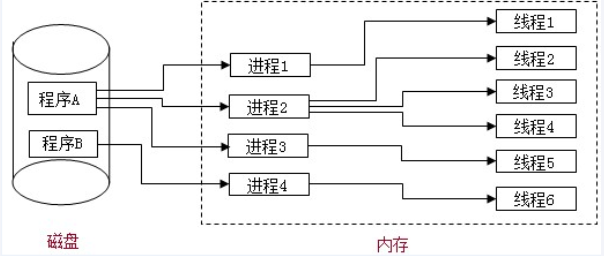

### 4.2 JavaScript是单线程执行

```
1. 如何证明JavaScript是单线程执行？
   设置了定时器，定时器的回调函数会等到主线程空闲且时间到执行；
   如果主线程没有空闲下来，即使定时器的时间到了，回调函数也不会执行（等到主线程空闲）。

2. 为什么JavaScript选择单线程？
   多线程会有线程调度以及线程开启关闭的开销
   JavaScript主要在浏览器端操作DOM完成特效，如果不是单线程，不好解决页面渲染的同步问题。
```

### 4.3 事件轮询（循环）机制

事件轮询（Event Loop）是 JS 实现异步的具体解决方案，同步代码直接执行，异步函数或代码块先放在异步队列中，待同步函数执行完毕，轮询执行异步队列的函数。

```
执行栈（调用栈）：   要执行的代码进入执行栈
回调队列： 计时器过期或者事件触发亦或者接收到ajax响应，现在回调被推送到回调队列。但是回调不会立即执行，这就是事件轮询开始的地方。
管理模块： DOM事件管理、定时器管理、ajax请求管理
事件轮询： 事件轮询的工作是监听执行堆栈，并确定执行堆栈是否为空。如果执行堆栈是空的，它将检查回调队列，看看是否有任何挂起的回调等待执行。
```


**一道经典题目：**

```js
//问题描述：请写出最终的输出值，并解释原因
var value1 = 0, value2 = 0, value3 = 0;

for ( var i = 1; i <= 3; i++) {
  var i2 = i;
  (function() {
    var i3 = i;
    setTimeout(function() {
      value1 += i;
      value2 += i2;
      value3 += i3;
    }, 1);
  })();
}

setTimeout(function() {
        console.log(value1, value2, value3);
}, 100);
```

### 4.4 JS多线程

```
利用Worker可以实现多线程运算符
通过实例化一个Worker，创建一个子线程
子线程里面不允许操作DOM，也没有window
worker适合场景：
    把耗时的计算放在分线程，不会影响主线程的其他工作
    如果耗时的计算在主线程，导致页面卡顿（甚至崩溃）

worker的缺点：
    ① 无法操作DOM
    ② 无法跨域
    ③ 兼容性（不是所有的浏览器都可以使用）
Worker 构造函数
Worker.prototype.postMessage()  向分线程发送数据
Worker.prototype.onmessage      监听分线程的消息
```

