# HTML

# HTML 基本语法

## 1 HTML 标签

- 标签是HTML中最基本单位,也是最重要组成部分
- 通常要用两个角括号括起来:`<`和`>`
- 标签都是闭合的（两种形式：成对与不成对）
- 双标签（成对）: `<标签名>内容</标签名>` 如：`<table></table>` 即分起始和结束
- 单标签（不成对）: `<标签名 />`; 如： `<br/>`、`<hr/>`
- 标签是大小写无关的,`<body>`;跟`<BODY>`表示意思是一样的，标准推荐使用小写，这样符合XHTML标准。
- 对于HTML标签来讲，最重要的是**语义。**

## 2 HTML 标签属性

- HTML属性一般都出现在HTML的开始标签中, 是HTML标签的一部分。

- 标签可以有属性,它包含了额外的信息.属性的值一定要在双引号中。

- 标签可以拥有多个属性。

- 属性由属性名和值成对出现。

- 语法格式如下：

  ```html
  <标签名 属性名1="属性值" 属性名2="属性值" ... 属性名N="属性值">
    <!– 输出内容…  -->
  </标签名>
  ```

## 3 如何掌握一个 HTML 标签

要掌握一个 HTML 标签，我们需要记住以下几点：

- ① 标签的语义、作用。
- ② 该标签有哪些属性，属性的值是怎样的。
- ③ 该标签是单标签还是双标签。

## 4 HTML代码格式

任何回车或空格在源代码中都是不起作用， 所以在编写HTML代码时，都可以使用回车或者空格进行代码排版， 这样可以使代码清晰，也便于团队合作。必须保持严格的缩进规则，以`Tab`键为准。

```html
<!DOCTYPE html>
<html lang="en">
<head>
    <meta charset="UTF-8">
    <title>网站</title>
</head>
<body>
    <div class="container">
        <div class="header">
            <div class="logo"></div>
            <div class="nav"></div>
        </div>
        <div class="main"></div>
    </div>
</body>
</html>
```

## 5 HTML 注释

```html
<!-- 注释内容 -->
<!--
    这里全是注释
    都是注释
-->
```

## 6 文档声明

你可使用此声明在 Internet Explorer 6 及以后版本中切换为严格的标准兼容模式。

```html
<!DOCTYPE HTML PUBLIC "-//W3C//DTD HTML 4.01//EN" "http://www.w3.org/TR/html4/strict.dtd">

<!DOCTYPE html PUBLIC "-//W3C//DTD XHTML 1.0 Transitional//EN"
 "http://www.w3.org/TR/xhtml1/DTD/xhtml1-transitional.dtd">

<!DOCTYPE html>
```

# HTML 常用标签

## 1 主体结构标签

| 标签名 | 标签的语义和作用 | 标签的属性 | 是单标签还是双标签 |
| ------ | ---------------- | ---------- | ------------------ |
| html   | 页面最外层       |            | 双                 |
| head   | 页面头部         |            | 双                 |
| body   | 页面主体         |            | 双                 |

## 2 HEAD 标签

| 标签名 | 标签的语义和作用                                             | 标签的属性                                                   | 是单标签还是双标签 |
| ------ | ------------------------------------------------------------ | ------------------------------------------------------------ | ------------------ |
| title  | 页面标题                                                     |                                                              | 双                 |
| meta   | 页面元信息： ① 设置字符集编码 ② 设置关键字和描述信息         | charset：值是字符编码 name: 值是 keywords 或 description content: 值根据 name 属性的值填写 | 双                 |
| base   | 为页面上的所有链接规定默认地址或默认目标 一个页面最多只能使用一个 base 元素，用来提供一个指定的默认目标。 | href: 规定页面中所有相对链接的基准 URL。 target: 规定页面中所有的超链接和表单在何处打开。值为`_blank`/`_self` | 单                 |
| style  | 定义 HTML 文档的样式信息。 该标签也可放在 head 之外。        | type: 规定样式表的 MIME 类型，默认`text/css`                 | 双                 |
| link   | 引入文档与外部资源的关系 该标签也可放在 head 之外。          | href：定义被链接文档的位置 rel：定义当前文档与被链接文档之间的关系。 type：规定样式表的 MIME 类型，默认`text/css` | 双                 |
| script | 定义客户端脚本，比如 JavaScript。script 元素既可以包含脚本语句，也可以通过 src 属性指向外部脚本文件。 该标签也可放在 head 之外。 | src：规定外部脚本的 URL type: 规定脚本的 MIME 类型，默认`text/javascript` | 双                 |

> 案例：link 标签可以用于引入外部 css 文件或者引入页面窗口小图标

```html
<!--导入外部CSS文件-->
<link rel="stylesheet" type="text/css"  href="style.css"></link>
<!--导入页面窗口小图标--->
<link rel="shortcut icon" type="images/x-icon" href="http://www.baidu.com/favicon.ico">
```

> 附：常用 MIME 类型
>
> text/html
>
> text/xml
>
> image/jpeg
>
> image/png
>
> image/gif
>
> image/x-icon
>
> .....

## 3 格式排版标签

| 标签名 | 标签的语义和作用           | 标签的属性 | 是单标签还是双标签 |
| ------ | -------------------------- | ---------- | ------------------ |
| h1~h6  | 标题                       |            | 双                 |
| p      | 段落                       |            | 双                 |
| hr     | 分割线                     |            | 单                 |
| br     | 换行                       |            | 单                 |
| pre    | 按原文显示                 |            | 双                 |
| div    | 没有任何语义，用于页面布局 |            | 双                 |

## 4 文本标签

| 标签名 | 标签的语义和作用                 | 标签的属性 | 是单标签还是双标签 |
| ------ | -------------------------------- | ---------- | ------------------ |
| em     | 表示强调，通常为斜体字           |            | 双                 |
| strong | 表示强调(语气更强)，通常为粗体字 |            | 双                 |
| del    | 定义文档中已删除的文本。         |            | 双                 |
| ins    | 定义已经被插入文档中的文本。     |            | 双                 |
| sub    | 文字下标字字体。                 |            | 双                 |
| sup    | 文字上标字体                     |            | 双                 |

```html
<!--一下文本标签  作为了解-->
<cite>    用于引证、举例、(标签定义作品（比如书籍、歌曲、电影、电视节目、绘画、雕塑等等）的标题)通常为斜体字
<dfn> 定义一个定义项目
<code> 定义计算机代码文本
<samp> 定义样式文本 标签并不经常使用。只有在要从正常的上下文中将某些短字符序列提取出来，对它们加以强调的极少情况下，才使用这个标签。
<kbd> 定义键盘文本。它表示文本是从键盘上键入的。它经常用在与计算机相关的文档或手册中。
<abbr> 定义缩写 配合title属性  (IE6以上)
<bdo>  来覆盖默认的文本方向 dir属性 值: lrt  rtl
<var> 定义变量。您可以将此标签与 <pre> 及 <code> 标签配合使用。
<small> 标签定义小型文本（和旁注）
<b>    粗体字标签 根据 HTML 5 的规范，<b> 标签应该做为最后的选择，只有在没有其他标记比较合适时才使用它。
<i>    斜体字标签 标签被用来表示科技术语、其他语种的成语俗语、想法、宇宙飞船的名字等等。
<u>    下划线字体标签 标签定义与常规文本风格不同的文本，像拼写错误的单词或者汉语中的专有名词。 请尽量避免使用 <u> 为文本加下划线，用户会把它混淆为一个超链接。
<q>  签定义一个短的引用。浏览器经常会在这种引用的周围插入引号。(小段文字)
<blockquote> 标签定义摘自另一个源的块引用。浏览器通常会对 <blockquote> 元素进行缩进。(大段文字) (块状元素)
<address>  定义地址 通常为斜体 (注意非通讯地址)  块状元素
<font>     H5已删除 字体标签，可以通过标签的属性指定文字的大小、颜色及字体等信息
<tt>       H5已删除 打字机文字
<big>      H5已删除 大型字体标签
<strike>   H5已删除 添加删除线
<acronym>  H5已删除 首字母缩写 请使用<abbr>代替
```

# HTML 功能标签

## 1 图片

### 1.1 img 标签

```html

```

**属性：**

**alt** -- 代表图像的替代文字

**src** -- 代表一个图像源(就是图像的位置)

**border** – 代表图片边框的宽度

**height** -- 代表一个图像的高度

**width** -- 代表一个图像的宽度

### 1.2 常见图片格式

**GIF** -- 最多支持256色,支持透明,支持多帧动画显示效果.

**JPEG** -- 支持多种颜色,可以有很高的压缩比,使用了有损压缩,不支持透明,不支持动画效果.

**PNG** -- 是一种新的图片技术,可以表现品质比较高的图片,使用了无损压缩,支持透明,不支持动画.

## 2 超链接和锚点

### 2.1 超链接

```html
<a href='要跳转的地址'>超链接文字</a>
```

#### ① a 标签的属性

**href** -- 代表一个url链接源(就是链接到什么地方)

```
url 除了是网页外,还可以是其它的文件(如文本文件,pdf文件等)。 
url 还可以是指向HTML文件中的一个位置。 
url 还可以是Email地址。
```

**target** -- 用来指出哪个窗口或框架应该被此链接打开

```
target=_blank： 将链接内容在新的浏览窗口中打开。 
target=_self：  将链接的内容，显示在目前的窗口中。 (默认)
target=_parent：将链接的内容，当成文件的上一个画面。 
target=_top：这个参数可以解决新内容被旧框窗包围的困扰，使用这参数，会将整个画面重新显示成链接的画面内容。
```

#### ② 超链接示例

```html
网站链接：     <a href="http://www.atguigu.com">尚硅谷</a>
电子邮件链接： <a href="mailto:fuming@atguigu.com">写信给我</a>
电话             <a href="tel:10086">10086</a>
短信          <a href="sms:10086">发短息给我</a>
```

### 2.2 锚点

#### ① 定义锚点

```
用 <a name=“”> 定义，例如：<a name=“here1”>第一部分</a>，
使用标签配合 id 属性定义，例如 <div id="header"></div>
```

#### ③ 跳转到锚点

```
本页面内跳转  <a href="#锚点名">跳转</a>
跳转到指定页面指定锚点  http://www.lampuser.com/index.html#section2
```

## 3. 列表标签

| 标签名 | 标签的语义和作用                   | 标签的属性 | 是单标签还是双标签 |
| ------ | ---------------------------------- | ---------- | ------------------ |
| li     | 列表项，被嵌套在 ul 或者 ol 的里面 |            | 双                 |
| ul     | 无序列表                           |            | 双                 |
| ol     | 有序列表                           |            | 双                 |
| dl     | 自定义列表                         |            | 双                 |
| dt     | 列表主题                           |            | 双                 |
| dd     | 列表描述，对列表主题的描述         |            | 双                 |

## 4. 表格标签

| 标签名  | 标签的语义和作用 | 标签的属性                                                   | 是单标签还是双标签 |
| ------- | ---------------- | ------------------------------------------------------------ | ------------------ |
| table   | 表格             | width: 设置表格的宽度（建议用css设置） height: 设置表格的高度（建议用css设置） border: 设置表格的边框（建议用css设置） cellspacing: 设置单元格之间的间隙（建议用css设置） cellpadding：设置单元格内边距（建议用CSS设置） align: 对齐方式 left/top/center（建议用css设置） | 双                 |
| caption | 表格标题         |                                                              | 双                 |
| thead   | 表格头部         |                                                              | 双                 |
| tbody   | 表格主体         |                                                              | 双                 |
| tr      | 行               |                                                              | 双                 |
| td      | 单元格           | colspan: 指定跨越的列数 rowspan:指定跨越的行数               | 双                 |
| th      | 表头单元格       | colspan: 指定跨越的列数 rowspan:指定跨越的行数               | 双                 |

> 注意：
>
> thead、tbody、tfoot 都有属性 align、valign
>
> tr、th、td 都有属性 width、height、align、valign

## 5 表单标签

| 标签名   | 标签的语义和作用     | 标签的属性                                                   | 是单标签还是双标签 |
| -------- | -------------------- | ------------------------------------------------------------ | ------------------ |
| form     | 表单                 | **action:** 指定表单提交的地址 **method:** 指定表达的提交方式 **target:** 同超链接的 target 属性 | 双                 |
| label    | 关联其他的表单控件   | **for：**指定其他要关联的表单控件的ID                        | 双                 |
| input    | 输入框               | **name:** 标识该输入框，后端用改标识获取数据（暂时不用） **type:** 指定输入框的类型值：text / password / submit / reset / button / radio / checkbox **value:** type 属性的值不同，value具有不同的意义；type值如果是button/submit/reset,value指定按钮的文字；type如果是text/password,value指定默认文字，如果type是checkbox/radio,value指定真正提交到后台的值。 **checked:** 为 radio 和 checkbox设置默认选项。 **length:** 设置输入框的最大输入长度（text 和 password） **size：** 设置输入框尺寸（text 和 password） | 单                 |
| select   | 下拉选择框           | **name:** 标识该输入框，后端用改标识获取数据（暂时不用）     | 双                 |
| option   | 下拉选项             | **value：**指定真正提交到后台的值。（暂时不用） **selected:** 表示默认选中 | 双                 |
| optgroup | 下拉选项分组         | **label：** 为选项组规定描述                                 | 双                 |
| textarea | 文本域               | **name:** 标识该输入框，后端用改标识获取数据（暂时不用） **rows：** 文本域行数，能决定文本域的高度 **cols：**文本域列数，能决定文本域的宽度 | 双                 |
| fieldset | 定位围绕表单的边框   |                                                              | 双                 |
| legend   | 为 fieldset 定义标题 |                                                              | 双                 |

> 注意：表单控件可以通过添加 disabled 属性，让表单控件不可用

## 6 框架标签

| 标签名 | 标签的语义和作用 | 标签的属性                                                   | 是单标签还是双标签 |
| ------ | ---------------- | ------------------------------------------------------------ | ------------------ |
| iframe | 规定一个内联框架 | name 定义iframe的名称 width 定义iframe宽度 height 定义height高度 frameborder 是否显示边框，值为0不显示 src 要显示文档的url | 双                 |

> 曾经事项框架分帧的还有 `<frameset>` 和 `<frame>` 标签，但新标准都已经不推荐使用

# HTML 字符实体

一些字符在 HTML 中是预留的，拥有特殊的含义，比如小于号 `<` 用于定义 HTML 标签的开始。如果我们希望浏览器正确地显示这些字符，我们必须在 HTML 源码中插入字符实体。

**字符实体**有三部分：一个和号`&`和一个实体名称（或者一个`#` 和一个实体编号），以及一个分号`;`。

使用实体名称而不是实体编号的好处在于，名称相对来说更容易记忆。而这么做的坏处是，并不是所有的浏览器都支持最新的实体名称，然而几乎所有的浏览器对实体编号的支持都很好。

> 注意：实体对大小写敏感。

|      | 描述              | 实体名称 | 实体编号 |
| :--- | :---------------- | :------- | :------- |
|      | 空格              | ` `      | &#160;   |
| <    | 小于号            | `<`      | &#60;    |
| >    | 大于号            | `>`      | &#62;    |
| &    | 和号              | `&`      | &#38;    |
| "    | 引号              | `"`      | &#34;    |
| ´    | 反引号            | `´`      | &#180;   |
| ￠   | 分（cent）        | `¢`      | &#162;   |
| £    | 镑（pound）       | `£`      | &#163;   |
| ¥    | 元（yen）         | `¥`      | &#165;   |
| €    | 欧元（euro）      | `€`      | &#8364;  |
| §    | 小节              | `§`      | &#167;   |
| ©    | 版权（copyright） | `©`      | &#169;   |
| ®    | 注册商标          | `®`      | &#174;   |
| ™    | 商标              | `™`      | &#8482;  |
| ×    | 乘号              | `&times` | &#215;   |
| ÷    | 除号              | `÷`      | &#247;   |

# 6. HTML 全局属性

| 属性名 | 含义                                                         |
| ------ | ------------------------------------------------------------ |
| class  | class 规定元素的一个或多个类名（引用样式表中的类） class 属性不能在以下 HTML 元素中使用：base, head, html, meta, param, script, style 以及 title。 |
| id     | 规定元素的唯一 id。                                          |
| dir    | 规定元素中内容的文本方向。 注意：dir 属性在以下标签中无效：base, br, frame, frameset, hr, iframe, param 以及 script。 |
| style  | 规定元素的行内 CSS 样式。                                    |
| title  | 规定有关元素的额外信息。                                     |
| lang   | 规定元素内容的语言，值是语言代码，如 cn、zh。 注意：lang 属性在以下标签中无效：base, br, frame, frameset, hr, iframe, param 以及 script。 |

# URL 和路径

## 1 URL

### 1.1 什么是 URL

统一资源定位符（URL，英语 Uniform Resource Locator 的缩写），它的英文简称叫做 URL。也被称为网页地址，是因特网上标准的资源的地址。它最初是由蒂姆·伯纳斯－李发明用来作为万维网的地址的，现在它已经被万维网联盟编制为因特网标准RFC1738了。

URL 就是表示互联网上一个资源的地址。

> 资源包括网页、图片、音乐、视频、样式文件、脚步文件以及其他各种文件等。

### 1.2 URL 的格式

```
scheme://host.domain:port/path/filename
```

> - scheme - 定义因特网服务的类型。最常见的类型是 http
> - host - 定义域主机（http 的默认主机是 www）
> - domain - 定义因特网域名，比如 w3school.com.cn
> - port - 定义主机上的端口号（http 的默认端口号是 80）
> - path - 定义服务器上的路径（如果省略，则文档必须位于网站的根目录中）
> - filename - 定义文档/资源的名称

## 2 相对路径和绝对路径

### 2.1 HTML 中用到路径的地方

- 使用 img 标签导入图片
- a 标签指定链接到页面地址
- link 标签引入 css 文件或图标文件
- script 标签引入 js 文件

### 2.2 绝对路径

#### ① 本地绝对路径

```
C:\Library\200524\index.html
```

> 后端程序可以用来读取文件

#### ② 网络绝对路径

```
https://www.baidu.com/img/pc_cc75653cd975aea6d4ba1f59b3697455.png
```

> 前端地址用绝对路径，就使用网络的绝对路径。
>
> 网络绝对路径其实就是URL。

### 2.3 相对路径

#### ① 要引用的文件在同级或者下一级

```
./
直接写
```

#### ② 要引用的文件在上一级或者更上级

```
../ 上级目录
../../ 上上级目录
../../../ 上上上级目录
```

# Meta 元信息

我们可以使用 `<meta>` 标签定义 HTML 页面的元信息。

## 1 Meta 标签属性的使用规则

- content 属性定义与 http-equiv 属性或 name 属性相关的元信息。

- name 属性把 content 属性关联到一个名称。

  > name 属性常见的值：
  >
  > author
  >
  > description
  >
  > keywords
  >
  > generator
  >
  > revised
  >
  > robots
  >
  > others

- http-equiv 把 content 属性关联到 HTTP 头部信息。

  > http-equiv 属性常见的值：
  >
  > content-type expires refresh set-cookie

- charset 属性定义字符集编码。

  > 常见字符集编码：
  >
  > GB2312
  >
  > GBK
  >
  > UTF8

## 2 案例

```html
编码字符集
<meta charset="utf-8">  HTML5 支持 HTML5向下兼容
<meta http-equiv="content-type" content="text/html;charset=utf-8" /> HTML 4支持

网页关键字：
<meta name="keywords" content="8-12个以英文逗号隔开的单词/词语">

网页描述信息
<meta name="description" content="80字以内的一段话，与网站内容相关">

所有搜索引擎，抓取这个页面、爬行链接、禁止快照：  
<meta name="robots" content="index,follow,noarchive">
  all：文件将被检索，且页面上的链接可以被查询；
  none：文件将不被检索，且页面上的链接不可以被查询；
  index：文件将被检索；
  follow：页面上的链接可以被查询；
  noindex：文件将不被检索，但页面上的链接可以被查询；
  nofollow：文件将被检索，但页面上的链接不可以被查询；
  noarchive：文件将被检索，但禁止保存快照；

网页作者：
<meta name="author" content="obama">

网页网页生成工具 
<meta name="generator" content="Sublime Text3">

定义页面最新版本 
<meta name="revised" content="David, 2008/8/8/" />

网页版权信息：
<meta name="copyright" content="2009-2014©版权所有">

网页刷新信息：(10秒后跳转到百度页面)
<meta http-equiv="refresh" content="10;url=http://www.baidu.com">
```

# CSS 概述

## 1 CSS 简介

层叠样式表(英文全称：Cascading Style Sheets)是一种用来表现 HTML 或 XML 等文件样式的计算机语言。CSS不仅可以静态地修饰网页，还可以配合各种脚本语言动态地对网页各元素进行格式化。

CSS 能够对网页中元素位置的排版进行像素级精确控制，支持几乎所有的字体字号样式，拥有对网页对象和模型样式编辑的能力。

CSS 由哈坤·利于 1994 年进行设计，1997 年 W3C 完成了第一份正式标准。

## 2 CSS 和 HTML

- 每一个 HTML 标签也称之为一个**元素**。
- CSS 是同过 **CSS 属性** 对 HTML 元素进行修饰，CSS 属性是作用在元素上的。

# CSS 基本语法

## 1 CSS 的使用方法

**第一种 行内式**

css 写在标签内的 style 属性中

```html
<p style="color:red;"</p>
```

**第二种 内嵌式**

css 写在 `<style>` 标签里

```html
<style>
    p {
        color:red
    }
</style>
```

**第三种 外部式**

css 写在独立的 css 文件中，再在 html 文件中把 css 文件导入

```html
<link rel="stylesheet" type="text/css" href="./style.css">
```

## 2 CSS 基本语法格式

CSS 由两个部分组成：选择器 声明块。

**选择器：**选择器用来选中页面中的指定元素。

**声明块：**声明块用来为选中的元素设置样式。

声明块由一对大括号括起来，大括号里边是一个一个的声明。

声明是一个名值对结构，一个属性名对应一个属性值，属性名和属性值使用冒号连接；声明以分号结尾。

```css
选择器 {
  属性名:属性值;
  属性名:属性值;
}
```

## 3 CSS 注释

```css
/* 注释内容 */
```

## 4 CSS基本长度单位

- em 倍数 默认字体大小的倍数
- px：pixel，像素，屏幕上显示的最小单位，用于网页设计，直观方便；%
- 百分比
- pt：point，是一个标准的长度单位，1pt＝1/72英寸，用于印刷业，非常简单易用；
- cm 厘米
- mm 毫米

## 5 CSS基本颜色单位

- colorName 颜色名方式 red,green,blue...

- RGB十进制数字表示颜色

  ```
   数字（1-255）  rgb(255,0,0)
   百分比(1-100)  rgb(100%,0,0)
  ```

- RGB十六进制表示

  ```
   #rrggbb
   #rgb  简写
  ```

# CSS 选择器

## 1 基本选择器

**HTML元素选择器**

```css
 div {

 }
```

**ID选择器**

```css
 #idName {

 }
```

**CLASS选择器**

```css
 .className {

 }
```

**全局选择器**

```css
 * {

 }
```

## 2 组合选择器

**后代选择器**

```css
 选择器 选择器 {

 }
 .nav li {}
 #box div {}
 div .list {}
 .container li {}
```

**子元素选择器**

```css
 选择器>选择器 {

 }
 .nav>li {}
 #box>div {}
 div>.list {}
 .container>li {}
```

**群组选择器（并集选择器）**

```css
 选择器,选择器，选择器 {

 }

 body,ul,li,p,figure,table,.item,.list-item {

 }
```

**多选择器（交集选择器）**

```css
 div.item {

 }
 .item.list-item {

 }
 div#container {

 }
```

## 3 伪类选择器

**E:link**

```
设置超链接a在未被访问前的样式。
```

**E:visited**

```
设置超链接a在其链接地址已被访问过时的样式。
```

**E:hover**

```
设置元素在其鼠标悬停时的样式。
```

**E:active**

```
设置元素在被用户激活（在鼠标点击与释放之间发生的事件）时的样式。
```

> 注意，a:hover 必须位于 a:link 和 a:visited 之后，a:active 必须位于 a:hover 之后

## 4 选择器权重

```
计算 选择符 中ID的数量(=a)                    
计算 选择符 中 类选择器 属性选择器 伪类选择器 的数量(=b)    
计算选择符 中 标签选择器 伪对象选择器的数量 (=c)        
忽略全局选择器                            
a的权重100  b的权重10   c的权重1    相加
标签选择器 < 类选择器 < ID选择器 < 行内样式 < !important
   1         10        100       1000     无穷大
```

# CSS 常用属性

## 1 字体属性

- font

  ```css
  font:字体风格[字体加粗]<字体大小>[/行高]<字体族科>
  ```

- font-family 字体族科 宋体|微软雅黑

  ```css
  font-family:"Arial","Helvetica",sans-serif;
  ```

- font-size 字体大小

- font-style 字体风格 normal | italic | oblique (斜体)

- font-weight 字体加粗 normal | bold | lighter

- font-variant 字体变形 normal | small-caps

## 2 文字颜色

- color 设置文字颜色

## 3 文本属性

- letter-spacing 字母间隔 值为长度，可以是负值

- word-spacing 词的间距(通过空格识别)

- text-decoration 文字修饰

  ```
  underline
  overline
  line-through
  none(默认)
  ```

- text-align 横向排列 left | right | center

- vertical-align 垂直对齐方式

  ```
  baseline： 将支持valign特性的对象的内容与基线对齐 
  sub： 垂直对齐文本的下标 
  super： 垂直对齐文本的上标 
  top： 将支持valign特性的对象的内容与对象顶端对齐 
  text-top： 将支持valign特性的对象的文本与对象顶端对齐 
  middle： 将支持valign特性的对象的内容与对象中部对齐 
  bottom： 将支持valign特性的对象的文本与对象底端对齐 
  text-bottom： 将支持valign特性的对象的文本与对象顶端对齐 
  <percentage>： 用百分比指定由基线算起的偏移量。可以为负值。基线对于百分数来说就是0%。 
  <length>： 用长度值指定由基线算起的偏移量。可以为负值。基线对于数值来说为0。（CSS2）
  ```

- text-indent 文本缩进 2em(2个字) 50px

- line-height 设置行间距离 不允许使用负值

> **行高和基线**：
>
> 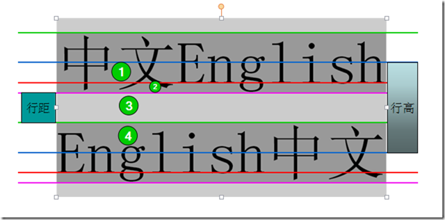
>
> - 基线：红色的线。
> - 顶线：绿色的线。
> - 底线：紫红色的线。
> - 中线：蓝色的线。

## 4 背景属性

- background

  ```css
  background:<背景颜色>|<背景图像>|<背景重复>|<背景附件>|<背景位置>
  
  例：background:red url('./123.png') no-repeat 100px 10px;
  ```

- background-color 设置背景色，或设置为transparent（透明）

- background-image 背景图片 url 或者 none

- background-repeat 背景重复 repeat | repeat-x | repeat-y | no-repeat

- background-attachment 背景附件 scroll | fixed

- background-position 背景位置

  ```
  background-position: 水平方向 垂直方向
  background-position:left top;
  background-position:100px 100px;
  
  left | center | right (横向) 
  top | center | bottom (纵向) 
  或者使用百分比或者数值
  ```

## 5 鼠标光标

- cursort

  ```
  text  文字选择器
  crosshair   十字架
  wait  等待
  help  帮助
  pointer 小手
  ```

## 6 列表属性

- list-style-type

  ```
  disc         实心点
  circle       圆圈
  square       小方框
  decimal      数字
  lower-roman  小写罗马字
  upper-roman  大写罗马字
  lower-alpha  小写字母
  upper-alpha  大写字母
  ```

- list-style-position 位置

  ```
  inside   标示在li里面
  outside  标示在li外面
  ```

- list-style-image 使用图片 url(./123.gif)

- list-style 复合属性

  ```
  list-style: type position image
  list-style: none
  ```

## 7 表格属性

- table-layout 表格布局方式

  ```
  auto(默认)  布局将基于各单元格的内容，换言之，可能你给某个单元格定义宽度为100px，但结果可能并不是100px。表格在每一单元格读取计算之后才会显示出来，速度很慢 
  fixed       平布局是仅仅基于表格的宽度，表格边框的宽度，单元格间距，列的宽度，而和表格内容无关。也就是说，内容可能被裁切
  ```

- border-collapse 表格的行和单元格的边是合并还是独立

  ```
  separate (默认)  独立
  collapse  合并
  ```

- border-spacing 当表格边框独立时，行和单元格的边框在横向和纵向上的间距

- caption-side caption 在table上面还是下面

  ```
  top    
  bottom
  ```

- empty-cells 没有内容的单元格隐藏还是显示

  ```
  show (默认)
  hide
  ```

# 盒子模型

## 1 什么是盒子模型

所有HTML元素可以看作盒子，在CSS中，"box model"这一术语是用来设计和布局时使用。

CSS盒模型本质上是一个盒子，封装周围的HTML元素，它包括：边距，边框，填充，和实际内容。

盒模型允许我们在其它元素和周围元素边框之间的空间放置元素。

## 2 盒子的显示模式

### 2.1 三种基本显示模式

#### ① 块级显示模式

- 自己单独占一行；设置宽高起作用,在不设置宽度的情况下,和父元素的宽度一样。
- 具有块级显示模式的元素称之为**块级元素**。
- 常见的块级元素有：div、h1-h6、 ul、 ol、 li、 dl、 dt、 dd、 hr、 p、 form 等

#### ② 行内(内联)显示模块

- 自己不独占一行，一行可以有多个；设置宽高不起作用,宽高靠内容撑开。
- 具有行内显示模式的元素称之为**行内元素**。
- 常见的行内元素有：span、a 、strong、 em、 ins、 del 等

#### ③ 行内块显示模式

- 自己不独占一行，一行可以有多个；设置宽高起作用；不设置宽度的情况下靠内容撑开。
- 具有行内块显示模式的元素称之为**行内块元素**。
- 常见的行内块元素有：img、input、textarea、select 等

> **注意：**
>
> ① 行内元素和行内块元素水平排列的时候由于代码换行会出现一个水平间距。
>
> ② 在有些教程中，会把行内块元素也算作行内元素，因为二者皆无法独占一行。

### 2.2 显示模式转换

可以通过给元素设置 **display** 属性，来改变元素的显示模式

| 值           | 描述                                                 |
| ------------ | ---------------------------------------------------- |
| none         | 此元素不会被显示。                                   |
| block        | 此元素将显示为块级元素，此元素前后会带有换行符。     |
| inline       | 默认。此元素会被显示为内联元素，元素前后没有换行符。 |
| inline-block | 行内块元素。（CSS2.1 新增的值）                      |

> **注意：** 设置 display: none, 元素将会被隐藏

## 3 盒子之间的关系

### 3.1 document 树

元素在加载过程中会形成一种树状结构

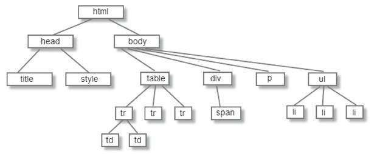

根据元素的位置，元素之间构成如下关系：

- 父元素
- 祖先元素
- 子元素
- 后代元素
- 兄弟元素

### 3.2 标准文档流

1. 行内元素不占据单独的空间，依附于块级元素，行内元素没有自己的区域。它同样是DOM树中的一个节点，在这一点上行内元素和块级元素是没有区别的。
2. 块级元素总是以块的形式表现出来，并且跟同级的兄弟块依次竖直排列，左右自动伸展，直到包含它的元素的边界，在水平方向不能并排。

## 4 盒子的组成


一个盒子模型有以下四部分组成：

- **Margin(外边距)** 清除边框外的区域，外边距是透明的。
- **Border(边框)** 围绕在内边距和内容外的边框。
- **Padding(内边距)** 清除内容周围的区域，内边距是透明的。
- **Content(内容)** 盒子的内容，显示文本和图像。

> **注意：**
>
> 一个盒子实际的大小 = 内容的大小 + padding + border宽度。
>
> 外边距不计入盒子的大小。

### 4.1 内容部分

内容区是盒子模型的中心，它呈现了盒子的主要信息内容。

#### ① 设置内容区尺寸 css 属性

- width 内容区宽度
- max-width 内容区最大宽度
- min-width 内容区最小宽度
- height 内容区高度
- max-height 内容区最大高度
- min-height 内容区最小高度

#### ② 内容区默认大小

- 如果没有设置宽度，块级元素会根据父元素大小自动计算，行内元素和行内块元素宽度根据内容大小计算。
- 如果没有设置高度，块级、行内、行内块都会根据内容大小计算。

> **width 默认是 auto,auto分为4种情况：**
>
> 1. fill-available：充分利用可使用空间（块标签）
> 2. fit-content: 收缩到合适（浮动，定位）
> 3. min-content: 收缩到最小（表格中常见）
> 4. max-content:超出容器限制（英文单词较长，或者设置了不换行，就会超出容器限制）
>
> height 的默认值也是 auto，其高度由内部元素堆叠而成，也就是内部元素撑起来的。
>
> **块级元素的默认宽度如何根据父元素宽度自动计算：**
>
> 元素设置了外边距、内边距、边框都会压缩该元素内容区域的宽度。
>
> 内容宽度 = 父元素的内容宽读 - margin（子元素） - padding（子元素） - border（子元素）。

#### ③ 设置内容区溢出

- overflow 设置内容溢出方式

  ```
      值          描述                          
  visible    默认值。内容不会被修剪，会呈现在元素框之外。      
  hidden     内容会被修剪，并且其余内容是不可见的。         
  scroll     内容会被修剪，但是浏览器会显示滚动条以便查看其余的内容。
  auto       如果内容被修剪，则浏览器会显示滚动条以便查看其余的内容。
  inherit    规定应该从父元素继承 overflow 属性的值。
  ```

- overflow-x 设置水平方向的内容溢出方式，值与`overflow`属性相同。

- overflow-y 设置垂直方向的内容溢出方式，值与`overflow`属性相同。

### 4.2 内边距 padding

内边距 padding 也叫补白或填充，是边框和内容之间的空间。

#### ① padding 相关属性

- padding 设置各个方向的内边距，复合属性，可以指定多个值。
- padding-left 设置左内边距。
- padding-right 设置右内边距。
- padding-top 设置上内边距。
- padding-bottom 设置下内边距。

```css
/* padding的复合属性 */
/* 一个值  上下左右*/
padding:10px;
/* 两个值   上下   左右*/
padding:10px 20px;
/* 三个值  上  左右  下*/
padding:10px 20px 30px;
/* 四个值 上  右    下   左*/
padding: 10px 20px 30px 40px;
```

#### ② padding 设置规则

- padding 不支持负值，也不能设置为“auto”。
- 给行内元素设置 padding 的时候，水平方向非常正常，但是垂直方向设置了 padding 之后不能撑开元素的距离。

### 4.3 外边距 margin

外边距是元素与父级或其他兄弟级元素的距离。

#### ① 外边距相关属性

- margin 设置各个方向的内边距，复合属性，可以指定多个值。
- margin-left 设置左外边距。
- margin-right 设置右外边距
- margin-top 设置上外边距
- margin-bottom 设置下外边距

```css
/* margin 的复合属性 */
/* 一个值  上下左右*/
margin:10px;
/* 两个值   上下   左右*/
margin:10px 20px;
/* 三个值  上  左右  下*/
margin:10px 20px 30px;
/* 四个值 上  右    下   左*/
margin: 10px 20px 30px 40px;
```

#### ② margin 设置规则

- margin 可以设置为负值。
- 对于行内元素，只有水平方向设置 margin 是有效的。ma

> **margin 为负值的情况：**
>
> - margin-left为负：
>
>   元素向左移动，并且原来的位置不保留（后边元素会紧跟上一起移动）；
>
>   元素向左移动，并不会挤到前边的兄弟元素，而是覆盖前边的兄弟元素。
>
> - margin-right为负：
>
>   元素视觉大小不发生变化;
>
>   但是元素实际所占用的空间变小，后边元素会跟上来或者是撑不开父级宽度。
>
> - margin-top为负：
>
>   元素向上移动，并且原来的位置不保留（下边元素会紧跟上一起移动），
>
>   元素向上移动，并不会挤到上边的兄弟元素，而是覆盖上边的兄弟元素
>
> - margin-bottom为负：
>
>   元素视觉大小不发生变化；
>
>   但是元素实际所占用的空间变小，下边元素会跟上来或者是撑不开父级高度。
>
> 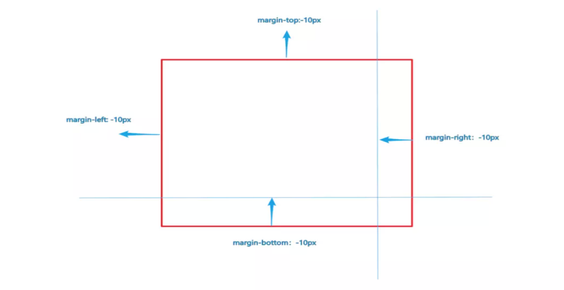

#### ③ margin 塌陷

在一个元素里，第一个子元素的 margin-top 会塌陷给父级；最后一个子元素的 margin-bottom 会塌陷给父级。

**解决 margin塌陷的方法：**

1. 给父元素设置一个边框 边框的宽度不能为 0 ; 防止影响视觉，可以设置透明（transparent）颜色。
2. 父元素开启BFC（块级格式化上下文），开启 BFC 的方法很多，如设置 `overflow:hidden`。

#### ④ margin 合并

左右两个兄弟元素，分别设置 margin-right（前面的元素） 和 margin-left（后面的元素），元素之间的间距是 margin-right 和 margin-left 之和。

上下两个兄弟元素，分别设置 margin-bottom（前面的元素）和 margin-top（后面的元素）, 两个元素之间的间距会取 margin-bottom 和 margin-top 之间最大的那个值，称之为 **margin 合并**

### 4.4 边框 border

#### ① 边框相关属性

- border 复合属性 border-left|border-right|border-top|border-bottom

  ```css
  border: 边框宽度  边框样式  边框颜色
  ```

- border-style 边框线风格 border-top-style | border-right-style | border-bottom-style | border-left-style

  ```
  dotted   点线
  dashed  虚线
  solid      实线
  double 双实线
  groove 槽状线
  ridge     脊线
  inset      内嵌效果
  outset   外凸效果
  ```

- border-color 边框颜色 border-left-color | border-right-color | border-top-color | border-bottom-color

- border-width 边框宽度 border-left-width | border-right-width | border-top-width | border-bottom-width

#### ② 边框位置

- 边框不会显示在 margin 中。
- 背景颜色在边框中显示（实线的时候，我们看不到）。
- 背景图片原点没有从边框开始 而是从padding开始的，但是可能会平铺到边框中。

# 浮动

## 1 浮动的来历

浮动设计的最初想法是为了实现文字环绕图片的效果。

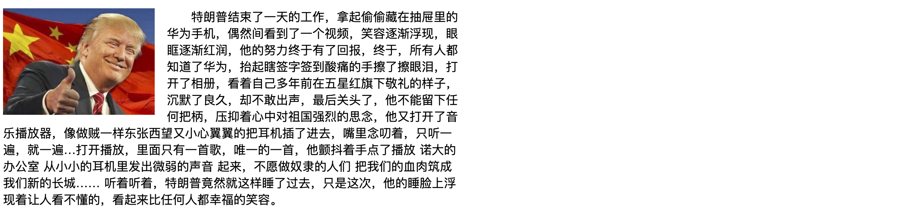

后来浮动代替表格布局成为了主流的布局方式。

CSS的Float(浮动)，元素可以围绕其他元素向左或向右被推动

- 设置浮动，脱离普通文档流。
- 浮动的元素，如果不设置宽度，会尽可能的窄（被内容撑开）
- 浮动元素之后的元素将围绕它 浮动元素之前的元素将不会受到影响。
- float 设计的初始想法仅仅是为了做文字环绕图片。

## 2 页面流（文本流）

在 CSS 中，是存在流的概念的，正常情况下，页面总是由左至右，由上至下布局，我们把这种情况称作为正常页面流。

但是，在很多情况下，正常页面流有很多效果实现不了，所以需要一些手段来破坏流，而浮动（float）就是破坏流的一种手段。

## 设置浮动

```css
.item {
    float:left
}
.item {
    float:right
}
/*float 属性的默认值是 none  表示没有浮动*/
```

- 在 CSS 中，我们通过 float 属性实现元素的浮动
- 浮动分为左浮动和右浮动，值分别是left和right

## 4 浮动之后的效果

> - 浮动的元素可以向左或向右移动，直到它的外边缘碰到包含框或另一个浮动框的边框为止。
> - 由于浮动框不在文档的普通流中，所以文档的普通流中的块框表现得就像浮动框不存在一样。

当把框 1 向右浮动时，它脱离文档流并且向右移动，直到它的右边缘碰到包含框的右边缘：


当框 1 向左浮动时，它脱离文档流并且向左移动，直到它的左边缘碰到包含框的左边缘。因为它不再处于文档流中，所以它不占据空间，实际上覆盖住了框 2，使框 2 从视图中消失。

如果把所有三个框都向左移动，那么框 1 向左浮动直到碰到包含框，另外两个框向左浮动直到碰到前一个浮动框。


如果包含框太窄，无法容纳水平排列的三个浮动元素，那么其它浮动块向下移动，直到有足够的空间。如果浮动元素的高度不同，那么当它们向下移动时可能被其它浮动元素“卡住”：


## 5 元素浮动之后的特点

不论是行内元素还是块级元素，设置浮动之后都会具有如下特点：

- 不再独占一行
- 可以设置宽高
- 完美支持 margin 和 padding
- 默认宽度会根据内容进行计算
- **构成了 BFC**

## 5 清除浮动

### 5.1 浮动的元素对于其他元素的影响

浮动的元素会脱离文档流，按照指定的方向发生移动，遇到父级的边界或者是上一个浮动元素或者是上一个不浮动兄弟元素就停下来，所有，浮动元素前面的元素不会受到影响，后面的兄弟元素和父元素会受到影响。

- **后面的兄弟元素**会当做浮动的元素不存在，可能会与浮动元素位置发生重合。
- **父元素：** 浮动的元素脱离父级区域，无法撑开父元素的高度，造成父元素高度塌陷。进而会影响到父元素后面的兄弟元素，造成布局问题。

### 5.2 如何清除浮动的影响

- 1) 给浮动元素的父级设置高度 height（不推荐使用）

  缺点：很多情况下元素的高度都是不确定的。

- 2) 以浮制浮，给浮动元素的父元素设置浮动，原理是开启BFC（不推荐使用）

  缺点：只有在父级需要浮动的时候，可以这么清除，否则父级的浮动会继续影响其他元素。

- 3) 给父级设置 `overflow：hidden；`，原理也是开启BFC。

  优点：简单快捷，

  缺点：元素超出的时候，会隐藏超出部分。

- 5) clear 浮动清除法：给浮动元素的下边添加一个块元素，书写样式 `clear:both`。

  缺点：增加额外的结构，不符合语义化标准

- 6) after 伪元素清浮动（推荐）

  给浮动元素的父元素添加 after 伪类，给 after 伪类设置样式 `clear:both`。

  可以给所有浮动元素的父元素一个 clearfix 的类名，当一个元素需要清除浮动的时候，直接设置 clearfix 类名即可。

  ```css
  .clearfix:after{
      content:"";      /* 必须拥有content属性  内容为空*/
      display: block;  /* 必须块标签才能清浮动 */
      clear: both;     /* 清除浮动* /
  }
  ```

## 6 浮动实验

1. 设置第一浮动的div
2. 设置第2个浮动div
3. 设置第3个浮动div
4. 改变第三个浮动方向
5. 改变第二个浮动方向
6. 全部向左浮动,增加第一个的高度
7. 使用clear属性清除浮动的影响
8. 扩展盒子的高度 (元素高度和浮动的元素)
9. 段落首字母浮动
10. 图片浮动
11. 简单浮动布局

## 7 浮动布局小案例

案例一：


案例二：

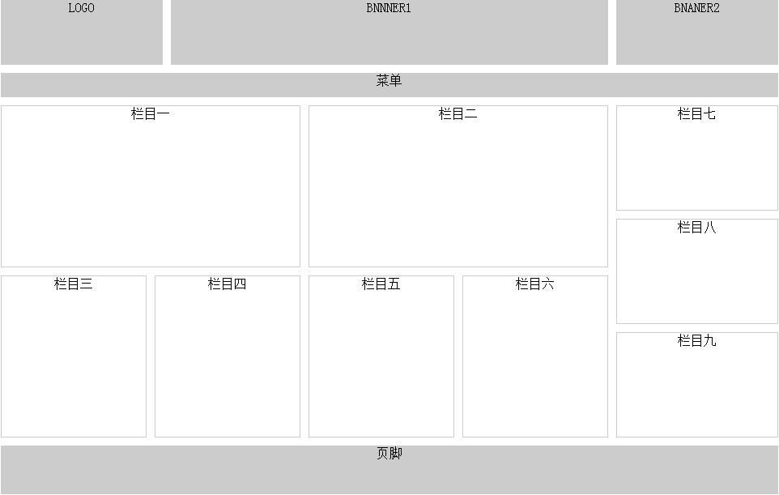

## 8 浮动相关CSS属性总结

- float 设置浮动 值: none(默认) /left /right
- clear 清除浮动。值: none(默认) /both /left /right

# 定位

## 1 定位的概念

1) 除非专门指定，否则所有框都在普通流中定位。也就是说，普通流中的元素的位置由元素在 HTML 中的位置决定。

2) 定位的基本思想很简单，它允许你定义元素相对于其正常位置应该出现的位置，或者相对于父元素甚至浏览器窗口本身的位置。

3) 通过使用 position 属性，我们可以选择 4 种不同类型的定位。

- position属性是把元素放置到一个静态的、相对的、绝对的、或固定的位置中。
- position属性的四个值分别对应 static、relative、absolute、fixed。

## 2 相对定位

- 使用相对定位的盒子,会相对于它原来的位置,通过偏移指定的距离,到达新的位置
- 使用相对定位的盒子,仍在标准流中,它对父块好兄弟盒子没有任何影响

```css
.box {
    position: relative;
    top: 10px;
    left: 20px;
}
```

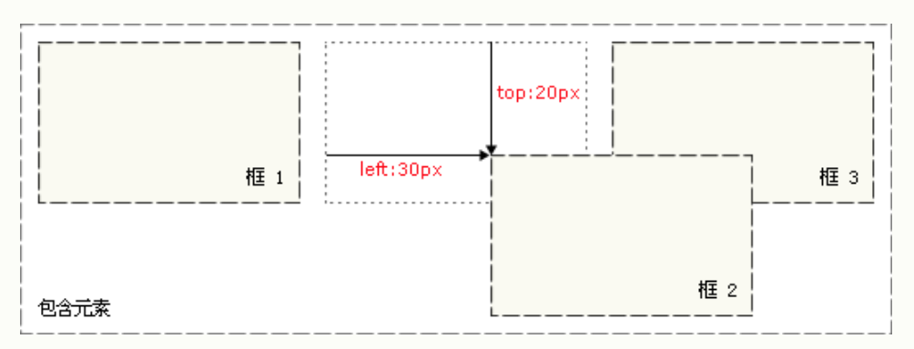

> **注意：**
>
> 相对定位可以和浮动一起使用。

## 3 绝对定位

- 使用绝对定位的盒子以它"最近"的一个"已经定位"的"祖先元素"为基准进行偏移. 如果没有已经定位的"祖先元素", 那么会以根元素 html 为基准进行定位。
- 绝对定位的框从标准流中脱离,这意味着它们对其后的兄弟盒子的定位没有影响,其他的盒子就好像这个盒子不存在一样

```css
.box {
    position: absolute;
    top: 10px;
    left: 20px
}
```

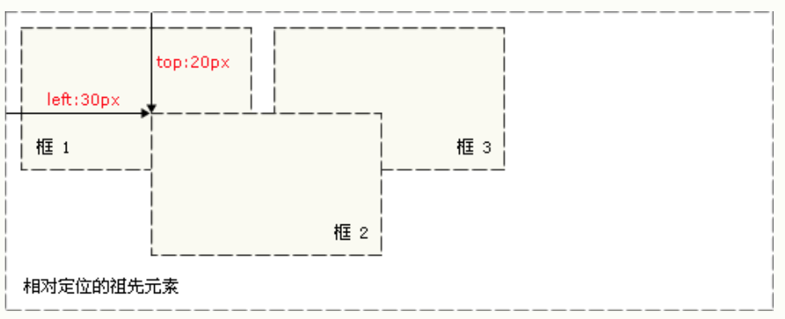

> **注意：**
>
> 绝对定位的元素无法再设置浮动。
>
> **关于包含块：**
>
> 绝对定位的元素其实是以他的包含块元素为基准进行定位的，但是元素 position 设置的不同，其包含块也会引起变化。
>
> 1) 如果一个元素自身的 position 属性是 static或者是relative：它的包含块就是离他最近的祖先元素或者是格式化上下文。
>
> 2) 如果一个元素自身的 position 属性是absolute，它的包含块就是离他最近的拥有定位属性（值不为static）的元素。
>
> 3) 如果一个元素自身的 position 属性是 fixed，它的包含块就是离他最近的拥有定位属性（值不为static）的元素。
>
> 4) 如果由内向外找不到包含块条件的元素，那么html（根元素）被称作为初始包含块。

## 3 固定定位

- 以视口（viewport）为基准进行定位
- 窗口滚动时,依然保持位置不变

```css
.box {
    position: fixed;
    top: 10px;
    left: 20px;
}
```

## 4 空间位置 z-index

### 4.1 z-index 属性

- 指定一个定位的元素及其后代的层叠顺序，只有定位元素（非static值）设置 z-index 才可以生效。
- z-index的值是数字，没有单位， 理论上来说 z-index的值大的元素会覆盖小的元素；z-index 的默认值是 auto。

### 4.2 z-index 注意事项

如果一个设置了 `z-index` 属性的定位元素中的子元素也设置了`z-index`，那么子元素会重新创建一个层叠上下文，子元素的 `z-index` 只能在当前的层叠上下文中对比排列。

### 4.3 元素的层叠顺序

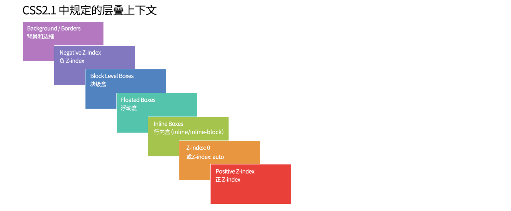

## 5 定位相关CSS属性总结

- position 设置定位。值： static(默认值) / relative / position / fixed。
- top 设置定位元素位置。
- left 设置定位元素位置
- right 设置定位元素位置
- bottom 设置定位元素位置。
- z-index 设置定位元素层级。值：auto(默认值) / 数字。

# 页面布局

## 1 页面组成


## 2 重置样式

很多元素是具有默认样式的，比如 p 元素有默认的上外边距和下外边距，h1~h6 标题元素也有默认的上外边距和下外边距且字体加粗，body 元素有默认的外边距，超链接有默认的字体颜色和下划线，ul 元素有默认的左内边距 等等。

在不同的浏览器下，元素的默认样式有时候有些差异，这样元素的默认样式就未我们的开发带来了一些问题。

所以，在开发页面之前，我们会选择重置元素的默认样式，这里介绍三种重置方案。

### 2.1 第一种方式 使用全局选择器重置样式

```css
* {
    margin: 0;
    padding: 0;
}
```

此种方法，在讲解案例的时候可以简单用一下，但实际开发中是不会用这种方式的，因为 `*` 是选择所有的元素，而并不是所有的元素都有默认样式，改方式效率较低。

### 2.2 Reset.css

选择到具有默认样式的元素，清空其默认的样式。

```css
/* 基础设置 */
body,h1,h2,h3,h4,h5,h6,hr,p,blockquote,dl,dt,dd,ul,ol,li,pre,form,fieldset,legend,button,input,textarea,th,td{
    margin: 0;
    padding: 0;
}

ul,ol {
    list-style: none;
}

img {
    /* 底部留白 */
    display: block;
  border:0;
}

b,strong {
    font-weight: 400;
}

h1,h2,h3,h4,h5,h6 {
    /* 父元素字号的百分比 */
    font-size: 100%;
}

i,em {
    /* 不倾斜 */
    font-style: normal;
}

u,ins,s,del {
    /* 去掉中划线和下划线 */
    text-decoration: none;
}

table {
    border: 1px solid #999;
    /* 相当于是cellspacing */
    border-spacing: 0;
    /* 1px边框 */
    border-collapse: collapse;
}

td,th {
    border: 1px solid #999;
}

input,button {
    /* 去掉轮廓线 */
    outline: none;
    border:none;
}

/* 风格设置 */
body {
    font: 12px/1.3 "Microsoft YaHei", Tahoma, Helvetica, Arial, "\5b8b\4f53", sans-serif;
    color: #333;
}

a {
    text-decoration: none;
    color: #666;
}

a:hover {
    color:#c00;
    text-decoration: underline;
}

.clearfix::after {
    content: "";
    display: block;
    clear: both;
}
```

各网站都会定义自己的重置样式表，请参考 http://www.unclealan.cn/index.php/front/174.html

### 2.3 Normalize.css

Normalize.css是一种CSS reset的替代方案。它在默认的HTML元素样式上提供了跨浏览器的高度一致性。相比于传统的CSS reset，Normalize.css是一种现代的、为HTML5准备的优质替代方案。

官网地址：http://necolas.github.io/normalize.css/

GitHub: https://github.com/necolas/normalize.css/

相对于 Reset.css， Normalize.css 有如下特点：

- 保护有价值的浏览器默认样式而不是完全去掉它们。
- 新增对 HTML5 元素的设置。
- 修复浏览器 BUG 并保证各浏览器的一致性，修复的 BUG 有预格式化文字的 `font-size` 问题、在 IE9 中 SVG 的溢出、许多出现在各浏览器和操作系统中的与表单相关的 BUF 等。
- Normalize.css 对并集选择器的使用比较谨慎，有效避免调试工具杂乱。

## 3 网页的版心

在PC端网页中,一般都会有一个固定宽度且水平居中的盒子,来显示网页的主要内容,这是网页的**版心**。

版心常见的宽度有 1200px、1000px、960px 等等。


## 4 元素居中总结

### 4.1 行内元素或行内块元素

让行内元素或行内块元素进行居中，需要对其父元素设置文本对齐方式，因为行内元素或行内块元素可以被当做文本处理。

让行内元素或行内块元素**水平居中对齐**，在其父元素上设置 `text-align:center`。

让行内元素或行内块元素**垂直居中对齐**，在其父元素上设置 `line-height` 属性，行高的值与高度相等即可。

### 4.2 块级元素

#### ① 水平居中对齐

设置元素的左外边距和右外边距的值都为 `auto`。

> **注意：**
>
> 让块级元素居中，是对元素本身进行设置。
>
> 浮动的元素以及绝对定位和相对定位的元素不能使用该方法进行居中。

#### ② 水平方向和垂直方向都居中对齐

要实现一个块级元素在父元素里面垂直居中对齐，需要对改元素设置定位；这种方式可以设置元素垂直居中，可以设置元素水平居中。

**定位的元素水平居中：** 设置 `left:50%`，设置 `margin-left` 为负的宽度的一半。

**定位的元素垂直居中：** 设置`top:50%`，设置 `margin-top` 为负的高度的一半。

## 5 CSS 属性的继承

### 2.1 哪些 CSS 属性可以继承

- 字体设置、颜色、文本设置这些 css 属性可以继承。
- 其他的 css 属性，如跟盒子相关的 cs s属性无法继承，像边框、宽高、内外边距、背景等等。

> 要善于利用继承的特性，字体、颜色和文本的相关设置可以设置在包裹在外层的元素上。

### 2.2 特殊情况

- 背景属性无法继承，看起来像继承是因为元素默认的背景色是透明色（transparent）.

- 继承下来的属性优先级最低，比元素默认属性值还要低。

  ```
     给超链接的父元素设置 color 或 text-decoration 的时候，我们发现超链接并不会安装父元素的设置；其实，超链接也继承了父元素的相关属性，只是同时超链接有默认的 color 和 text-decoration 设置，继承的属性优先级要低于默认的属性值，所以仍然按照默认的样式显示。
     所以，如果给超链接设置颜色或者 text-decoration 的时候，需要直接选择器选择到 a 元素来设置，不能依靠继承。
     类似的这种情况还有标题元素，标题元素有默认的 font-size 和 font-weight 设置继承的属性是不如默认的属性优先级高的。
  ```

## 6 行内元素和行内块元素的空白

### .1 元素之间的空白

#### ① 产生的原因

书写 html 代码的时候，每写一个元素都会换行，这个换行符号会被浏览器解析成空格，空格的大小根据字体大小的设置来计算。

块级元素没有这个问题，因为行内块和行内元素会被当做文本处理。

#### ② 解决方案：

- 方案一： 元素和元素之间不写换行（不建议）
- 方案二：给父元素设置 `font-size:0`,这样空格就不显示；再给具体的行内元素或行内块元素设置字体大小。

### 6.2 图片（行内块元素）底部幽灵空白

#### ① 产生的原因

图片（行内块元素）会按照基线对齐，基线和底线之间有间距，这个间距就是**幽灵空白**。

> **注意：**
>
> 一般行内块元素如果里面没有文本内容的话会出现跟图片相同的效果；但是如果里面有文本内容，里面的文字会以基线对齐，行内块元素就不存在底部的空白了。

#### ② 解决方案

- 方案一：设置图片（行内块元素）为块级元素（常用，但是如果一行内要显示多个图片（行内块），就不合适了）。
- 方案二：设置图片（行内块元素）的基线对齐方式，`vertical-align:bottom`,值不是 `baseline`。
- 方案三：给图片（行内块元素）的父元素设置 `font-size:0`。

## 7 精灵图的使用

### 7.1 什么是精灵图

CSS Sprites 也称之为精灵图或雪碧图，是一种**背景图片**的应用处理方式，将很多小图片合并到到一张大图中去。把整个大图作为背景图，然后通过 `background-position` 属性讲合适的图片显示到元素上。

精灵图最大的作用是**减少网络的请求次数**，因为图片只要下载一次就好，不用再分别去下载那些小图。

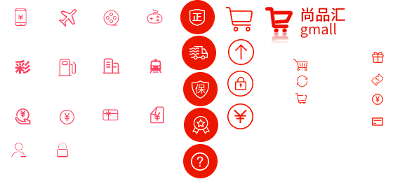

### 7.2 background-postion

实现精灵图主要是靠 设置 `background-postion` 来对背景图片进行定位，从而在元素上显示合适的图片，`background-position` 属性可能的值有：

| 值                                                           | 描述                                                         |
| :----------------------------------------------------------- | :----------------------------------------------------------- |
| left top left center left bottom center top center center center bottom right top right center right bottom | 如果您仅规定了一个关键词，那么第二个值将是"center"。 默认值：0% 0%。 |
| x% y%                                                        | 第一个值是水平位置，第二个值是垂直位置。 左上角是 0% 0%,右下角是 100% 100%。 如果您仅规定了一个值，另一个值将是 50%。 |
| xpos ypos                                                    | 第一个值是水平位置，第二个值是垂直位置。 单位是像素 (0px 0px) 或任何其他的 CSS 单位，可以为负值 z如果您仅规定了一个值，另一个值将是50%。 您可以混合使用 % 和 position 值。 |

> **关于百分比：**
>
> 百分比值的偏移指定图片的相对位置和容器的相对位置重合。值0%代表图片的左边界（或上边界）和容器的左边界（上边界）重合。值100%代表图片的右边界（或下边界）和容器的右边界（或下边界）重合。值50%则代表图片的中点和容器的中点重合。
>
> 当指定百分比值的时候，实际上执行了以下的计算公式（该公式可以用数学方式定义图片和容器相对位置重合）：
>
> ```
> (元素宽度 - 图片宽度) * 百分比 = 水平方向偏移位置
> (元素宽度 - 图片宽度) * 百分比 = 垂直方向偏移位置
> ```
>
> 使用 X 坐标来举个例子，假设有一个 300px 宽的图片，将这个图片使用到一个 100px 宽的元素中，
>
> ```
> 100px - 300px = -200px (元素和图片的宽度差)
> ```
>
> 当对 `background-position` 设置值依次为 -25%，0%，50%，100%，125%，得到图片相对容器的偏移值为：
>
> ```
> -200px * -25% = 50px
> -200px * 0% = 0px
> -200px * 50% = -100px
> -200px * 100% = -200px
> -200px * 125% = -250px
> ```

### 7.3 制作精灵图

- 在线工具 https://alloyteam.github.io/gopng/

  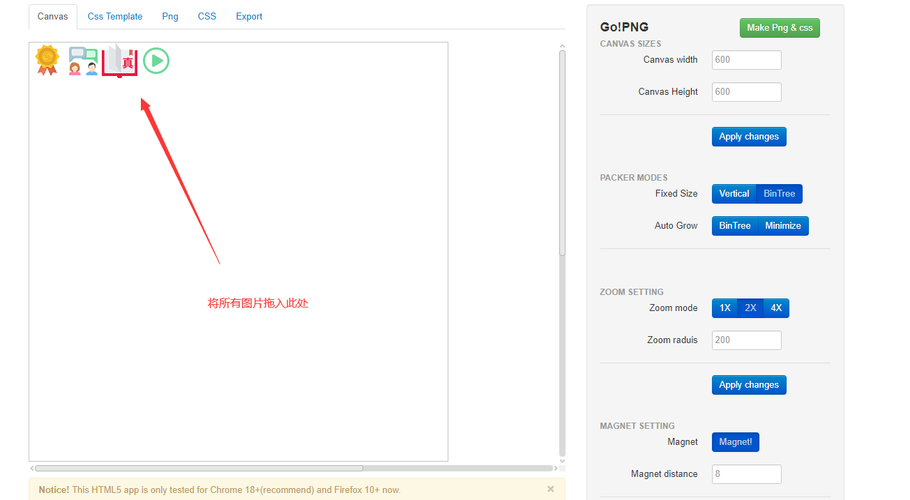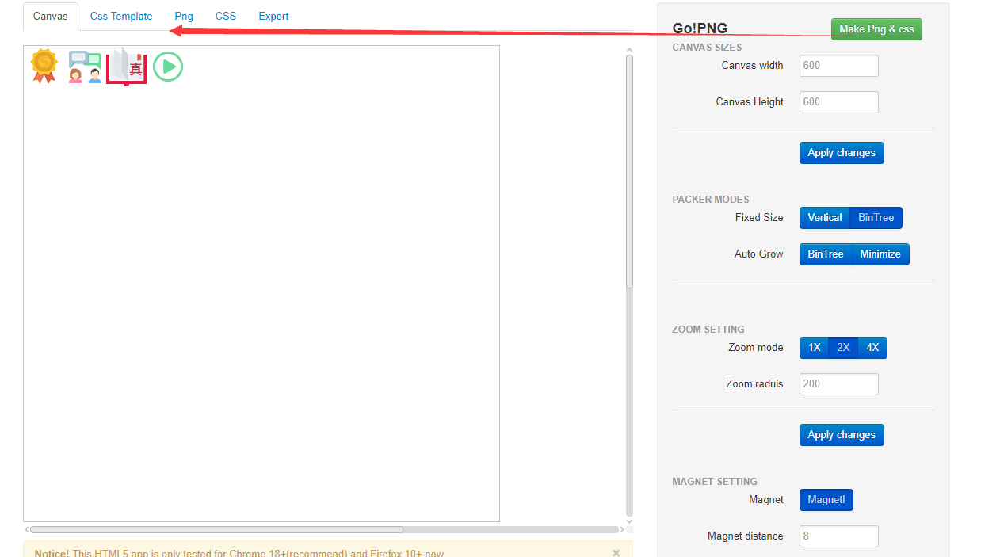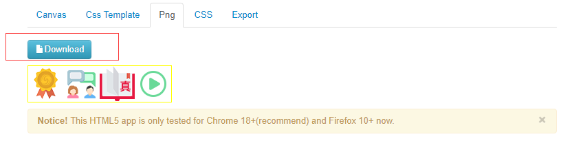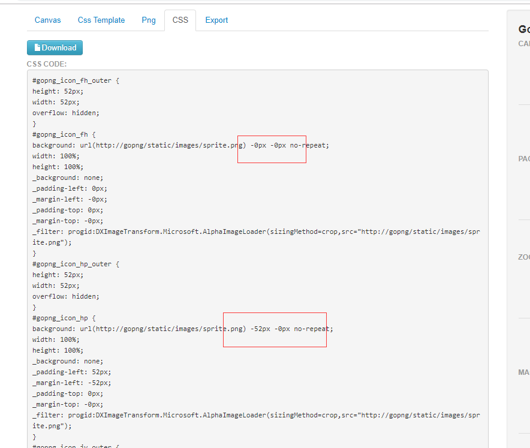

- 用 PS 自行制作。

  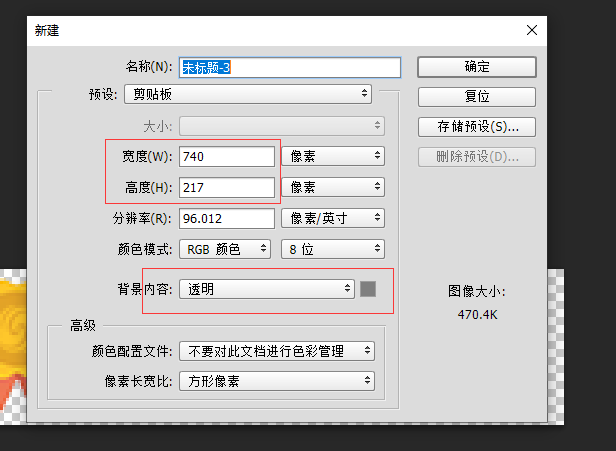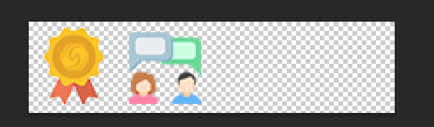

## 8. favicon 图标

### 8.1 favicon 图标介绍

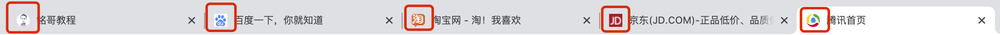

**favicon 图标** 一般用于作为缩略的网站标志,它显示位于浏览器的地址栏或者在标签上，用于显示网站的logo，如图红圈的位置， 目前主要的浏览器都支持 favicon 图标。

favicon 图标文件一般命名为 `favicon.ico`， 是后缀为 `.ico` 的图片文件。

### 8.2 favicon 图标的使用

**使用方法一：**把 ico 图标文件命名为 `favicon.ico` ,放在网站根目录下，网页会自动获取 ico 图标。

**使用方法二：**在网页中使用 link 标签自行引入 ico 文件。

```html
<link rel="shortcut icon" type="images/x-icon" href="favicon.ico">
```

### 8.3 favicon 图标的制作

- 在线工具 http://www.ico51.cn/
- 在线工具 http://www.bitbug.net/

# 浏览器兼容性

## 1 提高兼容性的设置

- 使用最新版IE渲染

  ```html
  <meta http-equiv="X-UA-Compatible" content="IE=Edge">
  ```

- 让双核浏览器默认使用webkit内核

  ```html
  <meta name="renderer" content="webkit">
  ```

## 2 CSS hack

由于不同的厂商的浏览器，或者是同一个浏览器不同的版本（ie），对css的解析和认识不完全一样可能会导致不同浏览器显示的效果不相同，那么我们需要针对某个浏览器，去写不同的样式，让代码能够兼容所有的浏览器。

### 2.1 CSS 属性前缀法

```css
*color： /*ie 5,6,7*/
+color： /*ie 5,6,7*/
#color： /*ie 5,6,7*/
_color： /*ie 5、6*/
color\0:  /*ie 9 10 11*/
color\9:ie  /*6 7 8 9 10*/
color\9\0:  /*ie 8 9 10*/
```

### 2.2 选择器前缀法

```css
/* ie 5 6*/
*div{ 

} 

/*ie7*/
*+div{
}
```

## 3 IE 条件注释

IE 中的条件注释对 IE 的版本和非IE版本有优秀的区分能力。

条件注释的基本结构和HTML的注释 `<!-- -->` 是一样的。因此 IE 以外的浏览器将会把它们看作是普通的注释而完全忽略它们。

IE9 以及 IE9 以下浏览器可以识别条件注释。

**比较符号：**

```
lt    表示    <
gt    表示    >
gte    表示    >=
lte    表示    <=
!      表示    !=
```

**案例：**

```html
<!--[if IE 8]> 仅IE8可见 <![endif]--> 

<!--[if gt IE 8]>仅IE 8以上可见<![endif]—>

<!--[if lt IE 8]>仅IE 8以下可见<![endif]—>

<!--[if gte IE 8]>IE 8及以上可见<![endif]—>

<!--[if lte IE 8]>IE 8及以下可见<![endif]—>

<!--[if !IE 8]>非IE 8的IE可见<![endif]-->

<!--[if !IE]><!--> 您使用不是 Internet Explorer <!--<![endif]-->
```

# 【附录】CSS 书写规范

## 1CSS 书写的几点建议

- 去掉小数点前面的 0，`0.5em →`.5em` 。
- 颜色用小写，用缩写，如：`#fff` 。
- 不要随意使用Id，Id在JS是唯一的，不能多次使用，而使用 class 类选择器却可以重复使用，另外id的优先级优先与class，所以id应该按需使用，而不能滥用。
- 0 不用加单位。
- 尽量缩写，`margin: 5px 10px 5px 10px;` → `margin: 5px 10px;` 。

## 2 CSS 属性书写顺序

相关的属性声明应当归为一组，并按照下面的顺序排列：

- Positioning 定位相关属性
- Box model 盒子模型相关属性
- Typography 文字字体相关属性
- Visual 视觉效果相关属性（背景等）

由于定位（Positioning）可以从正常的文档流中移除元素，并且还能覆盖盒模型（Box model）相关的样式，因此排在首位。盒模型排在第二位，因为它决定了组件的尺寸和位置。

其他属性只是影响组件的内部（inside）或者是不影响前两组属性，因此排在后面。

```css
.declaration-order {
  /* Positioning */
  position: absolute;
  top: 0;
  right: 0;
  bottom: 0;
  left: 0;
  z-index: 100;


  /* Box-model */
  display: block;
  float: right;
  width: 100px;
  height: 100px;


  /* Typography */
  font: normal 13px "Helvetica Neue", sans-serif;
  line-height: 1.5;
  color: #333;
  text-align: center;

  /* Visual */
  background-color: #f5f5f5;
  border: 1px solid #e5e5e5;
  border-radius: 3px;

  /* Misc */
  opacity: 1;
}
```

## 3 Class 命名规则

- 推荐使用小写字母。
- class 名称应当尽可能短，并且意义明确，使用有意义的名称的名称。
- 避免过度任意的简写。`.btn` 代表 *button*，但是 `.s` 不能表达任何意思。
- 允许多个单词组成类型，推荐 kebab-case 命名方式（短横线分隔符），如 `btn-danger`、`col-md-hidden`。
- 基于最近的父元素或基本 class 作为新 class 的前缀，如`news-title`

```css
/* Bad example */
.t { ... }
.red { ... }
.header { ... }

/* Good example */
.tweet { ... }
.important { ... }
.tweet-header { ... }
```

## 4 常见的命名

### .1 常见命名 1

| **名称**          | **用途**     |
| :---------------- | :----------- |
| .wrap 或 .wrapper | 用于外侧包裹 |
| .container 或 .ct | 包裹容器     |
| .header           | 用于头部     |
| .body             | 页面 body    |
| .footer           | 页面尾部     |
| .aside、.sidebar  | 用于侧边栏   |
| .content          | 用于主要内容 |
| .navigation       | 导航元素     |
| .pagination       | 分页         |

### 4.2 常见命名 2

| **名称**     | **用途**           |
| :----------- | :----------------- |
| .tabs        | tab 切换、选项卡   |
| .breadcrumbs | 导航列表、面包屑   |
| .dropdown    | 下拉菜单           |
| .article     | 文章               |
| .main        | 用于主体           |
| .thumbnail   | 头像、小图像       |
| .media       | 媒体资源           |
| .panel       | 面板               |
| .tooltip     | 鼠标放置上去的提示 |
| .popup       | 鼠标点击弹出的提示 |

### .3 常见命名 3

| **名称**              | **用途** |
| :-------------------- | :------- |
| .button、.btn         | 按钮     |
| .ad                   | 广告     |
| .subnav               | 二级导航 |
| .menu                 | 菜单     |
| .tag                  | 标签     |
| .message 或者 .notice | 提示消息 |
| .summary              | 摘要     |
| .logo                 | logo     |
| .search               | 搜索框   |
| .login                | 登录     |

### 4.4 常见命名 4

| **名称**            | **用途** |
| :------------------ | :------- |
| .register           | 注册     |
| .username           | 用户名   |
| .password           | 密码     |
| .banner             | 广告条   |
| .copyright          | 版权     |
| .modal 或者 .dialog | 弹窗     |

## 5 ID 命名规则

- ID 名称应当尽可能短，并且意义明确，使用有意义的名称的名称。
- ID 名称可以由多个单词组成，推荐 camelCase （小驼峰）命名法，如 `#pageHeader`。
- ID 不随意使用，一般页面中明确唯一的地方可以使用 ID 选择器，比如页头、页脚等。

# CSS3

# 选择器

## 1 基本选择器

- 通配选择器(*)

  ```css
  * {}
  ```

- 元素选择器(E)

  ```css
  div {}
  ```

- ID选择器(#id)

  ```css
  #box {}
  ```

- CLASS选择器(.class)

  ```css
  .item {}
  ```

- 群组选择器(select1,selectN)

  ```css
  ul,ol,.item {}
  ```

- 交集选择器

  ```css
  li.open {}
  .item.active {}
  ul li.current {}
  ```

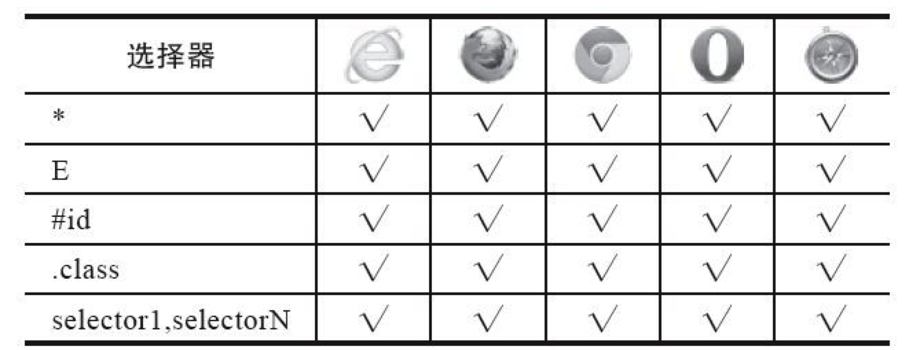

## 2 层级选择器

- 后代选择器 `E F`

  ```css
  .news-list li {}
  ```

- 子选择器 `E>F`

  ```css
  .news-list>li {}
  ```

- 相邻兄弟选择器 `E+F`

  ```css
  .active+.item {}
  ```

- 通用兄弟选择器 `E~F`

  ```css
  .active~li {}
  ```

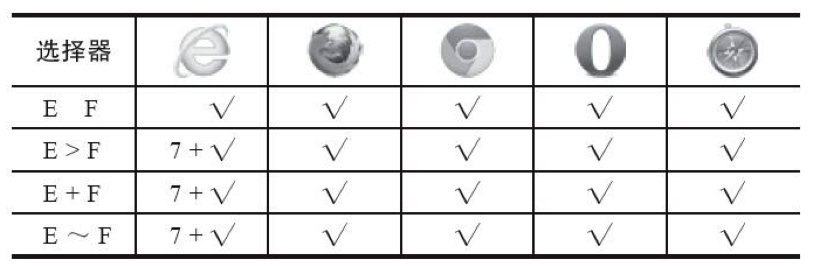

## 3 属性选择器

- `E[attr]` 选择具有att属性的E元素。
- `E[attr="val"]` 选择具有att属性且属性值等于val的E元素。
- `E[attr~="val"]` 选择具有att属性且属性值为一用空格分隔的字词列表，其中一个等于val的E元素（包含只有一个值且该值等于val的情况。
- `E[attr^="val"]` 选择具有att属性且属性值为以val开头的字符串的E元素。
- `E[attr$="val"]`选择具有att属性且属性值为以val结尾的字符串的E元素。
- `E[attr*="val"]` 选择具有att属性且属性值为包含val的字符串的E元素。
- `E[attr|="val"]` 选择具有att属性且属性值为以val开头并用连接符"-"分隔的字符串的E元素，如果属性值仅为val，也将被选择。

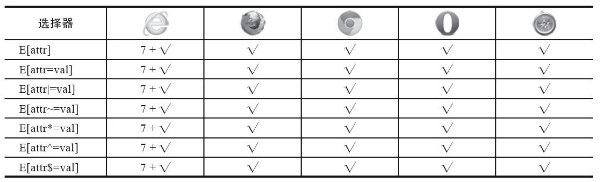

## 4 伪类选择器

### 4.1 动态态伪类选择器

- `E:link`

  ```
    设置超链接a在未被访问前的样式。
  ```

  注意，a:hover 必须位于 a:link 和 a:visited 之后，a:active 必须位于 a:hover 之后

- `E:visited`

  ```
    设置超链接a在其链接地址已被访问过时的样式。
  ```

- `E:hover`

  ```
    设置元素在其鼠标悬停时的样式。
  ```

- `E:active`

  ```
    设置元素在被用户激活（在鼠标点击与释放之间发生的事件）时的样式。
  ```

- `E:focus`

  ```
    设置对象在成为输入焦点（该对象的onfocus事件发生）时的样式。
  ```

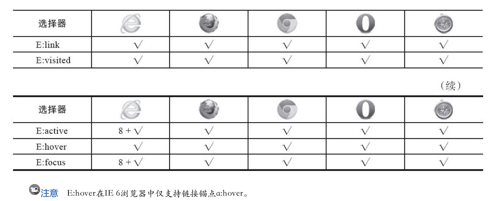

### 4.2 目标伪类选择器

- `E:target`

  ```
    匹配相关URL指向的E元素。
  ```

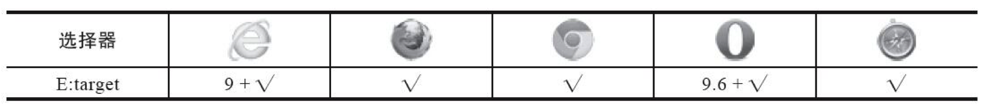

### 4.3 语言伪类选择器

- `E:lang(fr)`

  ```
    匹配使用特殊语言的E元素
  ```

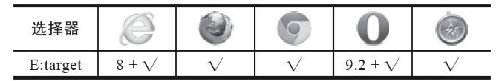

### 4.4 UI元素伪类选择器

- `E:checked`

  ```
    匹配用户界面上处于选中状态的元素E。(用于input type为radio与checkbox时)
  ```

- `E:enabled`

  ```
    匹配用户界面上处于可用状态的表单元素
  ```

- `E:disabled`

  ```
    匹配用户界面上处于禁用状态的表单元素
  ```

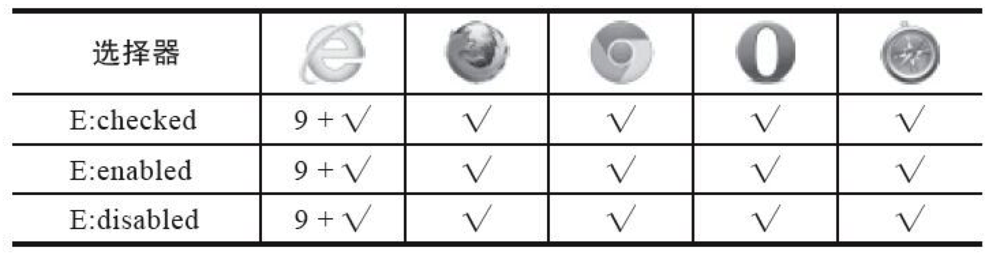

### 4.5 结构伪类选择器

- `E:root`

  ```
    匹配E元素在文档的根元素。在HTML中，根元素永远是HTML
  ```

- `E:first-child`

  ```
    匹配父元素的第一个子元素E。
  ```

- `E:last-child`

  ```
    匹配父元素的最后一个子元素E。
  ```

- `E:only-child`

  ```
    匹配父元素仅有的一个子元素E。
  ```

- `E:nth-child(n)`

  ```
    匹配父元素的第n个子元素E，假设该子元素不是E，则选择符无效。
  ```

- `E:nth-last-child(n)`

  ```
    匹配父元素的倒数第n个子元素E，假设该子元素不是E，则选择符无效。
  ```

- `E:first-of-type`

  ```
    匹配同类型中的第一个同级兄弟元素E
  ```

- `E:last-of-type`

  ```
    匹配同类型中的最后一个同级兄弟元素E
  ```

- `E:only-of-type`

  ```
    匹配同类型中的唯一的一个同级兄弟元素E
  ```

- `E:nth-of-type(n)`

  ```
    匹配同类型中的第n个同级兄弟元素E
  ```

- `E:nth-last-of-type(n)`

  ```
    匹配同类型中的倒数第n个同级兄弟元素E
  ```

- `E:empty`

  ```
    匹配没有任何子元素（包括text节点）的元素E
  ```

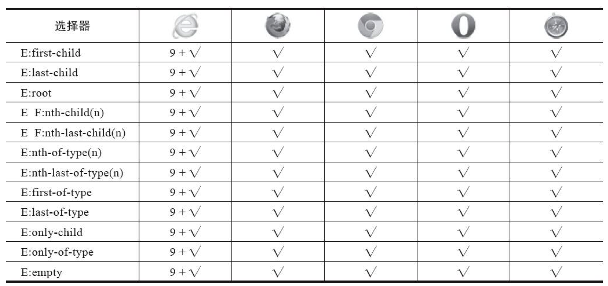

### 4.6 否定伪类选择器

- `E:not(s)`

  ```
    匹配不含有s选择符的元素E
  ```

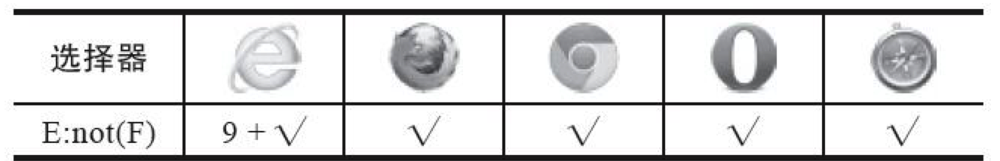

## 5 伪元素选择器

- `E:first-letter/E::first-letter`

  ```
    设置对象内的第一个字符的样式。
  ```

- `E:first-line/E::first-line`

  ```
    设置对象内的第一行的样式。
  ```

- `E:before/E::before`

  ```
    设置在对象前（依据对象树的逻辑结构）发生的内容。用来和content属性一起使用
  ```

- `E:after/E::after`

  ```
    设置在对象后（依据对象树的逻辑结构）发生的内容。用来和content属性一起使用
  ```

- `E::placeholder`

  ```
    设置对象文字占位符的样式。
  ```

- `E::selection`

  ```
    设置对象被选择时的样式。
  ```

## 6 选择器优先级

### 6.1 权重的等级与权值

行内样式（1000）> ID选择器（100）> 类，属性选择器和伪类选择器（10）> 元素选择器和伪元素选择器（1）>通配符选择器（0）

### 6.2 CSS权重规则

1) 当多个选择器发生冲突时，会选择权重高的选择器来显示，权重越高越优先显示

2) 比较时需要将多个选择器的权重进行相加在进行比较，如果权重一样，后面的会覆盖前面的样式

3) 权重相加不可能超过他的最大数量级，例如无论多少个元素组成的选择器，都没有一个class选择器权重高

4) 可以在样式后边添加一个！important ，这样该样式将会拥有最大的权重，其他样式都不能将其覆盖（注意：尽量不要使用！important）

# 盒子模型

## 1 盒子尺寸

- box-sizing 定义盒子模型的尺寸解析方式

  ```
  值：
  content-box(默认)    
  border-box
  ```

- resize 否允许用户缩放，调节元素尺寸大小

  ```
  值：
  none： 不允许用户调整元素大小。 (默认)
  both： 用户可以调节元素的宽度和高度。 
  horizontal： 用户可以调节元素的宽度     
  vertical： 用户可以调节元素的高度。
  ```

## 2 display

display 盒子是否以及如何显示

```
值：
none： 隐藏对象。与visibility属性的hidden值不同，其不为被隐藏的对象保留其物理空间 
inline： 指定对象为内联元素。 
block： 指定对象为块元素。 
list-item： 指定对象为列表项目。 
inline-block： 指定对象为内联块元素。（CSS2） 
table： 指定对象作为块元素级的表格。类同于html标签<table>（CSS2） 
inline-table： 指定对象作为内联元素级的表格。类同于html标签<table>（CSS2） 
table-caption： 指定对象作为表格标题。类同于html标签<caption>（CSS2） 
table-cell： 指定对象作为表格单元格。类同于html标签<td>（CSS2） 
table-row： 指定对象作为表格行。类同于html标签<tr>（CSS2） 
table-row-group： 指定对象作为表格行组。类同于html标签<tbody>（CSS2） 
table-column： 指定对象作为表格列。类同于html标签<col>（CSS2） 
table-column-group： 指定对象作为表格列组显示。类同于html标签<colgroup>（CSS2） 
table-header-group： 指定对象作为表格标题组。类同于html标签<thead>（CSS2） 
table-footer-group： 指定对象作为表格脚注组。类同于html标签<tfoot>（CSS2）
run-in： 根据上下文决定对象是内联对象还是块级对象。（CSS3） 
box： 将对象作为弹性伸缩盒显示。（伸缩盒最老版本）（CSS3） 
inline-box： 将对象作为内联块级弹性伸缩盒显示。（伸缩盒最老版本）（CSS3） 
flexbox： 将对象作为弹性伸缩盒显示。（伸缩盒过渡版本）（CSS3） 
inline-flexbox： 将对象作为内联块级弹性伸缩盒显示。（伸缩盒过渡版本）（CSS3） 
flex： 将对象作为弹性伸缩盒显示。（伸缩盒最新版本）（CSS3） 
inline-flex： 将对象作为内联块级弹性伸缩盒显示。（伸缩盒最新版本）（CSS3）
```

## 3 盒子阴影

**box-shadow** 设置元素的阴影

```
box-shadow:<length>① <length>②;
box-shadow:<length>① <length>② <color>;
box-shadow:<length>① <length>② <length>③;
box-shadow:<length>① <length>② <length>③ <color>;
box-shadow:<length>① <length>② <length>③ <length>④ <color>;
box-shadow:<length>① <length>② <length>③ <length>④ <color> inset;
box-shadow:<length>① <length>② inset;
```

> **取值：**
>
> none： 无阴影
>
> `<length>`①： 第1个长度值用来设置对象的阴影水平偏移值。可以为负值 `<length>`②： 第2个长度值用来设置对象的阴影垂直偏移值。可以为负值 `<length>`③： 如果提供了第3个长度值则用来设置对象的阴影模糊值。不允许负值 `<length>`④： 如果提供了第4个长度值则用来设置对象的阴影外延值。可以为负值 `<color>`： 设置对象的阴影的颜色。 inset： 设置对象的阴影类型为内阴影。该值为空时，则对象的阴影类型为外阴影

可以设定多组效果，每组参数值以逗号分隔

```css
test .outset {
    box-shadow: 5px 5px rgba(0, 0, 0, .6);
}
.test .outset-blur {
    box-shadow: 5px 5px 5px rgba(0, 0, 0, .6);
}
.test .outset-extension {
    box-shadow: 5px 5px 5px 10px rgba(0, 0, 0, .6);
}
.test .inset {
    box-shadow: 2px 2px 5px 1px rgba(0, 0, 0, .6) inset;
}
.test .multiple-shadow {
    box-shadow:
        0 0 5px 3px rgba(255, 0, 0, .6),
        0 0 5px 6px rgba(0, 182, 0, .6),
        0 0 5px 10px rgba(255, 255, 0, .6);
}
```

## 4 盒子倒影

**-webkit-box-reflect** 倒影 （仅webkit 支持）

> 值: box-reflect：none | direction offset? mask-box-image?
>
> **取值：**
>
> **direction:**
>
> ```
> above： 指定倒影在对象的上边 
> below： 指定倒影在对象的下边 
> left： 指定倒影在对象的左边 
> right： 指定倒影在对象的右边
> ```
>
> **offset:**
>
> ```
> <length>： 用长度值来定义倒影与对象之间的间隔。可以为负值 
> <percentage>： 用百分比来定义倒影与对象之间的间隔。可以为负值
> ```
>
> **mask-box-image:**
>
> ```
> none： 无遮罩图像 
> <url>： 使用绝对或相对地址指定遮罩图像。 
> <linear-gradient>： 使用线性渐变创建遮罩图像。 
> <radial-gradient>： 使用径向(放射性)渐变创建遮罩图像。 
> <repeating-linear-gradient>： 使用重复的线性渐变创建背遮罩像。 
> <repeating-radial-gradient>： 使用重复的径向(放射性)渐变创建遮罩图像。
> ```

## 5 盒子不透明度

- **opacity** 检索或设置对象的不透明度。 值是0~1的范围。

- 对于尚不支持**opacity**属性的IE浏览器可以使用IE私有的滤镜属性来实现与**opacity**相同的效果

  ```css
  filter: alpha(opacity=透明值)
  ```

# 背景

## 1 新增背景属性

- **background-origin** 背景图片原点

  ```
  取值：
  padding-box：(默认值) 从padding区域（含padding）开始显示背景图像。 
  border-box： 从border区域（含border）开始显示背景图像。 
  content-box： 从content区域开始显示背景图像。
  ```

- **backgroun-clip** 指定对象的背景图像向外裁剪的区域。

  ```
  取值：
  padding-box： 从padding区域（不含padding）开始向外裁剪背景。 
  border-box： (默认值)从border区域（不含border）开始向外裁剪背景。 
  content-box： 从content区域开始向外裁剪背景。 
  text： 从前景内容的形状（比如文字）作为裁剪区域向外裁剪，如此即可实现使用背景作为填充色之类的遮罩效果
  ```

- **background-size** 背景图像的尺寸

  ```
  <length>： 用长度值指定背景图像大小。不允许负值。 
  <percentage>： 用百分比指定背景图像大小。不允许负值。 
  auto： 背景图像的真实大小。 
  cover： 将背景图像等比缩放到完全覆盖容器，背景图像有可能超出容器。 
  contain： 将背景图像等比缩放到宽度或高度与容器的宽度或高度相等，背景图像始终被包含在容器内。
  ```

## 2 复合属性用法

```css
background:bg-color bg-image  bg-repeat bg-attachment bg-position / bg-size bg-origin bg-clip
```

## 3 多背景

```css
background:url(test1.jpg) no-repeat scroll 10px 20px/50px 60px content-box padding-box,
           url(test1.jpg) no-repeat scroll 10px 20px/70px 90px content-box padding-box,
           url(test1.jpg) no-repeat scroll 10px 20px/110px 130px content-box padding-box #aaa;
```

# 边框

## 1 边框圆角

- **border-radius**

  > 设置或检索对象使用圆角边框。
  >
  > 提供2个参数，2个参数以“/”分隔，每个参数允许设置1~4个参数值，第1个参数表示水平半径，第2个参数表示垂直半径，如第2个参数省略，则默认等于第1个参数 水平半径：
  >
  > 如果提供全部四个参数值，将按上左(top-left)、上右(top-right)、下右(bottom-right)、下左(bottom-left)的顺序作用于四个角。
  >
  > 如果只提供一个，将用于全部的于四个角。
  >
  > 如果提供两个，第一个用于上左(top-left)、下右(bottom-right)，第二个用于上右(top-right)、下左(bottom-left)。
  >
  > 如果提供三个，第一个用于上左(top-left)，第二个用于上右(top-right)、下左(bottom-left)，第三个用于下右(bottom-right)。
  >
  > 垂直半径也遵循以上4点。

- **border-top-left-radius** 设置或检索对象的左上角圆角边框

- **border-top-right-radius** 设置或检索对象的右上角圆角边框

- **border-bottom-right-radius** 设置或检索对象的右下角圆角边框

- **border-bottom-left-radius** 设置或检索对象的左下角圆角边框

## 2 边框图片

- **border-image-source** 设置或检索对象的边框样式使用图像路径。

  ```
  取值: url
  ```

- **border-image-slice** 设置或检索对象的边框背景图的分割方式。

  ```
  取值: 浮点数/百分比
  ```

- **border-image-width** 设置或检索对象的边框厚度。

  ```
  取值: 长度值/百分比/浮点数
  ```

- **border-image-outset** 设置或检索对象的边框背景图的扩展

  ```
  取值: 长度值/浮点数
  ```

- **border-image-repeat** 设置或检索对象的边框图像的平铺方式。

  ```
  取值：
        stretch： 指定用拉伸方式来填充边框背景图。 
      repeat： 指定用平铺方式来填充边框背景图。当图片碰到边界时，如果超过则被截断。 
        round： 指定用平铺方式来填充边框背景图。图片会根据边框的尺寸动态调整图片的大小直至正好可以铺满整个边框。 
        space： 指定用平铺方式来填充边框背景图。图片会根据边框的尺寸动态调整图片的之间的间距直至正好可以铺满整个边框。
  ```

- **border-image** 复合属性。设置或检索对象的边框样式使用图像来填充。

  ```
  border-image：<' border-image-source '> || <' border-image-slice '> [ / <' border-image-width '> | / <' border-image-width '>? / <' border-image-outset '> ]? || <' border-image-repeat '>
  ```

## 3 外轮廓

- **outline-width** 外廓线宽度

  > ： 用长度值来定义轮廓的厚度。不允许负值 medium： 定义默认宽度的轮廓。 thin： 定义比默认宽度细的轮廓。 thick： 定义比默认宽度粗的轮廓。

- **outline-style** 外廓线风格

  > none： 无轮廓。与任何指定的 <' outline-width '> 值无关
  >
  > dotted： 点状轮廓。
  >
  > dashed： 虚线轮廓。
  >
  > solid： 实线轮廓
  >
  > double： 双线轮廓。两条单线与其间隔的和等于指定的 <' outline-width '> 值
  >
  > groove： 3D凹槽轮廓。
  >
  > ridge： 3D凸槽轮廓。
  >
  > inset： 3D凹边轮廓。
  >
  > outset： 3D凸边轮廓。

- **outline-color** 外廓线颜色

- **outline-offset** 外廓线的偏移量, 取值长度单位

- **outline** 复合属性，给元素周围绘制一条轮廓线

  ```css
  <' outline-width '> || <' outline-style '> || <' outline-color '>
  ```

# 文本设置

## 1 文本对齐

- **text-align** 文本水平对齐方式。

  > **取值：**
  >
  > left： 内容左对齐。
  >
  > center： 内容居中对齐。
  >
  > right： 内容右对齐。
  >
  > justify： 内容两端对齐。
  >
  > start： 内容对齐开始边界。（CSS3） （CSS3中规定的默认值）
  >
  > end： 内容对齐结束边界。（CSS3）

- **text-align-last** 文本最后一行的对齐方式（如果只有一行，既是第一行，也是最后一行）**CSS3新增属性**

  > **取值：**
  >
  > auto： 无特殊对齐方式。 (默认值)
  >
  > left： 内容左对齐。
  >
  > center： 内容居中对齐。
  >
  > right： 内容右对齐。
  >
  > justify： 内容两端对齐。
  >
  > start： 内容对齐开始边界。
  >
  > end： 内容对齐结束边界。

- **vertical-align** 文本在行框内的垂直对齐方式

  > **取值：**
  >
  > baseline： 把当前盒的基线与父级盒的基线对齐。如果该盒没有基线，就将底部外边距的边界和父级的基线对齐 (默认值)
  >
  > sub： 把当前盒的基线降低到合适的位置作为父级盒的下标（该值不影响该元素文本的字体大小）
  >
  > super： 把当前盒的基线提升到合适的位置作为父级盒的上标（该值不影响该元素文本的字体大小）
  >
  > text-top： 把当前盒的top和父级的内容区的top对齐
  >
  > text-bottom： 把当前盒的bottom和父级的内容区的bottom对齐
  >
  > middle： 把当前盒的垂直中心和父级盒的基线加上父级的半x-height对齐
  >
  > top： 把当前盒的top与行盒的top对齐
  >
  > bottom： 把当前盒的bottom与行盒的bottom对齐
  >
  > `<percentage>`： 把当前盒提升（正值）或者降低（负值）这个距离，百分比相对line-height计算。当值为0%时等同于baseline。
  >
  > `<length>`： 把当前盒提升（正值）或者降低（负值）这个距离。当值为0时等同于baseline。

  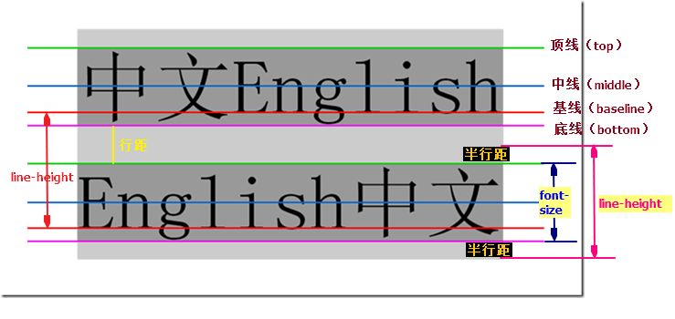

## 2 文本阴影

- **text-shadow** 设置文本阴影

  ```
  text-shadow：none | <shadow> [ , <shadow> ]* <shadow> = <length>{2,3} && <color>?
  ```

  > **取值：**
  >
  > none： 无阴影 (默认值)
  >
  > length①： 第1个长度值用来设置对象的阴影水平偏移值。可以为负值
  >
  > length②： 第2个长度值用来设置对象的阴影垂直偏移值。可以为负值
  >
  > length③： 如果提供了第3个长度值则用来设置对象的阴影模糊值。不允许负值
  >
  > color: 设置对象的阴影的颜色。

## 3 文本溢出

- **text-overflow** 设置文本内容溢出容器时的状态

  > **取值：**
  >
  > clip： 当内联内容溢出块容器时，将溢出部分裁切掉。 （默认值）
  >
  > ellipsis： 当内联内容溢出块容器时，将溢出部分替换为（...）。
  >
  > **注意：**
  >
  > 要使得 `text-overflow` 属性生效，块容器必须显式定义 `overflow` 为非 `visible` 值， `white-space` 为 `nowrap` 值。

## 4 文本换行

- **word-wrap / overflow-wrap** 设置内容超过指定容器的边界时是否断行。

  > **取值：**
  >
  > normal： 允许内容顶开或溢出指定的容器边界。 （默认值）
  >
  > break-word： 内容将在边界内换行，如果需要，单词内部允许断行。它要求一个没有断行破发点的词必须保持为一个整体单位，如果当前行无法放下需要被打断的单词，为了保持完整性，会将整个单词放到下一行进行展示。这与word-break的break-word值效果相同
  >
  > **注意**：
  >
  > IE5.5率先实现了`word-wrap`，后期被w3c采纳成标准属性；
  >
  > CSS3中将`word-wrap`改名为`overflow-wrap`；

- **word-break** 文本的字内换行行为。

  > **取值：**
  >
  > normal： 默认的换行规则。依据各自语言的规则，允许在字间发生换行。 （默认值）
  >
  > keep-all： 对于 CJK（中文，韩文，日文）文本不允许在字符内发生换行。Non-CJK 文本表现同`normal`
  >
  > break-all： 对于 Non-CJK 文本允许在任意字符内发生换行。该值适合包含一些非亚洲文本的亚洲文本，比如使连续的英文字符断行。
  >
  > break-word： 与`break-all` 相同，不同的地方在于它要求一个没有断行破发点的词必须保持为一个整体单位。这与 word-wrap 的 `break-word` 值效果相同

- **white-space** 设置元素是否保留文本间的空格、换行；指定文本超过边界时是否换行。

  > **取值：**
  >
  > normal： 默认处理方式。会将序列的空格合并为一个，内部是否换行由换行规则决定。 （默认值）
  >
  > pre： 原封不动的保留你输入时的状态，空格、换行都会保留，并且当文字超出边界时不换行。等同 pre 元素效果
  >
  > nowrap： 与`normal`值一致，不同的是会强制所有文本在同一行内显示。
  >
  > pre-wrap： 与`pre`值一致，不同的是文字超出边界时将自动换行。
  >
  > pre-line： 与`normal`值一致，但是会保留文本输入时的换行。
  >
  > **注意：** 控制文本断行，该属性是最常用的

## 5 文本装饰

- **text-decoration** CSS3变成了复合属性

  ```
  text-decoration：text-decoration-line || text-decoration-style || text-decoration-color
  ```

  > **注意：**
  >
  > 所有浏览器均支持 CSS2.1 中的`text-decoration`属性，在CSS3中，该属性定义被移植到其新的分解属性 `text-decoration-line` 上；

- **text-decoration-line** 设置文本装饰线的位置

  > **取值：**
  >
  > none： 指定文字无装饰 （默认值）
  >
  > underline： 指定文字的装饰是下划线
  >
  > overline： 指定文字的装饰是上划线
  >
  > line-through： 指定文字的装饰是贯穿线
  >
  > blink： 指定文字的装饰是闪烁。

- **text-decoration-style** 文本装饰线条的形状

  > **取值：**
  >
  > solid： 实线 （默认）
  >
  > double： 双线
  >
  > dotted： 点状线条
  >
  > dashed： 虚线
  >
  > wavy： 波浪线

- **text-decoration-color** 文本装饰线条的颜色

## 6 文本描边

文字描边功能仅 webkit 内核浏览器支持

- **-webkit-text-fill-color** 定义文字填充色

  > **注意：**
  >
  > 若同时设置 `-webkit-text-fill-color` 和 `color` 属性，`-webkit-text-fill-color` 定义的颜色将覆盖 `color` 定义。

- **-webkit-text-stroke-width** 设置文字描边的宽度，取长度单位。

- **-webkit-text-stroke-color** 设置文字描边的颜色，取颜色单位。

- **-webkit-text-stroke** 复合属性，设置文字描边宽度和颜色。

## 7 其他文本设置

- **text-transform** 设置文本如何转换大小写。

  > **取值：**
  >
  > none： 无转换
  >
  > capitalize： 将每个单词的第一个字母转换成大写
  >
  > uppercase： 将每个单词转换成大写
  >
  > lowercase： 将每个单词转换成小写

- **tab-size** 设置内容中制表符的长度。 取值长度单位。

  > **取值：**
  >
  > number： 用整数值指定制表符的长度。不允许负值。 代表空格的倍数(如：tab-size:4; 表示制表符宽度是4个空格的宽度) 。
  >
  > length：用长度值指定制表符的长度。不允许负值。
  >
  > **注意：**
  >
  > 只有当`white-space` 的属性值为：`pre | pre-wrap`时，该属性的定义才有效 。

# 渐变色

## 1 线性渐变

### 语法

```
<linear-gradient> = linear-gradient([ [ <angle> | to <side-or-corner> ] ,]? <color-stop>[, <color-stop>]+)

<side-or-corner> = [left | right] || [top | bottom]

<color-stop> = <color> [ <length> | <percentage> ]?
```

### 取值

```
<angle>：用角度值指定渐变的方向（或角度）。
    to left： 设置渐变为从右到左。相当于: 270deg
    to right：设置渐变从左到右。相当于: 90deg
    to top：  设置渐变从下到上。相当于: 0deg
    to bottom： 设置渐变从上到下。相当于: 180deg。这是默认值，等同于留空不写。

<color-stop> 用于指定渐变的起止颜色：
    <color>：  指定颜色。
    <length>： 用长度值指定起止色位置。不允许负值
    <percentage>： 用百分比指定起止色位置。
```

### 示例

```css
linear-gradient(#fff, #333);
linear-gradient(to bottom, #fff, #333);
linear-gradient(to top, #333, #fff);
linear-gradient(180deg, #fff, #333);
linear-gradient(to bottom, #fff 0%, #333 100%);
```

## 2 径向渐变

### 语法

```
<radial-gradient> = radial-gradient([ [ <shape> || <size> ] [ at <position> ]? , | at <position>, ]?<color-stop>[ , <color-stop> ]+)

<position> = [ <length>① | <percentage>① | left | center① | right ]? [ <length>② | <percentage>② | top | center② | bottom ]?

<shape> = circle | ellipse

<size> = <extent-keyword> | [ <circle-size> || <ellipse-size> ]

<extent-keyword> = closest-side | closest-corner | farthest-side | farthest-corner

<circle-size> = <length>

<ellipse-size> = [ <length> | <percentage> ]{2}

<shape-size> = <length> | <percentage>

<color-stop> = <color> [ <length> | <percentage> ]?
```

### 取值

```
<position> 确定圆心的位置。如果提供2个参数，第一个表示横坐标，第二个表示纵坐标；如果只提供一个，第二值默认为50%，即center
    <percentage>①：用百分比指定径向渐变圆心的横坐标值。可以为负值。
    <length>①：用长度值指定径向渐变圆心的横坐标值。可以为负值。
    left：设置左边为径向渐变圆心的横坐标值。
    center①：设置中间为径向渐变圆心的横坐标值。
    right：设置右边为径向渐变圆心的横坐标值。
    <percentage>②：用百分比指定径向渐变圆心的纵坐标值。可以为负值。
    <length>②：用长度值指定径向渐变圆心的纵坐标值。可以为负值。
    top：设置顶部为径向渐变圆心的纵坐标值。
    center②：设置中间为径向渐变圆心的纵坐标值。
    bottom：设置底部为径向渐变圆心的纵坐标值。

<shape> 确定圆的类型
    circle：指定圆形的径向渐变
    ellipse：指定椭圆形的径向渐变。

<extent-keyword> circle | ellipse 都接受该值作为 size
    closest-side：指定径向渐变的半径长度为从圆心到离圆心最近的边
    closest-corner：指定径向渐变的半径长度为从圆心到离圆心最近的角
    farthest-side：指定径向渐变的半径长度为从圆心到离圆心最远的边
    farthest-corner：指定径向渐变的半径长度为从圆心到离圆心最远的角 （默认值）

<circle-size> circle 接受该值作为 size
    <length>：用长度值指定正圆径向渐变的半径长度。不允许负值。

<ellipse-size> ellipse 接受该值作为 size
    <length>：用长度值指定椭圆径向渐变的横向或纵向半径长度。不允许负值。
    <percentage>：用百分比指定椭圆径向渐变的横向或纵向半径长度。不允许负值。

<color-stop> 用于指定渐变的起止颜色：
    <color>：指定颜色。
    <length>：用长度值指定起止色位置。不允许负值
    <percentage>：用百分比指定起止色位置。不允许负值
```

### 示例

```css
radial-gradient(circle, #f00, #ff0, #080);
radial-gradient(circle at center, #f00, #ff0, #080);
radial-gradient(circle at 50%, #f00, #ff0, #080);
radial-gradient(circle farthest-corner, #f00, #ff0, #080);
```

## 3 重复渐变

- **repeating-linear-gradient()** 重复先行渐变 参数同linear-gradient()
- **repeating-radial-gradient** 重复径向渐变 参数同radial-gradient()

## 4 低版本IE实现渐变 （了解）

低版本IE可以用IE滤镜实现：

```js
filter:progid:DXImageTransform.Microsoft.Gradient(GradientType=0,startColorStr=orange,endColorStr=green)
```

> **注意：**
>
> 滤镜是IE特有的语法，其他浏览器并不支持，且新版本IE以及Edge早已不再支持滤镜语法。

# 变换 transform

## 1 变换相关属性

- **transform** 设置或检索对象的转换。

  > **取值：**
  >
  > none (默认值)无转换
  >
  > 2D Transform Functions
  >
  > 3D Transform Functions

- **transform-origin** 设置或检索对象以某个原点进行转换。

  > **用法:**
  >
  > 如果提供两个值，第一个用于横坐标，第二个用于纵坐标。
  >
  > 如果只提供一个，该值将用于横坐标；纵坐标将默认为50%。
  >
  > 3D变形需要制定Z坐标 第三个参数值
  >
  > **取值:**
  >
  > left right center `<lenght>` `<percentage>` top bottom center `<lenght>` `<percentage>`

- **transform-style** 指定某元素的子元素是（看起来）位于三维空间内，还是在该元素所在的平面内被扁平化。

  > **取值：**
  >
  > flat： (默认)指定子元素位于此元素所在平面内
  >
  > preserve-3d： 指定子元素定位在三维空间内
  >
  > **注意：**
  >
  > 决定一个变换元素看起来是处在三维空间还是平面内，需要该元素的父元素上定义 `transform-style` 属性。

- **perspective** 景深，指定观察者与「z=0」平面的距离，使具有三维位置变换的元素产生透视效果。

  > **取值：**
  >
  > none： 不指定透视 （默认值）
  >
  > `<length>` ： 指定观察者距离「z=0」平面的距离，为元素及其内容应用透视变换。不允许负值。「z>0」的三维元素比正常大，而「z<0」时则比正常小。

  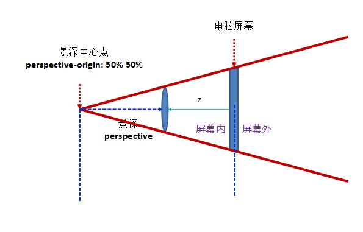

  

- **perspective-origin** 设置透视点的位置

  > **用法：**
  >
  > 如果提供两个参数，第一个用于横坐标，第二个用于纵坐标。 如果只提供一个参数，该值将用于横坐标；纵坐标将默认为center。
  >
  > **取值：**
  >
  > left right center `<lenght>` `<percentage>` top bottom center `<lenght>` `<percentage>`

- **backface-visibility** 指定元素背面面向用户时是否可见。

  > **取值：**
  >
  > visible： (默认)指定元素背面可见，允许显示正面的镜像。 hidden： 指定元素背面不可见
  >
  > **注意：**
  >
  > 决定一个元素背面面向用户时是否可见，需要直接在该元素上定义 `backface-visibility` 属性，而不能在其父元素上，因为该属性默认为不可继承。

## 2 2D变换

```
2D位移：
- translate(x, y) 指定对象的2D平移。第一个参数对应X轴，第二个参数对应Y轴。如果第二个参数未提供，则默认值为0 
- translatex()     指定对象X轴（水平方向）的平移 
- translatey()    指定对象Y轴（垂直方向）的平移 

2D缩放：
- scale(x, y)   指定对象的2D缩放。第一个参数对应X轴，第二个参数对应Y轴。如果第二个参数未提供，则默认取第一个参数的值 
- scalex()    指定对象X轴的（水平方向）缩放 
- scaley()    指定对象Y轴的（垂直方向）缩放 

2D旋转：
- rotate(deg)    指定对象的2D rotation（2D旋转）

2D扭曲：
- skew(x,y)    指定对象斜切扭曲。第一个参数对应X轴，第二个参数对应Y轴。如果第二个参数未提供，则默认值为0 
- skewx()    指定对象X轴的（水平方向）扭曲 
- skewy()    指定对象Y轴的（垂直方向）扭曲 

2D矩阵：
- matrix()    以一个含六值的(a,b,c,d,e,f)变换矩阵的形式指定一个2D变换，相当于直接应用一个[a,b,c,d,e,f]变换矩阵
```

## 3 3D变换

```
3D位移:
- translate3d(x, y, z)    指定对象的3D位移。第1个参数对应X轴，第2个参数对应Y轴，第3个参数对应Z轴，参数不允许省略 
- translatez()    指定对象Z轴的平移

3D缩放:
- scale3d()    指定对象的3D缩放。第1个参数对应X轴，第2个参数对应Y轴，第3个参数对应Z轴，参数不允许省略 
- scalez()    指定对象的z轴缩放 

3D旋转:
- rotate3d(x, y, z, a)    指定对象的3D旋转角度，其中前3个参数分别表示旋转的方向x,y,z，第4个参数表示旋转的角度，参数不允许省略
- rotatex()    指定对象在x轴上的旋转角度 
- rotatey()    指定对象在y轴上的旋转角度 
- rotatex()    指定对象在z轴上的旋转角度 

3D矩阵:
- matrix3d()    以一个4x4矩阵的形式指定一个3D变换 

透视距离：
- perspective() 指定透视距离
```

## 4 多重变换

CSS3支持多重变形

```css
transform:translate(-50%, -50%) rotate(45deg);
```

# 过渡 transition

## 1 过渡相关属性

- **transition** 检索或设置对象变换时的过渡。复合属性

  > **注意：**
  >
  > 如果只提供一个参数，则为 `transition-duration` 的值定义；如果提供二个参数，则第一个为 `transition-duration` 的值定义，第二个为 `transition-delay` 的值定义

- **transition-property** 设置对象中的参与过渡的属性

  > **取值：**
  >
  > none： 不指定过渡的css属性 all： 所有可以进行过渡的css属性 （默认值） IDENT： 指定要进行过渡的css属性 ，如果提供多个属性值，以逗号进行分隔。
  >
  > **可以被过渡的属性有:**
  >
  > 颜色属性 具有长度值 百分比的属性 值是数字的属性 如 z-index opacity outline-offset等 变形系列属性 阴影 渐变

- **transition-duration** 设置对象过渡的持续时间，如果提供多个属性值，以逗号进行分隔。

- **transition-timing-function** 设置对象中过渡的动画类型

  > **取值：**
  >
  > ease： 平滑过渡。等同于贝塞尔曲线(0.25, 0.1, 0.25, 1.0)
  >
  > linear： 线性过渡。等同于贝塞尔曲线(0.0, 0.0, 1.0, 1.0)
  >
  > ease-in： 由慢到快。等同于贝塞尔曲线(0.42, 0, 1.0, 1.0)
  >
  > ease-out： 由快到慢。等同于贝塞尔曲线(0, 0, 0.58, 1.0)
  >
  > ease-in-out： 由慢到快再到慢。等同于贝塞尔曲线(0.42, 0, 0.58, 1.0)
  >
  > cubic-bezier( number, number, number, number)： 特定的贝塞尔曲线类型，4个数值需在[0, 1]区间内
  >
  > step-start： 等同于 steps(1, start)
  >
  > step-end： 等同于 steps(1, end)
  >
  > steps( integer [, [ start | end ] ]?)： 接受两个参数的步进函数。第一个参数必须为正整数，指定函数的步数。第二个参数取值可以是start或end，指定每一步的值发生变化的时间点。第二个参数是可选的，默认值为end。
  >
  > 在线制作贝塞尔曲线： https://cubic-bezier.com/#.17,.67,.83,.67

- **transition-delay** 设置对象延迟过渡的时间

## 2 CSS3触发过渡的条件

- 伪类触发
- 媒体查询
- JavaScript触发

# 动画 animation

## 1 关键帧

帧——就是动画中最小单位的单幅影像画面，相当于电影胶片上的每一格镜头。

## 2 关键帧语法

```
@keyframes 动画名称 {

}
@keyframes testanimations {
    from { opacity: 1; }
    to { opacity: 0; }
}

@keyframes testanimations {
    from { transform: translate(0, 0); }
    20% { transform: translate(20px, 20px); }
    40% { transform: translate(40px, 0); }
    60% { transform: translate(60px, 20); }
    80% { transform: translate(80px, 0); }
    to { transform: translate(100px, 20px); }
}

@keyframes testanimations{
    0% { transform: translate(0, 0); }
    20% { transform: translate(20px, 20px); }
    40% { transform: translate(40px, 0); }
    60% { transform: translate(60px, 20px); }
    80% { transform: translate(80px, 0); }
    100% { transform: translate(100px, 20px); }
}
```

## 3 动画相关属性

- **animation** 设置对象所应用的动画特效 复合属性

  > **注意：**
  >
  > 如果提供多组属性值，以逗号进行分隔。
  >
  > 如果只提供一个参数，则为 `animation-duration` 的值定义；如果提供二个参数，则第一个为 `animation-duration` 的值定义，第二个为 `animation-delay` 的值定义
  >
  > **用法:**
  >
  > ```
  > animation： <single-animation-name> || <time> || <single-animation-timing-function> || <time> || <single-animation-iteration-count> || <single-animation-direction> || <single-animation-fill-mode> || <single-animation-play-state>
  > ```

- **animation-name** 设置对象所应用的动画名称

  > 必须与规则@keyframes配合使用，因为动画名称由@keyframes定义

- **animation-duration** 设置对象动画的持续时间

- **animation-timing-function** 设置对象动画的过渡类型

  > **取值：**
  >
  > ease： 平滑过渡。等同于贝塞尔曲线(0.25, 0.1, 0.25, 1.0)
  >
  > linear： 线性过渡。等同于贝塞尔曲线(0.0, 0.0, 1.0, 1.0)
  >
  > ease-in： 由慢到快。等同于贝塞尔曲线(0.42, 0, 1.0, 1.0)
  >
  > ease-out： 由快到慢。等同于贝塞尔曲线(0, 0, 0.58, 1.0)
  >
  > ease-in-out： 由慢到快再到慢。等同于贝塞尔曲线(0.42, 0, 0.58, 1.0)
  >
  > cubic-bezier( number, number, number, number)： 特定的贝塞尔曲线类型，4个数值需在[0, 1]区间内
  >
  > step-start： 等同于 steps(1, start)
  >
  > step-end： 等同于 steps(1, end)
  >
  > steps( integer [, [ start | end ] ]?)： 接受两个参数的步进函数。第一个参数必须为正整数，指定函数的步数。第二个参数取值可以是start或end，指定每一步的值发生变化的时间点。第二个参数是可选的，默认值为end。

- **animation-delay** 指定对象动画的延迟时间

- **animation-iteration-count** 指定动画的具体循环次数

  > **取值：**
  >
  > number:动画循环次数
  >
  > infinite： 无限循环

- **animation-direction** 设置对象动画在循环中是否反向运动

  > **取值：**
  >
  > normal： 正常方向 (默认)
  >
  > reverse： 反方向运行
  >
  > alternate： 动画先正常运行再反方向运行，并持续交替运行
  >
  > alternate-reverse： 动画先反运行再正方向运行，并持续交替运行

- **animation-play-state** 设置对象动画的状态

  > **取值：**
  >
  > running： 运动 (默认)
  >
  > paused： 暂停

- **animation-fill-mode** 设置对象动画时间之外的状态

  > **取值：**
  >
  > none： 默认值。不设置对象动画之外的状态
  >
  > forwards： 设置对象状态为动画结束时的状态
  >
  > backwards： 设置对象状态为动画开始时的状态
  >
  > both： 设置对象状态为动画结束或开始的状态

# WEB 字体

## 1 嵌入Web字体

### 1.1 什么是Web字体

- 可以把字体放置在服务器上,而不受制于客户端系统字体
- 浏览器会根据指定的命令将对应的字体下载到本地缓存
- 1998年@font-face加入到css2中, 但css2.1中又被移出,css3重新加入
- IE兼容性极好

### 1.2 @font-face语法

#### 格式

```css
@font-face { 
    font-family: <identifier>; 
    src: <fontsrc> [<string>] [, <fontsrc> [<string>]]*; 
    [<font>];
 }
```

#### 相关参数

- identifier 字体名称
- url 此值指的是你自定义的字体的存放路径，可以是相对路径也可以是绝路径
- string 字体的格式，主要用来帮助浏览器识别, format(fontType)

### 1.3 标准写法（兼容）

```css
@font-face {
    font-family: 'diyfont';
    src: url('diyfont.eot'); /* IE9兼容模式 */
    src: url('diyfont.eot?#iefix') format('embedded-opentype'), /* IE9 - */
         url('diyfont.woff') format('woff'), /* chrome、firefox opera  safari  IE9+ 最佳格式 */
         url('diyfont.ttf') format('truetype'), /* chrome、firefox、opera、Safari, Android, iOS 4.2+ IE9+*/
         url('diyfont.svg#fontname') format('svg'); /* iOS 4.1- */
}

/*使用*/
.box {
    font-family: "diyfont";
}
```

### 1.4 各种字体格式的兼容性情况（附）

- truetype .ttf

  > Firefox3.5+ Chrome 4+ Safari 3+ Opear10+ IOS Mobile Safari 4.2+ IE9+

- opentype .otf

  > Firefox3.5+ Chrome 4+ Safari 3+ Opear10+ IOS Mobile Safari 4.2+

- Web Open Font Format .woff

  > Firefox 3.5+ Chrome 6+ Safari 3.6+ Opera 11.1+ IE9+

- embedded Open Type .eot

  > IE4+

- svg .svg

  > Chrome 4+ Safari 3.1 + Opera 10+ IOS Mobile Safari 3.2+

## 2 字体工具

### 2.1 web字体定制

- https://www.iconfont.cn/webfont?spm=a313x.7781068.0.d81ec59f2#!/webfont/index 阿里Web字体
- http://www.youziku.com/ 字体库网站
- https://www.ziti163.com/webfont/create.aspx 字体网

### 2.2 web字体转换

- https://www.fontsquirrel.com/tools/webfont-generator FontSquirrel在线工具
- https://www.fontke.com/tool/fontface/ 字客网

## 3 字体图标

### 3.1 使用字体图标的优势

- 相比位图更加清晰
- 灵活性高，更方便改变大小、颜色、风格等
- 兼容性好，低版本IE也支持

### 3.2 常用的字体图标库

- 阿里图标 http://www.iconfont.cn/
- Font Awesome http://fontawesome.dashgame.com/
- Glyphicons Halfings http://glyphicons.com/

### 3.3 字体图标制作工具

- IcoMoon http://icomoon.io/app/#/select

# 多列布局

## 1 多列布局介绍

实现类似于报纸的布局方式


## 2 多列布局的相关CSS属性

- **columns** 设置的列数和每列的宽度。复合属性

  ```css
  columns：<' column-width '> || <' column-count '>
  ```

- **column-width** 设置每列的宽度（类似于最小宽度）

  > **取值：**
  >
  > auto： 根据 `column-count`> 自定分配宽度
  >
  > length： 用长度值来定义列宽。不允许负值

- **column-count** 设置列数

  > **取值：**
  >
  > auto： 根据 `column-width` 自定分配宽度
  >
  > number： 用整数值来定义列数。不允许负值

- **column-gap** 设置列与列之间的间隙

  > **取值：**
  >
  > normal： 与 `font-size` 大小相同。假设该对象的`font-size`为16px，则normal值为16px，类推。
  >
  > length ： 用长度值来定义列与列之间的间隙。不允许负值 。

- **column-rule** 列与列之间的边框,复合属性 同border类似

  ```css
  column-rule：<' column-rule-width '> || <' column-rule-style '> || <' column-rule-color '>
  ```

- **column-rule-width** 列与列之间的边框厚度

  > **取值：**
  >
  > length： 用长度值来定义边框的厚度。不允许负值
  >
  > medium： 定义默认厚度的边框。
  >
  > thin： 定义比默认厚度细的边框。
  >
  > thick： 定义比默认厚度粗的边框。

- **column-rule-style** 列与列之间的边框样式

  > **取值：**
  >
  > none： 无轮廓。`column-rule-color` 与`column-rule-width` 将被忽略
  >
  > hidden： 隐藏边框。
  >
  > dotted： 点状轮廓。
  >
  > dashed： 虚线轮廓。
  >
  > solid： 实线轮廓
  >
  > double： 双线轮廓。
  >
  > groove： 3D凹槽轮廓。
  >
  > ridge： 3D凸槽轮廓。
  >
  > inset： 3D凹边轮廓。
  >
  > outset： 3D凸边轮廓。

- **column-rule-color** 列与列之间的边框颜色

- **column-span** 对象元素是否横跨所有列

  > **取值：**
  >
  > none： 不跨列 (默认)
  >
  > all： 横跨所有列

- **column-fill** 所有列的高度是否统一

  > **取值：**
  >
  > auto： 列高度自适应内容 (默认)
  >
  > balance： 所有列的高度以其中最高的一列统一

- **column-break-before** 对象之前是否断行

  > **取值：**
  >
  > auto： 既不强迫也不禁止在元素之前断行并产生新列 (默认)
  >
  > always： 总是在元素之前断行并产生新列
  >
  > avoid： 避免在元素之前断行并产生新列

- **column-break-after** 对象之后是否断行

  > **取值：**
  >
  > auto： 既不强迫也不禁止在元素之后断行并产生新列
  >
  > always： 总是在元素之后断行并产生新列
  >
  > avoid： 避免在元素之后断行并产生新列

- **column-break-inside** 对象内部是否断行

  > **取值：**
  >
  > auto： 既不强迫也不禁止在元素内部断行并产生新列 (默认)
  >
  > avoid： 避免在元素内部断行并产生新列