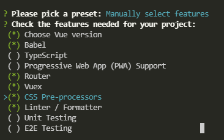
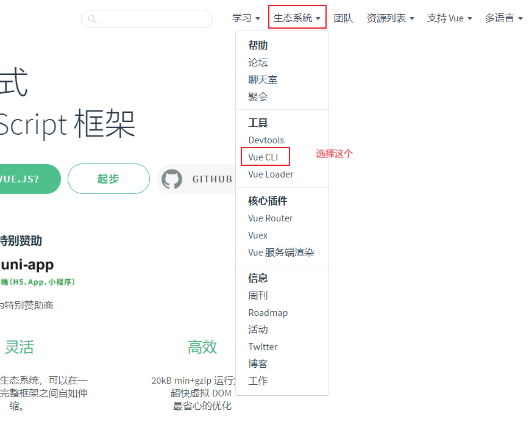
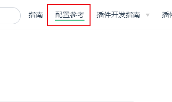
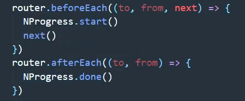

## 初始化项目

```vue
vue create dgshan
```

选择手动设置，



选择图片上的选项，空格键选择，回车键确定

项目创建好后，需要安装一些库

1. axios：npm i axios -S
2. element-ui：npm i element-ui -S


#### 目录介绍

1. node_modules：第三方包
2. public：静态文件
3. src：根目录
4. browserslistrc：浏览器文件
5. editorconfig：编辑器
6. eslintrc.js：代码检查
7. babel.config.js：
8. package-lock.json：

#### 完善目录

src下添加目录

1. utils
2. api/services


#### 完善文件

根目录下创建文件

1. `.env`：通用的
2. `.env.development`：针对开发环境的
3. `.env.test`：针对生产环境的
4. `.env.production`：针对测试环境的

应用场景：配置 api 接口

#### 第三方工具包安装和辅助工具

##### normalize.css

```vue
npm i normalize.css
```

安装完毕后需要再 main.js 中引入

##### axios、NProgress

```vue
npm install --save axios
npm install --save nprogress
```

NProgress是进度条展示效果

```vue
//main.js中引入
import NProgress from 'nprogress'
import 'nprogress/nprogress.css'

NProgress.start()//进度条效果开始
NProgress.done()//结束
```

axios，创建他的实例

在utils目录中创建 request.js 文件

```javascript
import axios from 'axios'
const request = axios.create({
  baseURL:process.env.VUE_APP_BASE_URL,
  timeout:5000,
  headers:{
    'Content-type':'application/json',//数据格式
    'Accept':'application/json',//接收数据格式
  }
})
export default request

```


## 使用Vue官方文档

进入官方文档选择



选择配置参考



#### 添加element-ui

```vue
vue add element-ui
```


#### vue.config.js配置文件

#### 封装axios

#### 处理跨域问题

跨域的概念是出现在浏览器中的，服务器之间不存在跨域问题

在浏览器中，域名，端口，IP地址，协议，有任何一项不同，则跨域

##### JsonP(只能处理get请求)

##### cors(后端开启)

```java
//表示接受任意域名的请求,也可以指定域名
response.setHeader("Access-Control-Allow-Origin", request.getHeader("origin"));

//该字段可选，是个布尔值，表示是否可以携带cookie
response.setHeader("Access-Control-Allow-Credentials", "true");

//客户端所要访问的资源允许使用的方法或方法列表
response.setHeader("Access-Control-Allow-Methods", "GET, HEAD, POST, PUT, PATCH, DELETE, OPTIONS");

response.setHeader("Access-Control-Allow-Headers", "*");
```

##### 代理服务器

https://blog.csdn.net/weixin_41819098/article/details/88053296

本地运行时可以通过代理服务器，但是上线后，代理服务将不起作用。但是项目上线后不存在跨域问题了，项目上线后 `vue.config.js`将不起作用

```js
 devServer:{
    port: 9529,
    host: 'localhost',
    open: true,
    https: false,
    proxy: {
      '/api': {
        target: 'http://172.16.72.211:7001',
        ws: true,
        changeOrigin: true,
        pathRewrite: {
          '^/api': ''
        }
      }
    }
  }
```

#### 设置请求头：Content-Type

```js

```


#### 安装NProgress

1. 安装

```vue
npm install --save nprogress
```

2. 导入

```vue
import NProgress from 'nprogress'
import 'nprogress/nprogress.css'

NProgress.start()//开始
NProgress.done()//结束
NProgress.configure({showSpinner: false})//只显示进度条，不显示圆圈进度
```

那个模块需要用，就在哪个模块引入



#### 自定义插件

#### 加密

MD5加密

## 问题：

##### 插件与依赖的区别

依赖：运行时开发时都需要用到的包，比如项目中需要一个包，就要添加一个依赖，这个依赖在项目运行时也需要，因此在项目打包时需要把这些依赖也打包进项目里；

插件：在项目开的发时需要，但是在项目运行时不需要，因此在项目开发完成后不需要把插件打包进项目中，比如有个可以自动生成getter和setter的插件，嗯对~这就是插件了，因为这玩意在编译时生成getter和setter，编译结束后就没用了，所以项目打包时并不需要把插件放进去~

##### npm 命令的-S与-D区别

`-D`就是`–save-dev `这样安装的包的名称及版本号就会存在`package.json`的`devDependencies`这个里面，而`–save`会将包的名称及版本号放在`dependencies`里面。

`devDependencies `里面的插件只用于开发环境，不用于生产环境，而` dependencies `是需要发布到生产环境的。

##### __dirname

/
/ 指的是根目录，比如这样一个目录` root/admin/aaa/bbb/ccc.js`，当使用/时，就代表了root目录。

./
./ 指的是当前目录，比如./出现在上述目录中的ccc.js中，则./代表 root/admin/aaa/bbb/目录。

. ./
. ./ 指的是上一级目录，若还是出现在上述目录中的ccc.js中，则…/代表root/admin/aaa/目录。

__dirname
__dirname指的是当前目录的绝对路径，若出现在上述ccc.js中，则代表root/admin/aaa/bbb/目录。